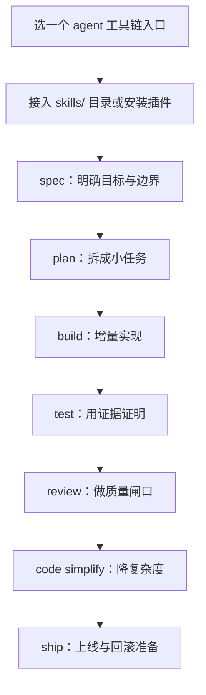

# Agent Skills：给 AI 编码加上工程师的流程护栏

你可能也遇到过这种体验：AI 写代码很快，但默认会走“最短路径”——能跑就算、能省就省。规格不写、测试先欠着、边界条件随缘、上线前的 checklist 更别提。

**Agent Skills** 这套东西干的事很直接：把资深工程师那套“开发生命周期里的硬流程”打包成一组可复用的 `SKILL.md` 工作流，让 AI coding agent 在每个阶段都按规矩来：先搞清楚要做什么，再拆任务，再一点点实现，再用测试证明，再做 review，再简化，最后再发版。

一句人话：**它不是让 AI 更会写代码，是让 AI 更像一个懂流程、怕出事的工程师。**

## 它解决的“破事”到底是什么

AI agent 的常见翻车方式并不神秘：

- 需求没问清，就开始敲；最后返工比新写还痛
- 不写测试，靠“看起来对”；一改就回归炸
- 为了快而“聪明”，代码可读性越来越差
- 安全和边界没想清楚，埋雷到上线后才爆

Agent Skills 的思路是把这些问题**变成流程上的必经关卡**：每个 skill 都是步骤 + 校验点 + 退出条件，甚至还专门写了“AI 最爱找的借口”和反驳（比如“我稍后补测试”这种）。

## 先看它怎么用：7 个贯穿开发生命周期的命令

它提供 7 个 slash commands，对应开发生命周期：

| 你在做什么 | 命令 | 核心原则 |
|---|---|---|
| 定义要做什么 | `/spec` | 先写清楚再动手 |
| 规划怎么做 | `/plan` | 小步、原子任务 |
| 增量实现 | `/build` | 一次只做一片 |
| 证明能跑 | `/test` | 测试是证据 |
| 合并前复查 | `/review` | 代码健康优先 |
| 简化代码 | `/code-simplify` | 清晰胜过机灵 |
| 发到线上 | `/ship` | 越快越安全 |

另外，它也支持“按场景自动触发”：你在设计 API，就触发 `api-and-interface-design`；你在写 UI，就触发 `frontend-ui-engineering` 之类。

## 这包里到底有什么：23 个 skills + 参考清单 + personas

从项目说明里能提炼出一个关键信息：这不是“几段提示词”，而是一整套结构化的工程流程包。

- **Skills：23 个**（22 个生命周期 skills + 1 个 meta skill `using-agent-skills`）
- **Agent Personas：3 个**（代码评审 / 测试工程 / 安全审计）
- **Reference Checklists：4 份**（测试、安全、性能、无障碍）
- **Hooks、commands、docs**：用于不同工具链的接入与自动发现

它强调的设计取向也很明确：

- **Process, not prose**：技能是让 agent“照着做”的流程，不是让人看的参考手册
- **Anti-rationalization**：把常见偷懒借口写出来并堵上
- **Verification is non-negotiable**：必须拿证据（测试、构建结果、运行时数据），不能靠“应该没问题”
- **Progressive disclosure**：入口是 `SKILL.md`，需要时再加载 supporting refs，避免 token 浪费

## 上手成本：更像“工程接入”，不是“开箱即用”

我会把它归类为“你愿意认真用，就能持续提升产出一致性”的那类工具。

原因也不复杂：它的价值来自**流程约束**，不是来自“一个魔法 prompt”。所以你得把它接到你常用的 agent/IDE/CLI 里，让它在关键节点自动出现，才是真的划算。

下面把项目说明里给出的几条接入路径放出来（代码块原样保留）。

## 安装 / 接入（官方示例命令）

### Claude Code（推荐）

**Marketplace install:**

```
/plugin marketplace add addyosmani/agent-skills
/plugin install agent-skills@addy-agent-skills
```

**Local / development:**

```bash
git clone https://github.com/addyosmani/agent-skills.git
claude --plugin-dir /path/to/agent-skills
```

### Gemini CLI

**Install from the repo:**

```bash
gemini skills install https://github.com/addyosmani/agent-skills.git --path skills
```

**Install from a local clone:**

```bash
gemini skills install ./agent-skills/skills/
```

## 用一条“真实使用路径”带你走一遍

别把它当成“我装了一个仓库”。更合适的理解是：**你在给 AI agent 装一套工程流程操作系统。**

### 1) 怎么接进来（从工具链入口开始）

最短路径通常是：先选一个你已经在用的 agent 工具（比如 Claude Code / Cursor / Gemini CLI），把 `skills/` 接进去，然后从 `/spec` 或 `/plan` 开始跑一遍完整生命周期。

### 2) 真正怎么用（你会卡在哪）

你大概率会卡在两类地方：

- **“我想快点出结果” vs “它逼我补证据”**：比如它会推动你写测试、做 review、解释边界；这会慢一点，但能减少后面的返工与线上风险。
- **团队/个人习惯差异**：你以前可能习惯“先堆功能后补文档”，而它更像“先把不确定性压下去再写”。适应期是有的。

### 3) 最后能产出什么

它最值的不是“帮你写更多代码”，而是让你更稳定地产出：

- 需求更清楚（减少返工）
- 代码更可维护（减少隐性债）
- 测试更扎实（减少回归炸）
- 上线更可控（减少临时救火）

### 安装/接入过程的简图



### 对话式演示（组合工作流示例）

```text
你: 我想把一个老项目的“加功能”模式改成“可上线”的模式，你别急着写代码，先告诉我这次要补哪些关卡。
AI: 先别动手。我先用 /spec 把目标、范围、非目标、风险边界写清楚；然后用 /plan 拆成小步任务，保证每一步都能验证。
你: 我最怕的是测试，别又给我来一堆理论。
AI: 不讲理论，只讲证据。/test 的目标就是定义“怎么证明它没坏”。你给我现有测试情况，我会先补最关键的回归路径，再逐步加覆盖。
你: 那如果我赶时间呢？
AI: 赶时间更该做最小可验证切片。我们用 /build 一次只交付一片，每片都能跑、能测、能回滚。快是快在少返工，不是快在少步骤。
```


如果你符合下面任意一条，Agent Skills 会更值：

- 你已经在用 AI agent 写代码，但经常被“返工/回归/线上风险”拖回去
- 你做的是长期维护的项目，不是一次性的 demo
- 你希望把“工程质量”变成流程约束，而不是靠自觉

如果你只想“临时写个脚本跑一下”，它可能会显得啰嗦——这不是它的问题，是你不需要这套流程。

Agent Skills 的价值不在于“让 AI 更强”，而在于**逼着 AI 按工程师的方式交付**：该问的先问清楚，该证明的拿证据，该复查的先过闸口。你想让 AI 真正成为生产力，而不是“写得快但不敢用”，这类流程包才是关键。

#AgentSkills #AICoding #DevWorkflow #SpecBeforeCode #Testing #CodeReview #Security #CI_CD #工程化 #生产级
