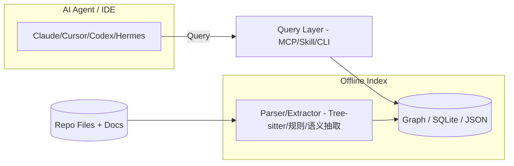
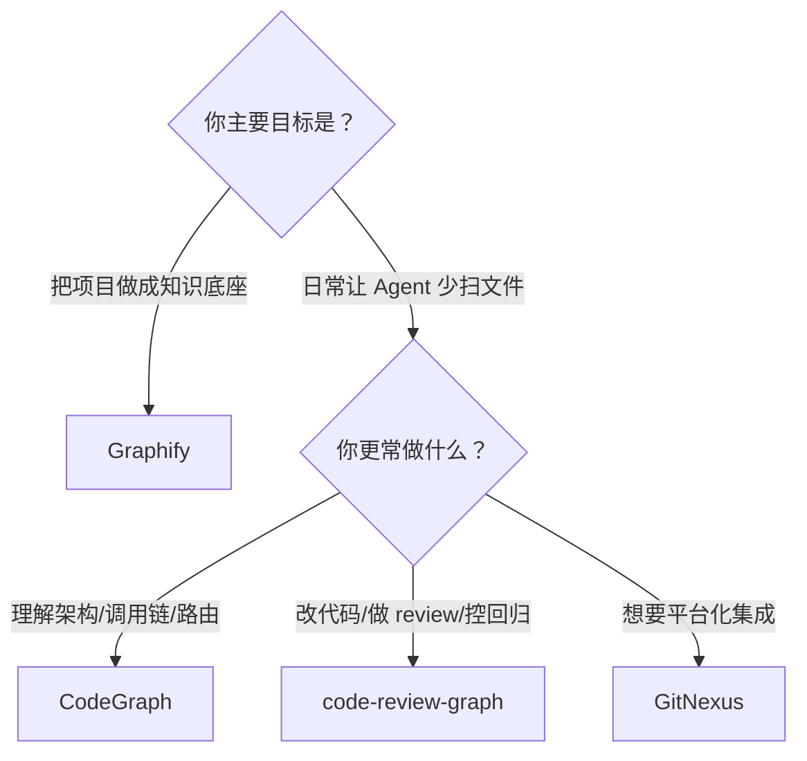

# CodeGraph vs Graphify vs code-review-graph vs GitNexus：4 个“代码知识图谱”工具怎么选？

做 AI 编码的朋友，大概率都被一个问题折磨过：

你让 Claude Code / Cursor / Codex / Hermes 帮你“解释一下架构”或者“看看改动影响面”，模型还没开始认真干活，工具调用已经把仓库扫了一遍：`grep`、`glob`、`find`、`Read`，再加上 Explore 子代理成批起飞。

能解决问题吗？能。但你也能清晰看到代价：

- Token 主要花在“找路”阶段，而不是“做决定”阶段
- 延迟主要卡在“读文件”阶段，而不是“推理”阶段
- 一句简单问题，也被迫走一遍“从零摸仓库”

所以这两个月你会看到一类工具突然爆发：**把代码库先离线索引成“图谱/结构化索引”，在线让 Agent 直接查图，而不是扫文件。**

今天我们就把 4 个常被一起提到的项目放在同一张桌面上：

- **CodeGraph**（colbymchenry/codegraph）
- **Graphify**（safishamsi/graphify）
- **code-review-graph**（tirth8205/code-review-graph）
- **GitNexus**（nxpatterns/gitnexus）

先说结论：这四个都能让 Agent 少读文件，但它们的“主战场”完全不一样。

---

## 一句话结论（你先按场景选）

- 你要的是“**多 Agent/多 IDE 一次装好，日常提问立刻少工具调用**”：优先看 **CodeGraph**。
- 你要的是“**把整个项目（代码 + 文档 + PDF/图片）做成可视化知识图谱 + 报告**”：优先看 **Graphify**。
- 你要的是“**PR/改动评审：算出最小阅读集合、影响面、甚至测试相关内容**”：优先看 **code-review-graph**。
- 你要的是“**更平台化/更重‘一条命令 index → graph → MCP’，并且带强集成（skills + hooks）**”：优先看 **GitNexus**。

---

## 先把差异说清楚（对比表）

| 工具 | 核心定位（人话） | 交付形态 | 你最容易感知的收益 | 代价/门槛 |
|---|---|---|---|---|
| CodeGraph | 把“代码结构图谱”提前建好，让 Agent 问图谱别扫文件 | CLI + 安装器 + MCP Server | 大仓库里架构问答/调用链/影响面：工具调用明显变少 | 需要先 init/index；收益依赖 Agent 真的用 MCP 工具 |
| Graphify | 把“项目所有资料”变成可浏览的知识图谱（HTML/JSON/报告） | Python CLI + skill | 上手快、可视化强、适合做“项目脑图/百科底座” | 构图本身需要一次性成本；图谱时效要看你是否重跑 |
| code-review-graph | 面向“改代码/做 review”的最小阅读集合 + 图谱查询 | CLI + MCP Server + daemon/watch | 审查/改动场景更强：少读不相关文件，指导回归范围 | 需要初始化/构图；如果只做架构问答未必最优 |
| GitNexus | 一条命令把 repo 索引成图谱，并提供 MCP + skills + hooks 集成 | CLI + MCP + skills/hooks | 更像“平台型 code-intel layer”：集成深、体验完整 | 安装/配置相对更重；同样需要索引与维护 |

---

## 一张图讲清楚：这四类工具的共同范式

它们本质都在做一件事：把“在线发现（读文件）”改成“离线索引（建图）”，然后在线查询。



区别在于：每个工具“更想让你拿它解决什么问题”。

---

## 核心亮点拆解：它们各自强在哪？

### 1）CodeGraph：主打“省 token/省工具调用”的工程化体验

CodeGraph 的叙事非常直接：给 Claude Code 等代理一份**预先索引好的语义知识图谱**，让它们更少 grep/read。它在 README 里明确写了“平均节省口径”（成本、token、时间、工具调用）以及“越大越赚”的边界。

它的价值点适合一句话概括：

**你不想每次问问题都把仓库重新摸一遍。**

### 2）Graphify：主打“知识底座 + 可视化 + 报告”

Graphify 的入口特别像“给项目拍 CT”：你对一个陌生项目说 `/graphify .`，它会在 `graphify-out/` 里吐出三份产物：

- `graph.html`：可视化图谱（浏览器打开就能点）
- `GRAPH_REPORT.md`：高连接节点、关键概念、建议提问
- `graph.json`：完整图谱（后续可复用、可检索）

它更像“把项目变成一个可浏览的知识产品”，不只是为了省 token。

### 3）code-review-graph：主打“改动/评审：只读必要的内容”

code-review-graph 的核心价值是把“review 时到底该读哪些文件”结构化：

- 解析代码成 AST 图谱
- 在 review/coding 场景里，给出最小阅读集合
- 还能用 daemon 去保持图谱随代码变更自动更新（适合 Cursor / OpenCode 这类 hook 支持不足的环境）

如果你的主战场是“改代码 + review”，这类工具的收益往往更稳定。

### 4）GitNexus：主打“一条命令把集成做满（MCP + skills + hooks）”

GitNexus 的 README 直接把流程写死：

一条 `npx gitnexus analyze` 做完索引、安装 skills、注册 hook、生成 `AGENTS.md/CLAUDE.md` 等上下文文件。

它更像一个“平台型 code-intel layer”，尤其对 Claude Code 给了更深的 hooks 集成描述（PreToolUse + PostToolUse 等）。

---

## 快速上手（每个工具 2 分钟跑起来）

下面全部是“官方文档/README 出现过的命令”，我只把注释翻译成中文，命令本体不改。

### CodeGraph（colbymchenry/codegraph）

```bash
# macOS / Linux：用脚本安装（无需 Node.js）
curl -fsSL https://raw.githubusercontent.com/colbymchenry/codegraph/main/install.sh | sh

# Windows（PowerShell）：用脚本安装
irm https://raw.githubusercontent.com/colbymchenry/codegraph/main/install.ps1 | iex
```

```bash
# 已有 Node.js？用 npx / npm 也行
npx @colbymchenry/codegraph        # 直接运行（零安装）
npm i -g @colbymchenry/codegraph   # 全局安装
```

```bash
# 在项目目录初始化索引
cd your-project
codegraph init -i
```

```bash
# 卸载：撤销它写入的 agent 配置（项目索引目录仍保留）
codegraph uninstall
```

### Graphify（safishamsi/graphify）

```bash
# 推荐：用 uv 安装（会把 graphify 放到 PATH）
uv tool install graphifyy

# 备选：pipx / pip
pipx install graphifyy
pip install graphifyy
```

```bash
# 注册 skill 到你的 AI 编码助手（Claude/Codex/Cursor 等按平台不同）
graphify install
```

```bash
# 开始构图（在支持“/命令”的助手里直接输入）
/graphify .
```

如果你想把图谱导出成一页“更像架构文档”的页面（含 Mermaid call-flow），官方给了这个命令：

```bash
graphify export callflow-html
```

### code-review-graph（tirth8205/code-review-graph）

它提供 MCP server 与 daemon/watch 机制；README 里也明确了会有 `serve`（启动 MCP server）以及 daemon 的 quick setup：

```bash
# 1) 添加要监控的仓库（给别名可选）
crg-daemon add ~/project-a --alias proj-a
crg-daemon add ~/project-b

# 2) 启动 daemon（后台运行）
crg-daemon start

# 3) 查看状态 / 日志 / 停止
crg-daemon status                 # 查看 daemon 和各 repo watcher 状态
crg-daemon logs --repo proj-a -f  # 追踪某个 repo 的日志
crg-daemon stop                   # 停止 daemon 和所有 watcher
```

（如果你只关心 MCP：它也提供 `code-review-graph serve` 用于启动 MCP server。）

### GitNexus（nxpatterns/gitnexus）

GitNexus 的 quick start 非常“硬”：直接在 repo 根目录跑：

```bash
# 在 repo 根目录索引（同时把 skills/hooks/config 等一并处理）
npx gitnexus analyze
```

它也提供一次性配置 MCP 的命令：

```bash
gitnexus setup  # 为编辑器/agent 写入全局 MCP 配置（一次性）
```

（如果你走手动配置，README 里也给了 Claude/Codex/Cursor/OpenCode 的 MCP 配置片段与命令。）

---

## 怎么选：给你一个更实用的“决策树”



---

## 写在最后：这类工具真正改变的是什么？

我觉得最重要的不是“省了多少 token”，而是它改变了 Agent 在工程里的工作方式：

- 过去：先读一堆文件，把“结构”在上下文里临时拼出来
- 现在：结构被固化成图谱/索引，Agent 直接查询结构，再决定读哪几段代码

你不是在给模型“加智商”，你是在给它一套更接近 IDE 的“工程接口”。

• 你目标是“**让 agent 少 read、立刻省 token**”，并且你在 Claude/Cursor/Codex/Hermes 多端切换：优先 **CodeGraph**。
• 你目标是“**改动评审/日常 coding 的最小阅读集合**”，并且你最关心 PR review/影响面：优先 **code-review-graph**。
• 你目标是“**把代码+文档+资料做成长期知识底座/可视化图谱**”：优先 **Graphify**。 
• 你想要“**零服务器、偏平台化的 code-intel layer + MCP**”并且可能要管理多个 repo：看 **GitNexus**。

#GitHub #AI编程 #MCP #CodeGraph #Graphify #code_review_graph #GitNexus #ClaudeCode #Cursor #Codex #HermesAgent #代码知识图谱
