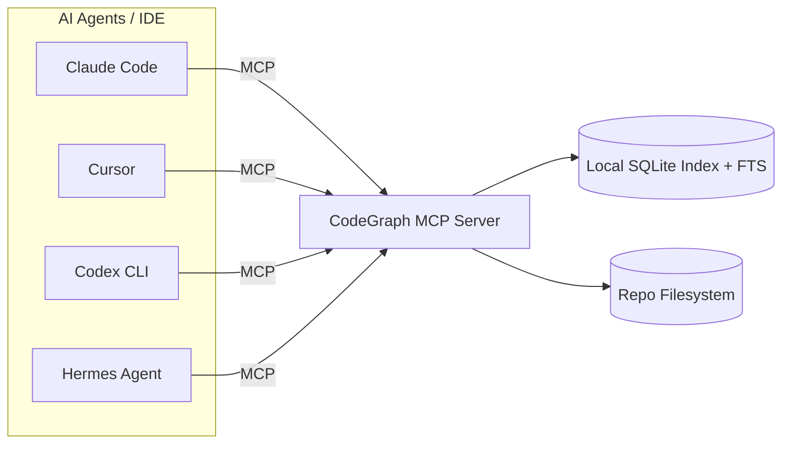

# CodeGraph：让 Claude Code / Cursor / Codex / Hermes 少读文件、更省 Token 的“本地语义代码图谱”

你有没有这种体验：让 Claude Code / Cursor / Codex 解释一个代码库的架构，结果模型还没开始回答，工具调用先刷了一屏——`grep`、`glob`、`find`、`Read`，外加一堆 Explore 子代理去扫文件。

这套“先把仓库翻个底朝天再说”的流程，确实能解决问题，但代价也很实在：

- Token 在发现阶段就被吃掉一大截
- 工具调用次数暴涨，延迟也跟着上来
- 小问题也会被迫走一遍“全仓库探测”

最近我看到一个项目把这个痛点做得很直接：**CodeGraph**。

它的定位一句话就够：

**给 AI 编码代理（Claude Code / Cursor / Codex CLI / opencode / Hermes Agent）准备一份“预先索引好的语义知识图谱”，让它们少扫文件、直接问图谱。**

更关键的是：**100% 本地**，不需要把你的代码传出去，也不需要 API Key。

---

## 一句话结论

如果你的 AI 编码代理经常在“找入口、找调用链、找路由、找影响范围”上花掉大量工具调用和 Token，**CodeGraph 的价值就是把这部分“发现成本”提前离线做掉，在线只做查询**。

---

## 一张图讲清楚（Mermaid）



---

## 核心亮点（按项目文档梳理）

1、**它不是“更聪明的搜索”，而是把代码库做成可查询的图谱**

传统流程里，代理靠 `grep/find/Read` 逐步逼近答案；CodeGraph 的思路是先把仓库索引成**知识图谱**（符号关系、调用关系、结构等），然后让代理“查图谱”而不是“扫文件”。

2、**官方给了一个很硬的收益口径：更便宜、更快、更少工具调用**

项目给出的 benchmark（7 个开源代码库、7 种语言）里，整体平均收益口径是：

- **35% cheaper**
- **59% fewer tokens**
- **49% faster**
- **70% fewer tool calls**

它还强调：**代码库越大，收益越明显**；小仓库（比如 ~150 files）原生搜索本来就便宜，边际收益会变小。

3、**支持多代理生态：Claude Code / Cursor / Codex CLI / opencode / Hermes**

它的安装器会询问你要配置哪些 agent，并写入各自的 MCP server 配置和对应的 instructions 文件（例如 `CLAUDE.md`、`.cursor/rules/codegraph.mdc`、`~/.codex/AGENTS.md`）。

4、**“Always Fresh”：靠文件监听自动同步**

项目的描述里，它会用系统原生文件事件（macOS 的 FSEvents、Linux 的 inotify、Windows 的 ReadDirectoryChangesW）做 watcher，并 debounce 自动同步，让图谱跟着你的编辑保持更新。

5、**全量本地：SQLite + FTS5，不出网**

它强调“100% local”：不需要外部服务、不需要 API key，存储是本地 SQLite 数据库，并且提供全文检索（FTS5）。

6、**不止是调用链：还有 Impact Analysis（影响面分析）**

你可以沿着 symbol 的 callers/callees 把影响半径梳理出来，在“准备改代码之前”先知道会牵扯到哪里。

7、**对 Web 框架路由“有意识”：把 URL pattern 连到 handler**

这点很像“把人肉追路由这件事自动化”：它会识别各框架的路由定义文件（Django/Flask/FastAPI/Express/NestJS/Laravel/Rails/Spring/Gin/Axum/ASP.NET/Vapor/React Router/SvelteKit…），生成 route 节点并关联到处理函数/类。

8、**语言覆盖很广（项目写的是 19+）**

TypeScript/JavaScript/Python/Go/Rust/Java/C#/PHP/Ruby/C/C++/Swift/Kotlin/Dart/Lua/Luau/Svelte/Liquid/Pascal/Delphi 等。

9、**它也把边界讲得很直白：只有“被正确查询”才会省钱**

项目强调：CodeGraph 只有在代理**直接查询 CodeGraph** 时才会带来收益；如果代理还是先派 Explore 子代理去读文件，那就算装了 CodeGraph，也可能变成额外开销。

---

## 快速上手（照着做就能跑）

项目文档里给了两种安装路径：脚本安装（不需要 Node.js）或 npm/npx。

### 安装

**不需要 Node.js** 的一条命令安装（按系统走对应脚本）：

```bash
# macOS / Linux
curl -fsSL https://raw.githubusercontent.com/colbymchenry/codegraph/main/install.sh | sh

# Windows (PowerShell)
irm https://raw.githubusercontent.com/colbymchenry/codegraph/main/install.ps1 | iex
```

如果你本来就有 Node，也可以用 npx/npm：

```bash
npx @colbymchenry/codegraph        # zero-install, or:
npm i -g @colbymchenry/codegraph
```

### 命令速查（表格）

| 阶段 | 命令 | 用途 |
|---|---|---|
| 安装（脚本） | `curl -fsSL https://raw.githubusercontent.com/colbymchenry/codegraph/main/install.sh \| sh` | macOS/Linux 安装（README） |
| 安装（脚本） | `irm https://raw.githubusercontent.com/colbymchenry/codegraph/main/install.ps1 \| iex` | Windows PowerShell 安装（README） |
| 安装（npx） | `npx @colbymchenry/codegraph` | 运行安装器（README） |
| 安装（npm） | `npm i -g @colbymchenry/codegraph` | 全局安装（README） |
| 安装（脚本化） | `codegraph install --yes` | 自动检测 agent，全局安装（README） |
| 安装（脚本化） | `codegraph install --target=cursor,claude --yes` | 指定目标 agent（README） |
| 安装（脚本化） | `codegraph install --target=auto --location=local` | 项目本地安装（README） |
| 安装（脚本化） | `codegraph install --print-config codex` | 只打印配置，不写文件（README） |
| 初始化 | `codegraph init -i` | 初始化项目索引（README） |
| 卸载 | `codegraph uninstall` | 撤销安装器写入的 agent 配置（README） |

### 初始化项目索引

到你的项目目录里初始化（文档里的交互式参数是 `-i`）：

```bash
cd your-project
codegraph init -i
```

### 卸载

如果你只是试试，不想留配置，文档也给了“一条命令撤销安装器做过的事”：

```bash
codegraph uninstall
```

---

## 更多命令与用法（来自官方文档，原样保留）

如果你要把它放进脚本/CI，官方 README 给了非交互式安装示例（这段建议直接复制用）：

```bash
codegraph install --yes                              # 自动检测 agent，执行全局安装
codegraph install --target=cursor,claude --yes       # 显式指定目标 agent 列表
codegraph install --target=auto --location=local     # 自动检测 agent，执行项目本地安装
codegraph install --print-config codex               # 仅打印配置片段，不写入文件
```

官方还给了一份 CLI 速览（这段更像“命令目录”）：

```bash
codegraph                         # 运行交互式安装器
codegraph install                 # 运行安装器（显式命令）
codegraph uninstall               # 从各 agent 中移除 CodeGraph（install 的逆操作）
codegraph init [path]             # 在项目中初始化（--index 表示同时索引）
codegraph uninit [path]           # 从项目中移除 CodeGraph（--force 跳过确认提示）
codegraph index [path]            # 全量索引（--force 强制重建；--quiet 降低输出）
codegraph sync [path]             # 增量同步更新
codegraph status [path]           # 查看索引统计信息
codegraph query <search>          # 搜索符号（--kind/--limit/--json）
codegraph files [path]            # 查看已索引文件结构（--format/--filter/--max-depth/--json）
codegraph context <task>          # 为 AI 构建上下文（--format/--max-nodes）
codegraph callers <symbol>        # 查询“谁调用了这个函数/方法”（--limit/--json）
codegraph callees <symbol>        # 查询“这个函数/方法调用了谁”（--limit/--json）
codegraph impact <symbol>         # 分析修改某符号的影响范围（--depth/--json）
codegraph affected [files...]     # 根据变更文件推导受影响的测试文件（见下文）
codegraph serve --mcp             # 启动 MCP 服务器
```

### `codegraph affected`：用依赖链把“该跑哪些测试”算出来

README 里给的例子是这样（适合做 pre-push / CI 加速）：

```bash
codegraph affected src/utils.ts src/api.ts         # Pass files as arguments
git diff --name-only | codegraph affected --stdin   # Pipe from git diff
codegraph affected src/auth.ts --filter "e2e/*"     # Custom test file pattern
```

以及一个 CI/hook 示例（原样）：

```bash
#!/usr/bin/env bash
AFFECTED=$(git diff --name-only HEAD | codegraph affected --stdin --quiet)
if [ -n "$AFFECTED" ]; then
  npx vitest run $AFFECTED
fi
```

---

## 为什么这类工具会变重要？

你把 AI 编码代理当成同事来用，就会发现它们在工程里最耗时、最耗 Token 的部分往往不是“写代码”，而是：

- 找入口（entry points）
- 找调用链（call graph）
- 找影响范围（impact radius）
- 找路由绑定（route → handler）

这些任务对人类开发者来说，本质是“在脑子里维护一张图”：模块关系图、调用图、依赖图、路由图、数据流图。

但对代理来说，如果没有图，它就只能用工具把“图”现场拼出来：扫描、读文件、再归纳。**这就是成本来源。**

CodeGraph 这类工具做的事，其实是把“建图”从在线推理阶段，挪到了离线索引阶段——让代理更像在用“IDE 的符号/引用/跳转系统”，而不是在用“远程 SSH + grep”。

换句话说：

**你不是在给模型加智商，你是在给它一套更像工程世界的“知识接口”。**

---

## 怎么把它用在你日常的 Agent 工作流里？

下面这段是“工作流建议”，不是项目官方承诺的内建特性：你可以把它当成一套使用姿势。

- 当你要问“架构/模块关系/调用链/路由绑定”时，先提示代理优先走 CodeGraph 的查询能力，而不是先开 Explore 子代理扫仓库。
- 当你要改代码时，先用 impact analysis 看影响范围，把测试/回归范围圈出来，再动手改。
- 对超大仓库，把“发现”从在线工具调用里拿掉，通常最容易看到收益；小仓库则更多是“体验提升”而不是“成本断崖式下降”。

---

## 写在最后：适合谁，不适合谁？

适合：

- 你经常用 Claude Code / Cursor / Codex / Hermes 在中大型仓库里做“理解 + 修改”
- 你对工具调用次数、Token 成本、延迟有明显体感（尤其是架构类问题）
- 你希望**代码不出本地**，同时又想要“更像 IDE 的语义能力”

不太适合（或收益不明显）：

- 你的仓库很小，原生 `grep/Read` 本来就够快
- 你的工作流仍然强依赖“子代理读文件”来推进（那 CodeGraph 的优势会被抵消）

如果你正在把 AI 编码代理当成“日常生产力工具”而不是“偶尔玩玩”，CodeGraph 这类“把发现成本离线化”的思路，值得你认真试一次。

#GitHub #AI编程 #MCP #CodeGraph #ClaudeCode #Cursor #Codex #HermesAgent #知识图谱 #代码索引 #本地优先
