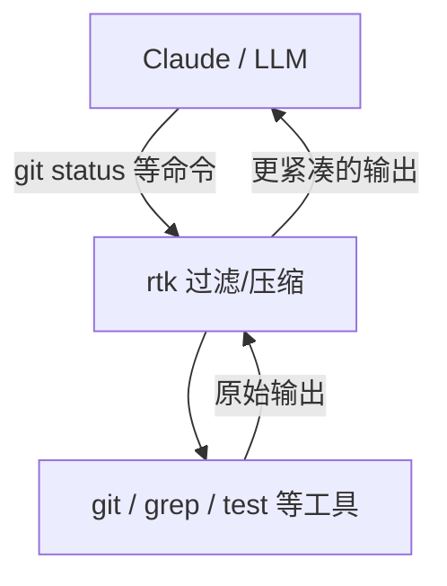

# rtk：给 Claude Code 装一个「token 压缩机」，把命令输出先过滤再喂给 LLM

你有没有过这种体验：

一条 `git diff`，AI 还没开始回答，额度先掉了一大截。  
`cargo test` 一跑，屏幕滚到天边，真正有用的只有最后那几行。  
你不是在“让 AI 帮你写代码”，你是在给它喂日志、喂噪音。

我最近看到一个很对味的思路：把“命令输出”先处理一遍，再交给 LLM。

## 先说结论：rtk 是什么

`rtk` 是一个高性能 CLI 代理：在命令输出进入 LLM 上下文之前，先做过滤和压缩，目标是把 token 消耗降低 60–90%，并把额外开销控制在 <10ms。

## 为什么值得看

它抓住了一个很现实的痛点：LLM 写代码的成本，很多不是“思考”花掉的，而是被 `tree`、`cat`、`grep`、`git status`、`git diff`、测试日志这些输出吞掉的。

你真正想给 AI 的通常是：

- 变化点（diff 的关键片段）
- 错误点（测试失败的那一段）
- 结构（目录树的骨架）

而不是整屏整屏的噪音。

## 项目核心能力拆解

从项目说明给出的路径来看，rtk 做的事情很直接，但很实用：

1. 智能过滤：把注释、空白、样板类噪音尽量去掉  
2. 分组：把相似结果聚合（按目录、按文件、按错误类型）  
3. 截断：保留相关上下文，删掉冗余  
4. 去重：重复行合并并计数，减少“刷屏型输出”

它的定位很克制：不是替你写代码、不是替你跑流程，而是让“你和 LLM 的上下文交换”更干净、更便宜。

## 上手成本到底高不高

门槛不高：单一 Rust 二进制文件、零依赖；你可以按自己环境选一种安装方式。

### Homebrew（推荐）

```bash
brew install rtk
```

### 快速安装（Linux/macOS）

```bash
curl -fsSL https://raw.githubusercontent.com/rtk-ai/rtk/refs/heads/master/install.sh | sh
```

### Cargo

```bash
cargo install --git https://github.com/rtk-ai/rtk
```

### 验证

```bash
rtk --version   # 应显示 "rtk 0.27.x"
rtk gain        # 应显示 token 节省统计
```

示例对话：

```text
你:
我想把 Claude Code 的 token 消耗压下来，先从哪些命令最“费”开始？
AI:
先盯住 `git diff`、`cat/read`、测试日志这三类输出；装好 rtk 后跑一次统计：`rtk gain`，再决定下一步从 hook 还是单命令替换开始。
你:
那我先接到 Claude Code？
AI:
可以，按官方的快速开始走一遍：`rtk init --global`，重启 Claude Code 后用 `git status` 试一下是否被自动重写。
```

## 怎么用：按真实使用路径走一遍

项目说明给了一个很“工作流”的快速开始：先装 hook，再让常见命令自动被 rtk 接管。

```bash
# 1. 为 Claude Code 安装 hook（推荐）
rtk init --global

# 2. 重启 Claude Code，然后测试
git status  # 自动重写为 rtk git status
```

它背后的链路可以用一张图讲清楚：区别不在于你跑了什么命令，而在于命令输出进 LLM 之前，多了一层“压缩过滤”。



你也可以显式用 rtk 跑具体场景（这类命令的价值是：一眼就能看出“它主要帮你省哪块 token”）。

### 文件相关

```bash
rtk ls .                        # 优化的目录树
rtk read file.rs                # 智能文件读取
rtk find "*.rs" .               # 紧凑的查找结果
rtk grep "pattern" .            # 按文件分组的搜索结果
```

### Git 相关

```bash
rtk git status                  # 紧凑状态
rtk git log -n 10               # 单行提交
rtk git diff                    # 精简 diff
rtk git push                    # -> "ok main"
```

### 测试相关

```bash
rtk jest                        # Jest 紧凑输出
rtk vitest                      # Vitest 紧凑输出
rtk pytest                      # Python 测试（-90%）
rtk go test                     # Go 测试（-90%）
rtk test <cmd>                  # 仅显示失败（-90%）
```

### 构建 & 检查

```bash
rtk lint                        # ESLint 按规则分组
rtk tsc                         # TypeScript 错误分组
rtk cargo build                 # Cargo 构建（-80%）
rtk ruff check                  # Python lint（-80%）
```

### 容器

```bash
rtk docker ps                   # 紧凑容器列表
rtk docker logs <container>     # 去重日志
rtk kubectl pods                # 紧凑 Pod 列表
```

### 分析

```bash
rtk gain                        # 节省统计
rtk gain --graph                # ASCII 图表（30 天）
rtk discover                    # 发现遗漏的节省机会
```

## 哪些地方是真的香

它把“省 token”变成了一个可执行动作：不改变你的日常命令习惯，只是把输出变得更短、更有结构。  
对于高频、输出量大的命令（diff、测试、搜索），节省会更直观。  
还有一个很现实的价值：AI 的上下文更干净，回答更容易聚焦在真正的问题上。

## 哪些人会更适合

- 在 Claude Code 这类终端协作工具里写代码的人  
- 经常把测试失败日志、lint 输出、diff 片段粘进对话的人  
- 需要在有限上下文里做复杂排查（而不是“把所有输出都贴上去”）的团队  
- 对“AI 使用成本”有压力，但又不想牺牲工作流的人

## 使用前最好知道的边界

- rtk 的目标是过滤和压缩输出；当你需要逐字逐行的完整上下文（例如非常细的 diff 或某些边缘报错），你可能仍然需要查看原始输出  
- 这类工具最怕的一件事是“你以为 AI 看到了全部”；一旦陷入诡异问题，最好主动确认关键信息是否被压缩掉，再决定要不要临时放开输出

## 收尾总结

rtk 这类工具的价值不在于“更强的 AI”，而在于让你把上下文喂得更像人、更像工程师：给结论、给变化点、给失败点，少给噪音。

如果你平时的 token 主要被命令输出吃掉，那它很可能是最容易立刻见效的一类优化。


#rtk #ClaudeCode #LLM #Token优化 #CLI工具 #Rust #开发效率 #Git #测试日志 #工程化
