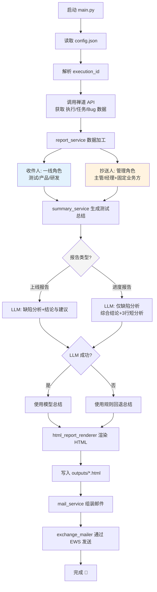

# 测试报告自动化：从手工整理到一键发送

> 测试组的一次效率革命

---

## 一、背景：那个让人头疼的「上线前半小时」

你一定经历过这样的场景：

上线前半天，测试同学开始手工整理禅道执行单 —— 打开执行页面，数一数有多少个任务、多少个 Bug，统计一下严重度分布，看看还有哪些问题没解决，然后把所有信息复制粘贴到邮件里，选好收件人、抄送人，发出一封格式五花八门的测试报告。

整个过程耗时 20～40 分钟不等，而且有三大痛点：

1. **重复劳动** —— 每次上线的流程几乎一样，但每次都要手工操作
2. **容易遗漏** —— 收件人抄送人靠人工维护，少了谁、多了谁全靠记忆力
3. **格式不统一** —— 每个人的报告风格不同，阅读成本高

我们团队平均每周上线 3～5 次，这意味着测试同学每周要花 2～3 小时在报告整理上。同时，团队还有每日进度同步的需求：项目进行到一半时，需要每天向全组同步测试进度、今日完成、明日计划。

能不能把这条链路做成自动化？

带着这个问题，`test-send-report` 项目诞生了。

---

## 二、目标：给一个执行 ID，直接产出并发送报告

项目的核心目标非常明确：

> **输入一个禅道执行 ID，自动产出测试报告，并通过邮件发送给相关人员。**

具体来说，我们希望实现：

- ✓ 自动拉取禅道执行单的完整数据（执行详情、任务列表、缺陷列表）
- ✓ 自动加工成结构化的报告内容（团队信息、测试周期、缺陷多维度统计）
- ✓ 用 LLM 自动生成测试总结，失败时降级为规则模板
- ✓  渲染成美观的 HTML 报告，既支持「测试上线报告」，也支持「测试进度报告」
- ✓  通过 Exchange 邮件直接发送，并自动保存到已发送
- ✓ 提供一个 Web 页面，让不熟悉命令行的同学也能操作

---

## 三、技术选型：不做过度设计

在技术选型上，我们坚持了几个原则：

- **Python 3.12+** —— 团队熟悉、生态成熟
- **禅道 API** —— 公司自研项目管理平台，直接调用 REST API
- **Exchange EWS**（`exchangelib`）—— 公司邮件系统，不走 SMTP 中继
- **OpenAI 兼容接口** —— 公司内部部署了 DeepSeek-v3 模型，直接调用
- **纯标准库写 Web 页面** —— 不引入 Flask/Django，零额外依赖

整个项目依赖极轻：

```
exchangelib>=5      # Exchange 邮件发送
openai>=2.32.0      # LLM 调用
colorlog>=6.10.1    # 日志着色
```

只有三个外部库。AI 调用通过公司内部 `ai-apiclient` 网关转发，不直接暴露模型地址。

---

## 四、整体架构：一个主入口，六个模块，清晰分工

项目的目录结构非常清晰：

```
test-automation/
├── main.py                         # 主入口：编排全流程
├── config/
│   └── app_config.py               # 配置读取（禅道/报告输出）
├── clients/
│   ├── chandao_client.py           # 禅道 API 客户端
│   └── ai_apiclient.py             # AI-APIClient 网关封装
├── services/
│   ├── report_service.py           # 报告数据加工
│   ├── summary_service.py          # 测试总结（LLM + 规则回退）
│   └── mail_service.py             # 邮件发送编排
├── renderers/
│   └── html_report_renderer.py     # HTML 渲染
├── common/
│   └── logger.py                   # 结构化日志（后续推广至全项目）
├── exchange_mailer.py              # Exchange 底层发送能力
├── web_app.py                      # Web 控制台
├── config.json                     # 运行配置
├── exchange_mailer.json            # Exchange 配置
└── tests/                          # 单元测试
```

### 完整执行流程

```
启动 main.py
    ↓
读取 config.json（禅道账号、默认执行 ID）
    ↓
解析 execution_id（支持直接数字 或 禅道链接）
    ↓
调用禅道 API 获取执行详情 / 任务列表 / 缺陷列表
    ↓
report_service 加工数据
  ├── 提取测试/产品/研发人员 → 收件人
  ├── 提取主管/经理角色 → 抄送人（含固定业务方）
  ├── 从 users_cleaned.json 映射邮箱
  ├── 计算测试周期
  ├── 缺陷多维度统计（状态/严重度/模块/趋势/高优）
  └── 解析执行描述中的进度、今日任务、明日计划
    ↓
summary_service 生成测试总结
  ├── 优先调用 AI-APIClient（DeepSeek V4 Flash）
  ├── 上线报告 → 【缺陷分析】+【结论与建议】
  ├── 进度报告 → 【缺陷分析】仅含综合结论+3行短分析
  └── 失败自动回退规则模板
    ↓
html_report_renderer 渲染为完整 HTML
    ↓
写入 outputs/*.html
    ↓
mail_service → exchange_mailer 发送 Exchange 邮件
    ↓
完成 🎉
```

---

## 五、实现细节：那些值得拿出来说的设计

### 5.1 禅道数据采集

通过禅道 REST API 获取数据，核心代码非常简洁：

```python
class ChandaoClient:
    def get_execution(self, execution_id: int) -> dict: ...
    def get_bugs(self, execution_id: int) -> list[dict]: ...
    def get_tasks(self, execution_id: int) -> list[dict]: ...
```

一次调用获取三个维度的数据，封装在 `ExecutionReportData` 数据类中传递。

### 5.2 报告数据加工

`report_service.py` 是核心的数据加工层。它的职责是「把原始 API 数据变成报告所需的结构化数据」，不关心数据来源，也不关心最终展示。

几个有意思的设计点：

**团队成员邮箱自动映射**：禅道返回的成员信息只有账号名，我们需要映射成邮箱。通过一个 `users_cleaned.json` 文件做 realname → email 的查找，自动提取团队成员邮箱。

**收件人与抄送人分离**（关键设计）：团队成员按角色分为两类——收件人（测试、产品经理、研发）和抄送人（测试主管、项目经理、研发主管、高层管理），避免重复入邮箱：

```python
def extract_team_emails(execution: dict) -> list[str]:
    cc_roles = {"测试主管", "项目经理", "研发主管", "高层管理"}
    # 跳过 cc_roles，只取一线执行角色
    for member in execution.get("teamMembers", []):
        if role in cc_roles:
            continue    # → 进入抄送列表
        if any(keyword in role for keyword in ["测试", "产品经理", "研发"]):
            emails.append(...)

def extract_cc_emails(execution: dict, report_type: str = "release") -> list[str]:
    cc_roles = ["测试主管", "项目经理", "研发主管", "高层管理"]
    # 只取 cc_roles 匹配的成员
    if report_type == "release":
        emails += ["xxx@txxx.com", "xxx_txl@xxxcom"]  # 固定业务方
```

上线报告会额外追加两个固定业务方邮箱。所有抄送人来自禅道执行团队的实时成员配置，**不再需要手工维护 config.json 中的抄送名单**。

**执行描述智能解析**：禅道的执行描述字段包含测试进度信息（如"今日任务""明日计划"），但格式不固定。我们写了一个解析器，能自动识别进度百分比、今日任务分区、明日计划分区：

```python
# 执行描述格式示例（在禅道中维护）：
# 50%
# 
# 今日任务
# 1. 配置相关验证 100%
# 2. 流程验证 50%
# 
# 明日计划
# 1. 流程验证 80%
```

解析器自动提取这些信息，用于「进度报告」类型的报告展示。

**Bug 多维度分析**：对缺陷列表进行 5 个维度的聚合统计——状态分布、严重度分布、指派人分布、模块分布、类型分布，以及按日期的趋势分析和高优缺陷提取。

### 5.3 LLM 测试总结 + 失败回退（核心亮点）

这个功能是整个项目中「最 AI」的部分。

**两次迭代，一次升级：**

**V1（初版）**：直接调用 OpenAI 兼容接口（公司内部的 DeepSeek-v3 模型），一次请求拿到完整总结。

**V2（当前版本）**：改为通过公司内部的 `ai-apiclient` 网关调用，使用 **DeepSeek V4 Flash 模型**，支持流式输出、思考模式控制、指数退避重试：

```python
class AiApiClient:
    def call(self, messages, model="deepseek-v4-flash",
             stream=True, thinking="disabled",
             max_retries=3, retry_delay=2) -> str: ...
```

模型调用封装在 `AiApiClient` 中，支持最多 3 次指数退避重试（2s → 4s → 8s），默认启用流式输出以降低首 token 延迟。`summary_service` 通过适配器模式延迟加载客户端，避免测试阶段引入真实网络依赖：

```python
def default_loader_factory():
    from clients.ai_apiclient import AiApiClient
    
    class AiApiClientAdapter:
        def call_llm(self, sys_content, user_content, temperature=0.6, timeout=1000000):
            ...
    return AiApiClientAdapter()
```

每次生成报告时，我们把缺陷数据、任务数据、项目信息拼成结构化的 prompt：

```python
sys_content = "你是一名资深测试经理和质量负责人..."
user_content = f"""项目名称：{project_name}
被测系统：{system_name}
缺陷总数：{total}
严重度分布：{severity_text}
状态分布：{status_text}
趋势摘要：{trend_text}
高优先级缺陷：{high_risk_text}
代表性缺陷详情：{bug_details}"""
```

**两种报告，两种 prompt 策略：**

- **上线报告**：要求模型输出【缺陷分析】和【结论与建议】两段完整内容
- **进度报告**：只输出【缺陷分析】，不含结论与建议（进度报告不需要质量决策）

无论是哪种类型，【缺陷分析】的格式要求一致：**先给 1 段综合结论，再输出 3 行短分析**，分别以"状态分布："、"严重程度："、"时间趋势："开头。这种结构化输出让报告排版更统一。

我们通过两种不同的解析器分别处理两种输出格式：

```python
parsed_summary = (
    parse_progress_summary_result(llm_result)
    if report_type == "progress"
    else parse_summary_result(llm_result)
)
```

**失败自动降级**依然保留：

```python
try:
    loader = loader_factory()
    llm_result = loader.call_llm(...)
    parsed_summary = parse_summary_result(llm_result)
    if parsed_summary is not None:
        return parsed_summary
except Exception:
    return build_fallback_summary(...)  # 规则模板
```

规则模板是基于数据特征生成的固定格式总结，兼容上线报告和进度报告两种场景。虽然不如 LLM 生动，但能保证**主流程永不被模型失败中断**——这是生产环境的底线。

### 5.4 HTML 报告渲染

报告渲染器用纯 Python 生成完整的 HTML 邮件模板。设计上注意了几点：

- **表格布局兼容邮件客户端** —— 没使用 CSS 框架，用 `<table>` 嵌套保证 Outlook/Exchange 兼容
- **响应式支持** —— 在移动端三列缺陷统计自动变为单列
- **视觉清晰** —— 每个板块都有明确的编号和视觉层次（概览/任务/缺陷/总结）
- **两种报告类型** —— 上线报告含「结论与建议」，进度报告含「今日任务/明日计划」

报告包含以下板块：

| 板块       | 上线报告 | 进度报告 |
| -------- | ---- | ---- |
| 一、测试概览   | ✓    | ✓    |
| 二、任务统计   | ✓    | ✓    |
| 三、缺陷统计   | ✓    | ✓    |
| 四、今日任务   | -    | ✓    |
| 五、明日计划   | -    | ✓    |
| 六/四、测试总结 | ✓    | ✓    |

### 5.5 Exchange 邮件发送

公司使用 Exchange 邮件系统，我们通过 `exchangelib` 库走 EWS 协议直接发送。关键设计：

- **显式指定服务器**，不走 autodiscover（内网环境 autodiscover 不稳定）
- **优先保存到已发送**，失败时直接发送
- **支持 HTML 正文**，报告直接作为邮件内容，无需附件
- **配置分层**：命令行参数 > 配置文件 > 环境变量

### 5.6 Web 控制台：零框架的单页应用

为了让不熟悉命令行的同学也能使用，我们用纯 Python 标准库写了一个 Web 控制台：

- **`http.server.ThreadingHTTPServer`** —— 并发处理请求
- **零框架** —— 没有 Flask、没有 FastAPI，前后端都在一个文件里
- **前端写死在 Python 字符串中** —— HTML/CSS/JS 都内嵌在 `render_index_page()` 方法里
- **后台异步执行** —— 提交报告生成任务后，前端通过轮询 `/api/jobs/{id}` 接口实时查看日志
- **临时配置** —— Exchange 账号密码只在当前页面有效，刷新即清空，不落盘

启动方式也非常简单：

```bash
python3 web_app.py --host 0.0.0.0 --port 8765
```

然后浏览器访问 `http://你的IP:8765` 即可。

### 5.7 配置设计：持续简化，按需覆盖

项目配置经历了两次简化：

**`config.json`** —— 应用主配置：

```json
{
  "chandao": {
    "account": "xxx",
    "password": "xxx"
  },
  "report": {
    "default_execution_id": 699,
    "output_dir": "outputs",
    "report_type": "progress"
  }
}
```

> `release_cc` / `progress_cc` / `default_cc` 等静态抄送配置已被移除。收件人和抄送人现在**全部从禅道执行团队成员的角色自动提取**（见 5.2 节），无需手工维护。命令行 `--extra-cc` 参数和 Web 页面的新增抄送人输入框也一并删除。

**`exchange_mailer.json`** —— Exchange 邮件配置，支持命令行临时覆盖：

```json
{
  "exchange": {
    "server": "mail.company.com",
    "username": "domain\\user",
    "auth_type": "NTLM"
  }
}
```

Web 页面中 Exchange 密码不落盘，每次发送时临时传入。

---

## 六、效果：21 份报告，覆盖多个项目

项目上线以来，已经：

- 生成了 **21 份测试报告**（11 份上线报告 + 10 份进度报告）
- 覆盖 **7 个项目**
- **从执行到发送只需 1 条命令**，耗时从 20 分钟降低到 10 秒
- **LLM 总结 + 规则回退双保险**，从未因模型失败阻塞发报
- **单元测试覆盖所有核心模块**，9 个测试文件，确保重构安全

### 前后对比

| 环节 | 手工操作 | 自动化后 |
|------|---------|---------|
| 数据整理 | 10 分钟 | 2 秒 |
| 缺陷统计 | 5 分钟 | 1 秒 |
| 总结撰写 | 5 分钟 | 3 秒（LLM） |
| 邮件发送 | 1 分钟 | 2 秒 |
| **总计** | **~20 分钟** | **~10 秒** |

### 实际产出截图

项目 `outputs/` 目录下的实际生成文件：

```
测试上线报告_xxx_20260424.html
测试上线报告_xxx_0428_20260428.html
测试上线报告_xxx_-PMO_20260425.html
测试上线报告_xxx_-PMO_20260428.html
测试上线报告_xxx__20260424.html
测试进度报告_xxx__20260507.html
测试进度报告_xxx_0508_20260509.html
...
```

---

## 七、设计亮点总结

回顾这个项目，有几个设计思路值得分享：

**1. 主入口收敛，模块职责清晰**

整个项目只有一个入口 `main.py`，所有模块只做自己的事：`chandao_client` 只管拉数据，`report_service` 只管加工，`renderer` 只管渲染，`mail_service` 只管发送。想改报告格式？改 renderer。想换数据源？改 client。想换邮件通道？改 mailer。

**2. 失败可降级，不阻塞主流程**

LLM 调用失败 → 自动回退规则总结。邮件发送失败 → 错误信息明确，报告已经落盘，可以手动发送。每个可能失败的点都有兜底方案。

**3. 输出可复用**

HTML 报告既可以直接在浏览器打开查看，也可以直接作为邮件正文发送。本地查看和邮件发送用的是同一份产出。

**4. 演进兼容旧脚本**

旧版的 `report.py`、`mailer.py`、`chandao_api.py` 仍然保留，新的模块逐步替换旧逻辑，不搞一刀切。

**5. 零框架 Web 页面**

`web_app.py` 用纯标准库实现，不引入任何外部框架。对于这种「一个页面、几个 API」的工具类场景，标准库完全够用，而且没有依赖管理的烦恼。

**6. 抄送人动态提取，零维护**

收件人和抄送人不再依赖 `config.json` 中的静态列表，而是从禅道执行团队的**成员角色**自动拆分。一线执行角色进入收件人，管理角色进入抄送人。成员调整后，下次报告的收件/抄送列表自动同步，无需任何人工操作。

**7. 配置持续做减法**

随着逻辑从配置迁移到代码自动推导，`config.json` 从 5 个 report 字段减少到 3 个，`app_config.py` 的 `ReportConfig` 也从 6 个字段减少到 3 个。命令行参数 `--extra-cc`、Web 界面的额外抄送输入框也随之删除。

---

## 八、后续可以增强的方向

项目目前满足日常需求，但还有一些可以改进的点：

- **结构化日志** —— 已引入 `common/logger.py`，`clients` 和部分模块已使用，主流程 `main.py` 的 `print` 尚未完全替换
- **配置校验** —— 启动时做必填字段校验，fail-fast
- **集成测试** —— 目前是单元测试覆盖，缺少真正的端到端集成测试
- **报告模板版本化** —— 支持多主题、多语言、多部门风格

---

## 九、总结

做这个项目的感受是：**很多重复劳动不是因为工具不够好，而是没有人愿意花半天时间把流程串起来。**

禅道有 API、Exchange 有 Python SDK、公司有内部 LLM 服务——所有的"零件"都是现成的，缺的只是一条把「拉数据 → 加工 → 生成报告 → 发送」连起来的链路。

当开发同学说「这个可以用 AI 做」的时候，很多时候并不是真的需要 AI。把流程打通、把步骤自动化，本身就能解决 80% 的效率问题。AI 只是在最后的 20% 上做锦上添花的事。

而整个项目代码也就 2000 多行，依赖三个外部库，一个下午就能跑通原型——关键在于**先想清楚链路，再动手写代码**。

---


**技术栈**：Python 3.12+ · 禅道 API · Exchange EWS · DeepSeek V4 Flash · AI-APIClient 网关 · `exchangelib`

**完整流程图**：



---

#测试自动化 #效率工具 #Python #禅道 #Exchange #LLM #测试报告
