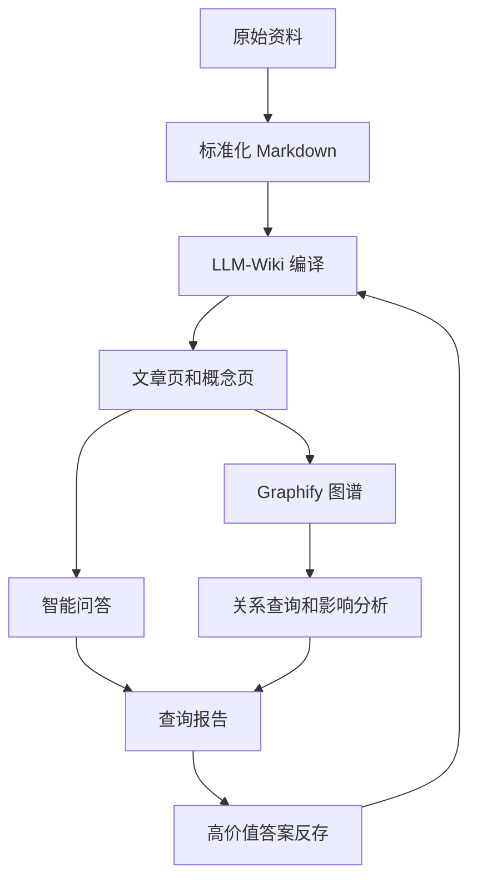

# 我一开始只是想做个文档问答，后来发现测试知识库真正难的是证据链

事情是这样的。

我一开始想做的东西其实很简单。

就是把测试团队平时那些乱七八糟的资料，需求文档、测试用例、Bug 记录、业务笔记、代码分析报告，全都扔进一个知识库里，然后让 AI 能回答问题。

听起来特别合理对吧。

你有一堆文档，我有一个大模型，中间接个检索，最后吐一段答案。

很 AI。

也很容易让人误判。

因为测试知识库最麻烦的地方，根本不是「能不能搜到一段文字」，而是你搜到这段文字以后，到底敢不敢拿它做判断。

测试人员问问题的时候，通常不是在问「这个文件里写了什么」。

他真正想问的是，这个需求会影响哪些页面，哪些历史用例必须回归，过去有没有类似 Bug，这次代码改动会不会碰到某条状态流，哪些地方我如果漏测了会很难看。

这些问题的背后，都不是单点知识。

它们是一串关系。

## 为什么普通文档问答不够

很多普通 RAG 项目喜欢把资料切块、向量化、召回、生成。

这个路线当然有用，但放到测试场景里，它有一个特别大的问题，它很容易给你一段看起来很像答案的东西，但说不清自己为什么这么说。

而测试恰恰是一个特别讨厌「看起来像」的工作。

你可以说某个支付场景风险高，但你得告诉我，依据是哪份需求，哪条用例，哪个历史 Bug，哪个代码模块。

你可以说某个回归用例建议必跑，但你得告诉我，是因为 diff 命中了接口，还是因为图谱里关联了这个业务模块，还是因为历史 Bug 出过同类问题。

不然这东西就变成了一个很能说的同事。

看着挺聪明，真出了问题，追责的时候找不到证据。

我后来给这个系统定了一个比较土但很实用的原则。

答案可以不完美，但证据必须能回头找。

## 测试资料不是文件集合

测试团队手里的资料，一般长这样。

| 资料类型 | 表面内容 | 真正价值 |
|---|---|---|
| 需求文档 | 功能描述、交互说明、验收标准 | 判断测试范围和业务优先级 |
| 测试用例 | 前置条件、步骤、预期结果 | 沉淀历史覆盖经验 |
| Bug 记录 | 问题现象、修复说明、影响版本 | 提醒同类问题不要重复漏测 |
| 业务笔记 | 状态流、边界条件、口径说明 | 补齐文档里没写清楚的灰区 |
| 代码分析 | 模块、接口、调用链、diff | 判断这次变更到底碰到了哪里 |

如果只是把这些东西平铺进一个库里，那它们仍然是一堆文件。

真正有价值的是把它们编译成测试知识资产。

这里我用「编译」这个词，是因为它真的很像写代码。

原始资料是源码，Markdown 标准化是语法整理，概念页和文章页是中间产物，图谱是依赖关系，查询报告是运行结果，反存 queries 是运行后的新知识。

这玩意一旦这么看，就不再是一个问答机器人了。

它更像一个测试知识的构建系统。

## 我最后搭出来的主流程

大概长这样。

这张图里最重要的不是 AI。

是中间那几层结构化产物。

因为只要有这些产物，后面的问答、报告、影响分析、回归推荐，才有共同的证据来源。

如果没有这层东西，模型每次回答都像临场发挥。

一次回答得很好，下一次换个问法就飞了。

## 证据链到底是什么

我现在理解的证据链，不是简单地在答案后面贴几个来源链接。

那太浅了。

真正的证据链至少要回答四个问题。

| 问题 | 系统要给出的东西 |
|---|---|
| 这个结论来自哪里 | 文档路径、图谱节点、代码文件、历史报告 |
| 这个证据怎么被选中 | 命中关键词、图谱邻居、diff 关联、历史沉淀 |
| 这个关系有多可信 | 明确抽取、推断关系、待人工确认 |
| 用户能不能复核 | 能回到原文件、原片段、原节点 |

这也是为什么我后来特别在意 `EvidenceItem` 这种结构。

每条证据不只是一个文本片段，还要带 title、path、kind、confidence、snippet、score、selection reason。

说真的，这些字段看起来很工程，但它们决定了系统有没有资格进入测试流程。

一个没有证据结构的 AI 答案，只能当参考。

一个能说清证据来源、置信度和选择原因的答案，才有机会变成测试判断的一部分。

## 这套系统真正解决的不是搜索

做到后面我才发现，LLM-Wiki 的价值不是让大家少翻几个文件。

少翻文件当然爽，但那只是表层收益。

更大的价值是，它让测试团队第一次有机会把散落的经验变成可以持续增长的资产。

比如一次查询报告，如果质量很高，可以反存到 queries 里。下一次再问类似问题，它会以较低权重参与检索。

这就很有意思了。

过去很多测试分析只存在于一次对话里，一次评审会上，一个群消息里。讲完就散了。

而现在，好的分析可以进入知识库，再成为下一次分析的证据。

这才是我觉得这个东西最值得继续做的地方。

它不是让 AI 替你判断。

它是把你每一次判断背后的资料、关系、证据、结论，慢慢沉淀成团队可以复用的东西。

## 这篇先收个口

如果用一句话概括第一阶段的经验，我会这么说：

测试团队需要的不是一个更会聊天的 AI。

测试团队需要的是一个能把需求、用例、Bug、代码和历史判断串起来的证据系统。

智能问答只是入口。

真正难的东西在后面。

下一篇我想接着讲，为什么一个靠谱的 AI 问答链路，最重要的一步反而不是调用大模型。

而是先把证据找明白。
