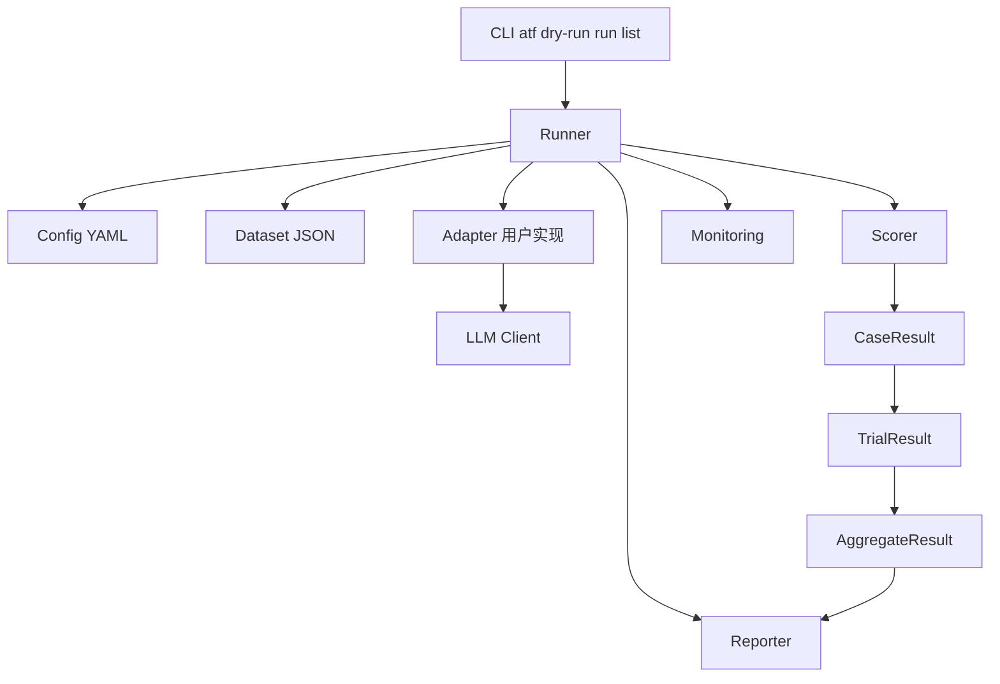
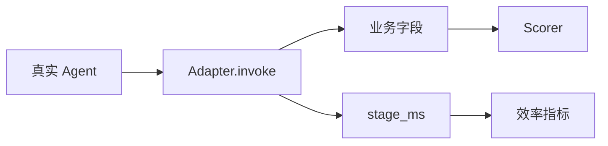
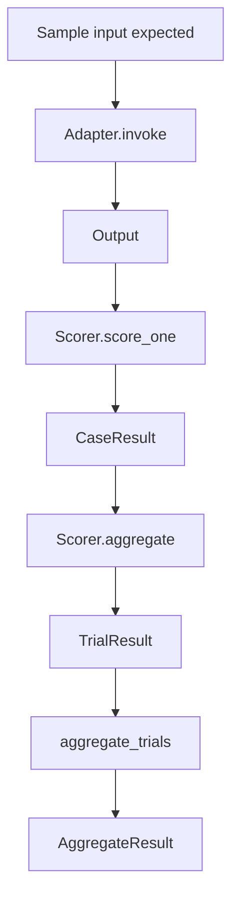

# 我给 Agent 做了一套测试框架，第一件事不是调模型，而是把评测流程拆开

事情是这样的。

做 Agent 做到后面，我越来越觉得，真正折磨人的地方不是它笨。

笨其实还好办。笨了就调 prompt，换模型，补工具，补知识库，至少问题摆在那儿。

最烦的是，它今天看起来挺聪明，明天换一批样本，又开始胡来。你改了一版 prompt，手工试了五六条，感觉确实好了，甚至有一种「这把稳了」的错觉。结果一上真实数据，另一个 intent 崩了。你又去改模型参数，路由好像稳了一点，但回复质量又飘了。

这时候人会很难受。

因为你不知道自己到底是在优化系统，还是在跟某几条样本斗智斗勇。

我后来给 Agent 做测试框架的时候，第一反应其实不是继续调模型。不是说模型不重要，也不是说 prompt 不值得调，而是如果评测流程本身还是一团散操作，你调得越勤，越容易把自己绕进去。

Agent 最难的不是让它某一次答对。

是让它每一次迭代，都能有证据地变好。

所以第一件事，得先把评测流程拆开。

## 随手测几条样本，真的不够

很多 Agent 早期验证，坦率地讲，都特别像临时抽查。

打开对话框，输入几句典型问题，看它有没有答对；再换几句边界问题，看看它会不会翻车。手感差不多，就说可以了。

这套方式不是完全没用。做 smoke test 的时候，它很快，也很直观，尤其是早期还没有稳定样本集的时候，靠手工问几条，确实能帮你发现很多低级问题。

但它有一个很要命的问题：没法复盘。

你不知道这次问的样本，和上次问的是不是同一批。你不知道这次失败到底是 Agent 本身的问题，还是样本写得不清楚，评分器太松或者太严，模型参数变了，工具调用不稳定，甚至只是数据集分布和线上流量对不上。

更麻烦的是，你也不知道今天这版到底比昨天那版好在哪里。

它可能在你刚才手测的五条样本上变好了，但在另外五十条隐藏样本上变差了。它可能 intent 命中率高了，但 specialist 路由错了。它可能格式更规整了，但事实正确性掉了。

如果没有一条稳定的评测链路，你就很难判断这次改动到底是进步，还是只是把问题从一个角落挪到了另一个角落。

所以一个正经的 Agent 测试框架，最小闭环不应该是「问一下，看一下」。

而应该是：

```text
load -> invoke -> score -> aggregate -> report
```

这几个词看着很工程，甚至有点无聊。

但它们很关键。

load 负责把样本和配置稳定地加载进来，invoke 负责用统一方式调用真实 Agent，score 负责把单条结果变成可解释的分数，aggregate 负责把一堆 case 汇总成 trial 级别的结论，report 负责把这轮评测留下来，给人看，也给后续回归看。

这条链路跑起来以后，Agent 就不再只是一个「看起来好像会聊天」的玄学对象。

它开始变成一个可以反复评测、可以比较版本、可以回看证据的工程对象。

## atf 的分层

我现在比较喜欢的框架形态，大概是这样。



这张图里，Runner 是核心，但它不是业务逻辑。

这一点很重要。

Runner 更像一个编排器。它负责把 Config YAML 加载进来，把 Dataset JSON 加载进来，然后调用用户实现的 Adapter，拿到 Agent 输出，再交给 Scorer 打分。单条 case 有单条 case 的结果，多条 case 聚合成一个 trial，多个 trial 再汇总成 AggregateResult，然后交给 Reporter 生成 HTML 或 JSON 报告。

Monitoring 这层也会在旁边看着事件和进度，但它不能变成主流程的依赖。

你想想看，如果监控组件坏了，评测也跟着停了，那就很尴尬。评测框架最起码要保证主链路能跑完，展示层、观测层、报告层都应该围着主链路转，而不是反过来绑架主链路。

所以这套分层真正解决的问题，是把评测从一堆散操作，变成一条能反复跑的流水线。

## 每一层都要有边界

这套框架最重要的不是模块多。

模块多没什么了不起，很多系统就是被模块拆死的。

真正重要的是，每个模块只管自己的事，而且边界要足够硬。

| 模块 | 负责什么 | 最怕什么 |
|---|---|---|
| CLI | 给用户统一入口 | 把业务逻辑塞进命令层 |
| Runner | 编排评测流程 | 和某个 agent 强绑定 |
| Config | 描述评测配置 | schema 随便变导致旧配置失效 |
| Dataset | 加载样本和 visible / hidden 拆分 | 样本格式混乱 |
| Adapter | 包装真实 agent 调用 | 把框架 API 污染到业务 agent |
| Scorer | 单条 case 打分 | 打分逻辑不可解释 |
| Aggregator | 跨 case / trial 汇总 | trial 边界混乱 |
| Reporter | 生成 HTML / JSON | 报告 schema 不稳定 |
| Monitoring | 展示事件和进度 | 监控阻塞主流程 |

这张表其实就是框架设计的底线。

CLI 只负责给用户一个统一入口，不要把业务逻辑塞进命令层。Runner 只负责编排评测流程，不要和某个具体 Agent 强绑定。Config 只描述评测配置，schema 不能今天一个样、明天一个样。Dataset 负责加载样本，也负责 visible / hidden 的拆分，不能让样本格式变成一锅粥。

Adapter 最容易失控，因为它离真实业务 Agent 最近；Scorer 也容易失控，因为大家总想把一切判断都塞进评分逻辑里；Aggregator 更要小心，因为 trial 的边界一乱，统计结论就会失真。Reporter 看起来只是生成报告，但报告 schema 如果不稳定，后面所有消费报告的脚本都会跟着痛苦。Monitoring 更不用说，它要展示事件和进度，但不能阻塞主流程。

Agent 可以换。

模型可以换。

评分器可以换。

报告模板也可以换。

但 Runner 这条主链路不能乱。

不然每接一个新 Agent，都要重写一套评测。写着写着，你以为自己在做测试框架，其实是在给每个 Agent 手搓一套一次性验收脚本。

## Adapter 是最关键的隔离层

我觉得整个框架里最关键的设计，是 Adapter。

因为不同 Agent 真的太不一样了。

有人用 OpenAI Agents SDK，有人用 LangChain，有人用 AutoGen，也有人根本不用任何框架，就是自己写了一堆函数，然后在里面接模型、接工具、接知识库、接业务系统。

这些东西没有谁天然更高级，关键是它们的调用方式、输出结构、异常形态、耗时统计，可能完全不一样。

如果测试框架核心直接依赖某个 Agent 框架，那它很快就废了。

今天你接的是 OpenAI Agents SDK，明天业务侧换成 LangChain，你要不要改 Runner？后天又来一个自己封装的函数式 Agent，你要不要继续改？如果每次接入都要动框架核心，那这个框架就不叫框架，叫公共代码临时仓库。

所以 Adapter 的任务很明确。

它把真实 Agent 包起来，让 Runner 只看到统一的输出。



Adapter 不只是调一下模型。

它还要声明 AdapterSpec，说明生产模块是什么，生产构造方法是什么，评测环境和生产环境相比有哪些 divergence。

这个 divergence 很重要。

很多评测结果看起来很漂亮，但一追问就会发现，评测环境里关掉了某些工具，或者换了测试知识库，或者模型参数跟线上不一样，或者为了跑得快把某些超时逻辑简化了。

这些不是一定不能做。

测试环境和生产环境有差异很正常，尤其是成本、稳定性、速度都要考虑。但差异必须写清楚，为什么这么做，影响什么，不影响什么，评测分数能代表什么，不能代表什么。

不然你跑出来的分数再好看，也没有生产意义。

这也是我觉得 AdapterSpec 必须存在的原因。它不是文档洁癖，而是为了避免大家拿一个实验室里的漂亮数字，去误判真实线上系统。

## Scorer 和 Aggregator 分开

Agent 评测里还有一个很容易混的点：单条样本怎么打分，和一批样本怎么汇总，不是一回事。

这一点我自己也踩过坑。

一开始很容易把所有逻辑都塞进一个 score 函数里。单条 case 的判断也在里面，批量统计也在里面，报告需要的字段也在里面。写的时候很爽，因为一个函数从头跑到尾，什么都有。

但后面只要业务稍微复杂一点，它就会变成灾难。

比如一条样本里，你可以检查 intent 是否命中，specialist 是否正确，输出格式是否合规，事实是否正确，有没有拒答错位，有没有遗漏关键字段。

这是 Scorer 的事。

但你想看每个 intent 的准确率，想看混淆对，想看不同轮数下的能力衰减，想看多 trial 之间的稳定性，想看某个 specialist 在 hidden set 里的表现是不是明显更差。

这是 Aggregator 的事。



把这两层拆开以后，系统会清楚很多。

新增一个业务规则，只要加 ScoreComponent。比如现在要检查某个 JSON 字段必须存在，那就新增一个组件去做这件事。

新增一个统计维度，只要加 Aggregator。比如现在想看不同 intent 的准确率，或者想看多轮对话里第几轮开始衰减，那就新增聚合逻辑。

不要动 Runner。

也不要动 Adapter 基类。

这就是框架能扩展的原因。

扩展性不是靠提前猜到所有需求，而是靠把变化放在应该变化的位置。业务规则会变，就让 ScoreComponent 变；统计口径会变，就让 Aggregator 变；真实 Agent 会变，就让 Adapter 变。主链路不跟着每次业务变化一起抖，系统才可能长期活下去。

## 有些东西不能乱改

我后来越来越觉得，一个框架能不能长期用，不取决于它有多少功能。

功能多当然爽，但功能多不等于可维护。

真正决定它能不能长期活下去的，是它有没有不变量。

| 不变量 | 为什么重要 |
|---|---|
| Protocol 不改签名 | 改了就破 ABI，旧 Adapter 全挂 |
| Adapter 必须声明 AdapterSpec | 否则无法判断和生产的关系 |
| score_one 不应该抛异常 | 单个评分器不能拖垮整轮评测 |
| Aggregator 不能让 trial 跨界 | 否则多 trial 统计会失真 |
| Monitoring 不阻塞主流程 | 监控坏了，评测也要继续跑 |

这些听起来有点无聊。

但框架就是靠这些无聊的东西活下来的。

Protocol 不改签名，是为了让旧 Adapter 不会突然全挂。Adapter 必须声明 AdapterSpec，是为了让大家知道评测和生产到底是什么关系。score_one 不应该抛异常，是因为单个评分器不能拖垮整轮评测。Aggregator 不能让 trial 跨界，是因为一旦 trial 边界乱了，多 trial 统计就会失真。Monitoring 不阻塞主流程，是因为监控坏了，评测也要继续跑完。

真正上线以后，你会遇到各种奇怪 Agent、奇怪样本、奇怪输出、奇怪评分器。

有的 Agent 会返回半截 JSON，有的工具调用会超时，有的样本 expected 写得像谜语，有的评分规则一开始看着合理，跑起来才发现边界条件一堆。

这时候不变量就是护栏。

没有护栏，框架会慢慢变成一坨谁也不敢改的东西。每个人都往里面补一点特殊逻辑，每次修一个 case，又悄悄弄坏三个 case，到头来大家只能靠「不要动那块」来维持系统运行。

那就很危险了。

## 这篇先收一下

说到这里，先收一下。

Agent 评测不是试几条 prompt，也不是凭手感看它今天乖不乖。

它应该是一条工程链路。

数据怎么来，Agent 怎么调，输出怎么打分，结果怎么聚合，报告怎么生成，异常怎么兜住，这些都得拆开。拆开以后，才知道每一层出了问题该找谁，也才知道下一次迭代到底应该改哪里。

我现在越来越觉得，agent-test-framework 的价值不是让评测变得多高级。

不是搞一堆很炫的指标，也不是把报告做得像 BI 大屏。

它真正的价值，是让评测变得可复现、可解释、可扩展、可回归。

可复现，才知道今天和昨天比的到底是不是同一件事。

可解释，才知道分数为什么涨，为什么跌。

可扩展，才接得住新的 Agent、新的规则、新的统计口径。

可回归，才敢持续改 prompt、改模型、改工具、改路由，而不是每改一次都靠玄学祈祷。

下一篇就顺着这个讲。

如果框架已经搭好了，接入一个新 Agent，到底应该改什么。

我自己的答案是，尽量只改三件事。

Adapter、Dataset、Config。

其他地方，能不动就先别动。

因为一个测试框架真正成熟的标志，不是你每次都能往里面加新东西。

而是新东西来了以后，老链路还能稳稳地跑下去。
