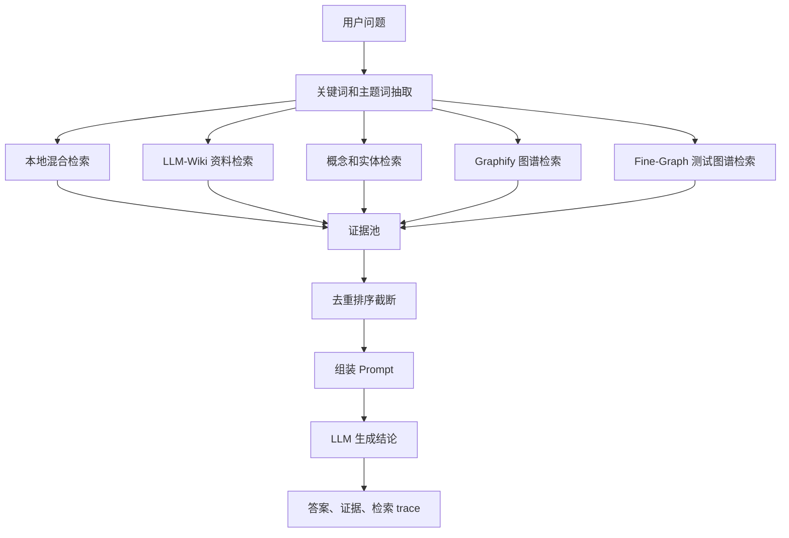

# 我给测试知识库做智能问答时，最重要的一步反而不是调用大模型
!{{year}}年{六月}月-{{noteName}}.webp

很多朋友一听 AI 问答，第一反应就是，模型用哪个。

Claude 还是 GPT。

要不要上向量库。

embedding 选哪个。

说真的，这些都重要，但我真正在做测试知识库的时候，最折磨我的反而不是模型。

是证据召回。

因为测试人员问的问题，通常不是开放闲聊。

他问「支付超时重试会影响哪些测试范围」，不是想听一段泛泛的支付测试方法论。他想知道在当前项目里，有哪些需求、用例、Bug、模块、状态流和这件事有关。

所以我后来把智能问答链路拆成了一个很笨，但比较可靠的流程。

先找证据。

再让模型说话。

## 一条问题进来以后发生了什么

当前链路大概是这样。



这张图看着像架构图，但它背后的想法非常朴素。

一个问题不要只走一条路。

因为任何单一路径都会漏。

BM25 能找到关键词很准的文档，但不懂同义表达。

图谱能找到关系，但前提是关系已经构出来。

概念页能找到业务主题，但可能缺少具体用例。

历史 queries 能找到之前沉淀的高质量答案，但不能让它压过原始资料。

所以最后只能把多路结果放进同一个证据池，再统一去重和排序。

这个过程看着麻烦，但很值。

## 本地混合检索为什么要做得这么土

我没有一上来就把所有希望押在语义检索上。

原因也很简单，测试资料里有大量中文业务词、页面名、接口名、状态名。

这些词很多时候不需要理解。

它就是要精确命中。

比如「检测报告」「定金」「留资」「车源详情」「支付超时」。

命中了就是命中了。

这时候 BM25 加精确关键词，反而非常稳。

| 检索方式 | 它擅长什么 | 它不擅长什么 |
|---|---|---|
| BM25 | 找关键词相关文档，稳定、可解释 | 不理解同义表达和隐含关系 |
| 精确关键词 | 找业务词、文件名、路径命中 | 容易漏掉换一种说法的内容 |
| QMD 语义召回 | 找语义相近资料 | 依赖索引质量，可解释性弱一点 |
| Graphify | 找节点关系和上下游 | 依赖图谱构建质量 |
| Fine-Graph | 找测试点、边界、风险 | 需要测试资产本身有结构 |

这里比较有意思的是 RRF。

RRF 不是召回方式，而是融合排序方式。

BM25 有一个排名，关键词命中也有一个排名。两个排名的分数不是一个量纲，强行相加很怪。

RRF 的做法很粗暴，按名次加分。

```text
score += 1 / (RRF_K + rank)
```

它不关心你原始分数是多少，只关心你在某一路结果里排得靠不靠前。

所以一个文档如果在 BM25 和精确关键词里都靠前，它就会比较稳定地被选出来。

这种算法没有什么玄学感。

但在工程里，就是好用。

## 证据不是文本片段这么简单

如果只是召回几段文本，那这个链路还不够。

我希望前端能展示「这条答案到底怎么来的」，所以每个节点都会生成 trace。

也就是 `ChatTraceStep`。

它大概记录这些东西。

| 字段 | 作用 |
|---|---|
| name | 这一步是什么检索节点 |
| status | 这一步有没有完成 |
| detail | 召回了多少证据，做了什么处理 |
| keywords | 本轮使用了哪些关键词 |
| evidence_count | 这个节点贡献了多少证据 |

证据本身是 `EvidenceItem`。

| 字段 | 作用 |
|---|---|
| title | 证据标题 |
| path | 证据来源路径 |
| kind | 来源类型，比如 wiki_article、graph_node |
| confidence | 证据置信度 |
| snippet | 进入 Prompt 的片段 |
| score | 排序分数 |
| source_node | 来自哪个检索节点 |
| selection_reason | 为什么被选中 |

我很喜欢 `selection_reason` 这个字段。

因为它让系统从「我找到了这个」往前走了一步，变成「我为什么认为这个值得给你看」。

这个区别很关键。

测试人员不是不能接受 AI 辅助判断。

测试人员不能接受的是，AI 用一种很自信的语气，说一个你不知道从哪来的结论。

## 一个问题可以这样跑

假设用户问：

```text
支付超时重试会影响哪些测试范围？
```

链路可能会拆出这些词。

```text
支付
超时
重试
测试范围
订单
状态流
回归
```

然后几路证据会同时回来。

| 来源 | 可能召回的内容 |
|---|---|
| 本地混合检索 | 支付相关需求、用例、历史报告 |
| Wiki 资料 | 订单状态、支付规则、异常场景 |
| 概念实体 | 支付、订单、超时、回归范围 |
| Graphify | 支付节点关联的页面、模块、Bug |
| Fine-Graph | 对应测试点、边界条件、风险项 |

最后模型拿到的不是一个空问题。

而是一包整理过的证据。

它的任务也不再是凭空发挥，而是基于证据做归纳。

这时候答案的质量就会稳定很多。

## 为什么 trace 很重要

我以前觉得 trace 是给开发调试用的。

后来发现不是。

trace 是给用户建立信任用的。

当用户看到系统先做了关键词抽取，再走本地检索，再走图谱，再把证据排出来，他会知道这个答案不是直接拍脑袋。

尤其是测试场景里，用户经常要拿这个结论去做下一步动作。

要不要补用例。

要不要扩大回归范围。

要不要拦提测。

要不要把某个风险写进报告。

这些动作背后都需要依据。

没有 trace，AI 答案就是一段文字。

有 trace，它才开始像一个可复核的工作流。

## 这篇的结论

我现在越来越觉得，AI 问答系统最核心的体验，不是回答得多漂亮。

而是当它回答完以后，用户能不能顺着证据一路点回去。

能看到它查了什么，漏了什么，哪些是强证据，哪些只是推断。

如果能做到这一点，模型哪怕说得朴素一点，也能用。

如果做不到这一点，模型说得再顺，也只能当聊天。

下一篇就可以继续往下讲了。

当文档能被检索以后，为什么我还要继续做图谱。

因为测试真正想知道的，往往不是某个文件写了什么。

而是这些东西之间，到底有什么关系。
