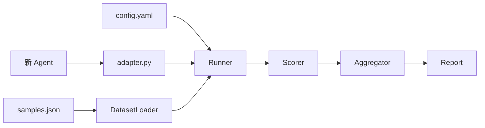
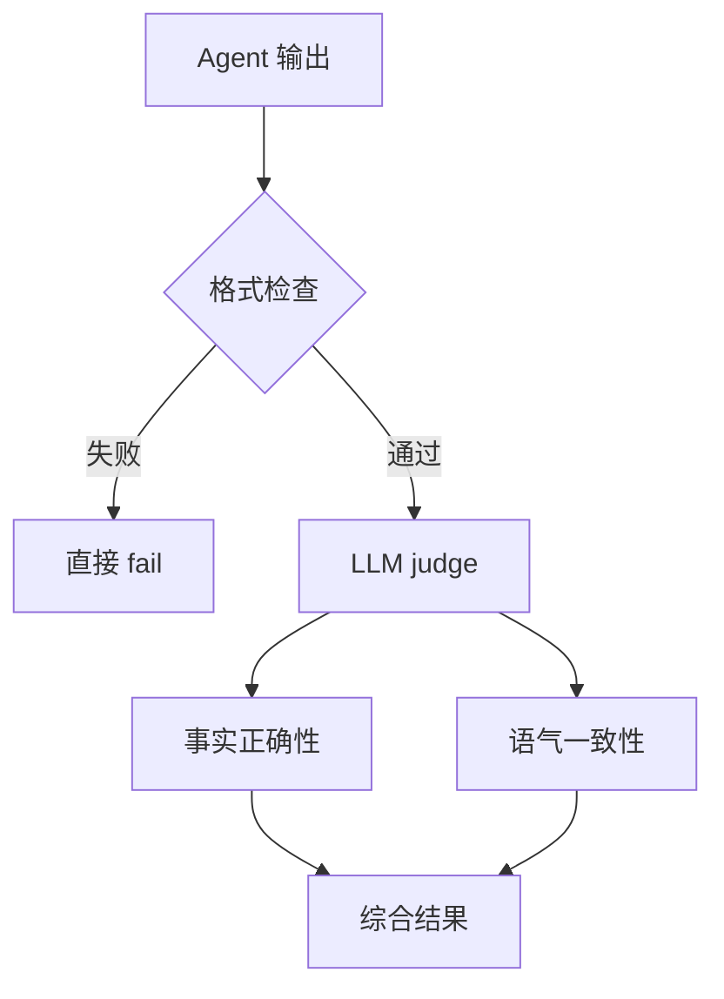

# 我设计 Agent 测试框架时，最想避免的一件事，就是每接一个新 Agent 都重写一套评测

做完框架分层以后，下一个问题就来了。

怎么接入一个新 Agent。

这件事如果设计不好，框架很快就会变成摆设。

因为每个 Agent 都不一样。

有的做分类路由，有的做结构化提取，有的做自然语言回复，有的会调工具，有的还会多轮 handoff。

你不可能要求每个业务同学都理解框架内部所有模块。

所以我设计 agent-test-framework 的扩展方式时，脑子里一直有一个目标。

接入新 Agent 的路径要短。

最好只改三件事。

Adapter。

Dataset。

Config。

## 最短路径应该长这样

理想的接入流程应该非常朴素。

```bash
cp -r examples/intent_classifier examples/your_agent
cd examples/your_agent

# 改 adapter.py
# 改 datasets/samples.json
# 改 config.yaml

atf dry-run examples/your_agent/config.yaml
atf run examples/your_agent/config.yaml --limit 5
```

这就是我希望用户看到的第一层体验。

先拷贝示例。

然后改三件事。

dry-run 验证链路。

run 小样本试跑。

不要一上来就让用户理解注册表、Protocol、CompositeScorer、Aggregator、Reporter。

这些东西应该存在，但不应该挡在门口。

## 三件事分别负责什么

| 文件 | 必改内容 | 它解决的问题 |
|---|---|---|
| adapter.py | name、spec、invoke | 真实 Agent 怎么被框架调用 |
| samples.json | input、expected、样本元数据 | 用什么样本测 |
| config.yaml | dataset、scorer、aggregators、report | 怎么加载、怎么打分、怎么输出 |

这张表很关键。

它把变化限制在用户项目内。

框架核心不需要知道你是 OpenAI Agents SDK，还是 LangChain，还是自己写的 agent。

只要 Adapter 最后返回统一 dict，后面的评分和报告就能继续跑。



这就是扩展性的本质。

不是框架什么都懂。

而是框架只懂稳定边界。

## Adapter 的检查清单

Adapter 是最容易踩坑的地方。

因为它离真实生产 Agent 最近。

我会强制要求它至少说清楚这些事。

| 检查项 | 为什么重要 |
|---|---|
| name 和 config 一致 | 否则报告和配置对不上 |
| production_module 指向真实生产模块 | 证明不是随手 mock |
| production_factory 指向真实构造方法 | 复刻生产创建方式 |
| divergence 必须有 reason | 测试和生产差异要可解释 |
| invoke 返回业务字段 | scorer 要有东西可打 |
| invoke 返回 stage_ms | 延迟和阶段耗时要可统计 |
| 失败抛 AdapterError | 不要静默 None |
| model_settings 对齐生产 | 否则分数没有意义 |

这里我想重点讲 model_settings。

很多评测失真，不是因为样本不好。

是因为测试时模型参数和生产不一样。

生产 temperature 0.6，测试 temperature 0。

生产 top_p 0.85，测试没设。

生产 tool_choice required，测试没强制。

这时候跑出来的分数，很可能只是测试环境下的幻觉。

所以 AdapterSpec 里必须把这些差异写清楚。

## Scorer 常见四种模式

接完 Adapter 以后，就要考虑怎么打分。

不同 Agent 的输出不一样，评分方式也不一样。

我会把常见场景拆成四类。

| 模式 | 适合场景 | 典型组件 |
|---|---|---|
| 分类 / 路由 | intent、specialist、handoff | exact_match、per_class、confusion_pairs |
| 结构化提取 | JSON、表单、IOE | json_match |
| 自然语言回复 | 回复质量、事实、语气 | llm_compare |
| 混合打分 | 先看硬约束，再看语义质量 | regex_match + llm_compare |

分类和路由最好理解。

预期 intent 是 A，输出 intent 也是 A，就 pass。

但自然语言回复就麻烦很多。

你很难用 exact_match 判断一段回复是不是好。

这时候可以用 LLM-as-Judge，但我建议一定要克制。

因为 judge 烧 token，而且它本身也会有不稳定性。

所以比较实用的策略是，先跑硬约束。

格式错了，直接 fail。

格式过了，再看事实正确性和语气。



这不是为了省一点钱。

是为了让评测更稳。

硬规则能解决的，别交给 judge。

## 自定义组件不要改核心

如果内置组件不够，当然要允许用户自己加。

但加法应该走 registry。

比如新增一个业务规则检查，判断输出里的下单时间是不是在 9 点到 20 点。

用户写一个 ScoreComponent，注册成 `my_business_check`，再在 YAML 里引用。

框架核心不用动。

聚合器也是一样。

你想按城市、按客户等级、按 intent 分桶统计，都可以新增 Aggregator。

但别把这些业务统计硬塞进 Runner。

| 想扩展什么 | 应该加在哪里 | 不应该改哪里 |
|---|---|---|
| 新评分维度 | scoring components | Runner |
| 新聚合统计 | scoring aggregators | CompositeScorer 主行为 |
| 新报告模板 | reporting templates | 结果 schema |
| 新 Agent 框架 | Adapter | BaseAdapter 签名 |
| 新监控展示 | monitoring subscriber | Event 字段 |

这个原则听起来很工程洁癖。

但它决定了框架能不能长大。

如果每个新需求都改核心，框架很快就不敢升级了。

## 接其他 Agent 框架也一样

OpenAI Agents SDK 可以接。

LangChain 可以接。

AutoGen 可以接。

CrewAI 也可以接。

但方式都一样，把它们包在 invoke 里。

不要把某个框架的特定 API 暴露到 BaseAdapter。

不然今天为了 OpenAI Agents SDK 加了一个字段，明天为了 LangChain 再加一个字段，后天为了 AutoGen 再加一个字段。

最后 BaseAdapter 会变成各家框架的垃圾桶。

真要接入具体框架，就让 Adapter 自己处理。

框架核心只认输入、输出、错误、耗时和 spec。

## 这篇的结论

一个 Agent 测试框架好不好用，不只看它能不能跑。

还要看它接入新 Agent 时，用户要理解多少内部细节。

我的判断是，接入路径应该尽量短。

改 Adapter，让真实 Agent 能被调用。

改 Dataset，让样本能代表真实场景。

改 Config，让评分和聚合符合这类 Agent 的目标。

剩下的都应该藏在框架里。

下一篇就该讲报告了。

因为评测跑完以后，如果报告只告诉你一个通过率，那其实还不够。

真正有用的报告，应该告诉你怎么测的，为什么失败，下一步该改什么。
