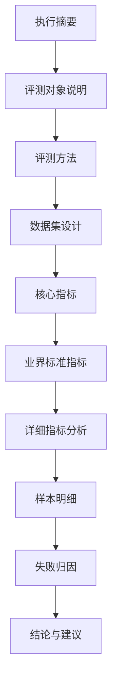

# Agent 测试报告如果只告诉你通过率，那基本等于没告诉你怎么改

我见过很多测试报告。

最常见的一种，就是上来给你一个通过率。

76.7%。

旁边可能再放个红黄绿。

看起来挺直观。

但问题是，看到这个数字以后，PM、QA、开发三个人脑子里的问题完全不一样。

PM 会问，这个结果能不能上线。

QA 会问，这个数据集到底覆盖了哪些场景。

开发会问，失败的 case 到底为什么失败，我该改 prompt、改模型，还是补数据。

如果一份 Agent 测试报告只给通过率，它基本等于只告诉你「现在不太行」。

但没告诉你怎么改。

所以我后来设计 v2 报告的时候，核心目标不是把页面做漂亮。

而是让报告从「结果展示」变成「下一轮优化入口」。

## v1 报告的问题

v1 报告通常会有几个典型问题。

| 痛点 | 具体表现 | v2 应该怎么改 |
|---|---|---|
| 字段含义不清 | 表头全是英文，PM 和 QA 看不懂 | 全字段中英对照，加 tooltip |
| 缺少评测方法 | 直接给数字，不说怎么测 | 加评测方法章节 |
| 不体现 Agent 特性 | 模板通用，看不出被测对象差异 | 加评测对象说明 |
| 维度单一 | 只有 normal / abnormal 之类粗分类 | 加设计类型和业界指标 |
| 缺少可靠性指标 | 只有单次通过率 | 加 pass@k 和 pass^k |
| 失败归因缺失 | 只列失败样本 | 加失败模式和优化建议 |

这些问题看着像报告设计问题。

其实是评测可信度问题。

因为报告如果不解释方法，不解释样本，不解释失败，你就不知道这个分数到底代表什么。

## 一份好报告应该先解释被测对象

Agent 和普通函数不一样。

它有架构，有工具，有模型参数，有边界，有生产差异。

比如 wecom_assistant 这种 manager-specialist 双层结构，就不能只看 50 类 intent 是否严格命中。

因为有时候 intent code 内部混了，但 specialist 路由仍然对，业务影响没那么大。

所以报告里必须先讲清楚被测对象。

| 信息 | 为什么要写 |
|---|---|
| Agent 名称和版本 | 确认被测对象 |
| 模型和 SDK | 解释能力边界和依赖 |
| 架构 | 理解指标为什么这么设计 |
| in_scope / out_of_scope | 防止误读报告 |
| model_settings | 判断是否贴近生产 |
| divergences | 说明测试环境和生产环境差异 |

如果这部分不写，读者很容易误解指标。

比如 B1 阶段只测 manager 的 intent 识别和路由，就不要拿它去评价 specialist 的回复质量。

边界一定要说清楚。

## v2 报告的十章结构

我更推荐的报告结构是 10 章。

这 10 章不是为了显得专业。

它们分别服务不同问题。

| 章节 | 解决的问题 | 主要读者 |
|---|---|---|
| 执行摘要 | 30 秒看懂能不能过 | PM / 负责人 |
| 评测对象说明 | 被测 Agent 到底是什么 | 全部 |
| 评测方法 | 结果怎么来的，能不能复现 | QA / 开发 |
| 数据集设计 | 样本覆盖是否专业 | QA |
| 核心指标 | 业务最关键结果 | 全部 |
| 业界标准指标 | 稳定性、效率、鲁棒性 | 开发 / 架构 |
| 详细指标分析 | 哪些类、哪些桶有问题 | QA / 开发 |
| 样本明细 | 回到具体 case | 开发 |
| 失败归因 | 为什么失败 | 开发 |
| 结论建议 | 下一步改什么 | 全部 |

报告不是写给一个人的。

它要让不同角色都能找到自己关心的那层信息。

## 核心指标要贴着业务

对 manager-specialist 架构来说，我会把核心指标放在最前面。

| 指标 | 中文释义 | 业务含义 |
|---|---|---|
| route_pass_rate | 路由通过率 | specialist 是否选对 |
| code_pass_rate | 意图命中率 | 50 类 intent 是否严格命中 |
| gap | 内部混淆率 | specialist 对但 code 内分错 |
| fallback_count | 兜底次数 | 非法 code 静默修正次数 |
| intent_lenient_rate | 宽松命中率 | 扣除近义干扰后的精度 |

这里 route_pass_rate 很关键。

因为业务上最关心的可能不是 code 是否完全一致，而是用户有没有被交给正确 specialist。

code_pass_rate 更严格，适合看模型分类能力。

gap 则很有意思，它能告诉你，错误里有多少只是同 specialist 内部混淆。

不是所有错误影响都一样。

报告必须把这个差异讲出来。

## pass@k 和 pass^k 很适合 Agent

Agent 有非确定性。

哪怕 temperature 固定，它在多 trial 下也可能表现不一样。

所以单次通过率不够。

这里可以引入 pass@k 和 pass^k。

| 指标 | 含义 | 读法 |
|---|---|---|
| pass@1 | 单次通过率 | 第一次能过多少 |
| pass@3 | 三次里至少一次通过 | 能不能碰巧跑对 |
| pass^3 | 三次都通过 | 稳不稳定 |
| Consistency Rate | 多次输出一致率 | 是否飘 |

pass@3 高，不一定是好事。

如果 pass@3 很高，但 pass^3 很低，说明这个 Agent 不是不会。

是很不稳。

用户真实体验更接近 pass^k。

因为用户不是来抽奖的。

他希望同样的问题，每次都能稳定得到正确处理。

## 数据集设计也要写进报告

测试报告不能只写结果。

还要写样本怎么设计。

比如这份设计里，把样本分成五类。

| 类型 | 定义 | 价值 |
|---|---|---|
| normal | 清晰意图、标准表达 | 主力业务场景 |
| boundary | 极短、极长、临界 intent | 看边界能力 |
| abnormal | 多意图、模糊、跨 specialist | 看复杂真实场景 |
| robustness | 错别字、口语、emoji | 看鲁棒性 |
| adversarial | 越界、注入、非业务话题 | 看安全底线 |

这部分非常重要。

因为如果 normal 占比太高，通过率会很好看。

但上线以后，用户不会只说标准话。

他会口语化，会打错字，会混着问，会前后文跳来跳去。

所以报告要告诉读者，这个分数是在哪种样本分布下跑出来的。

不然通过率没有解释力。

## 失败归因比失败列表更重要

失败样本当然要列。

但只列失败样本还不够。

你需要知道失败属于哪一类。

| 失败模式 | 优化方向 |
|---|---|
| 同 specialist 内意图混淆 | 细化 intent 描述 |
| 跨 specialist 意图混淆 | 优化 specialist 边界 |
| 长上下文衰减 | 增强早期上下文关注 |
| 对抗输入失败 | 加规则和安全边界 |
| 系统错误 | 查 API、超时、异常处理 |

这张表才真正能指导迭代。

如果失败主要是同 specialist 内部混淆，那可能业务影响没那么大，优先级可以低一点。

如果是跨 specialist 混淆，那就麻烦了。

这意味着用户被交给了错误的处理链路。

这类问题要优先修。

## 报告最后一定要给行动建议

我觉得很多技术报告差在最后一步。

分析写了很多。

图也很漂亮。

但没有告诉团队下一步干什么。

v2 报告应该把建议写得很具体。

| 优先级 | 建议类型 | 应该指向哪里 |
|---|---|---|
| P0 | 修跨 specialist 混淆 | prompt 边界、路由表 |
| P1 | 补长尾样本 | dataset |
| P1 | 增强长上下文能力 | prompt、上下文摘要 |
| P2 | 优化报告展示 | template |
| P2 | 降低 token 成本 | model settings、截断策略 |

建议不能只写「继续优化模型」。

这话等于没说。

要指向 prompt、数据、模型、工具、报告、评测策略里的某一个具体位置。

## 这篇的结论

Agent 测试报告不是成绩单。

它应该是下一轮迭代的地图。

通过率只是入口。

更重要的是，怎么测的，样本怎么分布，哪些指标最贴业务，失败集中在哪类，是否稳定，下一步该改哪里。

如果一份报告能回答这些问题，它就不只是展示结果。

它开始真正参与研发决策。

下一篇我想把这个系列收一下。

Agent 评测最难的不是跑出一个分数。

而是让这个分数真的能指导下一轮迭代。
