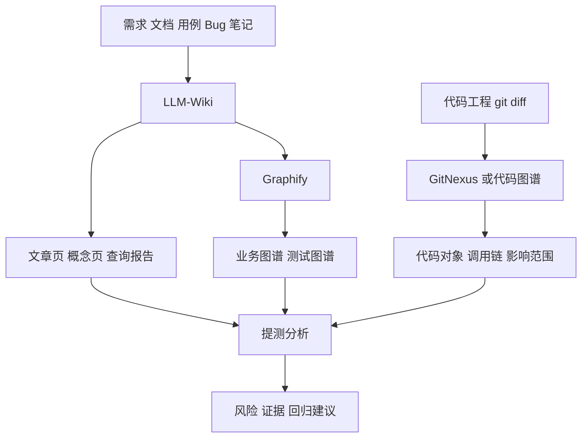

# 文档能搜索还不够，测试真正想知道的是这些东西之间有什么关系

做到智能问答以后，我一开始还挺开心。

因为它确实能回答问题了。

你问一个业务规则，它能把相关资料找出来。你问一个测试范围，它也能给你一些证据。

但很快我就发现一个更麻烦的问题。

文档能搜索，只能说明你找到了点。

测试真正要判断的，往往是点和点之间的线。

一个需求影响了哪个页面。

一个页面关联了哪些接口。

一个接口背后有没有历史 Bug。

一个 Bug 修复碰到了哪些代码文件。

一段 diff 又会反过来影响哪些测试用例。

这些问题如果只靠文本搜索，就会很吃力。

所以我后面开始把 LLM-Wiki、Graphify、GitNexus 这几件事串在一起。

不是为了显得技术栈很花。

而是因为测试这件事，本来就是关系密集型工作。

## 图谱不是拿来炫的

很多人一听知识图谱，会天然想到那种很炫的节点图。

一堆点，一堆线，可以拖来拖去。

挺好看。

但说实话，如果只是给用户看图，我觉得价值有限。

测试人员不是天然想看图。

他想要的是结论。

图谱真正的价值，是在背后帮系统回答这种问题。

| 测试问题 | 图谱能提供的帮助 |
|---|---|
| 这个需求影响哪些模块 | 从需求节点找功能、页面、接口邻居 |
| 这次代码改动该测什么 | 从代码对象反查业务节点和用例 |
| 历史 Bug 会不会复发 | 找同类功能、同类状态流、同类修复记录 |
| 资料有没有断链 | 找孤立节点、缺来源节点、低置信关系 |
| 回归范围怎么解释 | 给出用例推荐背后的关系证据 |

所以我后来给图谱的定位很明确。

它不是主产品界面。

它是证据基础设施。

用户可以不打开图谱页面，但系统生成报告的时候，应该能用到图谱证据。

## LLM-Wiki 和 Graphify 怎么分工

我现在比较习惯这样理解。

LLM-Wiki 负责把测试资料整理成可读、可查、可引用的知识库。

Graphify 负责把这些资料之间的关系构出来。

GitNexus 或代码图谱负责把代码侧的依赖、调用、变更影响范围接进来。

大概是这样。

这几个东西不要互相替代。

LLM-Wiki 不应该硬做代码调用链。

Graphify 也不应该替代文档编译。

代码图谱更不应该假装自己理解了全部业务。

每一层只做自己擅长的事，最后在提测分析或者智能问答里汇合。

这是我觉得比较稳的方案。

## 代码工程为什么也要图谱化

测试人员看代码，有个很现实的问题。

很多时候不是看不懂一行代码，而是不知道从哪里开始看。

一个后端项目里，包名、类名、任务名、接口名全堆在一起。你直接问 AI，它可能能解释某个文件，但很容易漏掉上下游。

所以代码工程类分析，我后来定了一个标准流程。

| 步骤 | 为什么要做 |
|---|---|
| 先分析项目结构 | 避免扫错目录 |
| 找出业务源码路径 | 降低噪音 |
| 必要时先确认路径 | 防止构图范围失控 |
| 再构建 graphify | 得到结构关系 |
| 回读关键源码 | 补足业务语义 |
| 输出业务可读报告 | 让产品、测试、业务也能读 |

这里最重要的是，不要只看图谱。

只看图谱会得到结构，但得不到业务语义。

比如你能看到 A 调了 B，B 又调了 C。

但为什么这么调，异常分支是什么，缓存什么时候刷新，补偿任务什么时候跑，这些细节还是要回读源码。

图谱给你路线图。

源码给你真实路况。

两个都要。

## 图谱关系要服务测试报告

我做这套东西时，有一个挺明确的想法。

图谱结果不能只停留在 graph.html 里。

它应该进入测试报告。

比如一份提测分析报告里，能出现这样的结构。

| 报告部分 | 图谱证据怎么参与 |
|---|---|
| 影响范围 | 从需求、功能、代码对象邻居推导 |
| 风险点 | 从历史 Bug、低覆盖节点、状态流断点推导 |
| 回归推荐 | 从代码对象到测试用例的关系推导 |
| 待复核项 | 从 AMBIGUOUS 或 INFERRED 边抽取 |
| 证据来源 | 回到文档、图谱节点、源码路径 |

这时候图谱就不再是一个独立页面。

它变成了报告里的依据。

这很关键。

因为测试工作最终要交付的往往不是「我看了一个图」。

而是一份结论。

这个版本能不能测。

风险高不高。

哪些必须回归。

哪些资料不可信。

哪些地方要补用例。

图谱如果不能帮助这些结论，它就只是一个漂亮玩具。

## 我对 GitNexus 的定位

在当前这套资料里，LLM-Wiki 和 Graphify 已经是可落地的部分。

GitNexus 更适合被写成下一阶段增强。

也就是把代码侧知识纳入统一查询链。

它应该回答的是这些问题。

| 能力 | 价值 |
|---|---|
| 代码依赖链 | 判断变更影响范围 |
| blast radius 分析 | 找出可能被波及的模块 |
| diff 上下文 | 把本次改动接进测试分析 |
| 代码对象映射 | 把文件、类、函数和业务节点关联 |
| 回归推荐增强 | 从代码变更反推测试用例 |

我不太想把它说成一个万能代码大脑。

那样太虚。

更准确的说法是，它负责补上代码侧证据。

当测试知识库已经知道需求、用例、Bug 的关系以后，代码侧证据一接进来，提测分析才会完整。

## 这篇的结论

文档问答解决的是「我能不能找到资料」。

图谱解决的是「这些资料之间有没有关系」。

代码图谱解决的是「这次变更到底碰到了哪里」。

三件事连起来，测试平台才不只是一个资料搜索入口。

它开始有机会回答更接近真实工作的判断。

这次改动影响什么。

该测什么。

为什么要测。

证据在哪。

下一篇就该讲这条关系链里最核心的部分了。

需求、测试用例、Bug 和代码，为什么应该被连成一条链。
