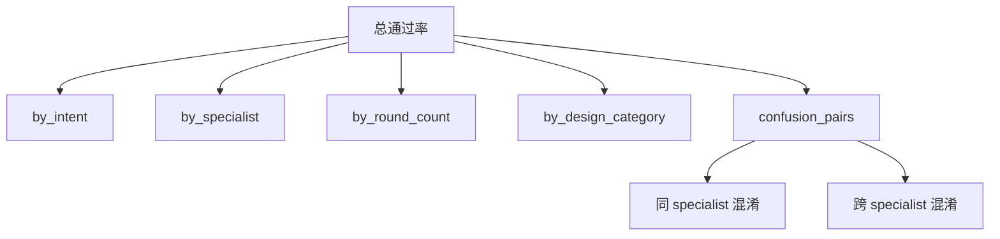
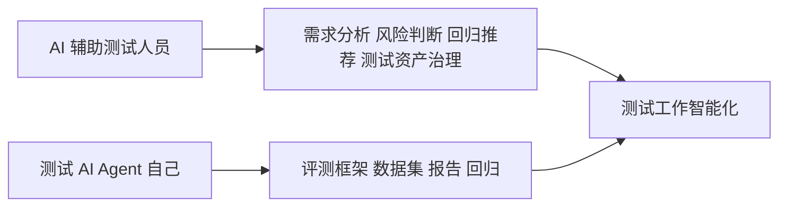

# Agent 评测最难的不是跑出一个分数，而是让这个分数真的能指导下一轮迭代

写到第四篇，其实可以把前面三件事串起来了。

第一篇讲架构。

评测流程要拆成 load、invoke、score、aggregate、report。

第二篇讲扩展。

接新 Agent 不应该重写一套评测，而是改 Adapter、Dataset、Config。

第三篇讲报告。

报告不能只给通过率，还要解释对象、方法、数据集、失败归因和行动建议。

这三件事合起来，才是我理解里的 Agent 评测闭环。

不是跑一个分数。

而是让分数能进入下一轮迭代。

## 一个完整闭环长什么样

我现在更认可这样的流程。

这张图里最重要的是最后一段。

报告不是终点。

报告要回到优化。

优化以后，再回归。

否则每次评测都是一次性活动。

今天跑一下，明天忘掉。

这就很浪费。

## 评测要分阶段

不是所有评测都要一次跑满。

Agent 评测最好分阶段。

| 阶段 | 目标 | 样本规模 | 适合什么时候跑 |
|---|---|---|---|
| dry-run | 验证链路能不能跑通 | 极少量 | 接入新 Agent 时 |
| smoke | 快速发现大问题 | 代表性小样本 | 每次改 prompt / adapter 后 |
| full | 全量能力评估 | 全量 visible / hidden | 重要版本前 |
| regression | 防止旧能力回退 | 固定回归集 | 每次发布前 |

这个分层很实用。

如果每次都 full，成本太高，大家会不愿意跑。

如果每次只 smoke，又看不出真实质量。

所以要让不同阶段服务不同问题。

dry-run 保证接入没断。

smoke 保证没有明显大坑。

full 看整体能力。

regression 看有没有退化。

## visible 和 hidden 不是形式主义

做 Agent 评测很容易过拟合样本。

你看到了失败样本，就去改 prompt。

改着改着，这批样本全过了。

然后换一批真实用户输入，又崩了。

这就是为什么要做 visible / hidden 拆分。

| 数据集 | 用途 | 风险 |
|---|---|---|
| visible | 开发可见，用于调试和优化 | 容易被过拟合 |
| hidden | 开发不可见，用于验收泛化能力 | 样本设计要稳定 |
| regression | 历史关键样本，防回退 | 需要长期维护 |

visible 是训练场。

hidden 是考试。

regression 是底线。

这三类样本不能混着用。

尤其是 Agent 这种很容易被 prompt 调教到「会背题」的东西，更要小心。

## 分数要能拆开

一个总通过率太粗了。

比如 76.7%，你不知道它到底差在哪里。

是长尾 intent 差。

是长上下文差。

是对抗样本差。

是同 specialist 内部混淆。

还是跨 specialist 直接路由错了。

所以分数必须能拆。

拆开以后，优化才有方向。

如果长上下文衰减明显，就去看上下文截断、摘要、早期消息保留。

如果长尾 intent 很差，就补样本和描述。

如果跨 specialist 混淆严重，就改 specialist 边界。

如果对抗样本失败，就补安全规则和拒答策略。

这时候分数才有用。

## 多 trial 是为了看稳定性

Agent 不是普通确定性函数。

同一个输入，多跑几次，可能会有不同输出。

所以多 trial 很重要。

但多 trial 不是为了把分数刷高。

而是为了看稳定性。

| 指标 | 它告诉你什么 |
|---|---|
| pass@1 | 单次成功率 |
| pass@k | 多次里至少一次成功，说明能力上限 |
| pass^k | 连续多次都成功，说明用户体验稳定性 |
| consistency rate | 输出是否一致 |

我会更看重 pass^k。

因为真实用户不会对同一个问题反复问三次，等它碰巧答对。

对用户来说，稳定比偶尔聪明更重要。

一个 pass@3 很高但 pass^3 很低的 Agent，就像一个考试会蒙题的人。

不是完全不会。

但你不敢把关键任务交给它。

## 失败归因要能回到动作

失败归因如果只是分类，也还不够。

它要能回到动作。

| 失败归因 | 下一步动作 |
|---|---|
| intent 描述重叠 | 改 prompt 里的边界说明 |
| 长尾样本不足 | 补 dataset |
| 长上下文衰减 | 改上下文策略 |
| 输出格式不稳 | 先加 rule scorer 和格式约束 |
| LLM judge 成本高 | 加硬规则短路 |
| 系统错误 | 查 adapter 异常和 API 超时 |

我很不喜欢那种「建议进一步优化」。

太空了。

好的报告应该直接告诉你，改哪里。

prompt。

数据集。

模型设置。

Adapter。

Scorer。

还是报告模板。

这才叫可行动。

## 评测框架真正的价值

回到最开始，为什么要做 agent-test-framework。

不是为了多一个 CLI。

也不是为了生成一个更漂亮的 HTML。

而是为了把 Agent 迭代从感觉驱动，变成证据驱动。

| 没有框架时 | 有框架后 |
|---|---|
| 手工试几条 | 固定数据集可复跑 |
| 感觉变好了 | 指标对比能证明 |
| 失败靠翻聊天记录 | 样本明细和失败归因 |
| 每个 Agent 单独搞 | Adapter 接入统一流程 |
| 报告只看通过率 | 报告给出下一步动作 |
| 改完不知道有没有回退 | regression 集兜底 |

这就是工程化的意义。

让模糊的东西变得可比较。

让临时的判断变得可复盘。

让每一次优化都能留下证据。

## 和测试平台那组文章的关系

前面那组 LLM-Wiki-Code 文章讲的是，AI 怎么帮测试人员做测试判断与质量决策。

这一组 Agent 测试框架讲的是，我们怎么测试 AI Agent 自己。

这两个方向其实是连着的。

一个是用 AI 做测试。

一个是测试 AI。

两件事最后会汇合。

因为当 AI Agent 进入真实业务流程以后，它自己也必须被纳入测试体系。

不然我们只是把不确定性从人手里，转移到了模型里。

这不是进步。

这是把风险换了个地方藏起来。

## 最后收一下

Agent 评测最难的不是跑出一个分数。

分数很好跑。

难的是这个分数能不能复现，能不能解释，能不能拆解，能不能对比，能不能指导下一步行动。

如果不能，它只是一个好看的数字。

如果能，它就是研发迭代的一部分。

我做 agent-test-framework 的底层想法，其实就这么简单。

把真实样本放进来。

把真实 Agent 跑起来。

用稳定的评分器和聚合器把结果拆开。

用报告把失败讲明白。

再让这些失败，回到下一轮 prompt、数据、模型和代码优化里。

这样 Agent 才不是越改越玄学。

而是每一轮都能留下一点证据。

这事儿听起来不酷。

但我越来越觉得，AI 工程化真正值钱的地方，往往就是这些不酷的东西。
