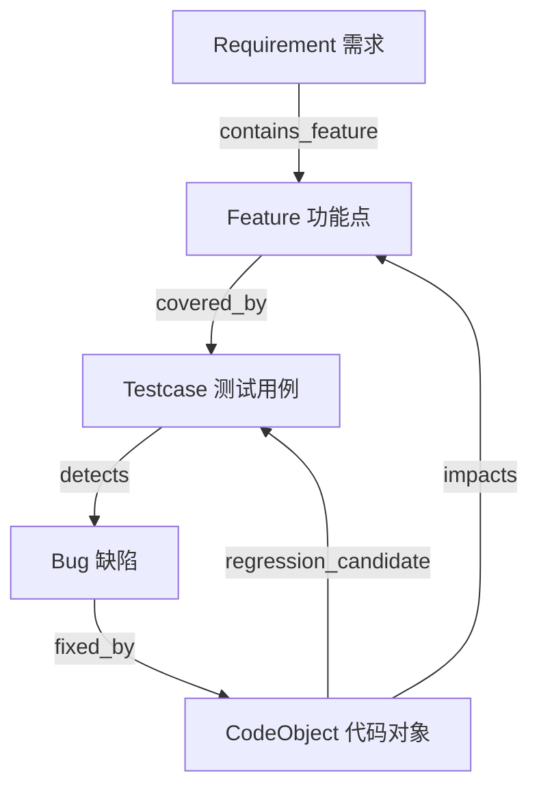
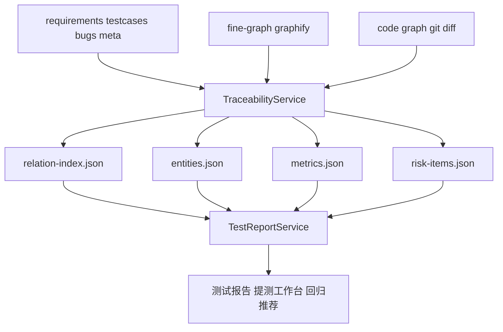
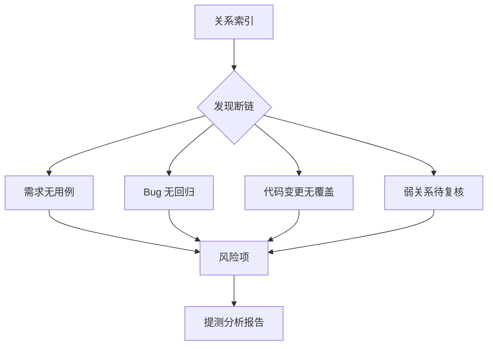

# 测试平台最该沉淀的不是报告，而是需求、用例、Bug 和代码之间的关系

我之前一直有个误区。

觉得测试平台能生成一份不错的分析报告，就已经很有价值了。

后来我越做越觉得，报告当然有价值，但如果报告只是一次性产物，那它的价值会很快散掉。

今天生成，今天看完，明天换一个需求又从头来。

测试团队真正应该沉淀的，不是某一份漂亮报告。

而是报告背后的关系。

哪个需求被哪些用例覆盖。

哪个 Bug 应该被哪些回归用例兜住。

哪个代码文件最近总是影响某个业务模块。

哪个功能点历史缺陷很多，但测试资产一直很薄。

这些关系一旦沉淀下来，后面的测试报告、回归推荐、覆盖率统计、范围评估，才不会每次都重新拍脑袋。

## 一条测试关系链长什么样

我现在倾向于把第一版关系链做得非常克制。

不要一上来搞一个大而全的数据中台。

先把最关键的链路跑通。



这条链基本覆盖了测试人员最常见的几个问题：

这个需求有没有用例。

这个功能以前有没有出过 Bug。

这个 Bug 有没有补回归。

这次代码改动会不会影响某些测试点。

这条链如果打通，很多事情会变简单。

## 为什么要有 TraceabilityService

我不想直接改 graphify 底层，也不想让每个业务功能自己拼一遍关系。

所以设计里有一层 `TraceabilityService`。

它的定位是聚合层。

从现有 Wiki、fine-graph、code graph、diff、测试报告里抽取实体和关系，然后生成平台统一能消费的索引。



这层东西不追求酷。

它追求可消费。

因为后面的测试报告不应该每次都临时去读一堆散文件。

它应该有一份稳定的关系索引。

## 关系不能只有真假，还要有置信度

这块我觉得非常重要。

很多 AI 系统一出问题，就是因为把推断当事实。

测试平台尤其不能这么干。

比如系统通过关键词发现某个需求和某个用例都提到了「检测报告」，这可以作为线索，但不能直接当成强覆盖关系。

如果用例文件里明确写了需求编号，或者图谱里有明确强边，那才更接近强证据。

所以关系链里需要置信度分级。

| 置信度 | 含义 | 使用方式 |
|---|---|---|
| EXTRACTED | 从文件、图谱强关系、diff、接口结果中明确抽取 | 可以进入报告指标和强结论 |
| INFERRED | 通过关键词、别名、邻居关系推断 | 可用于召回和风险提示 |
| AMBIGUOUS | 来源冲突、关系不确定、证据不足 | 必须进入待复核 |

这张表看着很普通，但它背后是一个底线。

模型推断不能直接写成强事实。

不然报告看起来很自动化，实际是在给团队埋雷。

## 关系索引里应该存什么

第一版没必要复杂。

一个实体大概这样。

```json
{
  "id": "req:tcc-c:req-001",
  "type": "Requirement",
  "title": "检测报告新增瑕疵打点",
  "source_path": "requirements/xxx.md",
  "labels": ["检测报告", "瑕疵", "打点"]
}
```

一条关系大概这样。

```json
{
  "id": "rel:covered_by:req-001:tc-009",
  "source_id": "req:tcc-c:req-001",
  "target_id": "tc:tcc-c:tc-009",
  "relation": "covered_by",
  "confidence": "EXTRACTED",
  "evidence_path": "fine-graph/graph.json",
  "evidence_snippet": "Feature 检测报告 -> Evidence 检测报告-最全.md"
}
```

关键不是字段多。

关键是每个关系都能回到证据。

你说这个需求被这个用例覆盖。

证据在哪。

你说这个代码对象影响这个功能。

证据在哪。

你说这个 Bug 有回归候选。

证据在哪。

只要能回去，测试人员就能复核。

## 关系链能直接产出哪些价值

一旦关系索引有了，很多功能就不是单点工具了。

| 能力 | 没有关系链时 | 有关系链后 |
|---|---|---|
| 测试报告 | 临时拼资料和结论 | 指标能回到关系和证据 |
| 回归推荐 | 靠 diff 和关键词召回 | 能结合历史 Bug、用例覆盖、代码对象 |
| 覆盖率统计 | 只能看关键词命中 | 能看需求到用例的覆盖关系 |
| Bug 复盘 | 靠人工翻历史记录 | 能反推缺失用例和代码影响 |
| 范围评估 | 依赖个人经验 | 能基于历史关系链估算重点区域 |

这就是我觉得它值得单独做一层的原因。

它不是为了做数据建模而建模。

它是为了让平台的每个结论都有一条可追踪的路。

## 断链本身就是风险

还有一个很有意思的点。

关系链不只是帮你找到已有关系。

它还能帮你发现断链。

比如：

需求有了，但没有测试用例。

Bug 修了，但没有回归用例。

代码变了，但没有命中任何测试资产。

某个功能历史 Bug 很多，但覆盖热图一直是红的。

这些东西不需要模型写得多聪明。

关系链自己就能把风险暴露出来。



这类风险项比泛泛的 AI 提醒有用得多。

因为它是从数据结构里长出来的。

## 这篇的结论

测试平台如果只生成报告，会很容易变成一次性工具。

真正应该沉淀的是关系。

需求、功能、用例、Bug、代码、报告指标、风险项，这些东西被连起来以后，平台才开始有长期记忆。

而且这里一定要克制。

强证据就是强证据，推断就是推断，模糊就是模糊。

不要为了自动化，把所有东西都说成确定。

测试工作最怕的不是 AI 不够聪明。

是 AI 太自信。

下一篇我想讲三个看起来很小的质量工具。

覆盖热图、待复核队列、回归推荐。

它们单独看都能解释价值，但真正有用，是被放进提测闭环以后。
