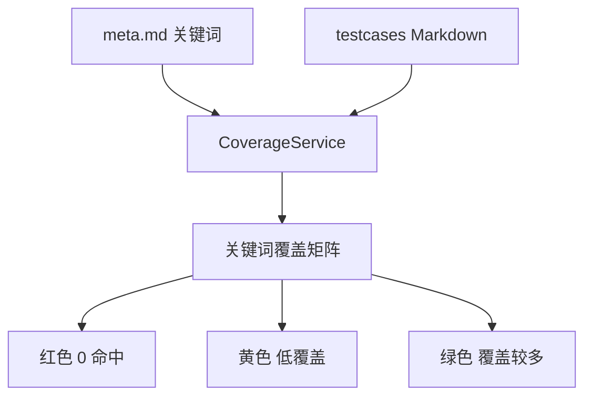
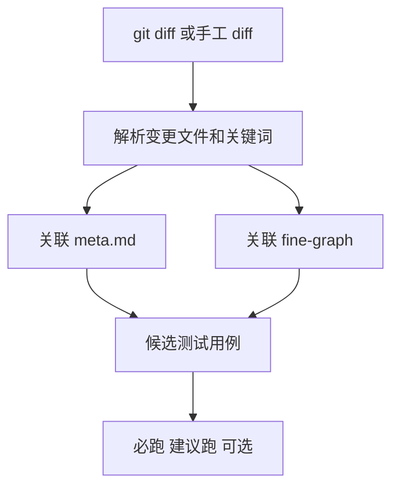
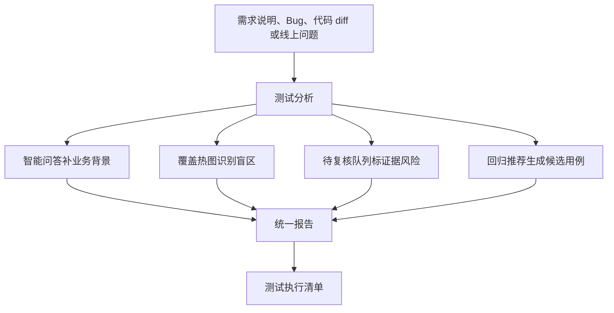

# 我做了三个测试质量小工具，后来发现它们不能单独存在

做平台的时候，最容易上头的一件事，就是不断加功能。

你做了智能问答，觉得还不够。

那加个覆盖热图吧。

有覆盖热图，资料不可信怎么办。

那加个待复核队列吧。

代码变了该回归什么，用户也想知道。

那再加个回归推荐吧。

听起来每个都对。

而且每个功能都能写出一套完整的价值说明。

但我后来复盘的时候发现一个有点扎心的事实。

功能有价值，不等于用户会觉得它有用。

因为用户不是为了使用功能而来。

用户是为了完成今天这次测试判断而来。

## 三个工具分别解决什么

这三个工具本身其实都挺实用。

| 工具 | 它回答的问题 | 核心数据来源 |
|---|---|---|
| 覆盖热图 | 哪些业务关键词没有测试用例覆盖 | meta.md 和 testcases |
| 待复核队列 | 哪些资料、关系、lint 告警不可信 | graphify、04-wiki、wiki-lint |
| 回归推荐 | 这次代码变更应该回归哪些用例 | git diff、meta.md、fine-graph |

覆盖热图看的是盲区。

待复核队列看的是可信度。

回归推荐看的是本次变更。

三件事单独拆开都成立。

但如果直接把它们平铺在菜单里，普通测试人员很可能会懵。

我今天拿到一个需求和一段 diff，我到底先点哪个。

看完覆盖热图以后，我下一步干什么。

待复核队列里一堆问题，哪些和本次提测有关。

回归推荐出来以后，怎么变成最终执行清单。

这些问题不解决，工具就会停留在「看起来有用」。

## 覆盖热图的价值和边界

覆盖热图的逻辑很直接。

从 meta.md 里提取业务模块、功能关键词、页面关键词、接口关键词、Bug 关键词、风险关键词。

再去测试用例目录里匹配。

命中多的绿色，命中少的黄色，完全没命中的红色。

这个东西很适合做测试资产治理。

比如你能一眼看到某个核心页面没有用例，某个风险关键词没有任何历史覆盖。

但它的问题也很明显。

红色不一定代表这次必须补。

绿色也不一定代表这次就安全。

覆盖热图告诉你资产薄弱区，但它不能单独决定本次测试范围。

所以它应该进入测试分析里的「覆盖风险」部分，而不是孤零零地当一个主入口。

## 待复核队列不是给用户增加负担

待复核队列聚合的是那些不太可信的东西。

比如 AMBIGUOUS 边、INFERRED 边抽样、待验证段落、lint 告警。

它本质上是在告诉你，哪些资料不能直接拿来做强结论。

| 来源 | 典型问题 | 处理方式 |
|---|---|---|
| AMBIGUOUS 边 | 图谱关系不确定 | 高优先级人工确认 |
| INFERRED 边 | 系统推断关系 | 可用于召回，不能做阻塞依据 |
| 待验证段落 | 文档作者留下疑点 | 中优先级补充资料 |
| lint 告警 | 断链、孤立、缺来源 | 修复后重新编译或构图 |

这个工具对平台建设很重要。

但如果直接丢给普通测试人员，它可能会变成负担。

你想想看，用户本来只是想知道这个版本怎么测，结果平台让他先处理一堆资料治理问题。

这就有点跑偏了。

更合理的方式是，在提测报告里把相关待复核项摘出来。

只告诉用户，本次结论里有哪些证据不够硬，哪些需要人工确认。

这样它才是在服务判断，而不是制造任务。

## 回归推荐最接近用户价值

三个工具里，回归推荐是最容易被用户感知到价值的。

因为它直接回答一个很现实的问题。

这次代码改了，我该回归什么。

它的链路大概是这样。

这件事非常贴近测试日常。

但它也有边界。

回归推荐只是候选范围。

它不能替代需求理解，也不能替代风险判断，更不能替代最终执行清单。

如果它不接入需求说明、历史 Bug、覆盖热图和待复核项，它就很容易变成「根据 diff 猜几个用例」。

有用，但还不够。

## 三个工具应该怎么组合

我后来更认可这种形态。

也就是，它们不应该平行存在。

它们应该被编排。

覆盖热图成为报告里的覆盖风险。

待复核队列成为报告里的证据可信度提示。

回归推荐成为测试清单的候选来源。

最后用户看到的不是三个工具，而是一份测试判断。

这才是产品化。

## 工具箱的问题

我现在有个很强烈的感受。

平台建设者很容易喜欢工具箱。

因为工具箱能展示能力。

这里一个图谱，那里一个热图，这边一个队列，那边一个报告。

每个页面都能讲出价值。

但用户不一定买账。

用户会问一个很朴素的问题。

我今天怎么用。

如果回答不上来，功能再多都显得散。

这也是为什么我后来建议把平台定位从「LLM-Wiki-Code 查询平台」收敛成「测试判断、风险分析与执行清单生成平台」。

不是因为底层能力不重要。

恰恰是因为底层能力太多了，必须有一个主流程把它们管起来。

## 这篇的结论

覆盖热图、待复核队列、回归推荐，都是好工具。

但它们不能单独成为产品答案。

测试人员真正要的是，在拿到需求和 diff 以后，平台能不能告诉他风险在哪里、必须测什么、哪些证据不可靠、最后清单怎么执行。

工具是零件。

测试判断和质量决策才是整机。

下一篇我想讲这个转向。

从一堆工具，到一个工作台。

也就是我把测试平台做成一堆功能后，才发现用户真正要的是一张测试决策单。
