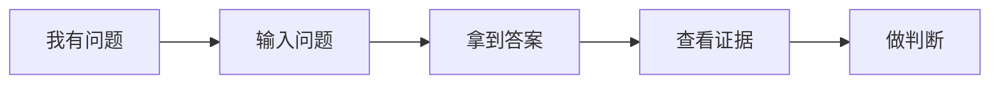
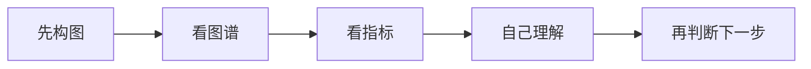
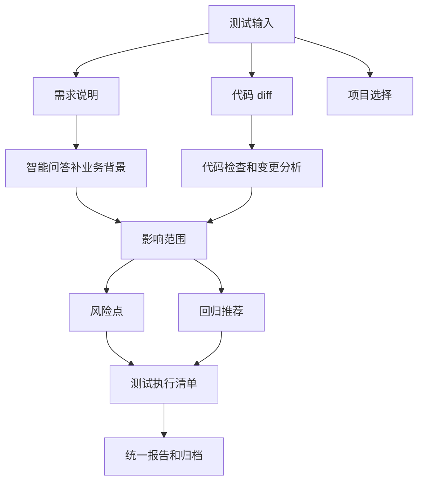

# 我把测试平台做成一堆工具后，才发现用户真正要的是一张测试决策单

这个系列写到这里，其实到了一个挺关键的转折点。

前面我一直在讲知识库、检索、图谱、关系链和质量工具，这些东西单独拿出来都对，也都有实打实的技术价值。问题恰恰出在这里，做平台的人很容易因为每个功能都有道理，就顺手把它们全都做出来，结果平台长成了一个看起来什么都有的工具箱。

智能问答、报告分析、覆盖热图、待复核队列、关系链分析、代码检查、变更分析、回归推荐、测试任务工作台、图谱、资产总览、数据维护，一个入口接着一个入口，看起来很丰富，甚至会让建设者产生一种平台已经相当完整的满足感。

但用户一进来，第一反应可能不是功能真多，而是我该从哪开始。

这件事挺危险的，因为当用户需要先理解每个工具的边界，再自己决定调用顺序，平台其实只是把原本散落在不同地方的信息集中到了一个页面里。工具确实变多了，用户的判断负担却没有减少。

## 用户最喜欢的为什么还是智能问答

我后来复盘时发现，当前最容易被用户感知到价值的，还是智能问答。原因并不是它的技术最复杂，而是它的使用路径最短，用户几乎不需要学习就知道自己该做什么。



这条路径非常顺。用户不需要理解图谱怎么构建，不需要知道覆盖热图用了什么算法，更不需要在提问之前先处理资料治理。他只是输入一个问题，然后拿到答案和证据，接着完成自己的判断，所以他会很自然地觉得这个功能有用。

反过来看，很多功能不是没有价值，而是它们抵达价值的路径太长。



对平台建设者来说，这些功能当然重要，因为它们代表数据能力、分析深度和技术壁垒。但对普通测试人员来说，判断负担仍然留在自己身上。他需要看懂图谱、理解指标、拼接证据，再决定下一步做什么。

平台给了他很多信息，但最费脑子的活还是他自己干，这就是问题。

## 平台真正缺的不是功能，是主流程

我后来越来越觉得，当前平台最大的问题不是能力不够，而是缺少一个测试人员每天真的会走的主流程。

一个测试人员今天拿到提测，手里可能有一份需求说明、一段 diff、一些历史用例和 Bug，甚至还有几句没有写进文档的口头补充。他真正想问的从来不是「我该点哪个功能」，而是今天这个版本到底应该怎么测，哪里最可能出问题，我有限的时间应该先花在哪。

顺着这个场景继续想，平台建设的判断标准也该变了。不要再问平台还能增加什么功能，而要问它能不能在 5 分钟内回答下面这些问题。

| 核心问题 | 平台应该输出 |
|---|---|
| 测什么 | 影响范围、功能点、页面、接口、状态流 |
| 哪些必须测 | 必跑回归、P0 风险、核心链路 |
| 哪些风险最大 | 历史 Bug、高风险代码、低覆盖区域 |
| 哪些用例可复用 | 历史用例、回归候选、相似场景 |
| 报告怎么交付 | 结论、证据、清单、待复核项 |

如果这几个问题答不上来，平台里的功能再多也是散的。用户需要自己在各个页面之间来回跳，把结果重新拼成一次测试判断，平台只是提供零件，没有交付结果。

但如果这几个问题能答清楚，底层功能哪怕没有被用户直接看见，也依然有价值。图谱可以藏在证据后面，覆盖热图可以进入风险判断，关系链可以负责解释推荐理由，用户不用逐一操作这些工具，只需要拿到一份可信、可执行、能继续追溯的决策单。

## 新定位应该更窄一点

我现在更建议把平台定位从下面这个偏技术对象的名字，

```text
LLM-Wiki-Code 查询平台
```

收敛成一个更靠近用户任务的方向，

```text
面向测试人员的测试判断、风险分析与执行清单生成平台
```

这个名字长了一点，但方向清楚了很多。它不再试图成为一个所有人都能进来随便查一查的资料平台，而是先服务一个高频、明确、可验收的场景。

需求来了，Bug 来了，代码变更来了，线上问题也来了，平台负责判断影响范围、识别风险、推荐回归、生成清单并输出报告。这条链路一旦跑通，平台就有了主心骨，后续新增能力也能判断到底应该接在哪个环节，而不是继续往菜单里塞一个孤立入口。

## 菜单也应该跟着收敛

之前按技术对象组织菜单其实很自然，Wiki 知识库、Code 知识库、图谱、维护、报告，每个模块都能对应一套清晰的技术能力。但测试人员的工作心智不是这样，他不会先想今天该打开 Wiki 还是图谱，他只会想这个需求怎么测、这次变更有什么风险、哪些用例今天必须跑。

所以主导航也应该收敛成更接近工作流的形态。

| 主入口 | 定位 |
|---|---|
| 智能问答 | 快速查业务规则、代码实现、历史资料 |
| 测试分析 | 输入需求、Bug、diff 或问题描述，生成影响范围、风险点、回归建议 |
| 测试执行清单 | 把分析结果转成可执行任务 |
| 数据维护 | 管理 Wiki、Code 图谱、资料质量、关系链索引 |

其他能力并不是删掉，而是从一级入口降到主流程里，在用户需要证据、解释或维护时再出现。

| 原功能 | 新位置 |
|---|---|
| 图谱 | 证据详情 |
| 覆盖热图 | 测试分析里的覆盖风险 |
| 关系链分析 | 报告里的关联证据 |
| 待复核队列 | 数据维护和报告风险提示 |
| 资产总览 | 维护状态 |
| 质量检查 | 提测前置检查或数据维护 |

这一步其实挺痛的，因为做功能的人天然舍不得把功能藏起来。一个模块从一级菜单降成报告里的一个区块，看起来像是它的重要性变低了，但对产品来说恰恰相反，它终于进入了真正会被使用的路径。

我有时候觉得，平台最容易犯的错误，就是把团队付出的工程成本直接翻译成菜单权重。哪个功能开发得久、技术难度高，就恨不得给它一个最显眼的入口。可用户不关心我们为图谱、检索或关系链花了多少时间，他只关心这些能力能不能帮他更快完成今天的任务。

产品不是功能陈列柜，产品是用户完成任务的路径。

## 测试分析工作台应该怎么长

我理想里的第一版测试分析工作台不需要一开始就特别复杂，也不需要继续发明一批新能力。它最重要的任务，是把已经做出来的能力编排到同一条链路上。



输入可以很简单，只需要需求说明、diff 或 commit，以及对应的项目。平台拿到这些材料以后，调用智能问答补充业务背景，用代码检查和变更分析识别影响范围，再结合历史用例、Bug、覆盖情况和关系链，生成风险点与回归建议。

输出则必须非常明确。开头先给一句话结论，告诉测试人员当前版本能不能测、风险高不高，后面再给出变更影响范围、重点风险点、必跑回归、建议回归、可选回归、缺失测试点和最终测试执行清单。

测试人员当然可以继续查看每一条判断背后的证据，但他不应该为了得到结论，先亲自操作一遍所有工具。能直接帮助他开始工作的东西，才是他真的要的东西。

## 工具能力在闭环里的位置

当主流程成立以后，前面那些分散能力会重新变得清晰。它们不再争夺用户注意力，而是在测试判断闭环里各自承担一个明确角色。

| 能力 | 在测试判断闭环里的作用 |
|---|---|
| 智能问答 | 补充业务规则、历史背景、代码解释 |
| 代码检查 | 判断实现风险和准入问题 |
| 变更分析 | 识别 diff 影响范围 |
| 回归推荐 | 生成必跑、建议跑、可选用例 |
| 覆盖热图 | 判断是否存在测试盲区 |
| 关系链 | 证明需求、用例、Bug、代码之间的依据 |
| 待复核队列 | 标出不可信资料和需人工确认的证据 |
| 报告归档 | 让一次分析结果可沉淀和复用 |

这时候，它们就不再是一堆散点，而是变成了同一条流水线里的工位。用户不需要知道每个工位具体怎么运转，也不需要每次都手动决定它们的调用顺序，他只需要拿到最终判断，并在有疑问时能够顺着证据继续追溯。

这也是我现在对 AI 测试平台更明确的一条判断。AI 的价值不只是把问题回答得更像人，也不只是把检索结果总结得更顺，而是把原来需要测试人员在多个系统之间完成的判断过程，压缩成一条可解释、可复核、可执行的工作流。

## 这篇的结论

做 AI 测试平台，最容易误入的方向，就是不断展示底层能力。我有图谱、检索、关系链、覆盖热图和回归推荐，这些当然都重要，但它们都不是用户最终愿意买单的东西。

测试人员真正要的是，在一个具体提测摆到面前时，平台能不能帮他完成判断，告诉他今天应该测什么、哪些必须测、风险在哪里、证据在哪里，以及最终应该怎么交付。

所以从工具箱走到工作台，并不是一次简单的 UI 调整，也不是把几个菜单换个名字，而是产品重心真的发生了变化。以前我们交付的是能力，期待用户自己完成组装，之后要交付的是一次完整的测试判断，让用户拿到结果就能开始执行。

下一篇也是这个系列的收束。AI 测试平台真正要交付的，不是一段看起来很聪明的答案，而是一张测试人员今天就能执行、执行之后还能沉淀复用的清单。
