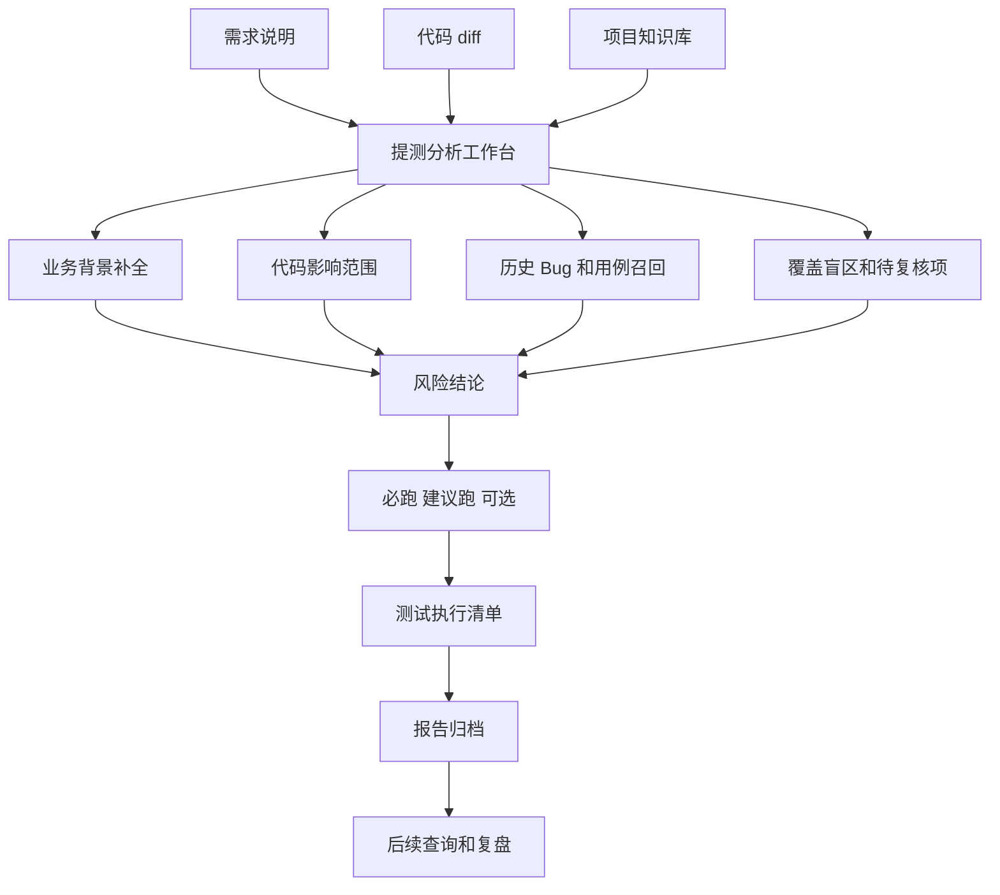

id1([Some text])

# 我做了七层 AI 测试能力，才发现一张开工清单比十页分析更有用

这个系列写到收尾，我重新把前面做过的东西摊开看了一遍。

知识库、证据链、检索、图谱、关系链、覆盖热图、待复核队列、回归推荐、提测分析工作台，这些模块各自都有技术价值，放进架构图里，也确实像一套逐渐完整的 AI 测试工程系统。

但如果暂时把架构图关掉，坐到测试人员的工位上看一眼，脑子里大概率只剩一句话。

今天这活，我到底怎么干？

需求已经提过来了，代码 diff 也摆在面前，历史 Bug、测试用例和各种项目资料却散落在不同地方；这时候再给测试人员一段看起来很专业的分析，或者让他多开几个功能页面，多少有点给已经迷路的人再发一张景区宣传册。大家需要的是把信息整理清楚，告诉他哪里必须测、哪里风险高、数据怎么准备、证据从哪来，以及执行完以后该怎么交付。

我后来才想明白，AI 给测试人员最有用的输出不是一篇洋洋洒洒的分析，而是一张拿到手就能开工、做完可以交差、过段时间还能翻出来复盘的清单。

AI 很擅长写分析，给它一段需求、一段 diff 和一堆历史资料，它能哐哐生成一份篇幅不短的风险说明，里面有影响范围、有潜在问题，也有一堆听起来相当合理的建议，情绪价值和字数都给得很足。

可测试工作不会因为分析写完就自动消失，测试人员仍然要把那些建议重新拆成任务，决定测试范围和执行优先级，准备用户、订单、车源、状态与 Mock 数据，判断哪些历史用例可以直接复用，记录哪些地方证据不足，还要在执行结束后给出结论和待处理项。AI 写爽了，测试人员看完还得继续做高级电子阅读理解，这个提效多少带点赛博黑色幽默。

| 工作 | 需要的输出 |
|---|---|
| 制定测试范围 | 明确哪些功能、页面、接口要测 |
| 安排执行优先级 | 必跑、建议跑、可选 |
| 准备测试数据 | 用户、订单、车源、状态、Mock |
| 复用历史用例 | 找到可直接执行或需要改造的用例 |
| 记录风险 | 哪些地方证据不足，哪些需要人工确认 |
| 汇报结果 | 输出结论、证据和待处理项 |

分析写得再完整，也只是把问题讲明白了，离动手开工还差一截。

分析报告更像一张地图，它告诉你哪里可能有山、哪里可能有河，却不会替你安排今天应该先走哪条路；执行清单会再往前走一步，把路线拆成一个个可以完成的动作，并且告诉你走到哪里需要停下来确认，哪里证据不够，别头铁硬冲。

测试人员需要理解风险，更需要把理解变成行动；否则分析写得越长，阅读和二次整理的成本反而越高，平台看起来输出了一大堆内容，开始执行时还是要靠人重新翻译一遍。看着像 AI 在干活，仔细一看，人类只是从亲自写报告升级成了亲自整理 AI 写的报告。

清单的好处就在这里，它能把模糊判断拆成具体任务，每一项都有优先级、执行方式、数据准备、预期结果、负责人和当前状态；测试人员不用再对着一大段文字做阅读理解，拿到以后就知道先做什么、怎么做、做到什么程度才算完成。

我理想里的测试执行清单，大概会长成下面这样。

| 优先级 | 测试项 | 执行方式 | 数据准备 | 预期结果 | 证据来源 | 状态 |
|---|---|---|---|---|---|---|
| P0 | 支付超时后订单状态回滚 | 手工 + 接口校验 | 超时订单、支付 Mock | 状态回到待支付，不生成重复扣款 | 需求、历史 Bug、diff | 待执行 |
| P0 | 支付成功回调重复通知 | 接口回放 | 同一支付单多次回调 | 幂等处理，不重复发券或改状态 | 代码改动、用例 | 待执行 |
| P1 | 订单列表状态展示 | 前端回归 | 多状态订单 | 展示文案和筛选正确 | 页面关键词、历史用例 | 待执行 |
| P1 | 异常日志和告警 | 日志检查 | 模拟支付失败 | 记录错误但不泄露敏感信息 | 代码检查 | 待执行 |

这张表看起来不复杂，但里面每一行都得说得清来路。支付超时后的状态回滚为什么是 P0，依据可能来自需求中的状态规则、过去发生过的 Bug，以及本次 diff 命中的代码；重复回调为什么必须验证幂等，也不能靠 AI 拍脑袋生成，而应该由代码改动、历史用例和风险规则共同支撑。

前面那些知识库、图谱、关系链、覆盖热图和回归推荐，就该在这里干活；用户不一定需要逐个打开它们，也没必要先考一张平台操作证，底层能力在背后把资料查清楚、把证据排好，再汇入同一张表就行。

完整链路大概会长成这样。

这条链路有个不能糊弄的地方，清单不能凭空生成，更不能让 AI 随手编几个测试点就假装已经完成分析。智能问答负责补充业务背景，代码检查识别实现风险，变更分析寻找影响范围，关系链证明需求、用例、Bug 和代码之间的关联，覆盖热图暴露测试资产盲区，待复核队列标出证据不可靠的地方，回归推荐再提供候选用例。

等这些能力完成各自的工作，平台再生成测试执行清单；否则，所谓智能清单只是把模型的猜测排成一张表，属于给幻觉加了边框和表头，看起来很整齐，点进去全靠命。

清单靠不靠谱，还要看平台敢不敢承认自己不知道。AI 测试平台不能只输出「你应该测这些」，还得老实标出「这些地方我不确定」，不然它和群里那个什么都敢接话、出了问题就失忆的人也没太大区别。

| 不确定项 | 为什么重要 |
|---|---|
| 需求资料缺少验收标准 | 测试预期可能不一致 |
| 某条关系是 INFERRED | 只能作为线索，不能当强证据 |
| 历史 Bug 无回归用例 | 同类问题可能复发 |
| diff 命中代码但无测试资产 | 可能存在覆盖盲区 |
| 图谱节点孤立 | 资料结构可能不完整 |

这个部分不能省，因为做测试时，知道哪些事情还没搞清楚，本身就很重要。需求资料缺少验收标准，就应该明确提醒测试预期可能不一致；某条图谱关系只是 `INFERRED`，它就只能作为排查线索，不能穿件西装就冒充强证据；diff 命中了代码却找不到测试资产，也不能悄悄略过，而应该把它标成潜在覆盖盲区。

一个只会输出结论的 AI，很容易表现得像什么都懂，但测试人员不需要这种自信；愿意把证据不足、推断关系和待确认风险摊开的 AI，反而更值得相信，因为它没有抢着替需要负责的人拍板。

清单执行完以后，事情也不应该就此结束。如果本次分析质量不错，版本、日期、需求、diff、风险结论、执行清单和执行结果都应该被归档；下一次类似需求出现时，这些内容可以重新参与检索与判断，成为新的历史证据。

过去很多测试经验会消失在一次项目里，一个人踩过的坑，换个人以后还会原路再踩一次；一份报告写完，过两周就进入数字坟场；一次 Bug 复盘讲得热血沸腾，半年后同类问题照样换个名字重新上线。

如果报告和执行清单能够回到知识库，它们就不再只是本次任务的交付物，还能给下一次判断提供依据；AI 测试平台不只帮人完成一次任务，也让每一次任务都给后面的工作留下点东西，而不是做完即失忆，下次继续从头渡劫。

这个系列一直有一条底线，AI 可以干活，但不能替测试人员背锅和拍板。

尤其在提测准入、风险阻塞和覆盖是否足够这些问题上，仍然要由人负责；AI 可以把判断之前的脏活累活做掉很多，它能把资料找出来，把证据排好，把关系链串起来，把历史 Bug 翻出来，把回归候选列出来，把不确定项标出来，再把这些结果整理成执行清单。

测试人员不再需要从一堆散乱资料里挖线索，而是站在整理好的证据面前做判断；AI 没有抢走他的专业价值，只是把那些费时间、又不太值得人肉反复做的活接了过去。

回看整个系列，它不只是在讲一个工具应该怎么做，也在讲测试知识怎样从散乱资料，逐步变成可查询、可追踪、可复用、可执行的团队资产。

我一开始只是想做一个文档问答，后来发现测试知识库难在证据链，再往后又发现，证据链也只是把材料备齐了；要让测试人员每天愿意用，还得把证据变成判断，把判断变成清单，再把执行后的清单留下来，供下一次直接复用。

这套系统值不值得继续做，不看它能回答多少问题，也不看架构图里塞了多少模块，只看测试人员能不能拿到一张今天就能开工的清单，能不能少在需求、用例、Bug 和代码之间来回找线索。

#AI测试 #软件测试 #测试开发 #质量工程 #测试知识库 #Agent #测试自动化 #测试执行清单
