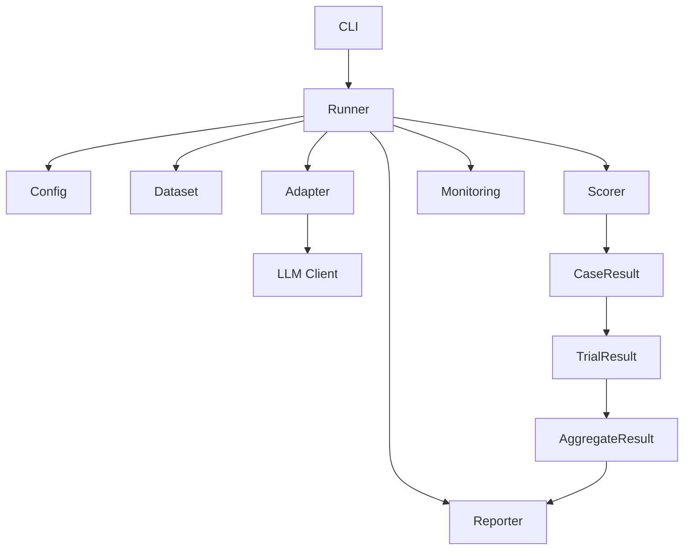
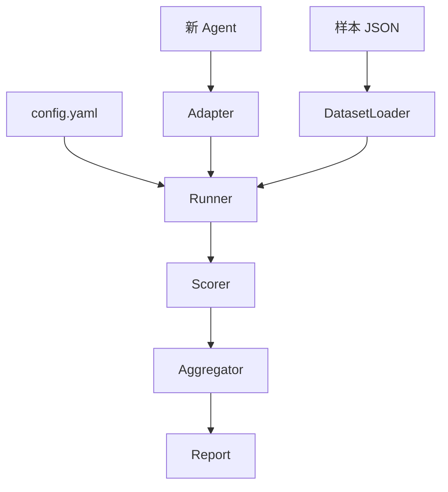
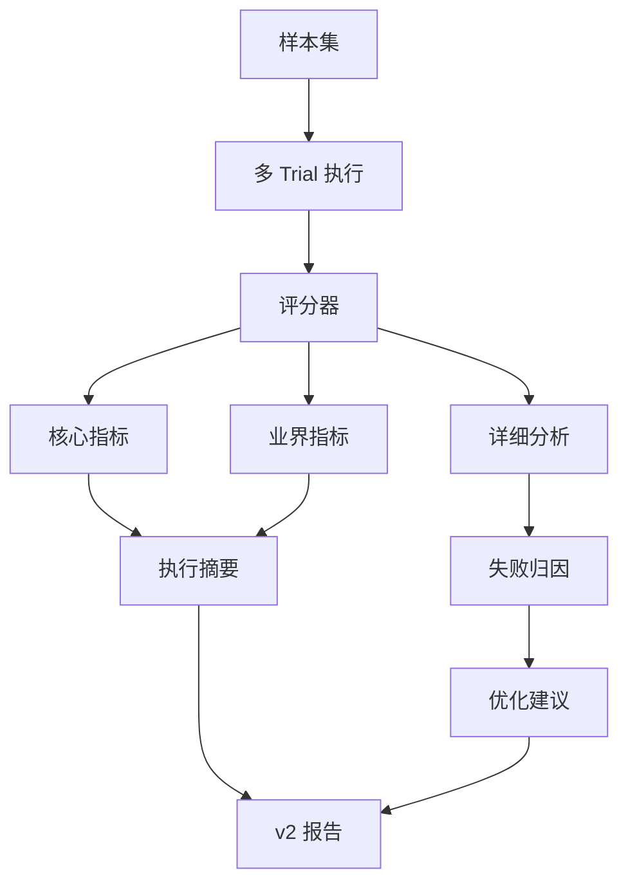
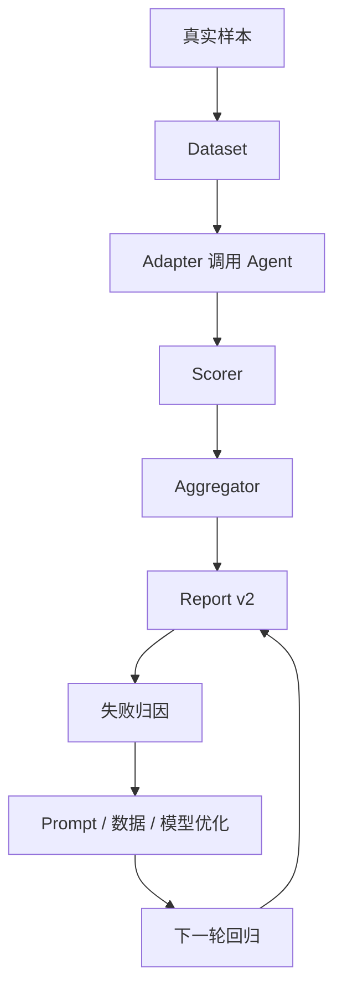

# agent-test-framework 公众号技术系列规划

> 基于三篇附件整理：
> - `architecture.md`
> - `extending.md`
> - `test_results_report_design.md`

## 总判断

这组三篇材料不建议压成一篇。

原因很简单，它们其实刚好对应 Agent 测试工程化的三层问题：

1. 一个 Agent 评测框架应该怎么分层，边界在哪里。
2. 一个新 Agent 应该怎么低成本接入评测体系。
3. 一份评测报告应该怎么让 PM、QA、开发都看懂，并且能指导下一步优化。

如果硬写成一篇，会变成一篇很长的说明书。

更适合拆成 3 篇主文，必要时再补一篇总纲或番外。

推荐系列名：

```text
我给 Agent 做了一套测试框架，后来发现评测不是跑个通过率这么简单
```

## 推荐发布顺序

### 01｜为什么 Agent 也需要一套正经测试框架

建议标题：

```text
我给 Agent 做了一套测试框架，第一件事不是调模型，而是把评测流程拆开
```

对应素材：

- `architecture.md`

核心角度：

- Agent 评测不能只靠手工试几条 prompt。
- 真正可复用的评测链路应该是：load → invoke → score → aggregate → report。
- `agent-test-framework` 的价值是把 CLI、Runner、Adapter、Scorer、Reporter、Monitoring 分层，让每层边界清楚。
- 重点不是框架多复杂，而是它把「被测 agent」和「评测流程」隔开了。

文章类型：

技术拆解型 + 方法论分享型。

建议结构：

```text
从一次手工试 Agent 的痛点开场
-> 为什么随手测几条样本不够
-> atf 的分层架构
-> Runner 为什么是核心编排层
-> Adapter 为什么是隔离生产实现的边界
-> Scorer / Aggregator / Reporter 分别解决什么
-> 关键不变量，哪些地方不能乱改
-> 收束到评测框架的本质，是把不稳定的 Agent 变成可复盘的工程对象
```

建议 Mermaid 图：



建议表格：

| 模块 | 解决的问题 | 对外扩展性 |
|---|---|---|
| CLI | 给用户一个统一入口 | 可加子命令 |
| Runner | 编排评测主流程 | 公共 API 要稳定 |
| Adapter | 包装真实 agent 调用 | 每个 agent 自己实现 |
| Scorer | 单 case 打分 | 可加 component |
| Aggregator | 跨 case / trial 汇总 | 可加聚合器 |
| Reporter | 输出 HTML / JSON | 模板可定制 |
| Monitoring | 事件和 TUI | 可替换 Web UI |

### 02｜接入一个新 Agent，真正该改的只有三件事

建议标题：

```text
我设计 Agent 测试框架时，最想避免的一件事，就是每接一个新 Agent 都重写一套评测
```

对应素材：

- `extending.md`
- `architecture.md` 的扩展点部分

核心角度：

- 一个好评测框架不应该逼用户理解全部内部实现。
- 接入新 Agent 的最短路径应该只改三件事：Adapter、Dataset、Config。
- Adapter 是关键，它负责复刻生产 agent、对齐 model settings、返回业务字段和 stage_ms。
- Scorer 分成分类 / 结构化提取 / 自然语言回复 / 混合打分四种模式。
- 自定义 score component 和 aggregator 要靠 registry，而不是改框架核心。

文章类型：

实战指南型 + 工程方法论。

建议结构：

```text
从「每个 agent 都长得不一样」开场
-> 为什么 BaseAdapter 不能被具体框架污染
-> 接入新 agent 的最短路径
-> Adapter 检查清单
-> Scorer 的四种常见模式
-> 什么时候用 rule，什么时候用 LLM judge
-> 自定义 component / aggregator 的注册机制
-> 收束到扩展性的本质，是让变化留在边界内
```

建议 Mermaid 图：



建议表格：

| 接入项 | 必改内容 | 最容易踩坑 |
|---|---|---|
| adapter.py | name、spec、invoke | model_settings 没对齐生产 |
| samples.json | 真实样本和 expected | 样本太少或分布失真 |
| config.yaml | dataset、components、aggregators | scorer 配错字段 |
| ScoreComponent | 特定业务规则 | 异常没兜住导致评测中断 |
| Aggregator | 自定义汇总维度 | trial 边界混乱 |

### 03｜Agent 测试报告不能只给通过率

建议标题：

```text
Agent 测试报告如果只告诉你通过率，那基本等于没告诉你怎么改
```

对应素材：

- `test_results_report_design.md`

核心角度：

- v1 报告的问题是只给数字，不解释字段、方法、失败原因和下一步动作。
- v2 报告要同时服务 PM、QA、开发，所以要有中英字段、tooltip、评测方法、数据集设计、失败归因。
- 业界指标可以引入 Anthropic Evals、AgentBoard、τ-bench 的思路，但要落到业务指标上。
- 对 wecom_assistant 这类 manager-specialist 架构，route_pass_rate 比单纯 code_pass_rate 更贴近业务结果。
- pass@k 和 pass^k 可以解释非确定性 Agent 的稳定性。

文章类型：

产品复盘型 + 测试方法论。

建议结构：

```text
从一份只有通过率的报告开场
-> 为什么 PM / QA / 开发看到同一个数字会有不同困惑
-> v2 报告的十章结构
-> 执行摘要应该 30 秒讲清楚什么
-> 方法论和数据集设计为什么必须写
-> 核心业务指标和业界指标怎么放
-> pass@k / pass^k 为什么能揭示稳定性
-> 失败归因为什么比失败列表更重要
-> 收束到报告不是终点，而是下一轮优化的入口
```

建议 Mermaid 图：



建议表格：

| 报告章节 | 解决的问题 | 面向读者 |
|---|---|---|
| 执行摘要 | 30 秒看懂能不能过 | PM / 负责人 |
| 评测对象说明 | 说明被测 agent 是什么 | 全部 |
| 评测方法 | 说明怎么测，结果是否可信 | QA / 开发 |
| 数据集设计 | 样本覆盖是否专业 | QA |
| 核心指标 | 业务关键结果 | 全部 |
| 业界指标 | 稳定性、效率、鲁棒性 | 开发 / 架构 |
| 失败归因 | 为什么失败 | 开发 |
| 结论建议 | 下一步改什么 | 全部 |

### 04｜可选番外，Agent 评测最难的不是跑分，是让跑分能指导迭代

建议标题：

```text
Agent 评测最难的不是跑出一个分数，而是让这个分数真的能指导下一轮迭代
```

对应素材：

- 三篇都用

核心角度：

- 可以作为前三篇之后的总结篇。
- 把架构、扩展、报告三件事合在一起，讲完整闭环。
- 重点讲 baseline、visible/hidden、smoke/full/regression、多 trial、失败归因、建议回流。

建议 Mermaid 图：



## 如果只写一篇

不推荐，但可以写成总览文：

```text
我给 Agent 做了一套测试框架，才发现评测不是跑个通过率这么简单
```

文章主线：

```text
为什么要做
-> 框架怎么分层
-> 新 Agent 怎么接入
-> 怎么打分和聚合
-> 为什么报告要重做
-> 最后形成可回归、可解释、可行动的评测闭环
```

但这篇会很长，技术点会挤。公众号发布效果不如拆成 3 篇。

## 推荐最终方案

建议先做 3 篇：

1. 架构篇：`我给 Agent 做了一套测试框架，第一件事不是调模型，而是把评测流程拆开`
2. 接入篇：`我设计 Agent 测试框架时，最想避免的一件事，就是每接一个新 Agent 都重写一套评测`
3. 报告篇：`Agent 测试报告如果只告诉你通过率，那基本等于没告诉你怎么改`

如果这三篇反馈好，再补第 4 篇总结：

```text
Agent 评测最难的不是跑出一个分数，而是让这个分数真的能指导下一轮迭代
```

## 和前一组 LLM-Wiki-Code 七篇的关系

这组文章可以作为前一组之后的第二个系列。

前一组讲的是：

```text
AI 怎么帮测试人员做测试判断与质量决策
```

这一组讲的是：

```text
我们怎么测试 AI Agent 自己
```

两组可以形成一个连续主题：

1. AI 辅助测试知识、风险判断、回归推荐和质量决策。
2. AI Agent 自身的评测、回归和报告体系。

这样公众号内容线会更完整。
