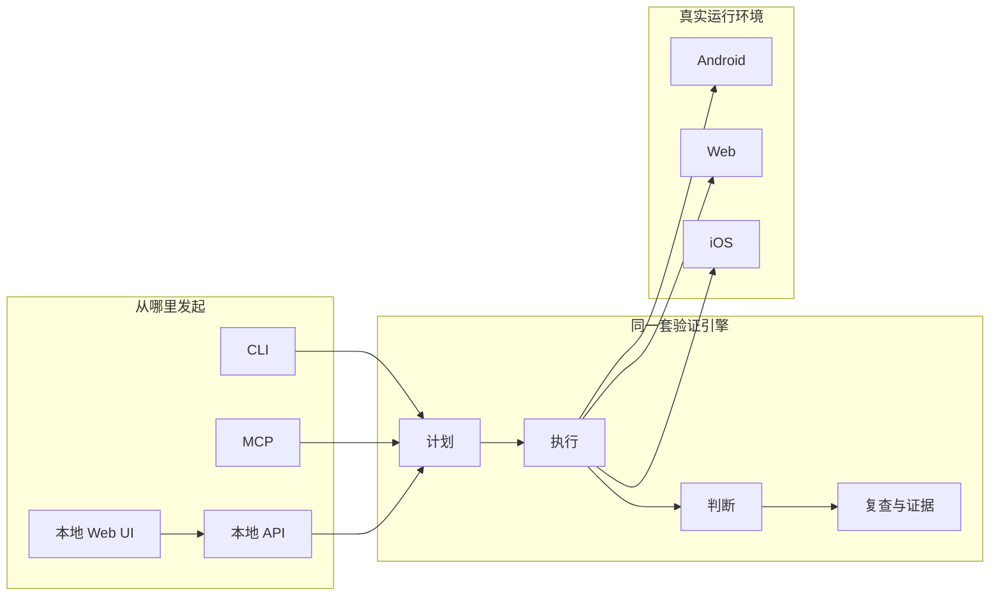

# AI 代码写完没人验收？Munk AI 想把真机测试也塞进闭环

现在让 AI 写一个删除按钮，可能几分钟就交活了。

但按钮到底能不能点，确认弹窗对不对，删完页面有没有刷新，最后往往还得人亲自编译、启动、点击、截屏，再把问题重新描述给 AI。

代码生成快得像外卖下单，验证却还在厨房里手切土豆。

`Munk AI` 瞄准的就是这段破事：让测试 Agent 看懂真实界面，在 Android、iOS 和 Web 上执行操作，再把截图、UI 树和运行日志送回编码 Agent，尽量把“写代码到验收结果”连成一圈。

## AI 已经会写了，卡住交付的是最后那双手

大部分 AI 开发工作流仍然是开环的。

人提出需求，编码 Agent 修改代码；接下来，人负责构建项目、打开应用、点过完整流程、观察报错、截图，再把上下文喂回去。Agent 看起来自动化了，实际只是把人从“写代码的人”变成了“专职测试操作员”。

Munk AI 的判断很直接：代码生成已经不再是唯一瓶颈，验证正在变成新的瓶颈。

它测试的不是静态代码、Mock 或一堆脆弱选择器，而是实际运行中的产品界面。放到真实工作里，这意味着 Agent 不只交一份代码改动，还要面对设备和浏览器里的真实结果。

## 它盯着界面干活，不靠 XPath 背答案

Munk AI 把视觉理解、结构化规划和真实设备执行放进同一个验证循环，核心动作可以概括成四步：计划、运行、复查、验证。

| 能力 | 它具体做什么 | 放进工作流意味着什么 |
| --- | --- | --- |
| 自然语言生成测试计划 | 把需求转成结构化测试计划 | 验收标准不必先手写成一长串脚本 |
| 跨平台真实执行 | 在 Android、iOS、Web 上运行验证 | 结果来自实际界面，不只来自代码分析 |
| 录制并复用交互 | 把操作记录转成可复用测试资产 | 人走过一次的路径，可以留给后续批量执行 |
| 推断回归范围 | 审查代码变更并判断需要回归的位置 | 改一个功能后，不必完全靠人猜该测哪里 |
| 返回结构化证据 | 输出截图、UI 树、运行日志 | Agent 拿到的是可追踪现场，不是一句“好像不对” |

这里最关键的不是“AI 会点按钮”。

真正值钱的是它把失败证据整理后送回 Agent。就像测试同事不只在群里丢一句“有 Bug”，还把复现路径、现场照片和日志一起贴好，编码 Agent 才有机会继续修，而不是靠猜。

## 一套引擎，从命令行一直伸到 QA 工作台

Munk AI 没把开发者、QA 和编码 Agent 拆成三套互不相干的系统，而是让同一个验证引擎通过多种入口工作：

- CLI：服务本地开发流程。
- MCP：接入编码 Agent 和自动化系统。
- 本地 Web UI：管理设备、测试资产与批量执行，更偏 QA 工作台。
- 本地 API：让周边工具做程序化集成。

核心编排层负责计划、运行、判断、复查和录制；设备与感知层再连接 Android、Web 和 iOS 运行目标。



底层技术栈也不神秘：核心运行时使用 Python 3.10、FastAPI、Typer CLI、Pydantic / PydanticAI、NumPy / OpenCV；Android 侧使用 `uiautomator2`，Web 侧使用 `Playwright + Chromium`，iOS 有独立运行时集成。

本地 UI 使用 Vue 3、TypeScript、Vite、TanStack Query 和 `vue-i18n`；桥接层使用 Node.js、Fastify、WebSocket，并借助 scrcpy 生态处理本地 Android 设备串流与控制。

仓库本身也按层拆开：`src/munk/` 放编排、适配器与产物处理；`*-api` 包负责稳定契约；`*-runtime-*` 提供本地运行时实现；`perception-*` 把编排与感知内部实现隔离；`recording-web` 和 `recording-bridge-local` 则支撑 QA 界面与录制流程。

它默认走 local-first 路线。设备执行、证据和工作台尽量留在本地，目标是降低成本、收紧隐私边界，也让团队保留更多控制权。对测试基础设施来说，这比“再接一个云端聊天窗口”靠谱得多。

## macOS 能直接装，但先让 doctor 把环境说清楚

目前可用发行版面向 macOS。安装后先运行诊断，再启动本地 Web UI：

```bash
curl -fsSL https://get.munk.sh | sh
munk doctor
munk serve --port 16888
```

这三步很克制：安装、体检、启动服务。`munk doctor` 放在中间很重要，设备连接、浏览器和本地运行环境这类东西，最怕表面装好了，真正执行时才发现缺胳膊少腿。

### 装好以后，真实协作大概长这样

```text
你: 帮我接入 Munk AI，先检查本机环境，再启动本地测试工作台。

AI: 我会先安装 Munk AI，然后运行 munk doctor。
    诊断通过后，再启动本地 Web UI。

你: 不要先改业务代码，确认测试环境能连接真实运行目标。

AI: 明白。我会先完成环境检查和连接验证，
    把诊断结果留给你确认，再进入功能验证。
```

## Trae 写功能，Munk AI 接着去设备上验收

官方演示给出的场景很具体：Trae 实现一个新的删除流程，构建项目，然后由 Munk AI 在真实设备上自动验证改动。

把这条路径拆开，就是一套典型的 Harness Engineering 闭环：

1. 人给出目标和验收标准。
2. 编码 Agent 修改代码并部署构建。
3. Munk AI 接收验证任务，在设备、模拟器或浏览器里点击、输入和检查。
4. 验证失败时，截图、UI 树和日志形成结构化 Bug 上下文。
5. 编码 Agent 根据证据继续修复；验证通过后，再把结果交回人。

### 把 Codex 接进来，重点不是多一个 Agent

下面是一条补充的实际协作路径，不是项目原生示例：

```text
1. 把功能需求和验收标准交给 Codex，让它完成代码修改与构建。
2. 通过 MCP 或本地 API 触发 Munk AI 执行对应验证计划。
3. Munk AI 在真实运行环境中操作界面，并产出截图、UI 树和运行日志。
4. Codex 根据结构化失败证据继续修复。
5. 重复验证，直到通过或遇到需要人工判断的边界。
```

这套组合真正减少的，不只是几次点击，而是“人看见问题后，再费劲翻译给 AI”的往返损耗。

## 开发、QA、Agent 终于能看同一份现场

开发者可以从 CLI 发起本地验证，QA 可以在 Web UI 管理设备、录制流程、测试资产和批量执行，编码 Agent 则能通过 MCP 接入同一套能力。

三种角色不必各自维护一套互不相认的业务逻辑。测试结果也不只是红灯或绿灯，而是能带回截图、UI 树和运行日志。这个设计挺实在：先把现场证据统一，再谈自动修复，少一点“在我电脑上明明是好的”。

已完成的路线还包括 App Knowledge、较完整的 CLI 工作流、稳定的 MCP 支持、本地 Web UI、批次模式、计划任务模式，以及 API 契约开源。

## 经常替 AI 收尾的人，最容易看懂它的价值

- 已经用 Trae、Codex、Claude Code 等编码 Agent，但每次改完仍要人工点 UI 验收的开发者。
- 想把真实设备验证接入 Agent 闭环，而不是只做单测和静态检查的团队。
- 需要管理设备、录制测试流程、沉淀复用资产和批量执行的 QA 团队。
- 正在建设 Harness Engineering，希望让编码 Agent 获得真实产品反馈的平台团队。
- 需要同时覆盖 Android、Web，并持续关注 iOS 路径成熟度的测试基础设施团队。

## 仓库已经公开，不等于所有能力都已开源成熟

这项目值得关注，但现在还不能上头。

它仍处于活跃开发阶段，公共仓库已经上线，核心模块会分阶段开放；当前已开源 API 契约，但实现代码开源仍在路线图中。

平台成熟度也要分开看：Android 是当前主要的本地执行路径；Web 已可用但仍在演进；iOS 相关支持存在于仓库中，也还在持续演进。

目前发行版仅支持 macOS。Windows、Linux、iOS 环境配置、Web 环境配置、CI 与发布配置、文档与贡献指南、高级 Agent，都还列在后续计划里。

所以，别因为架构图画得完整，就默认每个平台已经达到同样成熟度。先拿自己的真实应用和验收路径做小范围验证，再决定要不要塞进主流程。

项目采用 Apache-2.0 许可证。


项目地址：<https://github.com/chaxiu/munk-ai>

**AI 写代码越来越便宜，能不能让它为真实结果负责，才是下一段硬仗。**

#MunkAI #HarnessEngineering #AITesting #Agent #Android #iOS #Web #MCP #Playwright #QA #Codex #Trae
