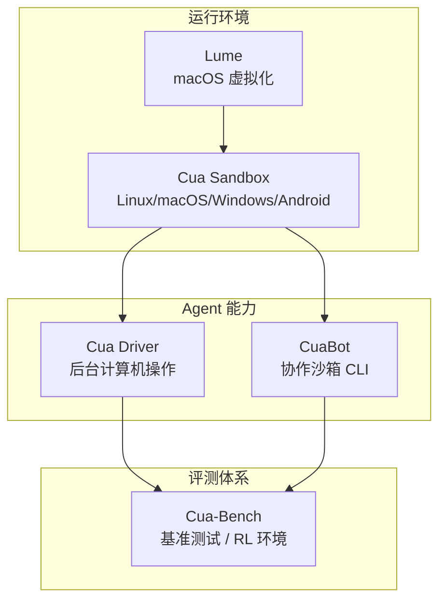
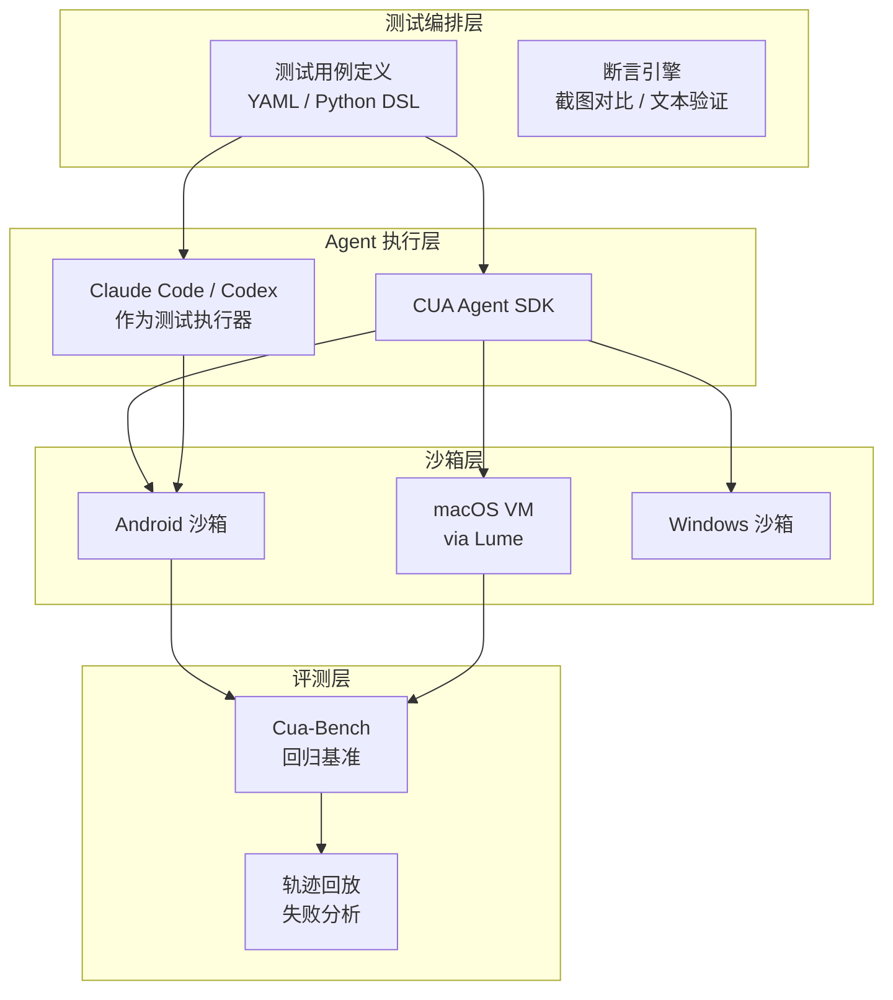

# CUA - 使用 Agent 平台解读及 UI/Android 自动化测试落地实践

>  **CUA 深度解读：一个统一 Android/macOS/Windows 的计算机使用 Agent 平台**

## 1. 背景

**CUA**（Computer Use Agent）是一个让 AI Agent 像人一样操作计算机的开源平台。它不只是"让 AI 看屏幕、点按钮"，而是一整套从**沙箱环境 → Agent SDK → 基准评测 → macOS 虚拟化**的工具链。

与传统 UI 自动化（Selenium / Appium / UIAutomator）相比，CUA 的核心差异在于：**它不是按元素定位的脚本驱动，而是视觉+Agent 驱动的计算机使用**。这对 UI 自动化测试来说，思路完全不同。

## 2. CUA 项目全景



五个核心组件，分工明确：

| 组件 | 定位 | 一句话 |
|------|------|--------|
| **Cua Sandbox** | 环境层 | 一键创建任意 OS 的沙箱（含 Android） |
| **Cua Driver** | 操作层 | 后台操控桌面应用，不抢鼠标焦点 |
| **CuaBot** | 协作层 | 把任意 Coding Agent 放进沙箱 |
| **Cua-Bench** | 评测层 | 标准基准测试 + RL 训练环境 |
| **Lume** | 虚拟化层 | Apple Silicon 上的 macOS/Linux VM |

---

## 3. 各组件能力拆解

### 3.1 Cua Sandbox —— 核心沙箱

**安装：**

```bash
pip install cua
```

**核心 API：**

```python
from cua import Sandbox, Image

async with Sandbox.ephemeral(Image.android()) as sb:
    # 截图验证
    screenshot = await sb.screenshot()
    
    # 鼠标/触控操作
    await sb.mouse.click(100, 200)
    await sb.keyboard.type("Hello from Cua!")
    
    # Android 多点触控手势
    await sb.mobile.gesture((100, 500), (100, 200))
    
    # Shell 命令
    result = await sb.shell.run("echo hello")
```

**支持的操作系统矩阵：**

| 环境 | Linux Container | Linux VM | macOS | Windows | Android | 自定义镜像 |
|------|:---:|:---:|:---:|:---:|:---:|:---:|
| Cloud (cua.ai) | ✅ | ✅ | ✅ | ✅ | ✅ | 🔜 |
| Local (QEMU) | ✅ | ✅ | ✅ | ✅ | ✅ | ✅ |

**对 UI 测试的关键意义：** Android 支持意味着你可以在本地或云端直接启动 Android 沙箱，用同一套 API 做截图对比、手势操作、键盘输入——不需要单独维护 Appium 或 UIAutomator 环境。

### 3.2 Cua Driver —— 后台计算机操作

**一句话：** 让 Agent 在后台操控桌面应用，不抢鼠标、不占焦点。

```bash
# macOS / Linux
/bin/bash -c "$(curl -fsSL https://raw.githubusercontent.com/trycua/cua/main/libs/cua-driver/scripts/install.sh)"

# Windows
irm https://raw.githubusercontent.com/trycua/cua/main/libs/cua-driver/scripts/install.ps1 | iex
```

**支持接入的 Agent 框架：** Claude Code、Cursor、Codex、OpenClaw、自定义客户端。

**对 UI 测试的意义：**
- 传统桌面自动化（PyAutoGUI / AppleScript）会抢占鼠标焦点，人不能同时用电脑
- Cua Driver 后台运行，测试和开发可以并行
- 通过 MCP Server 暴露能力，可以被任何支持 MCP 的 Agent 调用

### 3.3 CuaBot —— 协作沙箱

```bash
npx cuabot              # 初始化
cuabot claude            # Claude Code 进沙箱
cuabot openclaw          # OpenClaw 进沙箱
cuabot --screenshot      # 截图
cuabot --click 100 200   # 点击
```

内置支持 `agent-browser` 和 `agent-device`（iOS、Android）。

**对 UI 测试的意义：** 可以把测试 Agent（如 Codex / Claude Code）直接放进沙箱执行测试流程，不需要在宿主机上配置测试环境。

### 3.4 Cua-Bench —— 基准测试

```bash
cd cua-bench
uv tool install -e . && cb image create linux-docker
cb run dataset datasets/cua-bench-basic --agent cua-agent --max-parallel 4
```

支持基准：OSWorld、ScreenSpot、Windows Arena、自定义任务。可导出轨迹用于 RL 训练。

**对 UI 测试的意义：**
- 可以把你的测试用例沉淀为基准数据集，持续评估 Agent 的 UI 操作能力
- 导出轨迹 = 自动生成测试报告 + 失败回放
- 并行执行 = 大规模回归测试的可能

### 3.5 Lume —— macOS 虚拟化

```bash
/bin/bash -c "$(curl -fsSL https://raw.githubusercontent.com/trycua/cua/main/libs/lume/scripts/install.sh)"
lume run macos-sequoia-vanilla:latest
```

基于 Apple Virtualization.Framework，近原生性能。

**对 UI 测试的意义：** 在 Apple Silicon 上快速创建 macOS VM，适合做 macOS 桌面应用的自动化测试环境。

---

## 4. UI / Android 自动化测试落地路径

### 4.1 总体架构



### 4.2 Android 自动化测试具体方案

**场景 1：Android App 功能回归测试**

```python
from cua import Sandbox, Image

async def test_login_flow():
    async with Sandbox.ephemeral(Image.android()) as sb:
        # 1. 安装 APK
        await sb.shell.run("adb install /path/to/app.apk")
        
        # 2. 启动 App
        await sb.shell.run("adb shell am start -n com.example/.MainActivity")
        
        # 3. 等待启动完成，截图验证
        await sb.wait(2)
        screenshot = await sb.screenshot()
        assert "Login" in await sb.ocr(screenshot)
        
        # 4. 输入用户名密码
        await sb.mouse.click(200, 400)   # 点击用户名输入框
        await sb.keyboard.type("testuser")
        await sb.mouse.click(200, 500)   # 点击密码输入框
        await sb.keyboard.type("password123")
        
        # 5. 点击登录按钮
        await sb.mouse.click(200, 600)
        
        # 6. 验证登录成功
        await sb.wait(2)
        screenshot = await sb.screenshot()
        assert "Welcome" in await sb.ocr(screenshot)
```

**场景 2：多点触控手势测试（滑动、缩放）**

```python
# 上滑刷新
await sb.mobile.gesture((540, 1500), (540, 500))

# 双指缩放
await sb.mobile.gesture(
    (200, 800), (200, 400),    # 手指1：向上
    (800, 800), (800, 1200)    # 手指2：向下
)
```

**场景 3：跨平台 UI 一致性测试**

```python
async def test_cross_platform_ui():
    test_actions = [
        ("click", 200, 400),
        ("type", "hello"),
        ("screenshot",),
    ]
    
    results = {}
    for os_type in [Image.android(), Image.ios()]:  # iOS via agent-device
        async with Sandbox.ephemeral(os_type) as sb:
            for action in test_actions:
                await execute(sb, action)
            results[os_type] = await sb.screenshot()
    
    # 对比跨平台截图
    diff_score = compare_screenshots(results[0], results[1])
    assert diff_score < 0.05  # 允许 5% 差异
```

### 4.3 桌面应用自动化测试方案

```python
# 使用 Cua Driver 在后台操作桌面应用
async def test_desktop_app():
    # 通过 MCP 调用 Cua Driver
    # 打开应用 → 操作 → 截图验证
    await cua_driver.launch("com.example.DesktopApp")
    await cua_driver.click(300, 200)
    await cua_driver.type("test data")
    screenshot = await cua_driver.screenshot(region=(0, 0, 800, 600))
    assert verify_ui(screenshot, expected_layout)
```

### 4.4 与现有测试框架的关系

| 维度 | 传统方案 (Appium/Selenium) | CUA 方案 |
|------|---------------------------|----------|
| **定位方式** | 元素 ID / XPath / 选择器 | 视觉坐标 + OCR + Agent 推理 |
| **环境依赖** | 需要 WebDriver / ADB / 设备 | 云端或本地 QEMU 沙箱 |
| **脚本编写** | 精确的元素定位链 | 自然语言描述 + 坐标操作 |
| **跨平台** | 不同 Driver 不同 API | 统一 Python SDK |
| **规模化** | Selenium Grid / Appium Grid | `--max-parallel` 并行 |
| **失败分析** | 手动截图 | 轨迹回放 + 基准评测 |
| **适用场景** | 精确的 UI 元素级断言 | 视觉级验证 + Agent 自由探索 |

**关键判断：** CUA 不是 Appium 的替代品，而是在**视觉/Agent 驱动测试**这个维度上的补充。当测试场景是"看不出问题但元素定位没问题"时，传统方案仍然更可靠；当测试场景是"像人一样操作并视觉判断"时，CUA 更合适。

---

## 5. 关键能力与测试场景映射

| CUA 能力 | 测试场景 | 落地价值 |
|----------|----------|----------|
| Android 沙箱 | Android App 功能测试 | 无需实体设备，云端/本地按需创建 |
| `mobile.gesture()` | 多点触控/手势测试 | 覆盖滑动、缩放、长按等操作 |
| `screenshot()` + OCR | 视觉断言 | 不受元素树变化影响 |
| 后台操作 (Cua Driver) | 桌面应用回归测试 | 测试不阻塞人工操作 |
| `cb run --max-parallel` | 大规模回归 | 多设备并行执行 |
| 轨迹导出 | 失败复现 | 回放每次操作的完整路径 |
| Agent SDK | AI 驱动的探索性测试 | Agent 自主发现 UI 异常 |

---

## 6. 落地建议与实施路线

### Phase 1：能力验证（1-2 周）

- [ ] 在本地用 QEMU 启动 Android 沙箱
- [ ] 跑通 `screenshot()` + `click()` + `type()` 基础链路
- [ ] 验证 `mobile.gesture()` 在目标 App 上的表现
- [ ] 测试 APK 安装和 App 启动的稳定性

### Phase 2：用例集成（2-4 周）

- [ ] 选 3-5 个核心业务流程（登录、下单、搜索等）
- [ ] 用 CUA SDK 编写测试脚本
- [ ] 建立截图基准库，实现视觉 diff
- [ ] 对比 Appium 方案的结果一致性

### Phase 3：规模化（4-8 周）

- [ ] 接入 Cua-Bench，把测试用例注册为基准任务
- [ ] 配置 `--max-parallel` 并行执行
- [ ] 建立轨迹回放机制用于失败分析
- [ ] 探索 Agent 驱动的探索性测试

### 风险点

| 风险 | 影响 | 缓解措施 |
|------|------|----------|
| 视觉定位不稳定 | UI 变化后坐标失效 | 结合 OCR 做语义定位，不硬编码坐标 |
| 沙箱启动慢 | 影响测试速度 | 使用镜像预热 / 沙箱池化 |
| Android 兼容性 | 部分 App 在沙箱中行为异常 | 先在目标 App 上做兼容性验证 |
| 网络依赖 | 云端沙箱需要稳定网络 | 关键场景保留本地 QEMU 方案 |
| 学习成本 | 团队需要适应视觉测试思维 | 先做概念验证，再推广 |

---

## 7. 总结

CUA 不是一个单纯的"AI 操作电脑"玩具项目，它的组件矩阵切得很准：

- **Sandbox** 解决"在哪跑" —— 按需创建、跨 OS、含 Android
- **Driver** 解决"怎么操作" —— 后台、不抢焦点、MCP 集成
- **Bench** 解决"怎么评" —— 标准化基准、轨迹导出、并行执行

对 UI/Android 自动化测试团队来说，CUA 最大的价值在于**统一了"创建环境 → 执行操作 → 视觉验证 → 结果评测"的完整链路**，而且这整条链路都可以被 AI Agent 驱动，不需要写死每一步的元素定位。

与传统 Appium/Selenium 不是替代关系，而是互补：传统方案做精确元素断言，CUA 做视觉级验证和 Agent 自主探索。

---

[GitHub - trycua/cua: Open-source infrastructure for Computer-Use Agents. Sandboxes, SDKs, and benchmarks to train and evaluate AI agents that can control full desktops (macOS, Linux, Windows). · GitHub](https://github.com/trycua/cua)

## 

`#CUA` `#ComputerUse` `#UI自动化` `#Android测试` `#AI-Agent` `#沙箱` `#视觉测试` `#Appium` `#测试平台`
