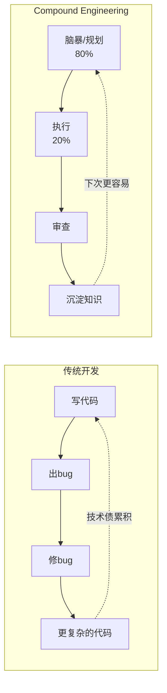
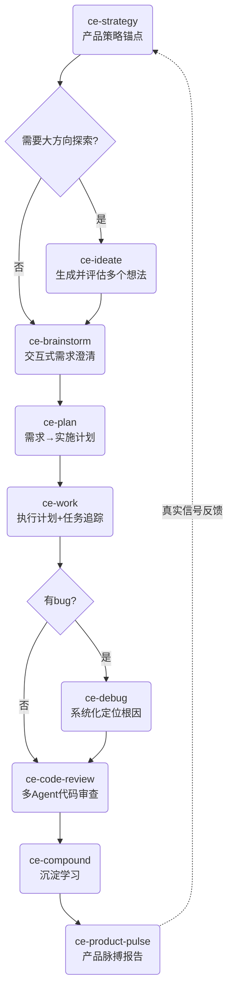
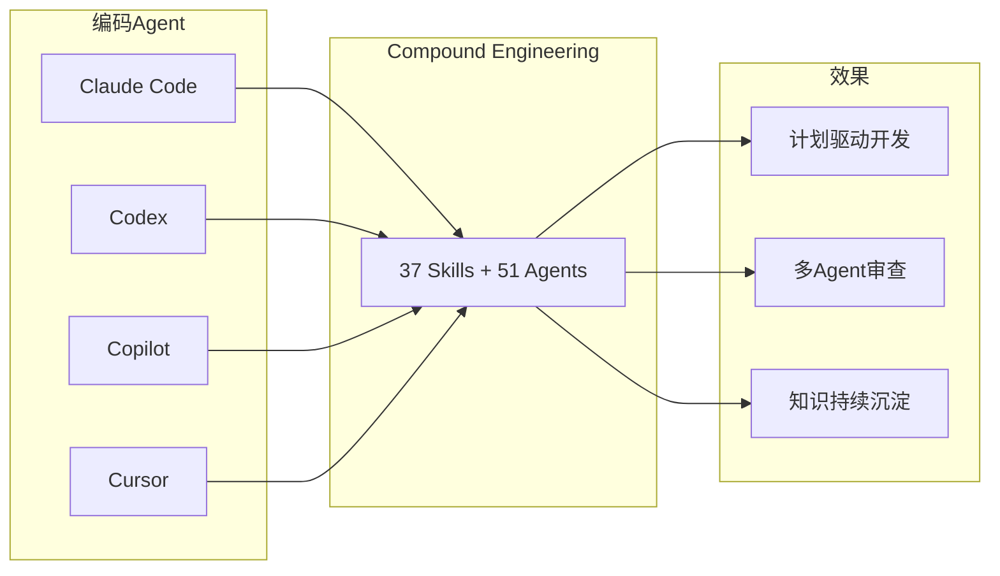

# Compound Engineering —— 让每次工程工作都比上次更容易的 AI Agent 方法论

> 基于 [EveryInc/compound-engineering-plugin](https://github.com/EveryInc/compound-engineering-plugin) 官方 README 整理，拆解其核心理念、工作流闭环、安装方式和跨平台支持。

## 1. 一句话

**每次工程工作都应该让下一次更简单，而不是更难。**

传统开发积累技术债——每个功能增加复杂度，每个 bug fix 留下只有当事人懂的隐性知识。Compound Engineering 翻转了这个逻辑：80% 在规划和审查，20% 在执行。

## 2. 核心理念



四个关键动作构成闭环：

| 动作 | 技能 | 占位 |
|------|------|------|
| **规划透彻** | `/ce-brainstorm` + `/ce-plan` | 80% |
| **严格审查** | `/ce-code-review` + `/ce-doc-review` | 审查层 |
| **知识编码** | `/ce-compound` | 沉淀层 |
| **保持高质量** | 整套技能链 | 持续收益 |

核心不是仪式感，是**杠杆效应**：好的脑暴让计划更精确，好的计划让执行量更小，好的审查抓的是模式而不只是 bug，好的 compound 笔记让下一个 Agent 不用从零开始学同一个教训。

## 3. 工作流闭环



### 3.1 上游锚点

| 技能 | 用途 |
|------|------|
| `/ce-strategy` | 创建/维护 `STRATEGY.md`——产品的目标问题、方法、用户画像、关键指标。ideate/brainstorm/plan 会读取它作为锚点 |
| `/ce-ideate` | 可选的大方向探索：生成并批判性评估多个想法，选出最强的一个进入脑暴 |

### 3.2 核心循环

| 技能 | 用途 | 输入 → 输出 |
|------|------|-------------|
| `/ce-brainstorm` | 交互式 Q&A，把模糊想法变成需求文档 | 一句话想法 → `docs/brainstorms/*.md` |
| `/ce-plan` | 需求文档 → 详细实施计划 | 需求文档 → 任务分解 |
| `/ce-work` | 执行计划，worktree + 任务追踪 | 计划 → 代码变更 |
| `/ce-debug` | 系统化复现失败、追踪根因、实施修复 | bug 描述 → fix |
| `/ce-code-review` | 合并前多 Agent 审查 | 代码变更 → 审查意见 |
| `/ce-compound` | 记录学到的经验，让未来的工作更简单 | 经验 → 持久化知识 |

### 3.3 下游反馈

| 技能 | 用途 |
|------|------|
| `/ce-product-pulse` | 时间窗口内的产品脉搏报告（用量、性能、错误、后续行动），保存到 `docs/pulse-reports/`，形成可浏览的用户结果时间线 |

### 3.4 典型使用示例

```text
# 标准功能开发循环
/ce-brainstorm "make background job retries safer"
/ce-plan docs/brainstorms/background-job-retry-safety-requirements.md
/ce-work
/ce-code-review
/ce-compound

# Bug 修复循环
/ce-debug "the checkout webhook sometimes creates duplicate invoices"
/ce-code-review
/ce-compound
```

## 4. 插件规模

当前版本：**37 个 Skills + 51 个 Agents**。

这是一个重量级插件，不是几个提示词模板的集合。Skills 负责定义工作流步骤，Agents 负责执行审查、研究等需要独立上下文的子任务。

## 5. 安装方式（跨平台矩阵）

| 平台 | 安装方式 | 需要额外步骤？ |
|------|----------|:---:|
| **Claude Code** | `/plugin marketplace add` + `/plugin install` | 不需要 |
| **Cursor** | `/add-plugin compound-engineering` | 不需要 |
| **Codex** | CLI 注册 marketplace + Bun 安装 agents + TUI 安装插件 | ⚠️ 三步 |
| **GitHub Copilot** | VS Code 命令面板 或 `copilot plugin install` | 不需要 |
| **Factory Droid** | `droid plugin marketplace add` + `droid plugin install` | 不需要 |
| **Qwen Code** | `qwen extensions install` | 不需要 |
| **OpenCode / Pi / Gemini / Kiro** | `bunx @every-env/compound-plugin install --to <target>` | 需要 Bun |

### 5.1 Codex 特别注意（三步安装）

Codex 是唯一需要三步的平台：

```bash
# Step 1: 注册 marketplace
codex plugin marketplace add EveryInc/compound-engineering-plugin

# Step 2: 安装 agents（因为 Codex 原生插件还不支持自定义 agent）
bunx @every-env/compound-plugin install compound-engineering --to codex

# Step 3: TUI 安装 skills
codex  # 进入后 /plugins → 选择 Compound Engineering → Install
```

> 一旦 Codex 原生插件规范支持自定义 agent，Step 2 就可以去掉。

### 5.2 Pi 的前置依赖

Pi 没有原生 subagent 原语，需要额外安装：

```bash
pi install npm:pi-subagents    # 必须——提供 subagent 工具
pi install npm:pi-ask-user     # 推荐——提供 ask_user 工具
```

## 6. 本地开发与测试

```bash
bun install
bun test
bun run release:validate
```

### 本地 checkout 开发

```bash
# Claude Code：独立 alias，不影响生产安装
alias cce='claude --plugin-dir ~/Code/compound-engineering-plugin/plugins/compound-engineering'

# Codex / 其他平台：用本地 CLI 安装
bun run src/index.ts install ./plugins/compound-engineering --to codex
```

### 测试远端分支

```bash
# Claude Code
bun run src/index.ts plugin-path compound-engineering --branch feat/new-agents

# Codex / OpenCode
bun run src/index.ts install compound-engineering --to codex --branch feat/new-agents
```

## 7. 排障速查

| 问题 | 解决 |
|------|------|
| Codex skills 能用但审查/研究委托失败 | 补跑 Bun agent 安装步骤 |
| Codex 显示过期/重复的 CE skills | `bunx @every-env/compound-plugin cleanup --target codex` |
| Copilot/Droid/Qwen 加载过期 skills | 对应 `cleanup --target copilot/droid/qwen` |

## 8. 与 AI 编程 Agent 生态的关系



Compound Engineering 的核心价值不在于"让 AI 写代码更快"，而在于**把 AI 辅助开发这件事本身工程化**——引入规划→执行→审查→沉淀的完整闭环。

## 9. 关键启示

1. **80/20 法则不是口号**：脑暴+计划占 80% 精力，执行只占 20%。这部分是 AI 被严重低估的使用方式——大多数人让 AI 直接写代码，Compound Engineering 让 AI 帮你先想清楚再写。

2. **审查不是找 bug，是找模式**：`/ce-code-review` 用多 Agent 并行审查，抓的是重复出现的模式性错误，而不只是单次 bug。

3. **知识沉淀是杠杆支点**：`/ce-compound` 是闭环里最关键的一步——如果没有这一步，每个 Agent 每次都要从零学起。有了它，团队（人和 AI）的知识随时间累积而不是稀释。

4. **策略锚点是方向保证**：`/ce-strategy` 维护 `STRATEGY.md`，确保每一次脑暴和计划都朝着同一个产品目标前进，而不是各自为战。

## 10. 限制

- Codex 原生插件安装当前只处理 skills，自定义 agent 需要 Bun 补充步骤
- OpenCode / Pi / Gemini / Kiro 通过转换器安装，随目标格式演化可能变化
- 作者不接受外部 PR（但欢迎 issue 和 bug report），所有代码变更由作者通过 Claude/Codex 审查后独立决定

---

## 

`#CompoundEngineering` `#AI-Agent` `#ClaudeCode` `#Codex` `#工程方法论` `#Skill` `#知识沉淀` `#AI编程` `#代码审查`
