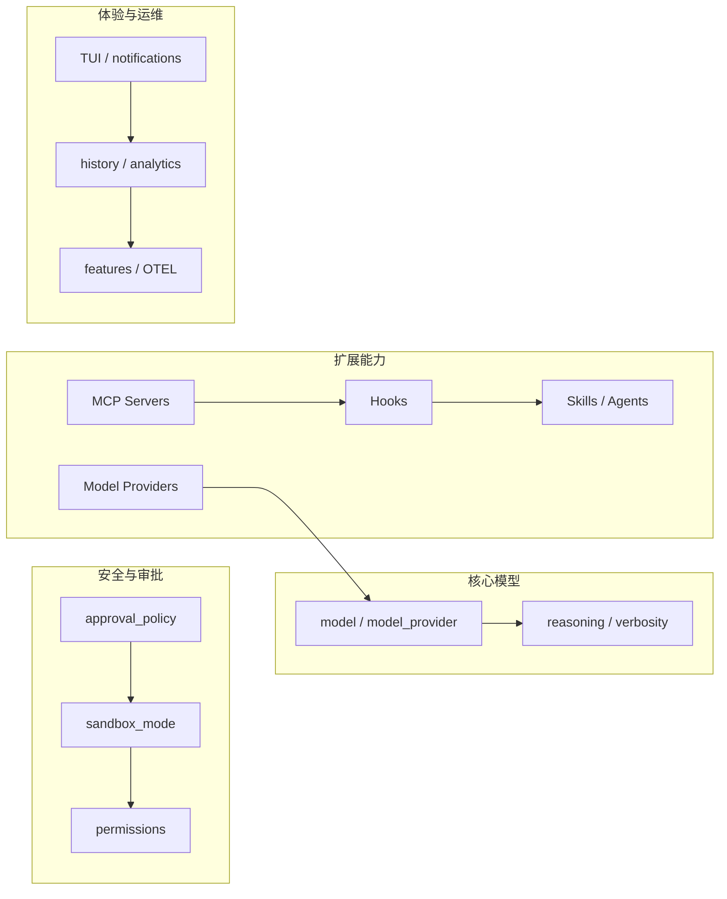
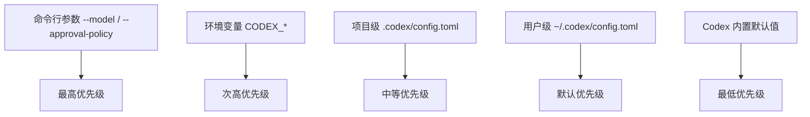

# OpenAI Codex config.toml 配置全解

> 基于 OpenAI 官方 Sample Configuration 页面整理，逐段拆解 + 注释翻译 + 使用建议。

## 1. 背景

OpenAI Codex 是一个终端里的 AI 编程 Agent，所有行为由 `~/.codex/config.toml`（或项目级 `.codex/config.toml`）驱动。这份官方 Sample Config 覆盖了 Codex 能读取的几乎所有 key，带默认值、推荐值和简短注释。

这篇文章把整份配置按功能域拆开，逐一说明每个配置项的用途和选值建议。

## 2. 配置文件总览



配置分为四大块：**核心模型**、**安全审批**、**扩展能力**、**体验运维**。下面逐一拆解。

## 3. 核心模型配置

### 3.1 模型选择

```toml
model = "gpt-5.5"                      # 主模型
model_provider = "openai"              # 从 [model_providers] 中选择
# review_model = "gpt-5.5"              # /review 命令的模型覆盖
# oss_provider = "ollama"               # --oss 会话的默认本地模型
# service_tier = "flex"                 # fast | flex
```

**关键点：**
- `model` 是必填项，决定你每次对话用哪个模型
- `model_provider` 默认 `"openai"`，但你可以在 `[model_providers]` 里定义 Azure、Ollama、Bedrock 等
- `service_tier` 影响响应速度和并发限额：`fast` 更快但更贵，`flex` 便宜但可能排队

### 3.2 推理与输出控制

```toml
# model_reasoning_effort = "medium"      # minimal | low | medium | high | xhigh
# plan_mode_reasoning_effort = "high"    # plan 模式的单独覆盖
# model_reasoning_summary = "auto"       # auto | concise | detailed | none
# model_verbosity = "medium"             # GPT-5 系列：low | medium | high
# personality = "pragmatic"              # none | friendly | pragmatic
```

**使用建议：**
- 日常开发用 `medium` reasoning，复杂重构切 `high`/`xhigh`
- `plan_mode_reasoning_effort` 独立控制 plan 模式，建议设高
- `personality = "pragmatic"` 让 Codex 少废话、多干活

### 3.3 上下文窗口

```toml
# model_context_window = 128000          # 手动指定上下文窗口
# model_auto_compact_token_limit = 64000 # 触发自动压缩的阈值
# tool_output_token_limit = 12000        # 每个工具输出的存储上限
```

这三个值直接影响 Codex 能"记住"多少上下文。大多数情况保持默认即可，除非你发现频繁压缩影响体验。

## 4. 安全与审批

这是整个配置里最重要的部分——它决定了 Codex 能做什么、需要你同意什么。

### 4.1 审批策略

```toml
approval_policy = "on-request"
# 可选值：
#   "untrusted"   - 只自动运行已知安全的只读命令
#   "on-request"  - 模型自己判断是否需要问你（默认）
#   "never"       - 永远不问你（危险）
#   { granular = {...} }  - 细粒度控制
```

**推荐：** 日常用 `on-request`，CI 环境用 `untrusted`，绝对不要设 `never` 除非你完全理解风险。

细粒度控制示例：

```toml
approval_policy = { granular = {
    sandbox_approval = true,       # 沙箱操作需审批
    rules = true,                  # 规则变更需审批
    mcp_elicitations = true,       # MCP 信息收集需审批
    request_permissions = false,   # 权限请求自动拒绝
    skill_approval = false         # 技能审批自动拒绝
} }
```

### 4.2 沙箱模式

```toml
sandbox_mode = "read-only"
# 可选值：
#   "read-only"        - 只读（最安全，默认）
#   "workspace-write"  - 可写工作区
#   "danger-full-access" - 无沙箱（极其危险）
```

**关键理解：** `workspace-write` 下还需要配置 `[sandbox_workspace_write]`：

```toml
[sandbox_workspace_write]
writable_roots = []        # 额外可写根目录
network_access = false     # 是否允许沙箱内联网
exclude_tmpdir_env_var = false
exclude_slash_tmp = false
```

### 4.3 权限配置（Permissions Profile）

Codex 支持命名权限配置文件，内置了三个：

| Profile | 说明 |
|---------|------|
| `:read-only` | 只读，最安全 |
| `:workspace` | 可写工作区 |
| `:danger-full-access` | 完全访问 |

自定义权限配置文件示例：

```toml
[permissions.workspace.filesystem]
glob_scan_max_depth = 3
":workspace_roots" = { "." = "write", "**/*.env" = "deny" }

[permissions.workspace.network]
enabled = true
mode = "limited"
allow_local_binding = false

[permissions.workspace.network.domains]
"api.openai.com" = "allow"
"example.com" = "deny"
```

**最佳实践：** 永远在自定义 profile 里 `deny` `*.env` 和密钥目录。

### 4.4 网络代理沙箱

```toml
[features.network_proxy]
enabled = true
domains = {
    "api.openai.com" = "allow",
    "*.github.com" = "allow",
    "example.com" = "deny"
}
```

域名规则：
- 精确匹配：`api.openai.com`
- 子域名通配：`*.example.com`（匹配 `a.example.com`，不匹配 `example.com`）
- 全域名通配：`**.example.com`（匹配 `example.com` 及其所有子域名）

## 5. 扩展能力

### 5.1 MCP 服务器

Codex 原生支持 MCP（Model Context Protocol），两种传输方式：

**STDIO 传输：**

```toml
[mcp_servers.docs]
command = "docs-server"
args = ["--port", "4000"]
env = { "API_KEY" = "value" }
startup_timeout_sec = 10.0
tool_timeout_sec = 60.0
enabled_tools = ["search", "summarize"]
```

**Streamable HTTP 传输：**

```toml
[mcp_servers.github]
url = "https://github-mcp.example.com/mcp"
bearer_token_env_var = "GITHUB_TOKEN"
http_headers = { "X-Example" = "value" }
```

**重要参数：**
- `required = true`：如果该服务器初始化失败，Codex 启动也会失败
- `enabled_tools`：白名单，只暴露指定工具
- `disabled_tools`：黑名单，排除特定工具（在白名单之后生效）

### 5.2 Model Providers（自定义模型后端）

Codex 内置了 `openai`、`ollama`、`lmstudio`、`amazon-bedrock` 四个 provider ID。

**Azure 示例：**

```toml
[model_providers.azure]
name = "Azure"
base_url = "https://YOUR_PROJECT_NAME.openai.azure.com/openai"
wire_api = "responses"
query_params = { api-version = "2025-04-01-preview" }
env_key = "AZURE_OPENAI_API_KEY"
```

**本地 Ollama：**

```toml
[model_providers.local_ollama]
name = "Ollama"
base_url = "http://localhost:11434/v1"
wire_api = "responses"
```

**命令驱动的 Bearer Token（适用于企业代理）：**

```toml
[model_providers.proxy.auth]
command = "/usr/local/bin/fetch-codex-token"
args = ["--audience", "codex"]
timeout_ms = 5000
refresh_interval_ms = 300000
```

### 5.3 Hooks（生命周期钩子）

```toml
[hooks]
hooks.PreToolUse
matcher = "^Bash$"

hooks.PreToolUse.hooks
type = "command"
command = 'python3 "/absolute/path/to/pre_tool_use_policy.py"'
timeout = 30
statusMessage = "Checking Bash command"
```

Hooks 可以在工具调用前后插入自定义逻辑，适合做安全审计、自定义审批流。

### 5.4 Agents（多 Agent）

```toml
[agents]
# max_threads = 6          # 最大并发 agent 线程
# max_depth = 1            # 最大嵌套深度

# [agents.reviewer]
# description = "Find correctness, security, and test risks in code."
# config_file = "./agents/reviewer.toml"
```

### 5.5 Skills 控制

```toml
skills.config
# path = "/path/to/skill/SKILL.md"
# enabled = false         # 禁用但不删除
```

## 6. 开发者体验

### 6.1 TUI 配置

```toml
[tui]
notifications = false                     # 桌面通知
animations = true                         # 动画效果
show_tooltips = true                      # 新手引导
# theme = "catppuccin-mocha"              # 语法高亮主题
# status_line = ["model", "context-remaining", "git-branch"]
# terminal_title = ["spinner", "project"]
```

**自定义快捷键：**

```toml
[tui.keymap.global]
open_transcript = "ctrl-t"
open_external_editor = []

[tui.keymap.composer]
submit = ["enter", "ctrl-m"]

[tui.keymap.chat]
interrupt_turn = "f12"
```

### 6.2 Feature Flags

```toml
[features]
# shell_tool = true
# hooks = false
# codex_git_commit = false
# multi_agent = true
# personality = true
# network_proxy = false
# fast_mode = true
# prevent_idle_sleep = false
```

**重要 feature：**
- `codex_git_commit`：让 Codex 帮你写 commit，开启后会自动加 `Co-authored-by: Codex <noreply@openai.com>`
- `fast_mode`：启用快速模式，降低延迟
- `enable_request_compression`：压缩请求体，减少带宽

### 6.3 项目信任级别

```toml
[projects."/absolute/path/to/project"]
trust_level = "trusted"   # 或 "untrusted"
```

对特定项目目录标记信任级别，影响审批策略。

### 6.4 环境变量策略

```toml
[shell_environment_policy]
inherit = "all"                     # all | core | none
ignore_default_excludes = false     # 是否跳过 KEY/SECRET/TOKEN 的默认排除
exclude = ["AWS**", "AZURE**"]      # 额外的排除模式
include_only = []                   # 白名单模式
```

这个配置决定了子进程能继承哪些环境变量，是安全防线的重要一环。

## 7. 可观测性

### 7.1 OpenTelemetry

```toml
[otel]
log_user_prompt = false
environment = "dev"
exporter = "none"
trace_exporter = "none"
metrics_exporter = "statsig"

# [otel.exporter."otlp-http"]
# endpoint = "https://otel.example.com/v1/logs"
# protocol = "binary"
# [otel.exporter."otlp-http".headers]
# "x-otlp-api-key" = "${OTLP_TOKEN}"
```

### 7.2 分析 & 反馈

```toml
[analytics]
enabled = true

[feedback]
enabled = true
```

## 8. Config Profile（多环境配置）

Codex 支持通过 `--profile` 切换配置：

```bash
codex --profile ci    # 加载 ~/.codex/ci.config.toml
```

CI Profile 示例（`~/.codex/ci.config.toml`）：

```toml
model = "gpt-5.4"
approval_policy = "on-request"
sandbox_mode = "read-only"
service_tier = "flex"
model_reasoning_effort = "medium"
```

## 9. 配置优先级总结



## 10. 最佳实践清单

- [ ] `sandbox_mode` 至少设为 `read-only`，生产环境不要用 `danger-full-access`
- [ ] `approval_policy` 保持 `on-request`，不要设 `never`
- [ ] 自定义 permissions profile 里显式 deny `*.env`
- [ ] `shell_environment_policy.ignore_default_excludes` 保持 `false`
- [ ] `network_proxy` 使用域名白名单，避免 `"*" = "allow"`
- [ ] MCP server 用 `enabled_tools` 白名单限制暴露面
- [ ] 定期检查 `[features]` 中启用的实验性功能
- [ ] CI 环境使用独立 profile（`--profile ci`）
- [ ] `model_provider` 的 `env_key` 不要硬编码密钥

## 11. 参考链接

- [Config Basics](https://developers.openai.com/codex/config-basics)
- [Advanced Config](https://developers.openai.com/codex/advanced-config)
- [Config Reference](https://developers.openai.com/codex/config-reference)
- [Sandbox and Approvals](https://developers.openai.com/codex/sandbox-approvals)
- [Managed Configuration](https://developers.openai.com/codex/managed-configuration)

---

## 

`#OpenAI` `#Codex` `#config` `#TOML` `#AI-Agent` `#CLI` `#安全配置` `#MCP` `#沙箱` `#DevTools`
