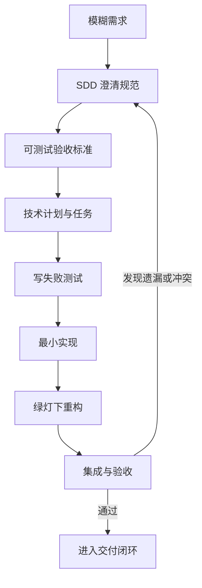

# SDD 和 TDD 根本不是二选一：一个管别做错东西，一个管别把东西做错

AI 写代码以后，研发团队遇到了一种很新的崩溃。

代码跑了，测试绿了，页面也能打开。

结果产品看完说：这根本不是我要的。

另一种崩溃正好相反：需求和方案写得巨细无遗，AI 也照着实现了，但一个边界条件没兜住，上线后照样翻车。

前一个问题，TDD 救不了；后一个问题，光写 Spec 也救不了。

## SDD 管方向，TDD 管每一步有没有踩空

这里的 SDD 指 **Spec-Driven Development，规范驱动开发**。

它先把模糊需求变成可审查、可追踪、可执行的规范，再从规范生成技术计划、任务、测试场景和实现。GitHub Spec Kit 对它的定义很直接：规范不再是代码写完就扔的脚手架，而是驱动实现的核心产物。

TDD 指 **Test-Driven Development，测试驱动开发**。

它把实现切成一个个小行为，严格执行“先写失败测试，再写最少代码让测试通过，最后在绿灯下重构”的红绿重构循环。

一句话说清：

> **SDD 防止团队把错误的需求实现得很完美，TDD 防止团队把正确的需求实现得漏洞百出。**

## 两者都强调先想清楚，但想的不是同一件事

SDD 和 TDD 看起来都反对“先撸代码再说”，所以经常被混在一起。

但它们工作的对象、产物和反馈周期完全不同。

| 对比维度 | SDD | TDD |
| --- | --- | --- |
| 主要问题 | 要构建什么，为什么构建，边界在哪里 | 某个行为如何实现，如何证明它正确 |
| 核心产物 | Spec、验收标准、技术计划、数据模型、接口契约、任务列表 | 自动化测试、最小实现、可重构代码 |
| 反馈来源 | 产品、开发、架构、测试、运行约束和人工评审 | 测试运行结果 |
| 工作粒度 | 功能、需求、系统改动、跨模块变更 | 一个行为、一个边界、一个代码增量 |
| 典型循环 | 澄清 → 规范 → 计划 → 拆任务 → 实现 → 验收 → 更新规范 | 红 → 绿 → 重构 |
| 最怕什么 | 规范含糊、过时、不可测试，最后变成高级废纸 | 测试写错、过度 Mock、只测实现细节 |
| AI 时代的价值 | 给 Agent 稳定上下文和明确施工图 | 给 Agent 快速、客观、可重复的自我纠错信号 |

只看粒度，可以把 SDD 理解成高层导航，把 TDD 理解成脚下路况。

但更准确的区别是：**SDD 把意图和约束变成研发的事实源；TDD 把预期行为变成代码级反馈机制。**

一个告诉你目的地在哪，一个不断提醒你车有没有开进沟里。

## SDD 最值钱的地方，是让“大家都知道”无处藏身

传统需求最危险的部分，通常不是写错的，而是根本没写的。

“支持用户登录”看起来很清楚，真正开工后却全是问题：支持哪些方式？密码规则是什么？登录状态保留多久？连续输错怎么处理？第三方账号冲突怎么办？

人类团队会靠会议、经验和口头沟通把这些坑补上。AI 不会读空气。对 Agent 来说，没有进入上下文的信息，基本等于不存在。

SDD 会通过人机澄清，把隐性信息变成结构化产物：

- 数据实体、字段和关系。
- API 输入输出、错误码、幂等要求。
- 技术选型、架构约束和决策理由。
- 可测试的验收标准。
- 可以独立执行的任务列表。

GitHub Spec Kit 的典型路径是：

`constitution → specify → clarify → plan → tasks → analyze → implement`

OpenSpec 则更轻量，让每个变更拥有自己的 proposal、specs、design 和 tasks，并允许这些产物随时迭代，不强制僵硬的阶段门。

两种工具路线不同，底层判断一致：**别让需求只活在聊天记录里，更别让 Agent 凭一段模糊 Prompt 猜完整个系统。**

## TDD 最狠的地方，是不接受“我觉得应该能跑”

SDD 把验收标准写清以后，代码仍然可能写错。

这时 TDD 接手，把一个验收目标继续拆成更小的可执行行为。每次只走三步：

1. **红**：先写测试，并运行确认它因为缺少目标行为而失败。
2. **绿**：只写足够让当前测试通过的代码，不顺手脑补未来需求。
3. **重构**：在测试持续通过的前提下，清理重复、改善命名和结构。

红阶段不是随便看到一片红就算完成。测试应该因为断言不满足而失败，而不是语法错误、环境报错或测试代码自己跑不起来。

这一步对 AI 编码尤其重要。没有失败测试，Agent 很容易一口气写出一大坨“看起来完整”的实现，再补一套专门迎合现有代码的测试。绿是绿了，可信度跟给自己出题自己判卷差不多。

TDD 的优势也正来自这套纪律：

- 测试先定义接口和行为，代码设计更贴近使用方式。
- 每次只实现当前测试要求的内容，减少过度设计。
- 反馈周期短，错误在几秒或几分钟内暴露。
- 有回归测试兜底，后续重构不必全靠胆量。
- Agent 可以根据测试结果持续自我修正，而不是等人手工验收。

## 验收标准，是 SDD 和 TDD 真正握手的地方

两套方法能不能接起来，关键看 Spec 里的验收标准写得怎么样。

“登录成功后进入首页”听起来像验收标准，其实依然很虚。什么叫成功？多久跳转？页面显示什么？失败时发生什么？

更可执行的写法是：

> 输入有效邮箱和正确密码后，系统在 3 秒内进入首页；顶部显示当前用户昵称；登录 Token 写入安全存储；刷新页面后登录状态保持。

这条规范可以继续拆成不同层级的测试：

- 单元测试：正确凭证返回成功结果，错误凭证返回明确错误。
- 集成测试：认证服务正确写入 Token，并读取用户信息。
- 端到端测试：用户提交表单后进入首页并看到昵称。
- 非功能测试：登录流程在约定时间内完成。



SDD 不应该只产出漂亮文档，TDD 也不应该只产出一堆脱离需求的测试。

真正有用的链路是：**需求条目能追到验收标准，验收标准能追到测试，测试能追到实现和交付结果。**

## 小改动直接进红绿循环，大改动先把施工图摊开

不是所有任务都需要同样重的流程。

### 行为已经讲清楚，就直接进红绿循环

- 需求明确、范围很小的 Bug 修复。
- 算法、数据转换、校验规则、状态机等确定性逻辑。
- 公共库、核心领域逻辑和高复用模块。
- 已有稳定接口，只需要增加一个行为。
- 重构已有代码，需要回归测试保护。

例如：“重试函数失败后最多执行三次，第三次成功时返回结果。”这个行为已经足够明确，可以直接先写失败测试。

### 跨系统的大改动，先别急着亮红灯

- 新功能仍有大量隐性需求需要澄清。
- 涉及多个系统、团队或角色的跨模块改动。
- API、数据模型、权限、安全和部署方式会一起变化。
- AI Agent 需要长时间、分任务或多角色执行。
- 需求变更频繁，需要知道会影响哪些计划和实现。
- 合规、审计或团队协作要求保留决策与追踪记录。

例如：“给现有 SaaS 增加企业级单点登录。”这类需求直接进 TDD，通常只会得到一套非常努力但方向未必正确的测试。

### 一次性实验，别把流程铺成高速公路

- 用完即丢的一次性原型。
- 只为验证技术可行性的 Spike。
- 自动生成且不会手工维护的代码。
- 无业务逻辑的简单配置改动。
- 风险极低、影响范围明确的文案或样式调整。

这些任务仍然需要基本验收，但没必要为了仪式感写十页 Spec，再给一行配置走完整红绿重构。流程不是越多越专业，能压住风险才算有用。

## AI 团队最实用的做法，是 SDD 定任务、TDD 逐块交付

一条可落地的组合流程可以这样走。

### 先让 SDD 把问题变成可执行任务

1. 收集 PRD、现有代码、架构约束、编码规范和历史决策。
2. 让 AI 主动追问含糊点、冲突和边界条件。
3. 人审核功能范围、非功能要求、风险与验收标准。
4. 生成技术计划、接口契约、数据模型和任务列表。
5. 检查需求、计划和任务之间是否存在遗漏或矛盾。

这一阶段的核心不是让 AI 多写文档，而是让团队在写代码前把分歧暴露出来。

### 每个任务内部严格走 TDD

1. 从任务的验收标准中挑出一个最小行为。
2. 写一个失败测试并运行，确认失败原因正确。
3. 写最少实现让测试通过。
4. 重构，并再次运行相关测试。
5. 提交测试和实现，再进入下一个行为。

```text
你: 根据已确认的 Spec，实现“连续登录失败 5 次后锁定账号 15 分钟”。
    每个行为严格走红绿重构，不允许先写实现。

AI: 我先补第一个失败测试：
    第 5 次错误密码提交后，账号状态应变为 locked。

你: 先运行并确认它因目标行为缺失而失败。

AI: 测试已按预期失败。接下来只实现让该测试通过的最小代码，
    然后继续补“15 分钟后自动解锁”的失败测试。
```

### 最后让 Harness 把闭环兜住

SDD 和 TDD 仍然只是研发方法，Agent 真正执行时还需要 Harness：

- 知识库给 Agent 提供项目背景、规则和历史决策。
- 沙箱和权限控制限制它能改什么、能执行什么。
- CI 运行完整测试、静态检查和构建。
- 代码审查与人工审批处理高风险决策。
- 部署、监控和生产反馈把真实结果送回 Spec。

如果 SDD 是施工图，TDD 是每一道工序的质检，Harness 就是工地围栏、工具台、监理和验收流程。少一个，都可能把“AI 写得快”变成“返工来得更快”。

## 只用 SDD，容易把文档当成果；只用 TDD，容易把绿灯当需求

SDD 最大的风险，是规范写完以后没人维护。

如果代码变化了，Spec 没更新；生产事故发生了，约束没回写；任务实施中发现设计错误，也没人修正规范，那么所谓事实源很快就会变成历史遗迹。

TDD 最大的风险，是测试本身可能定义错行为。

测试全部通过，只能证明实现符合这些测试，不能证明测试符合真实业务。过度使用 Mock、测试内部实现细节、为了绿灯修改断言，都会让 TDD 变成一套精致的自我安慰。

两者共同的边界也很明显：

- 都不能替代产品判断、架构判断和人工评审。
- 都需要控制粒度，过重会拖慢小任务，过轻又压不住复杂变更。
- 都必须进入版本控制，与代码一起评审和演进。
- 都要接受生产反馈，不能把开发环境里的通过当成交付完成。

## 真正成熟的团队，不会争论站哪一派

可以用一个简单判断来决定从哪里开始：

- 如果团队还没讲清楚“什么算完成”，先用 SDD。
- 如果已经知道某个行为应该怎样工作，立刻用 TDD。
- 如果 Agent 要连续执行、调用工具、改代码、跑测试和部署，再补 Harness。

SDD 把想法变成能施工的规范，TDD 把规范压进一个个可验证的代码增量，Harness 再让这些动作在受控环境里持续执行。

这三件事不是新潮缩写拼盘，而是一条很朴素的工程链路：先别做错东西，再别把东西做错，最后证明它真的能交付。


参考资料：

- `71-Wiki/71-01-raw/从 PRD 到部署：用 SDD+Harness 打通 AI 全流程研发实战.md`
- `71-Wiki/71-01-raw/第四篇 测试驱动开发(test-driven-development)：红绿重构的工程实践.md`
- GitHub Spec Kit：<https://github.com/github/spec-kit>
- OpenSpec：<https://github.com/Fission-AI/OpenSpec>

**SDD 决定做什么，TDD 证明怎么做，Harness 保证整条链路别失控。**

#SDD #TDD #测试驱动开发 #规范驱动开发 #HarnessEngineering #AICoding #软件工程 #红绿重构 #SpecDrivenDevelopment #研发流程
