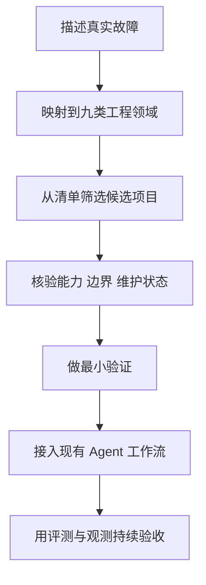

# 别再只盯着模型了：这份 Agent Harness 清单把真正影响交付的工程底座摊开了

同一个模型，别人家的 Agent 能连续干几个小时，自己家的跑十分钟就开始失忆、乱调工具、把任务做歪。

第一反应通常是：模型不行，再换个更贵的。

可换完以后，账单涨了，破事还在。

很多时候，真正拖后腿的不是“大脑”，而是大脑外面那套没人认真搭过的工作环境：上下文怎么续、工具怎么接、代码在哪跑、失败怎么恢复、过程怎么审计。

## 这张地图，补的是模型之外那一层

`awesome-agent-harness` 是一份面向 Agent Harness Engineering 的工程资源清单，把能直接落地的项目、工具、评测方案和实践文章，按九个关键领域整理到一起。

它不是又一个 Agent 框架，也不是装完就能干活的万能工具。它更像一张 Agent 工程选型地图：告诉你除了模型之外，还缺哪些零件，市面上有哪些现成方案。

截至 **2026 年 6 月 5 日**，清单收录了 **268 个条目**，其中 **241 个来自 GitHub**；九个项目分类中的 236 个条目全部来自 GitHub。

## Agent 不稳定，先别急着怪模型

做 Agent 最容易掉进一个坑：输出不稳定，就继续改提示词；任务跑不完，就继续换模型；工具调错了，就再补一句“请谨慎操作”。

这跟发现公司管理混乱，然后给老板换个更聪明的脑子差不多。脑子当然重要，但没有流程、权限、工作台、监控和验收，聪明人照样能把活干成一锅粥。

这份清单把问题拆成了九类：

| 工程领域 | 条目数 | 放到真实工作里意味着什么 |
| --- | ---: | --- |
| Harness 架构与编排 | 44 | 谁负责规划、谁执行、谁验收，任务怎样持续推进 |
| 上下文与工作状态工程 | 16 | Agent 换会话后还记不记得做到哪了 |
| 执行环境与沙箱 | 25 | 代码到底在哪跑，出事能不能被隔离 |
| 协议、工具接口与 Agent 契约 | 23 | Agent 怎样稳定调用外部工具和其他 Agent |
| 评测 Harness 与基准 | 27 | 怎么证明它真的变好了，而不是演示看着挺顺 |
| 可观测性与可靠性运维 | 14 | 失败发生在哪里，能不能追踪、重试和恢复 |
| 护栏、安全与治理 | 19 | 哪些钥匙能给 Agent，哪些动作必须先审批 |
| Harness 参考实现 | 68 | 想直接看成品或拆实现，可以从哪里下手 |
| 必读资料与生态地图 | 32 | 想把概念和工程边界补齐，该先读什么 |

这套分类最大的价值，是把“Agent 不好用”从一句模糊吐槽，变成可以逐层排查的工程问题。

## 把 Agent 跑稳，至少要补齐这九块

### 1. 长任务跑不下去，先看编排

Harness Architecture & Orchestration 收录的是任务规划、多 Agent 协作、工作流控制和长期运行相关项目。

里面既有 AutoGen、CrewAI、LangGraph、OpenAI Agents SDK 这类框架，也有 Superpowers、gstack、DeerFlow、Symphony、deepagents 等更偏工程工作流或长任务控制的方案。

放到真实场景里，它解决的是：一个需求进入系统以后，谁拆任务、谁分派、谁检查、失败以后从哪里继续。没有这层，Agent 就像临时拉来的聪明外包，能干活，但没人知道它下一步准备干什么。

### 2. 聊天记录很多，不代表工作状态还在

Context & Working-State Engineering 关注记忆、会话状态、任务依赖和上下文压缩。

这里收录了 claude-mem、Beads 等项目。它们关心的不是“让 Agent 记住你喜欢喝什么”，而是让长任务在跨会话、跨 Agent、跨时间运行时，仍然知道已经做了什么、还欠什么、哪些决策不能推翻。

说白了，聊天记录像会议录音，工作状态才像项目看板。把录音全塞给 Agent，不等于它真知道项目进度。

### 3. 敢不敢给权限，关键看沙箱

Execution Substrates & Sandboxing 收录代码执行、容器、虚拟机、浏览器环境和隔离运行相关方案。

Agent 一旦拥有 shell、文件系统、浏览器和云资源权限，就不再只是回答问题。它手里拿的是一串真钥匙，手一抖可能不是答错一句，而是改坏文件、泄露数据或者把环境搞挂。

所以执行环境的核心不是炫技，而是划边界：任务在哪跑、能看到什么、能改什么、失败后能不能回滚。

### 4. 工具怎么接，不能让 Agent 靠猜

Protocols, Tool Interfaces & Agent Contracts 关注 MCP、工具描述、协议互操作和 Agent 之间的明确契约。

这类项目解决一个非常现实的问题：模型知道自己“应该调用工具”，不代表它知道参数怎么传、结果怎么验、失败怎么处理。

工具接口写得含糊，就像只跟新同事说一句“你去把发布弄一下”。最后对方确实动手了，但动的是哪个环境，就得看命。

### 5. 一次演示成功，不能算评测

Evaluation Harnesses & Benchmarks 收录 Agent 评测框架、基准和相关工具。

Agent 的执行轨迹具有非确定性，一次成功演示说明不了多少。真正有用的评测，要能固定任务、记录轨迹、检查结果，并把模型、工具、提示、环境变化带来的影响区分开。

否则所谓“优化”，很可能只是这一次运气不错。

### 6. 出错不可怕，怕的是不知道死在哪一步

Observability & Reliability Operations 关注追踪、日志、重试、恢复和生产运行。

普通脚本失败了，通常能看到异常堆栈；Agent 失败了，可能经历几十轮思考、工具调用和状态变化，最后只留下一句“任务未完成”。

没有可观测性，排查就像在停电后的机房里摸黑找跳闸开关。你知道有问题，但不知道是哪一路先出了事。

### 7. 自动化越往前走，权限越要收紧

Guardrails, Security & Governance 收录权限、审批、安全策略、审计和治理相关方案。

这类能力不是为了把 Agent 捆成不会动，而是为了区分低风险动作和高风险动作：读文件可以自动，删数据需要审批；跑测试可以自动，生产发布需要门禁；普通工具可以直接调用，敏感凭证不能进日志。

自治度越高，这层越不能靠一句提示词硬撑。

### 8. 参考实现拿来拆，别闭眼照抄

Reference Harness Implementations 是清单里条目最多的分类，共 68 个。

OpenClaw、OpenHands、SWE-agent、OpenHarness、IronClaw、Agent S、Superset、GitHub Copilot CLI、Webwright 等项目都在这里。它们覆盖个人 Agent、编码 Agent、浏览器 Agent、桌面协作、多 Agent 工作区等不同形态。

这类项目最适合拿来回答“成熟实现通常怎么组织 Agent 循环、工具、记忆、权限和执行环境”。但不同项目解决的问题差异很大，Star 高不代表适合自己的场景，直接抄全家桶很容易把简单问题养成一头基础设施巨兽。

### 9. 资料够多了，先把边界弄明白

Essential Readings & Ecosystem Maps 收录了 32 个阅读与生态资源。

其中包含 OpenAI、Anthropic、LangChain、Cognition、Martin Fowler 等团队和作者围绕 Harness Engineering、长任务 Agent、工具设计、沙箱、评测和上下文工程的实践文章。

不知道 framework、runtime、harness 到底怎么分，或者想理解为什么“只换模型”解决不了系统可靠性问题，可以从这一类开始。

## 不用安装，真正费劲的是选型

这是一个资源清单，不需要安装，也没有运行依赖。打开项目页面，按问题进入对应分类，就能开始筛选。

真正的成本在后面：先讲清自己的问题，再看候选项目的定位、边界和维护状态。否则 268 个链接点一圈，浏览器标签页倒是很壮观，决策还是原地踏步。

项目维护者把条目放在单一数据源 `data/projects.yaml` 中，并提供了两个维护脚本：一个重新生成项目页面，一个校验条目与链接。

原始维护命令如下：

```bash
python3 scripts/render_readme.py
```

```bash
python3 scripts/verify_catalog.py
```

每个分类内部按 Star 数降序排列；Star 使用快照值，仓库更新时间统一记录在 `data/projects.yaml` 与验证报告中。也就是说，它适合做候选集入口，但选型时仍然要继续核验目标项目的最新状态。

### 实际会怎么问

```text
你: 帮我从这个 Agent Harness 清单里找一套适合长任务编码的方案。
    要能跨会话保存状态，执行时有隔离环境，还要能追踪失败步骤。

AI: 收到。我会先按四类筛选：
    编排、工作状态、沙箱、可观测性。

你: 不要只按 Star 排，先给选型条件和淘汰理由。

AI: 明白。我会输出候选项目、对应能力、缺口、维护状态和验证清单，
    不会直接替你拍板上线。
```

## 别从榜首往下刷，先把故障说清楚

最实用的路径不是从榜首往下挨个看，而是先把自己的故障翻译成 Harness 问题。



举几个直接能用的映射：

- Agent 经常跨会话失忆：先看上下文与工作状态工程。
- Agent 会乱跑命令，不敢给权限：先看执行环境与沙箱，再看护栏与治理。
- 多个 Agent 互相扯皮、任务没人收口：先看架构与编排、协议与契约。
- 演示挺好，生产总翻车：先看评测、可观测性与可靠性运维。
- 想知道成熟编码 Agent 怎么搭：去参考实现里拆结构。

### 把 OpenClaw 和 Codex 接进选型流程

下面不是项目原生功能，而是一条可以直接借用的实际协作路径。

```text
1. 把项目链接交给 OpenClaw，说明当前 Agent 的真实故障和约束。
2. 要求 OpenClaw 只从对应分类筛选 3 到 5 个候选，并列出淘汰理由。
3. 让 Codex 在隔离分支或临时项目中验证其中一个候选方案。
4. 固定一个真实任务，记录执行轨迹、失败点、耗时和人工介入次数。
5. 验证通过后再接入主工作流，并补上权限边界、日志和回归评测。
```

这套过程最重要的一步，是先写故障和约束，再挑工具。比如“长任务会中断，必须能从检查点恢复”就比“帮忙推荐最强 Agent 框架”有用得多。

产出也不应该只是一串链接，而应该是一张能做决定的选型单：

| 候选方案 | 解决的问题 | 缺失能力 | 验证方式 | 是否进入下一轮 |
| --- | --- | --- | --- | --- |
| 候选 A | 长任务编排 | 缺少隔离执行 | 在临时仓库跑固定任务 | 待验证 |
| 候选 B | 状态持久化 | 缺少可观测界面 | 模拟中断后恢复 | 待验证 |
| 候选 C | 沙箱执行 | 不负责上层编排 | 检查权限与回滚边界 | 待验证 |

## 它不是链接堆，维护方式也很工程化

第一，它没有把 Harness Engineering 偷懒压缩成“多 Agent 编排”，而是把上下文、沙箱、评测、可观测性和治理都摆上了桌。

第二，九类项目资源加上精选实践文章，既能找工具，也能补方法，不至于只会追着 Star 数跑。

第三，条目来自单一数据源，并提供生成和链接校验脚本，这份清单本身也在按工程资产维护。

## 这些坑踩过一个，这份清单就值得留着

- 已经在用 OpenClaw、Claude Code、Codex、OpenHands 等工具，但想把个人玩法升级为稳定工作流的人。
- 正在设计长任务 Agent、多 Agent 编排或编码 Agent 平台的工程团队。
- 经常遇到 Agent 失忆、乱调工具、任务中断，却不知道该从哪一层排查的人。
- 需要给 Agent 增加沙箱、审批、审计和安全治理的企业团队。
- 正在建设 Agent 评测、追踪、可靠性运维体系的测试与平台工程师。
- 想通过成熟开源实现理解 Agent Harness 结构，而不是只看概念文章的人。


项目地址：<https://github.com/Picrew/awesome-agent-harness>

**模型决定上限，Harness 决定这东西能不能稳定交付。**

#Agent #AgentHarness #HarnessEngineering #OpenClaw #Codex #ClaudeCode #GitHub #上下文工程 #Agent评测 #沙箱 #可观测性 #AI工程
