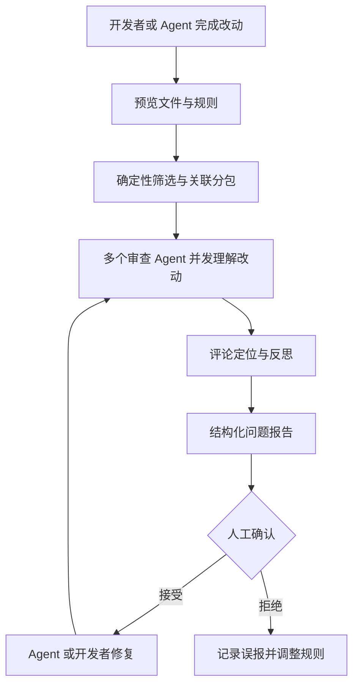

# 别再让通用 Agent 硬审大 PR 了：阿里把代码审查拆成了确定性工程 + AI

让通用 Agent 审一个小改动，通常看起来挺聪明。

让它审几十个文件的大 PR，画风就容易变了：挑几处顺眼的讲一讲，漏掉真正危险的文件，评论行号还可能飘到隔壁。

最后报告写得像模像样，人还是得重新过一遍。

这不是模型完全不行，而是把“哪些文件必须审、相关文件怎么分组、规则怎么匹配、评论应该落在哪一行”都交给自然语言决策，本来就有点像让一个聪明人闭眼管理流水线。

阿里开源的 `Open Code Review`，选择把这件事拆开：确定性工程负责不能错的流程约束，Agent 负责需要理解和判断的部分。

## 它不是再写一段审查 Prompt，而是给审查流程装上硬轨道

Open Code Review 是一个 AI 驱动的代码审查 CLI，前身是阿里集团内部的官方 AI 代码审查助手。

按照项目披露的信息，这套工具过去两年在内部服务了数万开发者，识别了数百万个代码缺陷，之后才被孵化成开源项目。

它读取 Git diff，把变更文件交给具备工具调用能力的 Agent。Agent 不只看几行 diff，还可以读取完整文件、搜索代码库、检查其他变更文件，再生成带行级定位的结构化审查意见。

但真正拉开差距的，不是“能读完整文件”，而是它没有把完整审查流程都押在模型临场发挥上。

## 通用 Agent 审代码，最容易在三件事上偷懒

项目把通用 Agent + Skills 做代码审查时的常见问题总结得很直白：

- **覆盖不全**：变更一大，Agent 可能只挑部分文件审查。
- **位置漂移**：发现的问题与真实代码位置对不上。
- **效果不稳定**：提示词稍微变化，结果质量就明显波动。

这些问题靠再补一句“请认真审查所有文件”很难根治。

因为模型擅长理解、推理和动态找上下文，却不擅长稳定充当流程控制器。让它自己决定要不要审某个文件，就像让质检员自己决定今天抽检几箱货，忙起来少看两箱也很合理。

## 不能出错的步骤，交给程序；需要判断的地方，才交给 Agent

Open Code Review 的核心设计是“确定性工程 × Agent”混合驱动。

| 审查环节 | 谁负责 | 这样拆的原因 |
| --- | --- | --- |
| 文件筛选 | 确定性工程 | 明确哪些文件必须审、哪些应该过滤，避免漏审 |
| 关联文件分包 | 确定性工程 | 把相关文件放进同一审查单元，减少上下文割裂 |
| 并发与上下文隔离 | 确定性工程 | 每个包作为独立 sub-agent，适配大变更 |
| 文件规则匹配 | 确定性工程 | 用路径和模板稳定匹配审查规则 |
| 评论定位与反思 | 独立工程组件 | 提升评论位置和内容准确性 |
| 理解改动与发现问题 | Agent | 发挥推理、动态决策和上下文召回能力 |
| 搜索代码库与关联变更 | Agent 工具集 | 根据当前问题补充所需上下文 |

关联文件分包是个很实际的设计。

比如 `message_en.properties` 和 `message_zh.properties` 会被放在同一审查单元里。每个分包由上下文隔离的 sub-agent 处理，既能分而治之，也能自然并发。

这样做不是为了炫多 Agent，而是防止一次把超大变更全塞进上下文后，模型顾头不顾腚。

项目还根据线上工具调用轨迹，分析不同工具的使用频率、重复调用率和新增工具对调用链的影响，最终沉淀出面向代码审查的专属工具集。比起给通用 Agent 一大串万能工具，这种做法更像工程系统：只给它完成当前工作需要的扳手，别把整个五金店都倒在桌上。

## 一条命令先看工作区，也能精确审分支和提交

推荐通过 NPM 全局安装：

```bash
npm install -g @alibaba-group/open-code-review
```

安装后即可使用 `ocr` 命令。项目也提供 macOS、Linux、Windows 的多架构二进制文件，以及源码构建方式。

开始审查前必须先配置 LLM。下面是项目给出的 Anthropic 配置示例：

```bash
# 方式 A：交互式配置
ocr config set llm.url https://api.anthropic.com/v1/messages
ocr config set llm.auth_token your-api-key-here
ocr config set llm.model claude-opus-4-6
ocr config set llm.use_anthropic true

# 方式 B：环境变量（优先级最高）
export OCR_LLM_URL=https://api.anthropic.com/v1/messages
export OCR_LLM_TOKEN=your-api-key-here
export OCR_LLM_MODEL=claude-opus-4-6
export OCR_USE_ANTHROPIC=true
```

配置会保存在 `~/.opencodereview/config.json`，环境变量优先级更高。它也兼容 Claude Code 的相关环境变量，并能解析 `~/.zshrc` 和 `~/.bashrc` 中的导出配置。

配置完成后，先测连通性：

```bash
ocr llm test
```

### 接入前先让它预览，别一上来就烧 Token

```text
你: 在这个仓库接入 Open Code Review。
    先预览哪些文件会被审查，不要立即调用模型。

AI: 我会先确认 ocr 已安装、LLM 连通性正常，
    然后运行预览模式并检查生效规则。

你: 确认范围没问题后，再审查当前分支相对 main 的变更。

AI: 明白。审查结果会按优先级整理，
    高风险问题先交给你确认，不自动修改代码。
```

最常用的三种审查入口是：

```bash
cd your-project

# 工作区模式 —— 审查所有暂存、未暂存和未跟踪的变更
ocr review

# 分支范围 —— 比较两个引用
ocr review --from main --to feature-branch

# 单个提交
ocr review --commit abc123
```

在真正调用 LLM 前，可以用 `ocr review --preview` 查看将被审查的文件列表。这个动作很值钱：先确认范围和规则，再花 Token 跑审查，比结果出来后才发现生成目录也被扫了一遍靠谱得多。

## 规则不该只写在 Prompt 里，项目和团队要能各自落盘

Open Code Review 用四层优先级解析审查规则：

1. CLI 的 `--rule` 参数，优先级最高。
2. 项目内的 `.opencodereview/rule.json`，可以提交进 Git。
3. 用户全局的 `~/.opencodereview/rule.json`。
4. 系统内置的默认规则。

每层规则按声明顺序匹配，首次命中生效；当前层没匹配到，再继续向下一层查找。

项目规则示例：

```json
{
  "rules": [
    {
      "path": "force-api/**/*.java",
      "rule": "所有新方法必须对必填参数进行空值校验"
    },
    {
      "path": "**/*mapper*.xml",
      "rule": "检查 SQL 注入风险、参数错误和缺少闭合标签"
    }
  ]
}
```

路径支持 `**` 递归匹配和 `{java,kt}` 大括号展开。

这套设计的好处，是把团队真正关心的风险固定成可版本控制的规则。Java API、Mapper XML、配置文件和前端组件可以各用各的检查重点，不必每次期待模型从一段大而全的提示词里抓到重点。

还可以先检查某个文件会命中哪条规则：

```bash
ocr rules check src/main/java/com/example/Foo.java
ocr rules check --rule custom.json src/main/resources/mapper/UserMapper.xml
```

## 把它塞进 Agent，审查才真正进入编码闭环

Open Code Review 不只可以独立运行，也能接入编码 Agent。

作为 Skill 安装：

```bash
npx skills add alibaba/open-code-review --skill open-code-review
```

它会教会编码 Agent 调用 `ocr`、按优先级整理问题，并选择性应用修复。

Claude Code 也可以安装对应插件：

```bash
/plugin marketplace add alibaba/open-code-review
/plugin install open-code-review@open-code-review
```

安装后会注册 `/open-code-review:review` 斜杠命令，用于运行审查、过滤问题和修复。

所有 Agent 集成方式都有同一个前置条件：本机必须已经安装 `ocr` CLI，并完成 LLM 配置。Skill 和插件只是把审查动作接进 Agent 工作流，不会凭空替你准备执行引擎。



这条闭环里，最该保留的是人工确认。AI 审查发现的问题可以帮助排序和补漏，但“是否真的要改、怎么改、会不会破坏业务意图”，仍然需要开发者判断。

## 进入 CI 后，它才从个人工具变成团队门禁

OCR 可以在 Merge Request 或 Pull Request 阶段自动审查分支差异。

CI 的核心命令是：

```bash
ocr review \
  --from "origin/main" \
  --to "origin/feature-branch" \
  --format json
```

`--format json` 会输出适合 CI 脚本解析的机器可读结果。仓库中提供 GitHub Actions 和 GitLab CI 示例。

常用参数还包括：

- `--preview`：只预览审查文件，不调用 LLM。
- `--concurrency`：控制最大并发文件审查数，默认 8。
- `--timeout`：控制并发任务超时分钟数，默认 10。
- `--audience agent`：面向 Agent 时只输出摘要。
- `--rule`：指定自定义审查规则。
- `--tools`：指定自定义工具配置。

对团队来说，比较稳妥的做法不是第一天就把所有 AI 意见设为阻断项，而是先在 CI 里观察命中率、误报类型和审查耗时，再逐步把高置信规则升级成门禁。

## 它把过程打开给你看，但提示词和代码内容也要当敏感数据

`ocr viewer` 可以启动 WebUI 会话查看器，默认地址是 `localhost:5483`，用于查看审查会话历史。

```bash
ocr viewer
ocr viewer --addr :3000
```

查看器会展示会话 JSONL，其中可能包含 LLM 请求消息和响应。项目对 Host Header 做了允许列表限制，以降低本地查看器遭受 DNS Rebinding 攻击的风险；如果绑定非本机地址，需要通过 `OCR_VIEWER_ALLOWED_HOSTS` 明确加入允许的主机。

工具还支持 OpenTelemetry spans 和 metrics，默认关闭：

```bash
ocr config set telemetry.enabled true
ocr config set telemetry.exporter otlp
ocr config set telemetry.otlp_endpoint localhost:4317
```

需要特别注意 `telemetry.content_logging`。一旦启用，它可能把 LLM 提示词和响应带入遥测数据。代码、审查上下文和模型响应都可能包含敏感信息，企业环境别为了排查方便随手打开，然后把内部代码送进另一个日志系统。

## 大 PR、复杂规则和 Agent 工作流，最容易看出它的价值

- 变更文件多，担心通用 Agent 选择性审查的团队。
- 需要对 Java、XML、配置等不同文件应用不同审查规则的项目。
- 想把 AI 审查接入 Claude Code 或其他编码 Agent 闭环的开发者。
- 希望在 GitHub Actions、GitLab CI 中自动解析审查结果的平台团队。
- 需要查看调用过程、调试规则与观察审查链路的工程团队。
- 已有可用模型端点，想掌控模型选择与数据流向的企业。

## 它能把审查做得更稳，但不能替开发者背责任

Open Code Review 解决的是 AI 代码审查的工程稳定性问题，不是把代码审查彻底无人化。

模型仍然可能误报、漏报或误解业务。行级定位更准，也不代表建议一定正确；规则匹配更稳定，也不代表团队规则本身没有问题。

大变更虽然能通过分包和并发提升稳定性，但关联关系如果跨越多个审查单元，仍然需要完整的架构理解和人工复核。安全、权限、数据一致性和高风险业务逻辑，不能因为 AI 报告看着专业就直接放行。

配置模型端点也意味着变更代码和上下文可能被发送给对应 Provider。使用前必须确认数据合规、密钥管理和日志策略。

项目采用 Apache-2.0 许可证。


项目地址：<https://github.com/alibaba/open-code-review>

**代码审查要稳定，不能只让 Agent 更聪明，还得让它在一条不容易偷懒的轨道上工作。**

#OpenCodeReview #CodeReview #AICodeReview #Agent #Alibaba #ClaudeCode #CI #GitHubActions #GitLabCI #软件工程 #代码质量
