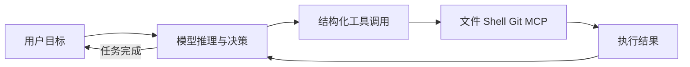

# 想搞懂 Claude Code，别再只研究提示词：这个项目把 Harness 拆成了 23 节课

很多人第一次做编码 Agent，思路都差不多。

接个模型，塞一段系统提示词，再给它读文件、写文件和跑命令的工具。

Demo 跑起来以后挺兴奋，真拿去干活就开始翻车：上下文越来越脏，危险命令没有门禁，任务一长就失忆，多 Agent 一并发就互相踩文件。

这时候才会发现，模型只是发动机。真正决定这辆车能不能上路的，是外面的方向盘、刹车、仪表盘、导航和交通规则。

`claude-code-from-scratch` 做的事情，就是把这套 Harness 从一个最小循环开始，一层一层搭到包含 23 个机制的多 Agent 参考系统。

## 这不是 Anthropic 源码，而是一套能跑起来的拆解实验

项目把自己定位成 Claude Code 架构的逆向学习实现，并基于 `learn-claude-code` 项目继续扩展。

它不是 Anthropic 官方源码，也不能证明 Claude Code 内部一定按相同方式实现。更准确的理解是：作者观察 Claude Code 的外部行为，再用 Python 重建一套相似机制，帮助开发者看清一个成熟编码 Agent 背后通常需要哪些工程组件。

整个项目围绕一个 `core.py` 展开。工具定义、分发、权限和核心循环能力集中在这里；每个 session 文件只新增一个概念，通常控制在较小范围内。

这套组织方式挺适合学习。它不像直接把一艘航母扔给你，让你自己找发动机，而是先给一条能漂的小船，再逐步装雷达、通信、甲板和舰队协作。

截至 **2026 年 6 月 6 日**，仓库公开了 23 个递进组件，主要使用 Python 3.10+，采用 MIT 许可证。

## 编码 Agent 的核心，最开始真的只是一个 while 循环

第一阶段只做四件事：

1. 调用模型。
2. 观察模型想执行什么动作。
3. 分发工具并执行。
4. 把执行结果送回模型，继续下一轮。

后面的规划、子 Agent、权限、上下文压缩、MCP 和多 Agent 协作，全都没有替换这个基本循环，只是在它外面持续增加能力。



这个判断很重要。

很多 Agent 项目一上来就堆复杂框架，最后出了问题连循环在哪都找不到。先看懂最小感知行动循环，再研究高级能力，脑子里会清楚很多。

## 23 个文件，刚好把 Harness 的复杂度逐层摊开

项目把能力拆成六个阶段：

| 阶段 | 主要机制 | 它解决的真实问题 |
| --- | --- | --- |
| 核心 Agent 循环 | 工具分发、TodoWrite、子 Agent | Agent 怎样从“会聊天”变成“会执行” |
| 知识与上下文 | Skill 按需加载、上下文压缩、任务依赖图 | 长任务怎样少失忆、少塞垃圾上下文 |
| 异步与多 Agent | 后台任务、队友邮箱、状态机、自主领任务、Worktree | 多个 Agent 怎样并行又不互相踩脚 |
| 生产加固 | 流式输出、可回滚文件操作、权限、事件总线、会话恢复 | 能跑的 Demo 怎样接近可控工具 |
| 高性能运行时 | 并行工具、中断注入、Prompt 缓存、MCP | 怎样提高速度、控制成本并扩展工具 |
| 企业级升级 | Redis Pub/Sub、高级 Worktree 生命周期 | 教学实现怎样替换成更耐用的组件 |

这 23 个 session 的价值，不只是功能多。

它让你能比较“加入某个机制前后，系统究竟发生了什么变化”。比如先看 JSONL 邮箱怎么让 Agent 通信，再看 Redis Pub/Sub 怎样替换它；先看基础 Worktree 隔离，再看脏工作区、分支冲突、Detached HEAD 和清理逻辑怎样补齐。

## 真正让 Agent 能干长活的，是上下文和任务状态

模型上下文不是越多越好。

任务跑久以后，历史对话、工具输出和中间尝试不断堆积，真正重要的信息反而会被淹没。项目用三层上下文压缩和磁盘记忆演示如何在信息过载前做整理，也用文件持久化的任务依赖图保存工作状态。

这两件事经常被混为一谈：

- 上下文管理决定模型当前能看到什么。
- 任务状态决定系统已经完成什么、下一步该做什么。

聊天记录像一整天的会议录音，任务图才是项目看板。把录音全部喂给 Agent，不代表它知道哪件事已经做完。

Skill 按需加载也是同一个思路：只有任务需要某类知识时，才把对应 `SKILL.md` 注入上下文，而不是每轮都背着全部说明书跑。

## 多 Agent 真正难的不是多开几个模型，而是别互相拆家

项目从后台任务开始，逐步加入持久化队友、JSONL 邮箱、有限状态机通信、自主任务领取和 Git Worktree 隔离。

状态机把团队通信约束成明确阶段，例如：

`IDLE → REQUEST → WAIT → RESPOND`

Worktree 则给并行任务准备独立代码目录，避免两个 Agent 同时改一个工作区。

到了高级版本，还会处理脏工作区提醒、过期 Worktree 清理、分支名冲突、Detached HEAD、并行冲突检测，以及通过 `try/finally` 保证清理。

这才是多 Agent 从演示走向工程的分水岭。

只让三个 Agent 同时开工很容易，能保证它们知道谁负责什么、改动互不覆盖、失败后有人收尸，才是真的难。

## 权限不是弹窗越多越安全，而是规则要能提前讲清

项目用 YAML 演示三层权限治理：

```yaml
always_deny:   rm -rf / · sudo · pipe-to-shell downloads
always_allow:  ls · cat · git status · grep · version checks
ask_user:      rm · git commit · pip install · .env access
```

这种声明式权限比把判断散落在代码分支里更容易审查。

低风险动作直接放行，高风险动作明确阻止，中间动作要求人工确认。权限规则本身也能进入版本控制，而不是靠一句“请谨慎操作”祈祷模型突然产生安全意识。

同一阶段还加入了事件总线、生命周期 Hook、文件快照与回滚，以及会话的保存、恢复和分叉。

Agent 能不能被中断、能不能恢复、做错后能不能回滚，通常比它一次答得多聪明更影响真实使用体验。

## 从最小循环开始跑，别一上来挑战 Redis 和多 Agent

项目支持直接调用 Anthropic，也能通过 LiteLLM 接入其他模型。

直接使用 Anthropic 的原始安装步骤如下：

```bash
# 1. Clone the repository
git clone https://github.com/FareedKhan-dev/claude-code-from-scratch.git
cd claude-code-from-scratch

# 2. Create virtual environment
python -m venv .venv
source .venv/bin/activate        # Linux/Mac
.venv\Scripts\activate           # Windows

# 3. Install dependencies
pip install -r requirements.txt

# 4. Set environment variables
cp .env.example .env
# Edit .env and add your ANTHROPIC_API_KEY and MODEL_ID
```

环境文件示例：

```env
ANTHROPIC_API_KEY=sk-ant-your-key-here
MODEL_ID=claude-sonnet-4-20250514
```

### 第一次打开，先盯住循环，不要急着看全部功能

```text
你: 帮我运行这个项目，但先只看最小 Agent 循环。
    解释每轮模型调用、工具执行和结果回传发生在哪里。

AI: 我会先检查环境变量与依赖，
    然后运行第一个 session，并沿调用链解释核心循环。

你: 暂时不要启动多 Agent、Redis 或 MCP。

AI: 明白。先确认最小循环能跑通，
    再逐步加入工具分发、TodoWrite 和子 Agent。
```

这里有一个当前仓库里的实际坑：项目说明多处使用 `01_perception_action_loop.py`，但仓库根目录中的真实文件名是 `s01_perception_action_loop.py`。

因此首个实验应以实际文件为准：

```bash
python s01_perception_action_loop.py
```

别小看这个文件名差异。教程型项目最怕第一条命令就报“找不到文件”，人还没看懂 Agent 循环，先开始怀疑 Python 环境。

## 想换模型，不需要把 Agent 代码重写一遍

项目通过 LiteLLM Proxy 支持其他模型提供商，让现有 Anthropic SDK 请求转发到选定模型。

先安装并启动代理：

```bash
pip install litellm[proxy]
```

```bash
litellm --config litellm_config.yaml --port 4000
```

然后让 `.env` 指向本地代理：

```env
ANTHROPIC_BASE_URL=http://localhost:4000
ANTHROPIC_API_KEY=dummy-key-litellm-ignores-this
MODEL_ID=my-model
NEBIUS_API_KEY=your-real-provider-key-here
```

这套做法的重点不是“支持很多模型”，而是把模型接入与 Agent 机制解耦。工具、权限、会话和任务系统不需要因为换 Provider 全部重写。

但不同模型的工具调用能力、上下文窗口和指令遵循能力差异很大。代理能翻译协议，不代表换个模型后行为一定等价。

## 并行、缓存、MCP，解决的是速度、成本和扩展边界

到了第五阶段，项目开始处理 Agent 跑久后的效率问题：

- 用 `asyncio.gather` 并行执行多个工具调用。
- 用中断注入让用户能在任务中途调整方向。
- 跟踪 Prompt 缓存命中与未命中，减少重复 Token 消耗。
- 使用官方 MCP SDK 自动注册外部工具。

MCP 服务器配置示例：

```yaml
servers:
  - name: filesystem
    transport: stdio
    command: npx
    args: ["-y", "@modelcontextprotocol/server-filesystem", "."]

  - name: git
    transport: stdio
    command: uvx
    args: ["mcp-server-git"]
```

这几项能力共同说明了一件事：成熟 Agent 的成本不只来自模型价格，也来自低效工具调用、重复上下文、无法中断的错误路径，以及每增加一个集成就修改核心循环的维护成本。

## Redis 不是终点，它只是提醒你教学实现和生产系统差很远

最后阶段用 Redis Pub/Sub 替换 JSONL 邮箱，并加强 Worktree 生命周期管理：

```bash
# Start Redis first
docker run -p 6379:6379 redis

python s22_production_mailbox.py      # Redis mailboxes (falls back to Queue)
python s23_worktree_advanced.py       # Advanced worktree management
```

这并不意味着加上 Redis 就自动成为生产级 Claude Code。

作者也列出了后续可继续加强的方向：并行生成子 Agent、向量记忆、细粒度 Token 成本账本、Webhook 事件总线，以及 LLM-as-a-Judge 评估层。

换句话说，这套项目更像一张从 Demo 走向生产的解剖图，而不是下载后就能替代 Claude Code 的成品。

## 想做 Agent 平台的人，最适合按顺序拆一遍

- 只会调用模型 API，想真正理解 Agent 循环与工具调用的开发者。
- 正在做编码 Agent，需要补上下文、权限、会话和任务系统的团队。
- 想理解多 Agent 通信、任务领取和 Worktree 隔离的人。
- 需要把 MCP、Prompt 缓存和并行工具接进现有 Agent 的工程师。
- 想比较教学实现与生产级组件差异的 Agent 平台团队。
- 已经在用 Claude Code、Codex 或 OpenClaw，想反过来理解 Harness 为什么重要的人。

## 能学到架构，不代表可以照抄进生产

项目的 Claude Code 对照关系来自作者的逆向理解，不是 Anthropic 官方确认的内部架构。

每个 session 为了教学会刻意压缩复杂度。生产环境还需要更完整的认证、审计、隔离、错误恢复、资源限制、数据保护、评测和运维体系。

项目中的 Agent 可以执行 Shell、读写文件、接入 MCP 和运行多 Agent。测试时应该放在隔离仓库或沙箱里，使用低权限凭证，并先读懂 `config/permissions.yaml`。

配置真实 API Key 前，也要确认 `.env` 不会进入版本控制。通过 LiteLLM 切换 Provider 时，还要单独评估数据流向、模型能力和调用成本。

它最适合拿来拆、改、做实验，不适合因为“代码不多”就直接塞进重要项目自动干活。


项目地址：<https://github.com/FareedKhan-dev/claude-code-from-scratch>

**真正把编码 Agent 拉开差距的，往往不是那段 Prompt，而是 Prompt 外面这一整套不太性感的工程。**

#ClaudeCode #HarnessEngineering #Agent #MultiAgent #MCP #PromptCaching #ContextEngineering #GitWorktree #Python #GitHub #AIEngineering
