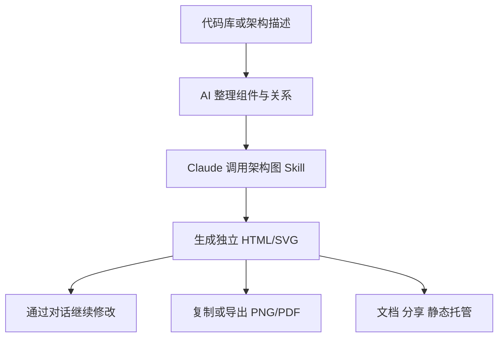

# 架构图别再手搓了：这个 Claude Skill 把描述直接变成可交付 HTML

架构图这东西，往往不是不会画，而是不值得花半天画。

盒子刚对齐，产品说少了个支付服务；箭头刚理顺，开发说缓存位置不对；好不容易改完，复制进文档又糊成一片。

最气人的是，真正重要的系统关系没讨论几分钟，大家先跟字体、配色和连线打了一架。

`Architecture Diagram Generator` 想省掉的就是这类破事：把系统描述交给 Claude，它按一套固定设计规则生成独立 HTML 架构图，浏览器直接打开，还自带复制、PNG 和 PDF 导出。

## 它不是画图网站，而是给 Claude 装了一套出图规矩

这个项目本质上是一个 Claude Skill。

Skill 里放着架构图生成规则和基础 HTML 模板。你负责讲清楚组件、连接关系和技术栈，Claude 负责把内容排成深色主题的 HTML/SVG 架构图。

这和一句“帮我画张架构图”差别很大。

前者像把需求丢给一个有设计规范的技术制图员；后者更像临时抓个同事，让他凭感觉画，最终效果全看当天手感。

截至 **2026 年 6 月 6 日**，该仓库已有约 **5.6K Star**，当前版本标记为 `1.1`，采用 MIT 许可证。

## 真正省时间的，不是第一次生成，而是后面每次修改

它的输入门槛很低：不需要设计技能，也不要求先学一套画图 DSL，只要准备一段能说明架构的文字。

这段文字可以自己写，也可以先让 Cursor、Claude Code、Windsurf 或 ChatGPT 分析代码库，整理主要组件、连接关系、技术栈、云服务和外部集成。

然后把描述交给安装了 Skill 的 Claude，生成独立 HTML 文件。架构变化以后，继续在对话里要求增加组件、调整布局或修改样式即可。

| 日常麻烦 | 这个 Skill 怎么处理 | 最终得到什么 |
| --- | --- | --- |
| 不知道怎么排版 | 用固定设计系统组织组件和连接 | 风格统一的架构图 |
| 架构描述散落在脑子里 | 接受自然语言组件清单 | 可视化系统关系 |
| 修改一次就要重新拖拽 | 通过对话继续迭代 | 更新后的 HTML 文件 |
| 发给别人需要装软件 | 输出自包含单文件 | 浏览器直接打开 |
| 放进文档或汇报不方便 | 内置 Copy、PNG、PDF | 可直接粘贴和交付的图片或 PDF |

它没有发明新的架构建模方法，做的是另一件更实际的事：把“能看懂的系统描述”快速变成“能拿去沟通的视觉产物”。

## 深色主题只是表面，统一语义才是底子

生成结果采用 Slate-950 深色背景和 40px 网格，字体使用 JetBrains Mono，整体是偏技术演示风格。

更重要的是，它给不同组件类型设置了稳定的语义颜色：

| 组件类型 | 颜色 | 常见用途 |
| --- | --- | --- |
| 前端 | Cyan | 客户端、UI、边缘设备 |
| 后端 | Emerald | 服务端、API、业务服务 |
| 数据库 | Violet | 数据库、存储、AI/ML |
| 云服务 | Amber | 云资源与基础设施 |
| 安全 | Rose | 认证、安全组、加密 |
| 外部系统 | Slate | 通用组件与外部系统 |

这套颜色规则看着只是配色，实际解决的是阅读成本。团队每次出图都沿用同一套视觉语言，别人不用重新猜“这个紫色框今天代表数据库，还是明天又代表消息队列”。

输出结构也比较完整：顶部是项目标题和动态状态标识，中间是 SVG 主图，下面有三张摘要卡片，底部放项目元数据。

箭头会先绘制，再通过组件底部的不透明背景遮罩处理层级，避免连线压在组件文字上。说人话就是：它至少知道箭头应该待在盒子后面，不会画出一团技术毛线。

## 最终交付的是一个文件，不是一张只能看的截图

每张图都是自包含 HTML，CSS 和 SVG 都嵌在文件里。

打开现代浏览器就能查看，不需要额外安装画图软件。文件可以直接发给同事、塞进文档、托管在静态站点，也能打印或导出 PDF。

浏览器中的工具栏提供三种导出方式：

- Copy：把高分辨率 PNG 复制到剪贴板，可直接粘贴到 Slides、Docs 或 Slack。
- PNG：下载适合演示文稿和截图的高分辨率图片。
- PDF：下载保留深色主题的 PDF 文件。

这里最顺手的点，是 HTML 既能继续修改，又能随时导出静态版本。它不像截图那样一改就得重来，也不像专业制图源文件那样，发给别人还要先确认对方装没装软件。

## 在 Claude.ai 里装好，三步就能开始出图

Claude.ai 是官方推荐的使用方式。Free、Pro、Max、Team 和 Enterprise 计划都可使用，但必须先启用 Code Execution。

个人计划需要在 `Settings → Capabilities` 打开；Team 和 Enterprise 则需要管理员在 `Organization settings → Skills` 中启用。

安装过程是：

1. 下载仓库中的 `architecture-diagram.zip`。
2. 进入 Claude.ai 的 `Customize → Skills`。
3. 点击 `+ → + Create skill → Upload a skill`，上传压缩包并开启 Skill。

如果使用 Claude.ai Project，也可以把压缩包上传到 Project Knowledge。

### 从代码库到架构图，实际会这样协作

```text
你: 分析这个项目的架构，整理主要组件、连接关系、
    使用的技术和外部服务。

AI: 已整理前端、API、数据库、缓存、消息队列和云服务关系。

你: 使用 architecture diagram skill 生成架构图。
    把认证域单独分组，并标注主要协议。

AI: 已生成独立 HTML 文件。
    可以直接在浏览器打开，并继续调整布局或导出 PNG/PDF。
```

准备架构描述时，项目给出的分析提示词是：

```
Analyze this codebase and describe the architecture. Include all major
components, how they connect, what technologies they use, and any cloud
services or integrations. Format as a list for an architecture diagram.
```

拿到描述后，再让 Claude 使用 Skill：

```
Use your architecture diagram skill to create an architecture diagram from this description:

[PASTE YOUR ARCHITECTURE DESCRIPTION HERE]
```

## Claude Code 用户不用绕网页，解压到技能目录就行

Claude Code CLI 可以把 Skill 安装到全局目录，也可以只放进当前项目。

原始安装命令如下：

```bash
# Global skills
unzip architecture-diagram.zip -d ~/.claude/skills/

# Or project-local
unzip architecture-diagram.zip -d ./.claude/skills/
```

手动配置时，只要确保 Claude 能访问下面两个文件：

```
architecture-diagram/
├── SKILL.md              # Skill instructions
└── resources/
    └── template.html     # Base template
```

对经常分析代码库的人来说，项目级安装尤其合适。可以让 Claude Code 先读代码、整理架构，再调用 Skill 出图，最后把 HTML 和技术文档一起留在项目里。



## Web 应用、Serverless、微服务，先把关系讲清就能画

项目给出的示例覆盖三类常见系统：

- React、Node.js 和 PostgreSQL 组成的 Web 应用。
- CloudFront、API Gateway、Lambda、DynamoDB、S3 和 Cognito 组成的 AWS Serverless 架构。
- React 与移动客户端、Kong、多个语言服务、不同数据库、Kafka 和 Kubernetes 组成的微服务架构。

Claude 会根据系统流向调整布局，为连接添加数据流箭头，并支持协议、端口和注释标签。还可以用安全组、云区域、限界上下文等方式为组件分组。

如果要画的是审批流程、Runbook 或自动化流水线，维护者另外提供了 `process-flow-diagram-generator`。两者设计语言相同，但一个擅长表达系统结构，一个擅长表达随时间推进的步骤，别拿架构图硬画流程图。

## 经常被追着要架构图的人，会最先觉得它省事

- 需要快速给方案评审、技术分享或项目文档补架构图的开发者。
- 经常使用 Claude.ai 或 Claude Code，希望把代码分析结果直接变成视觉产物的人。
- 没有专职设计资源，但又不想交付一张随手画的方框图的小团队。
- 需要频繁修改架构图，并把结果发到 Slides、Docs、Slack 或静态站点的人。
- 想统一团队架构图颜色、布局与交付格式的技术负责人。

## 它能让图更快成形，但不能替你判断架构对不对

这个 Skill 负责的是视觉表达，不是架构评审。

输入描述如果漏了组件、写错了依赖，最终图也会一本正经地把错误画漂亮。用 AI 分析代码库时，仍然要核对关键链路、数据方向、安全边界和外部依赖。

它的主要使用入口是 Claude，Claude.ai 上传自定义 Skill 前还需要启用 Code Execution。生成文件中的 JetBrains Mono 从 Google Fonts 加载；在严格离线或受限网络环境里，字体显示可能需要额外处理。

SVG 的 `viewBox` 通常宽约 1000 到 1100 像素，适合常规系统图。组件和连接特别多时，不要指望把整个公司技术版图塞进一张图还保持清晰，最好先按业务域或上下文拆开。

项目采用 MIT 许可证，可以使用、修改和分发。


项目地址：<https://github.com/Cocoon-AI/architecture-diagram-generator>

**架构图不该消耗掉架构讨论的时间，先把关系讲清，再让 Skill 负责把它画得像样。**

#Claude #ClaudeCode #ArchitectureDiagram #架构图 #GitHub #AISkill #HTML #SVG #技术文档 #系统设计 #开发工具
