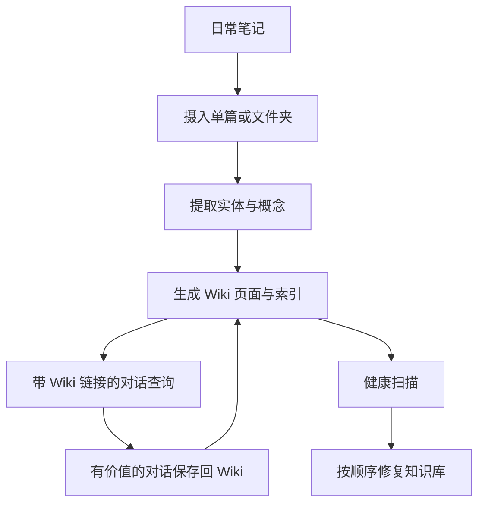

# 笔记越写越多却越来越难找？这个 Obsidian 插件让 AI 替你养 Wiki

记笔记最荒唐的一刻，不是没东西可写，而是明明写过，却死活找不到。

人物、概念、项目和观点散在几百篇文档里。搜索能找到关键词，却很难告诉你两年前的想法和昨天的会议记录到底有什么关系。

于是 Obsidian 用着用着，知识库没有长成第二大脑，先长成了一个装修精致的仓库。

`Karpathy LLM Wiki` 想接管的，就是仓库管理员这份活：读取源笔记，提取实体和概念，自动生成带双向链接的 Wiki 页面，再负责查询、去重、修断链和维护索引。

## 它不是给笔记加个聊天框，而是重新编译一遍知识库

很多“AI 笔记助手”的玩法，是把文档切成碎片，塞进向量库，然后给你一个聊天框。

这个插件走的是 Andrej Karpathy 提出的 LLM Wiki 思路：把笔记当原材料，让 LLM 从中提取人物、组织、产品、事件、理论、方法和术语，再生成结构化页面与链接网络。

它遵循三层分离：

```
sources/     # 📄 你的源文档（只读）
  ↓ ingest
wiki/        # 🧠 LLM 生成的 Wiki 页面
  ↓ query / maintain
schema/      # 📋 Wiki 结构配置（命名规范、页面模板、分类规则）
```

源笔记继续由你写，生成内容放进 `wiki/`，结构规则放进 `schema/`。这就像把原始资料、编译产物和编译配置分开，AI 可以反复整理知识库，却不需要在你的原文上乱动刀。

截至 **2026 年 6 月 6 日**，最新正式版是 **1.16.1**，于 **2026 年 6 月 5 日**发布；最低支持 Obsidian 1.6.6，插件并非仅桌面端，采用 MIT 许可证。

## 双向链接终于不用全靠人肉缝

Obsidian 本来就擅长链接思考，问题是每条链接都要人自己发现、自己补。

Karpathy LLM Wiki 会从笔记中提取实体和概念，为它们生成独立 Wiki 页面，并把来源、相关概念和相关实体串起来。每个生成页面至少带一个别名，别名可以是翻译、缩写或变体名，也会参与跨语言重复检测。

| 它处理的事情 | 放到真实笔记库里意味着什么 |
| --- | --- |
| 提取实体与概念 | 一篇长笔记不再只有标题和标签，里面的人物、方法与产品都能长出页面 |
| 生成双向链接 | 新笔记自动连接到已有知识，不必靠记忆补链接 |
| 多来源知识融合 | 同一概念在不同笔记里的新信息会增量合并 |
| 保留矛盾与归属 | 不会为了“整洁”把冲突观点强行抹平 |
| 保护 `reviewed: true` 页面 | 人工确认过的内容不会被自动覆盖 |
| 保留原文引用 | 来源提及保留原语言，可选翻译，方便追溯 |

重复摄入同一源文件时，实体页和概念页会增量合并新信息，摘要页则重新生成。文件夹批量摄入还会自动跳过已处理文件，避免每次都重新烧一遍 Token。

## Wiki 真正难的不是生成，而是半年后还能不能用

自动生成页面不稀奇，难的是生成几百页以后别变成另一堆垃圾。

这个插件把维护当成核心能力，而不是顺手加的按钮。它能扫描重复页面、断链、空洞页面、孤立页面、缺失别名和矛盾，并提供按因果顺序执行的一键修复：

`补全别名 → 合并重复 → 修复断链 → 链接孤立页 → 扩充空洞页`

这个顺序有讲究。别名没补全，重复检测就容易漏；重复页面没合并，修链接又可能把错误关系继续扩散。先治上游，再处理下游，比一股脑乱修靠谱。

语义重复检测也分层处理：直接名称、跨语言翻译、缩写和高相似标题属于第一层；共享链接和中等相似度等间接信号属于第二层，再根据 Token 预算验证。

最新的 1.16.1 版本还专门修了 Lint 误报：多个页面都指向同一枢纽页，不再轻易被当成重复内容；大小写变体和空格转连字符导致的页面匹配问题也得到了处理。

## 问笔记一个问题，回答会把路标一起带回来

查询 Wiki 时，插件提供类似聊天工具的对话框，支持流式 Markdown 和多轮历史。

但回答不是一段说完就断掉的文字，而会带着 `wiki-links` 指回知识图谱。你可以顺着回答继续打开相关实体、概念和来源页面。

有价值的对话还能保存回 Wiki。保存前会做语义去重，Hash 跟踪也会阻止没有变化的对话被重复评估。

这才是“笔记会聊天”真正有用的地方：回答不是终点，而是重新进入知识库的入口。否则聊天框再聪明，也只是给仓库门口放了个能说会道的保安。

## 装插件很简单，真正要选的是模型和成本

推荐直接从 Obsidian 社区插件市场安装：

1. 打开 `设置 → 第三方插件`。
2. 点击浏览，搜索 `Karpathy LLM Wiki`。
3. 点击安装并启用。

也可以从社区插件网站直接添加，或从 Releases 下载 `main.js`、`manifest.json` 和 `styles.css`，放入新建的 `karpathywiki` 插件目录。

需要参与开发时，先克隆仓库，再依次执行 `pnpm install` 和 `pnpm build`。

启用后，在设置中选择 LLM Provider，填入 API Key，获取或手动填写模型，测试连接后保存。当前支持 Anthropic、Anthropic 兼容接口、Gemini、OpenAI、DeepSeek、Kimi、GLM、OpenRouter、Ollama 和自定义接口。

Ollama 不需要 API Key，也能实现完全本地模式。项目给出的本地模型准备示例是：

```bash
ollama pull qwen3.5:latest
```

### 第一次接入，先拿一个小文件试水

```text
你: 帮我配置 Karpathy LLM Wiki。
    先用一个测试文件验证，不要直接批量处理整个 Vault。

AI: 我会先确认 Provider、模型和连接状态，
    再摄入单个源文件，检查生成页面、别名和双向链接。

你: 通过后再处理文件夹，并把提取粒度设为粗略。

AI: 明白。先小范围验收，再批量执行，
    同时观察 Token 消耗、限流和重复页面情况。
```

## 从一篇笔记开始，比一口吞掉整个 Vault 靠谱

日常使用主要通过命令面板完成：

- `摄入单个源文件`：选择一篇笔记，生成实体、概念和摘要页面。
- `从文件夹摄入`：批量处理文件夹中的笔记。
- `查询 Wiki`：对自己的知识库进行对话式提问。
- `维护 Wiki`：扫描重复页、断链、空洞页、孤立页、缺失别名和矛盾。
- `重新生成索引`：重建带别名信息的 `wiki/index.md`。
- `建议 Schema 更新`：让 LLM 分析内容并建议结构调整。
- `取消当前提取`：在批次边界安全停止，保留已经完成的工作。

左侧边栏的按钮还能直接摄入当前文件。



提取粒度可以选极简、粗略、标准、精细，或自定义 1 到 300 个实体与概念上限。大文件夹适合先用极简或粗略，关键资料再精细提取。别上来就给每篇日记榨出一百个概念，知识图谱还没长好，账单先长成参天大树。

## 它没有押注 RAG，长上下文模型才是关键变量

这个插件遵循 Karpathy 的核心思路：查询时把完整 Wiki 上下文交给 LLM，而不是把知识切碎后只检索局部片段。

好处是模型可以在完整知识图谱上理解跨页面关系；代价也很直接：Wiki 越大，对模型上下文窗口和调用成本的要求越高。

本地模型通常上下文窗口更小，项目建议可以用云端 Provider 负责摄入，再用本地模型负责查询。实际怎么选，取决于知识库规模、隐私要求、调用频率和预算，不能只看模型聪不聪明。

并行页面生成支持 1 到 5 个并发，默认是 3。包含十个以上实体的源文件，项目说明给出的加速幅度为 2 到 3 倍。遇到限流时，应降低并发度或增大批次延迟；单页失败不会拖垮其他页面，失败项会独立重试并指数退避。

## 不想把笔记送出机器，也有一条完整退路

插件没有自己的后端、追踪或数据分析，完全运行在 Obsidian 内部。

除非主动配置 LLM Provider，否则笔记不会离开 Vault。真正发送出去的，是用于摄入或查询的文本，而且只会发往你选择的 Provider。

如果使用 Ollama、LM Studio 或其他本地 Provider，可以让笔记始终留在本机处理。插件需要 Vault 文件权限来读取笔记、生成页面和检查链接；网络权限用于调用所选 LLM API；剪贴板权限只在查询窗口主动点击复制时使用。

这个边界讲得比较清楚，但仍要记住：一旦选择云端 Provider，被摄入和查询的文本就会发送给对应服务商。隐私要求高的 Vault，别只看“数据默认本地”六个字就放心开跑。

## 笔记库已经开始失控的人，会最先感受到差别

- Obsidian 笔记很多，但链接、标签和索引长期靠手工维护的人。
- 想从文章、剪藏、会议记录中自动提取人物、概念和关联的知识管理用户。
- 需要跨中文、英文、缩写和变体名识别重复页面的多语言知识库。
- 想用自然语言查询个人资料，同时保留可点击来源路径的人。
- 已经有旧 Wiki，需要持续检查断链、孤立页、重复页和矛盾的用户。
- 希望通过 Ollama 或其他本地模型掌控隐私边界的人。

## 自动维护不是自动正确，源笔记和生成区必须分清

LLM 能帮忙整理，但不会自动让错误信息变正确。

生成页的内容质量仍然取决于源笔记、模型能力和提取粒度。语义去重、矛盾检测和智能修复也可能需要人工复核；重要页面应使用 `reviewed: true` 保护，别把知识库完全交给自动改写。

自动文件监听、定时 Lint 和启动健康检查默认全部关闭，这是合理的。先理解它会处理哪些目录、消耗多少 Token、如何合并页面，再决定是否打开后台自动维护。

从多个旧版本升级时，虽然当前版本向后兼容，不要求迁移数据，但建议重建索引、运行一次维护扫描，再用 Smart Fix All 清理历史遗留问题。

项目仍在快速迭代。1.16.1 是稳定性和体验热修复，重点解决 Anthropic CORS 回归、Lint 误报、大小写重复页面和模型设置体验，没有引入破坏性变更。


项目地址：<https://github.com/green-dalii/obsidian-llm-wiki>

**真正有用的第二大脑，不只是记得多，而是多年以后仍能把关系找回来。**

#Obsidian #LLMWiki #Karpathy #知识管理 #第二大脑 #知识图谱 #PKM #Ollama #LLM #GitHub #双向链接
