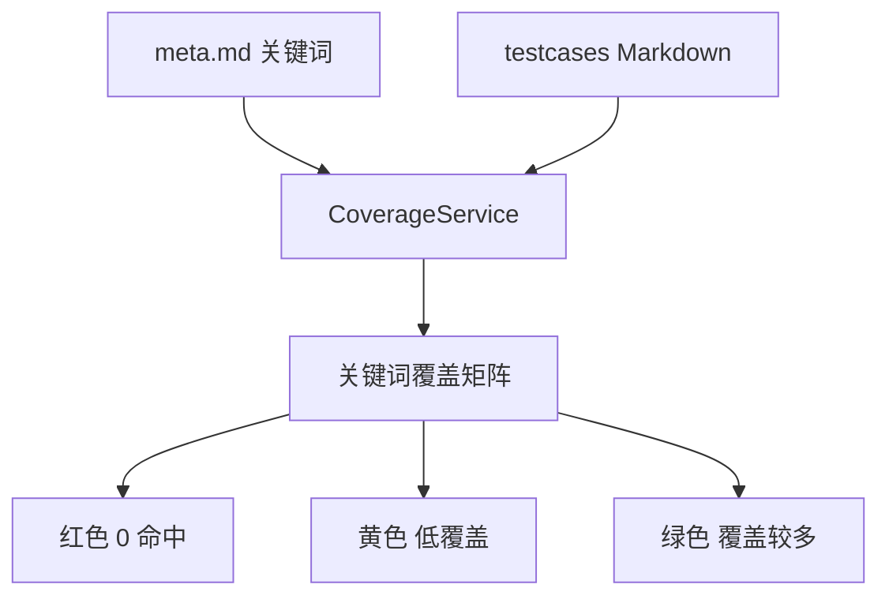
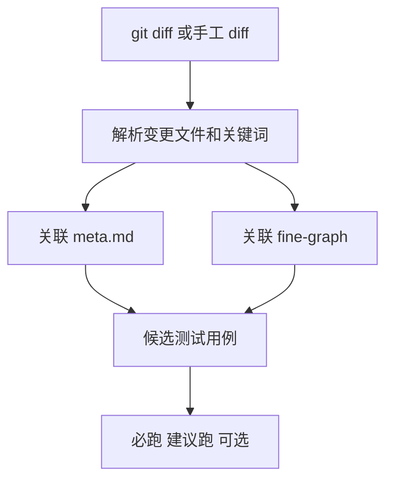
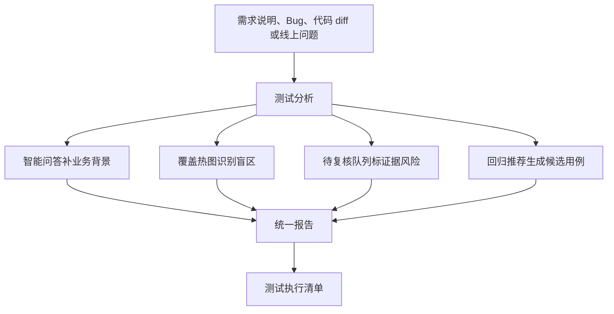

# 我做了三个测试质量小工具，最后发现用户根本不想用工具

前段时间，我在做一个测试质量平台。

有一天，我盯着页面里的三个功能，突然有点懵。

覆盖热图，能看测试盲区。

待复核队列，能看哪些资料和关系不可信。

回归推荐，能根据代码变更推荐要跑的用例。

每一个功能单独拿出来，都能讲出一套非常完整的价值。

甚至你让我当场做汇报，我都能把每个功能讲得头头是道。

但我盯着它们看了半天，脑子里冒出来一个很扎心的问题。

如果我是一个普通测试人员，今天刚拿到一个需求和一段代码 diff，我到底该先点哪个？

。。。

好像哪个都能点。

又好像哪个都不是我真正想要的。

事情是这样的。

做平台的时候，最容易上头的一件事，就是不断加功能。

你做了智能问答，觉得还不够。

那加个覆盖热图吧。

有了覆盖热图，又发现资料本身可能不可信。

那加个待复核队列吧。

代码变了以后该回归什么，用户肯定也想知道。

那再加个回归推荐吧。

听起来每一步都很合理。

而且说真的，这三个工具本身也确实都挺实用。

| 工具 | 它回答的问题 | 核心数据来源 |
|---|---|---|
| 覆盖热图 | 哪些业务关键词没有测试用例覆盖 | meta.md 和 testcases |
| 待复核队列 | 哪些资料、关系、lint 告警不可信 | graphify、04-wiki、wiki-lint |
| 回归推荐 | 这次代码变更应该回归哪些用例 | git diff、meta.md、fine-graph |

覆盖热图看的是盲区。

待复核队列看的是可信度。

回归推荐看的是本次变更。

三件事单独拆开都成立。

但功能有价值，不等于用户会觉得它有用。

因为用户不是为了使用功能而来的。

用户是为了完成今天这一次测试判断而来的。

这个区别看着只差几个字，实际差得非常远。

站在平台建设者的视角，我很容易把系统理解成一间装备齐全的工具房。墙上挂着锤子、扳手、电钻，每一件工具都有自己的用途，摆得也很整齐。

但用户推门进来，不是为了欣赏工具。

他手里拿着的是一个具体问题。

今天这个版本，到底该怎么测？

所以当三个工具平铺在菜单里时，普通测试人员很可能会直接懵掉。

我今天拿到一个需求和一段 diff，我到底先点哪个？

看完覆盖热图以后，我下一步干什么？

待复核队列里一堆问题，哪些和本次提测有关？

回归推荐出来以后，怎么变成最终执行清单？

这些问题如果没有答案，工具就会永远停留在「看起来有用」。

先聊覆盖热图。

它的逻辑其实很直接。

从 meta.md 里提取业务模块、功能关键词、页面关键词、接口关键词、Bug 关键词和风险关键词，再去测试用例目录里匹配。

命中多的显示绿色，命中少的显示黄色，完全没命中的显示红色。

这个东西很适合做测试资产治理。

你能一眼看到某个核心页面没有用例，某个风险关键词没有任何历史覆盖。以前这些盲区藏在一堆 Markdown 和测试用例里，谁也说不清楚。现在一张图摊开，红的地方全露出来了。

这种感觉其实挺爽的。

但我后来发现，爽完以后，问题才刚开始。

红色不一定代表这次必须补。

绿色也不一定代表这次就安全。

一个多年没有改动的边缘页面，可能一片通红，但和本次需求毫无关系。一个核心支付流程可能已经有很多用例，看起来绿油油的，可这次改动碰到的是过去从没出现过的资金边界。

颜色能告诉你哪里薄弱，却不能替你决定今天把时间花在哪里。

覆盖热图回答的是「我们的测试资产哪里比较虚」。

测试人员今天真正要回答的是「这次提测，哪里最可能出事」。

不是一个问题。

所以覆盖热图应该进入测试分析里的覆盖风险部分，成为判断的一块证据，而不是孤零零地当一个主入口。

说到证据，就绕不开待复核队列。

待复核队列聚合的是那些不太可信的东西。

比如 AMBIGUOUS 边、INFERRED 边抽样、待验证段落、lint 告警。

| 来源 | 典型问题 | 处理方式 |
|---|---|---|
| AMBIGUOUS 边 | 图谱关系不确定 | 高优先级人工确认 |
| INFERRED 边 | 系统推断关系 | 可用于召回，不能做阻塞依据 |
| 待验证段落 | 文档作者留下疑点 | 中优先级补充资料 |
| lint 告警 | 断链、孤立、缺来源 | 修复后重新编译或构图 |

这个队列其实很重要。

当平台开始用 graphify、04-wiki 和 wiki-lint 把资料、关系和测试资产连起来以后，系统肯定会遇到一类问题，有些连接是明确事实，有些连接只是机器推断，还有些资料自己就缺来源。

如果把它们全当成同样可靠的证据，平台给出的结论看起来越确定，风险反而越大。

所以待复核队列是在告诉你，哪些资料不能直接拿来做强结论。

可问题又来了。

如果直接把这整条队列丢给普通测试人员，它很容易从一个质量保障能力，变成一份额外负担。

你想想看。

用户本来只是想知道这个版本怎么测，结果平台让他先处理一堆资料治理问题。

这里有断链，那里有孤立节点，这条边是 AMBIGUOUS，那条边是 INFERRED。

测试人员看完可能只想问一句。

不是哥们，所以我今天到底测什么？

这就有点跑偏了。

更合理的方式，是在提测报告里把和本次变更相关的待复核项摘出来。

不用让用户治理整个知识库，只要明确告诉他，本次结论里有哪些证据不够硬，哪些关系来自系统推断，哪些地方需要人工确认。

这样，待复核队列才是在服务判断，而不是制造任务。

然后是三个工具里，最接近用户价值的回归推荐。

它直接回答了一个非常现实的问题。

这次代码改了，我该回归什么？

它的链路大概是这样。

这件事非常贴近测试日常。

git diff 或手工 diff 进来以后，系统解析变更文件和关键词，再关联 meta.md 和 fine-graph，找到候选测试用例，最后分成必跑、建议跑和可选。

做到这里的时候，很容易产生一种错觉。

这不就已经是答案了吗？

我一开始也这么觉得。

但回归推荐依然有自己的边界。

它推荐出来的只是候选范围。

它不能替代需求理解，也不能替代风险判断，更不能替代最终执行清单。

一段代码 diff 能告诉你哪里发生了变化，却不一定能告诉你为什么改。一个文件被修改了，也不代表所有被关联到的用例都值得在本次执行。更麻烦的是，有些风险根本不在直接修改的文件里，而在业务链路、历史 Bug 或上下游依赖里。

如果回归推荐不接入需求说明、历史 Bug、覆盖热图和待复核项，它就很容易变成「根据 diff 猜几个用例」。

有用。

但还不够。

到这里，我才慢慢意识到，我之前一直在用功能视角设计平台。

覆盖热图很有用，所以给它一个页面。

待复核队列很有用，所以再给它一个页面。

回归推荐很有用，所以把它放到更醒目的位置。

每做出一个能力，就想给它一块属于自己的招牌。

这个做法对展示平台能力非常友好。

这里一个图谱，那里一个热图，这边一个队列，那边一个报告。汇报的时候一页一页翻过去，功能很多，截图也很好看。

我非常理解这种冲动。

因为平台建设者需要证明自己做了什么，功能是最容易被看见的产物。

但用户不一定买账。

用户会问一个特别朴素的问题。

我今天怎么用？

如果回答不上来，功能再多都显得散。

后来我更认可的形态，是把三个工具放回同一个测试分析流程里。

需求说明、Bug、代码 diff 或线上问题，是整个流程的起点。

智能问答负责补业务背景。

覆盖热图负责识别盲区。

待复核队列负责标出证据风险。

回归推荐负责生成候选用例。

最后把这些东西收进一份统一报告，再生成测试执行清单。

它们不应该平行存在。

它们应该被编排。

覆盖热图不再要求用户专门进去看一遍，而是变成报告里的覆盖风险。

待复核队列不再把整座知识库的历史问题扔给用户，而是变成报告里的证据可信度提示。

回归推荐也不再假装自己能直接给出最终答案，而是老老实实成为测试清单的候选来源。

最后用户看到的不是三个工具。

而是一份测试判断。

这才是产品化。

我有时候觉得，做平台和开餐厅有一点像。

厨师当然要关心刀、锅、烤箱和食材管理，每一样都重要。可客人坐下来以后，真正想要的是一顿完整的饭，而不是服务员把三把刀、一口锅和一筐菜依次摆到桌上，再让他自己决定怎么做。

工具属于后台。

判断才应该走到前台。

这也是为什么我后来建议，把平台定位从「LLM-Wiki-Code 查询平台」收敛成「测试判断、风险分析与执行清单生成平台」。

不是因为底层能力不重要。

恰恰是因为底层能力太多了，必须有一个主流程把它们管起来。

否则智能问答会变成一个聊天入口，覆盖热图会变成一张偶尔被打开的图，待复核队列会变成没人愿意清的债务清单，回归推荐会变成一批看着挺合理、但不知道该不该执行的用例。

每个功能都做对了。

整个产品却没有真正成立。

这才是最容易让平台建设者难受的地方。

回到最开始那个问题。

如果我是一个普通测试人员，今天刚拿到一个需求和一段代码 diff，我到底该先点哪个？

现在我的答案是，他不应该先点覆盖热图，也不应该先点待复核队列，更不应该先研究回归推荐。

他只需要把这次提测的材料交给平台。

然后平台告诉他，风险在哪里，必须测什么，哪些证据不可靠，最后清单怎么执行。

覆盖热图、待复核队列、回归推荐，都是好工具。

但它们不能单独成为产品答案。

工具是零件。

测试判断和质量决策才是整机。

我自己也还在继续把这个流程往下做，很多地方肯定不成熟。但这次转向让我越来越确定一件事。

做平台，不是把能力一个个摆出来。

而是把能力藏到用户真正要完成的那件事里。

从一堆工具，到一个工作台。

从三个看起来有用的功能，到一张真的能拿去执行的测试决策单。

这大概才是这三个小工具，最后应该一起去的地方。
