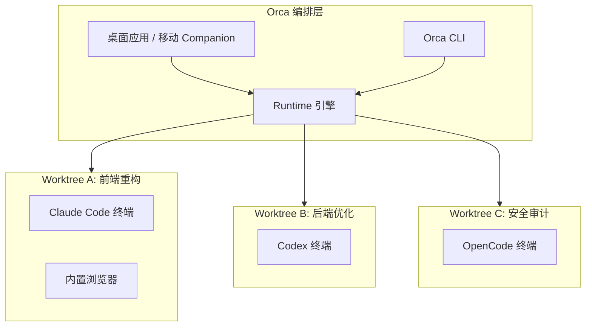

# Orca：一个让 Claude Code 和 Codex 同时干活的 AI 编排器，面向 100 x 构建者的 AI 编排器深度解析

## 1. 背景

2025~2026 年，CLI 编码 Agent 大爆发：Claude Code、Codex、OpenCode、Cursor CLI、Gemini CLI、Hermes Agent……几乎每周都有新选手入场。问题也随之而来——**每个 Agent 各有所长，但切换成本极高**。你不想在五个终端窗口之间来回切，更不想手工管理 git worktree、对比不同 Agent 产出的 diff。

Orca 就是为解决这个场景诞生的。

## 2. 目标 / 问题定义

Orca（[github.com/stablyai/orca](https://github.com/stablyai/orca)）是一个**开源 AI 编排器**，核心理念一句话：**让多个 CLI Agent 在隔离的 git worktree 里并行工作，统一跟踪、对比、合并**。

它不是一个 Agent 本身，而是 Agent 的"总控台"——类似于一个 AI 时代的 IDE 工作区管理器。

## 3. 核心架构

Orca 的核心抽象是 **Worktree**。每个 Worktree 是一个独立的 git 工作副本，有自己的一组终端、浏览器标签页、自动化任务。Agent 在 Worktree 内运行，互不干扰。



## 4. 核心能力拆解

### 4.1 并行 Worktree

一个 prompt 同时分发给多个 Agent，每个在独立 git worktree 中运行，互不干扰。跑完之后并排对比结果，挑最优方案合并。

这在以下场景特别实用：
- 同一个需求让 Claude Code 和 Codex 各写一版，对比质量
- 大重构时拆成多个子任务并行推进
- A/B 测试不同 prompt 策略的效果

### 4.2 终端分屏

基于 WebGL 渲染的终端，支持无限分屏，重启后滚动历史保留。不是简单的 xterm 封装，更像是 Ghostty 级别的终端体验直接嵌进了编排器里。

### 4.3 设计模式（Design Mode）

在 Orca 内置的 Chromium 窗口中点击任意 UI 元素，自动提取 HTML、CSS 和裁剪好的截图，直接注入到 Agent 的 prompt 中。前端调样式、Debug 布局时，比手动复制粘贴高效一个数量级。

### 4.4 GitHub & Linear 原生集成

在应用内浏览 PR、Issue 和项目看板。从任意任务直接打开 worktree，不用切上下文就能完成评审。核心价值是**减少 context switch**。

### 4.5 SSH Worktree

Agent 跑在远程高性能机器上，完整支持文件编辑、git 和终端操作。自带自动重连和端口转发。适合需要大算力或特定环境的场景。

### 4.6 标注 AI Diff

在任意 diff 行上添加评论并发回给 Agent 迭代修改。评审→编辑→提交，全流程不离开 Orca。

### 4.7 Orca CLI

Agent 也可以驱动 Orca 本身。`orca worktree create`、`snapshot`、`click`、`fill` 等命令，让整个工作流可脚本化，适合 CI/CD 或 automated agent pipeline。

### 4.8 移动 Companion 应用

iOS（App Store）和 Android（APK 直装）都有配套应用。手机端监控 Agent 进度、收到完成通知后发送后续指令。不是玩具，是真正能用的远程指挥台。

### 4.9 其他值得关注的能力

| 能力 | 说明 |
|------|------|
| 快速打开 | 在 worktree、文件、Agent、命令和仓库上下文之间搜索，不打断心流 |
| 账号切换与用量追踪 | 查看 Claude/Codex 用量和限额重置时间，无需重新登录即可热切换账号 |
| Computer Use | Agent 直接操作桌面应用和可见 UI |
| 通知与未读状态 | Agent 完成时即时通知，可标记会话为未读稍后处理 |
| 文件拖拽 | 把文件或图片直接拖入 Agent 提示 |

## 5. 支持的 Agent 矩阵

Orca 适配**任何能在终端里运行的 CLI Agent**。官方文档列出了 26+ 个确认兼容的 Agent：

**主流选手：**

| Agent | 说明 |
|-------|------|
| Claude Code | Anthropic 官方 CLI 编码助手 |
| Codex | OpenAI 官方 CLI Agent |
| OpenCode | 开源 CLI 编码 Agent |
| Cursor CLI | Cursor 编辑器配套 CLI |
| GitHub Copilot | GitHub 官方 CLI |
| Hermes Agent | Nous Research 的 Agent 框架 |
| Grok | xAI 的 CLI |

**还有更多：** Amp、OpenClaude、Antigravity、Pi、oh-my-pi、Goose、Auggie、Autohand Code、Charm、Cline、Codebuff、Command Code、Continue、Droid、Kilocode、Kimi、Kiro、Mistral Vibe、Qwen Code、Rovo Dev……

以及**任何自定义 CLI Agent**。

## 6. 安装与上手

### 桌面端

```bash
# macOS (Homebrew)
brew install --cask stablyai/orca/orca

# Arch Linux (AUR)
yay -S stably-orca-bin
```

也可以从 [onorca.dev/download](https://onorca.dev/download) 直接下载安装包：
- macOS Apple Silicon / Intel
- Windows (.exe)
- Linux AppImage

### 移动端

- **iOS**: [App Store](https://apps.apple.com/us/app/orca-ide/id6766130217)
- **Android**: [直接下载 APK](https://github.com/stablyai/orca/releases/download/mobile-android-v0.0.15/app-release.apk)

### CLI 基本用法

安装后先确认状态：

```bash
command -v orca
orca status --json
```

创建工作区并启动 Agent：

```bash
# 创建 worktree 并自动启动 Claude Code
orca worktree create --name "重构用户模块" --agent claude --prompt "重构 user module，提取公共逻辑" --json

# 在当前 worktree 中新开一个 Codex 终端
orca terminal create --worktree active --command "codex" --json

# 分屏跑测试
orca terminal split --direction horizontal --command "npm test" --json
```

终端操作常用命令：

```bash
# 读取终端输出
orca terminal read --terminal <handle> --json

# 发送指令
orca terminal send --terminal <handle> --text "继续" --enter --json

# 等待 Agent 完成
orca terminal wait --terminal <handle> --for tui-idle --timeout-ms 300000 --json
```

## 7. 实际工作流示例

假设一个典型场景：重构一个模块，想对比 Claude Code 和 Codex 的实现方案。

```bash
# 1. 确认 Orca 运行状态
orca status --json

# 2. 列出已有仓库
orca repo list --json

# 3. 创建两个并行 worktree，分别跑不同 Agent
orca worktree create --repo id:<repoId> --name "refactor-claude" --agent claude \
  --prompt "重构 user service，提取公共校验逻辑，保持接口兼容" --json

orca worktree create --repo id:<repoId> --name "refactor-codex" --agent codex \
  --prompt "重构 user service，提取公共校验逻辑，保持接口兼容" --json

# 4. 查看两个 worktree 状态
orca worktree ps --json

# 5. 用内置浏览器打开本地服务验证
orca goto --url http://localhost:3000 --json
orca snapshot --json
```

两个 Agent 独立跑完后，可以在 Orca 的 diff 视图中并排对比，挑选更优的实现合并到主分支。

## 8. 技术架构要点

| 维度 | 实现 |
|------|------|
| 许可证 | MIT（完全开源） |
| 平台 | macOS / Windows / Linux |
| 运行时 | 本地进程，非云端 |
| Agent 隔离 | 基于 git worktree，进程级隔离 |
| 终端引擎 | WebGL 渲染，支持分屏和历史持久化 |
| 浏览器 | 内嵌 Chromium，支持 Design Mode |
| 远程支持 | SSH Worktree + 自动重连 + 端口转发 |
| 自动化 | 内置 cron 式调度（Automations），支持 RRULE |

## 9. 风险点与注意事项

1. **不是 Agent 本身，而是编排器**——Orca 不提供 AI 能力，你得自己配好 Claude Code / Codex 等 Agent 的 API Key。
2. **资源消耗**——多个 Agent 并行跑，内存和 CPU 压力不小。尤其是浏览器 + 终端分屏同时开的时候。
3. **CLI 稳定性**——Orca 更新非常频繁（官方自称"每天发布新功能"），CLI 接口可能有 breaking change，生产环境依赖 CLI 脚本时建议锁定版本。
4. **移动端 Android 版本**——目前通过 APK 分发，不走 Google Play，更新需要手动下载。
5. **隐私**——Orca 收集匿名使用数据，可在设置中退出（详见[隐私与遥测文档](https://www.onorca.dev/docs/telemetry)）。

## 10. 适合谁

- 同时使用多个 CLI Agent、需要在它们之间快速切换的开发者
- 想对比不同 Agent 产出质量的团队
- 有"把 Agent 编码流程 CI/CD 化"需求的人
- 需要在手机端远程监控 Agent 进度的场景
- 重视 git 历史整洁性、不想 Agent 把主分支搞乱的开发者（worktree 天然隔离）

不太适合：
- 只用一个 Agent、且没有并行需求的开发者——直接在那个 Agent 的终端里跑就够了
- 资源受限的机器——多 Agent 并行对机器有一定要求

## 11. 结论

Orca 不是又一个 AI 编码工具，而是**AI 编码工具的管理层**。当你的工作流里 Agent 不止一个、任务不止一条线时，它的价值就会迅速体现。开源 + MIT 许可 + 快速迭代，值得放进工具箱。

---
https://github.com/stablyai/orca


`#Orca` `#AIAgent` `#ClaudeCode` `#Codex` `#DeveloperTools` `#Worktree` `#多Agent编排` `#开源工具` `#AI编码` `#工程效率`
