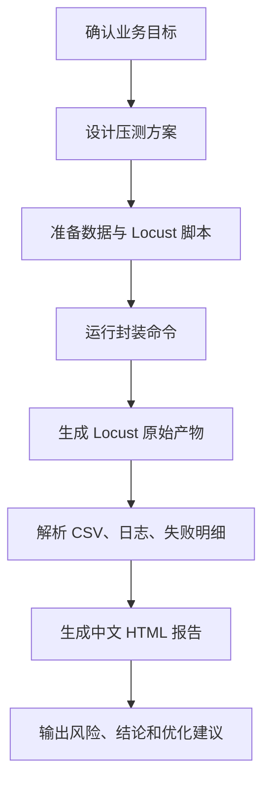
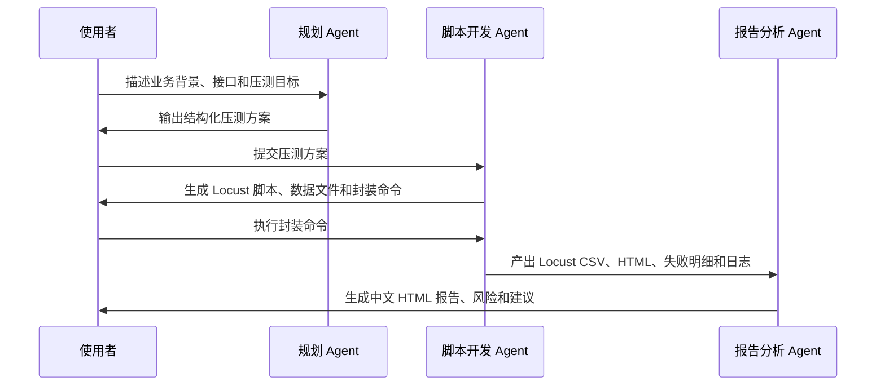

# 从 Locust 脚本到 AI 分析报告：一套可落地的 AI-Locust 性能测试框架

最近赶上一个技术改造项目，上线前需要对多个业务核心接口进行压力测试。回过头看，以往的压测工作大多是项目驱动型：需求来了就做，项目结束也就结束，没有形成完整的知识沉淀。正好借着这次机会，加上 AI 在代码生成、脚本优化、数据分析等方面的辅助能力，准备把整个压测流程重新梳理一遍，将通用能力抽离出来，沉淀成一套可复用的压测方案，包括脚本模板、监控方案、断言规范、结果分析、报告生成等内容，让以后再做压测时，不必每次都从零开始。

很多团队做性能测试时，工具并不缺。Locust、JMeter、wrk 都能把请求打出去，真正麻烦的是另一件事：每次压测都要重新整理脚本、测试数据、执行命令、原始 CSV、失败明细、截图、结论和汇报材料。

这套 AI-Locust 性能测试框架解决的不是“怎么发起一次请求”，而是把一次性能测试从方案设计、脚本开发、数据管理、执行记录到中文分析报告沉淀成可复用流程。它基于 Python + Locust，保留 Locust 原生能力，同时把复杂命令、报告整理和 LLM 辅助总结封装到项目内。

## 一、框架定位

AI-Locust 不是一个替代 Locust 的新工具，而是一层面向测试工程落地的组织方式。

它希望回答三个问题：

| 问题        | 框架处理方式                                                     |
| --------- | ---------------------------------------------------------- |
| 压测脚本放哪里   | 统一放在 `locustfiles/`，按业务域和测试类型命名                            |
| 测试数据怎么管理  | 统一放在 `data/`，<br>脚本只描述行为，不写死大段数据                           |
| 结果怎么交付    | 原始 Locust 产物进入 `reports/raw/`，<br>二次中文报告进入 `reports/html/` |
| 重跑会不会覆盖历史 | 每次执行自动创建时间戳目录，已存在时自动追加序号                                   |
| 结论怎么写     | 解析 Locust CSV、失败明细和日志，再结合 LLM 辅助生成中文分析                     |

当前项目已经内置了图片 URL 压力测试、业务接口基准测试、通用中文 HTML 报告生成器、日志工具和三类 Agent 职责说明。

## 二、整体流程

一次标准性能测试可以拆成六步：



- [ ] 框架中也对应拆了三类角色：

| 角色         | 关注点                           | 输出                       |
| ---------- | ----------------------------- | ------------------------ |
| 规划 Agent   | 业务背景、接口范围、测试类型、并发模型、指标口径、退出条件 | 压测方案                     |
| 脚本开发 Agent | Locust 脚本、测试数据、参数、日志和断言       | `locustfiles/` 与 `data/` |
| 报告分析 Agent | Locust CSV、失败明细、请求日志、LLM 辅助分析 | `reports/html/` 中文报告     |

这种拆法的好处是：压测不再只是“跑一下”，而是从一开始就面向可复盘、可对比、可交付。

## 三、三类 Agent 怎么用

在实际使用中，可以把三类 Agent 当作一次压测的三个工作台：先让规划 Agent 把问题问清楚，再让脚本开发 Agent 产出可执行脚本，最后让报告分析 Agent 基于真实产物写结论。

### 1. 规划 Agent：先把压测方案定清楚

规划 Agent 不直接写脚本，它负责把业务背景、接口信息、测试类型、并发模型、指标口径和退出条件问完整。适合在需求刚开始时使用。

可以这样给它任务：

```text
请作为规划 Agent，帮我设计某个业务接口的基准压测方案。

业务背景：核心业务链路上线前摸底。
接口：POST /api/example/resource
环境：https://test.example.com
目标：确认 50 并发下接口是否稳定。
已知数据：请求头和 body 后续放到 data/business_api_baseline.json。
希望报告关注：失败率、平均响应、P95、P99、吞吐量和业务成功率。
```

它应该输出类似这样的结构化方案：

```yaml
scenario:
  name: business_api
  background: 核心业务链路上线前性能基线摸底
  target_api:
    method: POST
    host: https://test.example.com
    path: /api/example/resource
  test_type: baseline
  load_model:
    users: 50
    spawn_rate: 5
    run_time: 5m
  data_requirements:
    file: data/business_api_baseline.json
    sensitive_fields: 认证头、账号标识等字段需要脱敏
  metrics:
    - failure_rate
    - average_response_time
    - p95
    - p99
    - requests_per_second
    - business_success_rate
  thresholds:
    failure_rate: <= 1%
    p95: <= 3000 ms
  deliverables:
    - Locust 原始报告
    - 失败明细 JSONL
    - 中文 HTML 分析报告
```

这个输出就是后面开发脚本和生成报告的“任务单”。

### 2. 脚本开发 Agent：把方案变成可执行资产

脚本开发 Agent 接收规划 Agent 的方案，负责生成 Locust 脚本、数据模板、运行入口和必要日志。它不应该把请求数据写死进脚本，也不应该伪造未确认的真实参数。

可以这样给它任务：

```text
请作为脚本开发 Agent，根据上面的 business_api 基准压测方案实现脚本。

要求：
1. Locust 脚本放到 locustfiles/。
2. 请求头和 body 从 data/business_api_baseline.json 读取。
3. task 中固定请求名为 POST business_api。
4. HTTP 200 之外算失败；HTTP 200 但响应中的业务状态不符合预期也算失败。
5. 失败明细写入 reports/raw/business_api/<timestamp>/failure_details.jsonl。
6. 用户执行时只需要传 --users、--spawn-rate、--run-time。
```

它最终应该交付这类文件和入口：

```text
locustfiles/locust_business_api_baseline.py
data/business_api_baseline.json
tools/run_business_api_baseline.py
reports/raw/business_api/<timestamp>/failure_details.jsonl
```

使用者只需要运行封装命令：

```bash
uv run python -m tools.run_business_api_baseline \
  --users 50 \
  --spawn-rate 5 \
  --run-time 5m
```

这里的重点是：脚本开发 Agent 交付的是可复用资产，而不是一条临时命令。

### 3. 报告分析 Agent：基于真实产物写结论

报告分析 Agent 在压测执行完成后使用。它读取 `reports/raw/` 下的 Locust CSV、失败明细、异常文件和执行上下文，生成能给研发、测试、服务负责人阅读的中文报告。

可以这样给它任务：

```text
请作为报告分析 Agent，分析这次 business_api 基准压测结果。

原始产物目录：
reports/raw/business_api/20260624_170021/

请读取：
1. stats_stats.csv
2. stats_failures.csv
3. stats_exceptions.csv
4. failure_details.jsonl

输出：
1. reports/html/business_api_baseline_<timestamp>.html
2. 报告包含测试概要、方案、指标汇总、失败分析、结论和建议。
3. 可以调用 LLM 辅助归纳，但结论必须以 Locust CSV 和失败明细为依据。
```

报告中应该明确回答：

| 问题 | 报告应给出的答案 |
| --- | --- |
| 本次压测是否通过 | 根据失败率和 P95 阈值给出通过、需关注或需修复 |
| 慢在哪里 | 按接口 P95、P99、最大响应定位慢接口 |
| 失败是什么 | 汇总 HTTP 失败、业务失败、异常堆栈和失败明细 |
| 下一步做什么 | 给出研发排查、服务监控、缓存或容量策略建议 |

这样三类 Agent 串起来以后，一次压测就形成了清晰链路：



## 四、目录结构

项目目录按性能测试生命周期拆分：

```text
test-locust-platform/
├── agents/          # 规划、脚本开发、报告分析 Agent 职责
├── config/          # 环境配置、压测参数、AI 客户端
├── data/            # 测试数据
├── docs/            # 流程、报告设计和说明文档
├── locustfiles/     # Locust 压测脚本
├── logs/            # 框架日志、请求明细日志
├── reports/
│   ├── raw/         # Locust 原始 CSV、HTML、失败明细
│   ├── html/        # 二次分析后的中文 HTML 报告
│   └── analysis/    # Markdown/JSON 中间分析产物
└── tools/           # 执行封装、命名、日志、报告生成工具
```

这里最关键的一点是分层边界清楚。脚本、数据、日志、原始报告和最终报告各放各的位置，后续排查问题时不用在项目里翻半天。

## 五、快速使用步骤

### 第一步：安装依赖

```bash
uv sync --extra dev
```

框架使用 `uv` 管理 Python 依赖，Locust、测试工具和报告生成依赖都由项目统一维护。

### 第二步：选择压测场景

当前框架内置两个常用入口。

图片 URL 压力测试：

```bash
uv run python -m tools.run_image_url_stress \
  --users 100 \
  --spawn-rate 5 \
  --url-limit 2000
```

业务接口基准测试：

```bash
uv run python -m tools.run_business_api_baseline \
  --users 10 \
  --spawn-rate 2 \
  --run-time 1m
```

这两个命令都只暴露必要参数。用户不需要手动创建目录、拼时间戳、指定 CSV 路径、再单独跑报告生成器。

### 第三步：查看执行产物

以图片 URL 压测为例，执行完成后会生成：

```text
reports/raw/image_url/<timestamp>/
├── report.html
├── stats_stats.csv
├── stats_failures.csv
├── stats_exceptions.csv
├── stats_stats_history.csv
├── failure_details.jsonl
└── image_url_summary.json

logs/image_url_requests_<timestamp>.jsonl
reports/html/image_url_stress_<timestamp>.html
```

其中：

| 文件 | 用途 |
| --- | --- |
| `stats_stats.csv` | Locust 接口统计，是报告核心指标来源 |
| `stats_failures.csv` | 失败类型和失败次数 |
| `stats_stats_history.csv` | 压测过程中的趋势数据 |
| `failure_details.jsonl` | 框架补充记录的失败明细 |
| `image_url_summary.json` | 图片场景的辅助统计 |
| `logs/image_url_requests_*.jsonl` | 全量请求日志，便于复核请求头、响应头、状态码和耗时 |
| `reports/html/*.html` | 最终中文分析报告 |

### 第四步：阅读中文报告

框架生成的中文报告不是简单转存 Locust 表格，而是按技术汇报习惯组织：

| 模块 | 内容 |
| --- | --- |
| 测试概要 | 场景、类型、环境、执行人、生成时间、总体结论 |
| 方案设计 | 为什么压测、怎么压、成功标准是什么 |
| 参数设置 | 并发用户数、启动速率、持续时间、数据文件 |
| 被测接口 | 方法、Host、Path、成功判定 |
| 指标说明 | 总请求数、失败率、平均响应、P95、P99、吞吐量 |
| Locust 汇总 | 接口级请求数、失败数、响应时间、RPS |
| 失败分析 | 失败类型、失败明细、异常摘要 |
| 结论建议 | 是否通过、风险点、优化建议、后续动作 |

报告默认会调用 `config/ai_apiclient.py` 做 LLM 辅助总结。如果网络或网关不可用，可以加参数跳过：

```bash
uv run python -m tools.run_image_url_stress \
  --users 100 \
  --spawn-rate 5 \
  --url-limit 2000 \
  --no-llm-analysis
```

## 六、两个内置场景

### 1. 图片 URL 压力测试

图片 URL 场景用于批量验证图片资源在并发访问下的响应、读取和失败情况。

它的特点是：

- URL 从 `data/` 下的文本文件读取。
- 每条 URL 默认只访问一次，覆盖完成后自动停止。
- 支持限制 URL 数量，例如 `--url-limit 2000`。
- 支持记录全量请求日志。
- 支持统计指定响应头或业务标识的出现次数。
- 支持输出图片辅助统计和失败明细。

典型命令：

```bash
uv run python -m tools.run_image_url_stress \
  --users 100 \
  --spawn-rate 5 \
  --url-file data/example_urls.txt \
  --url-limit 2000 \
  --transport requests \
  --read-mode first_chunk
```

适合用来做图片资源、CDN、文件读取链路、缓存效果和长尾响应风险分析。

### 2. 业务接口基准测试

业务接口场景用于核心链路单接口的基准压测。

它的特点是：

- 请求头和 body 从 `data/business_api_baseline.json` 读取。
- Locust 脚本使用固定请求名 `POST business_api`，报告行更稳定。
- 即使 HTTP 返回 200，也会继续校验业务字段。
- 当响应中的业务状态不符合预期时，按业务失败记录。
- 失败明细写入 `failure_details.jsonl`。
- 默认生成中文 HTML 报告，并启用 LLM 辅助分析。

典型命令：

```bash
uv run python -m tools.run_business_api_baseline \
  --users 50 \
  --spawn-rate 5 \
  --run-time 5m
```

如果需要临时切换环境或接口路径，只覆盖必要参数：

```bash
uv run python -m tools.run_business_api_baseline \
  --users 50 \
  --spawn-rate 5 \
  --run-time 5m \
  --host https://test.example.com \
  --path /api/example/resource \
  --data-file data/business_api_baseline.json
```

## 七、框架亮点

### 1. 命令短，产物全

传统 Locust 命令往往要手动拼很多参数：

```bash
uv run locust -f locustfiles/xxx.py \
  --headless -u 100 -r 5 -t 5m \
  --csv reports/raw/xxx/<timestamp>/stats \
  --html reports/raw/xxx/<timestamp>/report.html
```

框架把这些封装到 `tools/`，用户只需要关心并发数、启动速率、运行时长、数据文件这些真正影响压测方案的参数。

### 2. 不覆盖历史，天然可复盘

每次执行都会生成新的时间戳目录：

```text
reports/raw/<scenario>/<YYYYMMDD_HHMMSS>/
reports/html/<scenario>_<test_type>_<YYYYMMDD_HHMMSS>.html
```

如果路径已存在，会自动追加 `_01`、`_02` 这样的序号。历史报告不会被重跑覆盖，后续做问题复盘和版本对比更稳。

### 3. 数据和脚本分离

Locust 脚本只描述用户行为和校验逻辑，测试数据放在 `data/`。这样做有三个好处：

- 换数据不需要改脚本。
- 数据来源更容易审计。
- 避免 token、cookie、账号密码等敏感信息被写死到脚本里。

### 4. 报告面向决策，而不是堆指标

报告保留 Locust 原生指标，但不会把所有指标无差别堆给读者。基准测试重点看总请求数、失败率、平均响应、P95、P99、吞吐量和最大响应；负载/压力测试重点看失败率、吞吐量、最高 P95、最高 P99、最大响应和最慢接口。

默认判定逻辑也很直接：

| 条件 | 结论 |
| --- | --- |
| 失败率大于 1% | 需修复 |
| 失败率不超过 1%，但最高 P95 大于 3000 ms | 需关注 |
| 失败率不超过 1%，且最高 P95 不超过 3000 ms | 通过 |

正式项目中，这些阈值可以在方案阶段按业务口径确认。

### 5. LLM 辅助分析，但不替代原始证据

框架可以调用 `config/ai_apiclient.py` 生成辅助总结，但报告不会只依赖模型结论。Locust CSV、失败明细 JSONL、请求日志仍然是事实来源。

这点很重要：AI 适合帮我们组织语言、归纳风险和生成建议，但性能结论必须落回真实指标。

## 八、适合哪些场景

| 场景 | 适配度 | 说明 |
| --- | --- | --- |
| 单接口上线前摸底 | 高 | 用基准测试建立初始性能基线 |
| 核心链路并发验证 | 高 | 用负载测试观察目标并发下是否稳定 |
| 缓存前后效果对比 | 高 | 通过历史基线 CSV 做对比 |
| 图片、文件、CDN 链路压测 | 高 | 已有图片 URL 场景和请求明细日志 |
| 长时间稳定性测试 | 中 | Locust 支持，需补充资源监控和更长运行策略 |
| 容量规划和瓶颈定位 | 中 | 客户端指标已具备，服务端 CPU、内存、APM 需要额外接入 |

## 九、从一次压测到一套资产

这套 AI-Locust 框架最有价值的地方，不是让某一次压测快一点，而是让每一次压测都留下可复用资产：

- 本次为什么压测。
- 压了哪些接口。
- 使用了什么数据。
- 并发模型是什么。
- 原始指标在哪里。
- 失败明细在哪里。
- 中文报告在哪里。
- 结论和风险是什么。
- 下次如何复用或对比。

当这些内容被固定到项目结构和工具入口里，性能测试就不再依赖某个人临时整理，也不再是一次性的“跑数”。它会变成团队可以持续复用的工程能力。

## 结语

Locust 负责把请求打出去，AI-Locust 框架负责把压测做完整。

它把性能测试中最容易散落的部分收拢起来：脚本、数据、命令、日志、原始报告、中文分析和结论建议。对测试团队来说，这意味着更少的重复操作；对研发和负责人来说，这意味着更容易读懂的风险判断；对整个项目来说，这意味着性能测试结果能被沉淀、对比和复盘。

如果你的团队已经在使用 Locust，但每次压测之后仍然要手动整理一堆 CSV、截图和结论，那么这类框架化封装会是一个很实用的下一步。
