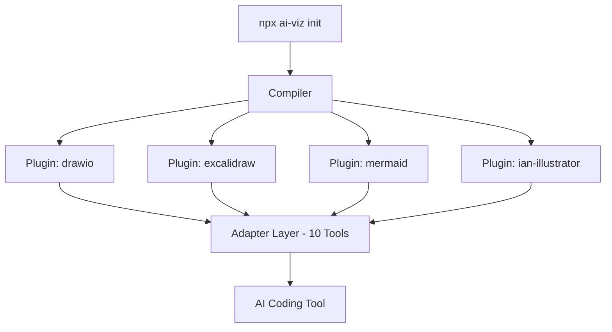

# 不用再手把手教AI画图了：这个开源项目把可视化方法论直接装进了AI脑子里

你是不是也有这种经历——想让AI画个架构图，结果出来的图结构完全不一样。今天画的3层，明天画成5层，节点挤成一团，连线比蜘蛛网还密。

你跟它说"画个微服务架构图"，它确实能生成一段Mermaid或者一个Excalidraw JSON。但每次你都得从零交代：分层画、连线标注、配色别太花。这些问题本来不该每次手动说一遍，可AI就是不记得。

最近看到一个项目把这事给捋顺了。

它叫**ai-viz**。一句话概括：把一整套可视化方法论直接编译到AI编程工具的指令里——装完以后，你只需要说一句"画个这个项目的架构图"，AI自己就知道怎么画、画成什么样、用什么格式。

## 一句话结论

ai-viz 是一个npm包，把"知识源→路由→生成→质量自检"这套可视化方法论装进你的AI编程工具里。装好之后，你给AI丢一个DDL文件它画ER图，丢一个接口规范它画时序图，丢一篇科普文章它画手绘配图——不用你告诉它画什么格式，它自己判断。

## 核心亮点

**1、智能路由，AI替你判断画什么图**

这是ai-viz跟其他画图Prompt最大的区别。它不是一套固定指令，而是一个带判断逻辑的路由系统。你丢DDL进去，它知道要出ER图；丢接口规范进去，它知道要出时序图；丢一篇科普文章进去，它直接转到手绘配图路线。

路由分了五级置信度：你明确说画啥它就执行；知识源跟图种强映射（DDL→ER图）它也直接执行；如果一份文档有多种可能，它先给推荐方案再等你确认。

**2、4种输出插件，从工程图到手绘配图全覆盖**

四个插件，各自管一摊：

| 插件 | 适合场景 | 输出格式 | 特殊能力 |
|------|---------|---------|---------|
| drawio | 专业架构图、对外正式文档 | .drawio XML | CLI导出PNG/SVG/PDF |
| excalidraw | 内部文档、白板讨论 | .excalidraw JSON | 手绘风格、精确坐标 |
| mermaid | README、GitHub文档 | 文本代码块 | 版本控制友好 |
| ian-illustrator | 科普文章配图、概念图解 | PNG | 小黑IP手绘风、原创隐喻 |

每个插件带独立的指令、Schema定义和质量自检清单。明天出了新格式，加一个插件就行，不用改框架。

**3、适配10款主流AI编程工具**

Claude Code、Cursor、Windsurf、OpenCode、GitHub Copilot、Codex、Qoder、Aider、Trae、CodeBuddy——你能想到的主流AI编程工具基本都在里面了。

关键是安装路径不用你自己操心：Claude Code放`.claude/skills/`，Cursor放`.cursor/rules/`，Copilot放`.github/copilot-instructions.md`。适配器自动写到正确位置。

**4、项目级安装，每个项目独立配置**

不是全局装一次就完事。ai-viz刻意选了项目级安装。原因很简单：A项目用深色主题、品牌色，B项目用浅色、稳重色；后端项目只要mermaid画时序图就够了，前端项目要excalidraw画UI流转。一份全局配置根本没法兼顾。

每个项目独立跑`npx ai-viz init`，各管各的设计语言、插件和版本。

**5、设计语言可配，配色风格统一**

项目根目录下有个`design-language.yaml`，定义配色、字体层级、间距规则。生成的图都按这个配色走，不会每次都用随机配色。

```
# 色彩系统 — 语义映射
colors:
  primary: "#a5d8ff"
  secondary: "#b2f2bb"
  accent: "#ffd43b"
  muted: "#e9ecef"
```

**6、五层质量自检，生成物到可交付物的门禁**

AI画完图不是结束。它要逐项检查：结构正确性（图对不对）、布局合理性（清不清楚）、信息完整性（该有的标注有没有）、风格一致性（配色对不对）、可交付性（格式能不能打开）。

不同格式还有专项检查——Draw.io检查XML标签闭合，Excalidraw检查JSON合法性，Mermaid检查语法渲染。出问题当场修，不用等人Review。

**7、CLI一键导出，DrawIO图表转图片**

选了drawio插件的话，`npx ai-viz export`能把.drawio文件转成PNG、SVG、PDF，支持自定义缩放倍数。对外正式文档的配图流程一步走完。

## 帮你理解：它的架构长什么样



四层架构：Core层（方法论/路由/质量控制）→ Plugin层（各输出格式）→ Adapter层（10个工具适配器）→ CLI层（安装部署）。四层各管各的事，加插件不改框架，加工具不改方法论。

## 30秒快速上手

前提：项目里有Node.js >= 16，装了一个AI编程工具。

```bash
cd your-project
npx ai-viz init
```

交互式向导会问你四个问题：用什么AI工具、要什么插件、用中文还是英文、要不要生成设计语言配置。选完30秒完事。

然后在你用的AI工具里说：**"画一个这个项目的架构图"**——它已经知道怎么做了。

### 命令速查

| 命令 | 用途 |
|------|------|
| `npx ai-viz init` | 交互式安装向导 |
| `npx ai-viz add drawio` | 添加插件 |
| `npx ai-viz remove excalidraw` | 移除插件 |
| `npx ai-viz export diagram.drawio` | 导出为PNG（默认2x缩放） |
| `npx ai-viz export diagram.drawio -f svg` | 导出为SVG |
| `npx ai-viz update` | 修改设计语言后重新编译 |

# 完整安装步骤


本指南将引导你安装 ai-viz 并生成第一张图表。

## 前置要求


- **Node.js** >= 18.0.0
- 一个 AI 编程工具（Claude Code、Cursor、Windsurf、OpenCode、GitHub Copilot、Qoder 或 Aider）
- （可选）[Draw.io Desktop](https://github.com/jgraph/drawio-desktop) — 导出 PNG/SVG/PDF 时需要

## 安装

ai-viz 使用交互式 CLI 向导，无需全局安装：

```shell
cd your-project
npx ai-viz init
```

### 安装流程详解

```
🎨 AI-Viz 初始化向导
────────────────────────────────────────

? 选择你的 AI 编程工具:
  ❯ Claude Code
    Cursor
    Windsurf
    OpenCode
    GitHub Copilot
    Qoder
    Aider
    多工具 (Multi-tool)

? 选择输出格式插件 (空格选择，回车确认):
  ❯ ◉ drawio - 专业正式图表，支持 PNG/SVG 导出
    ◉ excalidraw - 手绘风格，适合内部讨论
    ◯ mermaid - 轻量文本图表，适合 README

? 选择文档语言:
  ❯ 中文 (zh-CN)
    English (en)
    双语 (both)

? 是否创建设计语言配置文件？(design-language.yaml) Yes

⚙️  正在生成配置...
  ✓ ai-viz.config.json
  ✓ design-language.yaml
📦 正在编译指令文件...
📥 正在安装到 AI 工具...
  ✓ Claude Code (4 个文件)

✅ ai-viz 初始化完成！
```

初始化后，你的项目会新增：

```
your-project/
├── ai-viz.config.json         # ai-viz 配置文件
├── design-language.yaml       # 视觉风格配置（配色、布局）
└── .claude/skills/ai-viz/     # （或对应你工具的等效目录）
    ├── SKILL.md
    ├── drawio-instructions.md
    ├── drawio-schema.md
    └── design-language.yaml
```

## 生成第一张图表

安装完成后，打开你的 AI 编程工具，描述你的需求：

```
你："画一个这个项目的分层架构图，
     展示 API 层、服务层和数据层。"
```

AI 将会：

1. 读取方法论指令（确定画什么类型的图）
2. 遵循路由规则（根据上下文选择最佳格式）
3. 读取插件指令（精确的输出格式规范）
4. 应用设计语言（颜色、间距、字体）
5. 生成图表文件（如 `architecture.drawio`）

### 输出示例


DrawIO 会生成 `.drawio` XML 文件，可用 Draw.io Desktop 或 VS Code 扩展打开。

Excalidraw 会生成 `.excalidraw` JSON 文件，可用 Excalidraw 或其 VS Code 扩展打开。

Mermaid 会生成 Markdown 中的围栏代码块，可在 GitHub、GitLab 和大多数文档工具中渲染。

## 导出为 PNG


如果选择了 drawio 插件，可以将图表导出为图片：

```shell
# 导出为 PNG（默认，2x 缩放）
npx ai-viz export architecture.drawio

# 导出为 SVG
npx ai-viz export architecture.drawio -f svg

# 导出为 PDF
npx ai-viz export architecture.drawio -f pdf

# 自定义缩放倍数
npx ai-viz export architecture.drawio --scale 3
```

> **注意：** 导出功能需要系统安装 [Draw.io Desktop](https://github.com/jgraph/drawio-desktop)。

## 自定义配置

### 设计语言


编辑 `design-language.yaml` 以匹配你项目的视觉风格：

```yaml
# 色彩系统 — 语义映射
colors:
  primary: "#a5d8ff"       # 核心服务/节点
  secondary: "#b2f2bb"     # 外部系统
  accent: "#ffd43b"        # 网关/关键路径
  muted: "#e9ecef"         # 基础设施/背景
  danger: "#ffc9c9"        # 告警/错误

# 布局偏好
layout:
  direction: "top-to-bottom"
  h_gap: 250
  v_gap: 180

# 按使用场景设置默认格式
format_preference:
  internal: "excalidraw"       # 内部文档 → 手绘风格
  external: "drawio"           # 对外文档 → 正式精美
  documentation: "mermaid"     # README → 文本图表
```

编辑后重新编译以传播变更：

```shell
npx ai-viz update
```

### 添加/移除插件


```shell
# 添加新插件
npx ai-viz add mermaid

# 移除插件
npx ai-viz remove excalidraw
```

## 写在最后

这个项目的核心思路我挺喜欢的——它不是在教你"怎么描述需求让AI画图"，而是把整个画图方法论灌进AI的上下文里，让AI自己去读知识源、自己判断画什么、自己检查质量。

人只负责思考架构，可视化执行交给AI。

当然它也不是万能药。项目级安装意味着每个项目都要跑一遍init，团队多人协作时设计语言得统一维护。drawio导出依赖Draw.io Desktop，不是纯命令行搞定。ian-illustrator插件目前只出PNG，不支持矢量。这些边界摆在台面上，适合的场景一眼就能判断适不适合自己——如果你的日常就是画架构图、写文档、做科普配图，值得花30秒试一下。

开源地址：[github.com/deepjai-way/ai-viz](https://github.com/deepjai-way/ai-viz)

#AI #可视化 #开源 #ai-viz #架构图 #Mermaid #DrawIO #Excalidraw #开发者工具 #效率工具 #AI编程 #技术分享 #npm
