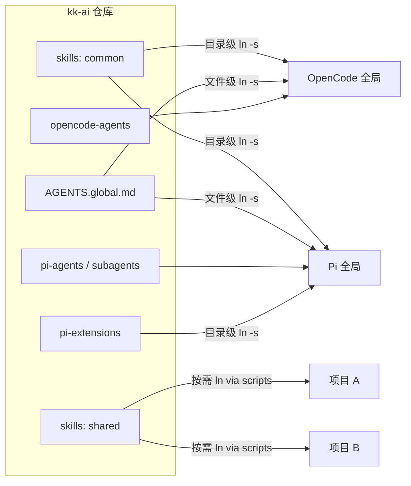

# 不用再给每个项目重复配AI Agent了：一个仓库统一管理OpenCode和Pi

用 AI 写代码的人多了，有个麻烦也跟着来了——Skill 放在哪、Agent 配在哪、扩展装在哪，全看你在用什么工具。

OpenCode 有 OpenCode 的目录结构，Pi 有 Pi 的路径习惯。你写三五个项目还能忍，写到第十个就会发现：

- 同一个 skill，这个项目 ln 一次，那个项目 ln 一次，忘了 ln 就报错
- OpenCode 的 Agent 文件散落在各个 `.opencode/agents/` 里，全局没有统一版本
- Pi 的扩展是 TypeScript 模块，每次换项目都得重新折腾一遍

说白了，AI 写代码的效率上去了，但管理和配置的效率没跟上。

最近有人把这个麻烦事儿做成了一个项目——**kk-ai**，一个仓库统一管理 OpenCode 和 Pi 的所有 Skill、Agent、Extension 和全局规则。思路很简单：**所有资源归到一个仓库，common 目录全局 symlink，shared 目录按需 ln 到项目，AGENTS.global.md 双平台共用。**

一句话结论：**kk-ai 是一个面向 AI 编码工具（OpenCode + Pi）的配置管理中心，通过统一的目录结构和符号链接策略，让 Skill、Agent、Extension 和全局规则只需维护一份，所有项目自动生效。**

## 核心亮点

### 1. 双平台统一收纳，不再两套配置

OpenCode 和 Pi 的配置路径、文件格式、管理方式完全不同。kk-ai 的做法是：在仓库里按 `skills/`、`opencode-agents/`、`pi-agents/`、`pi-subagents/`、`pi-extensions/` 分层组织，common 目录一次 ln 到全局，OpenCode 和 Pi 各走各的路径，但资源同源。

**收益**：新增一个 skill 只需放在 `skills/common/`，所有项目自动可用。不用记两套目录，也不用担心配漏了。

**边界**：仅管理 OpenCode 和 Pi 两套工具的资源文件，不涉及其他编码 Agent 或 IDE 插件。

### 2. 自研 12+ 个 Skill，从图表到公众号全覆盖

项目自带了相当多的自研 Skill，覆盖了日常高频场景：

- **markdown-to-image**：Markdown / 代码片段转图片，做分享图的好东西
- **mermaid**：Mermaid 图表生成（基于 mmdc CLI，输出 SVG/PNG/PDF）
- **skillify**：将会话过程捕获为可复用的 skill——相当于"用 AI 教 AI 干活"
- **skill-creator**：创建新 skill（基于 anthropics/skills）
- **project-init**：项目初始化工具，双平台支持
- **html-ppt**：HTML 演示文稿生成
- **gzh-article-creator**：公众号文章创作工具
- **wechat-gzh-skill**：微信公众号草稿发布工具
- **image-prompt**：AI 图像生成提示词生成器

**收益**：开箱即有一整套技能库，不需要从零开始攒。

**前提**：部分外部来源的 skill（如 playwright-cli、frontend-design）需要额外安装依赖或手动更新。

### 3. kk-brain 知识工作流水线：思考→捕获→成稿→润色

这是我最感兴趣的一组。它把一次知识产出拆成了四个阶段，每个阶段一个 skill：

1. **ob_architect_structure**——整理思路、构建逻辑骨架模板
2. **ob_capture_insight**——捕捉洞察、结晶知识卡片（含一句话核心观点）
3. **ob_compile_manuscript**——整合内容、输出文章（含成稿模板 + 三层审计）
4. **ob_polish_prose**——扩写大纲、优化文字（含 author_voice 人格注入 + 三层风格审计）

**收益**：把"从模糊想法到正式文章"这件事流程化了。每个 skill 只做一件明确的事，可以组合，也可以独立用。

**前提**：需要对自己当前处于哪个阶段有判断力，否则容易在错误阶段调用错误 skill。

### 4. Pi 双 Agent 架构设计得很清楚

很多刚用 Pi 的人会搞混：主 Agent 和子 Agent 到底有什么区别？

kk-ai 的目录设计说得很明白：

- **主 Agent**（`pi-agents/`）——由 `pi-agent-switcher` 扩展管理，存在 `~/.pi/agent/main-agents/`，启动时自动加载，`/agents` 查看、`/agent` 切换
- **子 Agent**（`pi-subagents/`）——被 `@agwab/pi-subagent` 委派执行，存在 `~/.pi/agent/agents/`

两类 Agent 目录独立，互不干扰。common 目录已通过目录级符号链接全局生效，新增文件放入对应 `common/` 即可。

**收益**：明确了主/子 Agent 的存储和加载机制，不会再出现把子 Agent 放到主目录、切换不生效的迷惑场景。

**边界**：子 agent 项目级使用是复制（cp）而非软链接（ln），因为 `pi-subagent` 拒绝符号链接。

### 5. 全局规则一次定义，双平台共享

`AGENTS.global.md` 是双平台共享的全局代理规则文件：

```bash
# OpenCode
ln -sf ~/Code/kk-ai/AGENTS.global.md ~/.config/opencode/AGENTS.md

# Pi
ln -sf ~/Code/kk-ai/AGENTS.global.md ~/.pi/agent/AGENTS.md
```

一份规则文件，通过文件级符号链接同时服务两个平台。

**收益**：代理行为规则只需维护一个源文件，两个工具同步生效，不会出现 OpenCode 更新了规则但 Pi 没同步的情况。

### 6. 辅助脚本让链接操作自动化

手动 `ln -s` 容易搞混路径和参数。项目提供了 `scripts/link-skills.sh` 脚本，一行命令把需要的资源链到项目：

```bash
# 链接 skill 到项目
~/Code/kk-ai/scripts/link-skills.sh shared xxx-skill /path/to/project

# 链接 OpenCode agent
~/Code/kk-ai/scripts/link-skills.sh opencode-agent xxx-agent.md /path/to/project

# 链接 Pi 主 agent
~/Code/kk-ai/scripts/link-skills.sh pi-agent xxx-agent.md /path/to/project

# 链接 Pi 子 agent（复制形式）
~/Code/kk-ai/scripts/link-skills.sh pi-subagent xxx-agent.md /path/to/project

# 链接 Pi 扩展
~/Code/kk-ai/scripts/link-skills.sh pi-extension extension-name /path/to/project
```

**收益**：从"记住 ln 语法 + 核对路径"变成"一个脚本搞定"。

### 7. 三方扩展可扩展

除了自研和官方 Skill，kk-ai 还管理了三个 Pi 扩展：

- **baishan**——白山云 API 扩展
- **huawei-cloud**——华为云 API 扩展
- **pi-agent-switcher**——Pi Agent 角色切换扩展

**收益**：如果你用云厂商的 API，这些扩展可以直接用，不用自己写 TypeScript 模块。

**前提**：扩展是 TypeScript 模块，如果扩展本身有依赖冲突或 API 版本变更，需要手动维护。

### 8. Agent 角色体系丰富

项目目前管理的 Agent 覆盖了多个角色：

- **知识共建者（Knowledge Co-Creator）**——识别思维阶段并协助知识构建
- **产品调研（ProductResearch）**——多源调查并输出结构化报告
- **公众号运营（WeChat-GZH-Operator）**——从选题到发布全流程管理
- **通用翻译（universal-translator）**——多语言翻译成英语
- **验证（verification）**——测试破坏性实现、边缘情况
- **诸葛亮**——人生导师、思维军师

**收益**：十几个 Agent 各有明确职责，可以用 pi-agent-switcher 按需切换，不用每次重新写 prompt。

**边界**：诸葛亮 agent 和知识共建者这些角色是开发者自己设计的 prompt 配置，不是 Pi 官方标准的角色，效果取决于 prompt 质量。

## 项目总览

这张图展示了 kk-ai 的管理逻辑——common 目录全局生效，shared 目录按需链接到项目，AGENTS.global.md 同时服务于两个平台：



## 功能速览

| 分类              | 资源               | 管理方式       | 生效范围              |
| --------------- | ---------------- | ---------- | ----------------- |
| Skills          | common/          | 目录级符号链接到全局 | 所有项目自动可用          |
| Skills          | shared/          | 按需 ln 到项目  | 仅目标项目             |
| OpenCode Agents | common/          | 目录级符号链接    | OpenCode 全局       |
| Pi 主 Agents     | common/          | 目录级符号链接    | Pi 主 Agent 目录     |
| Pi 子 Agents     | common/          | 目录级符号链接    | Pi 子 Agent 目录     |
| Pi 子 Agents     | shared/          | 按需复制到项目    | 仅目标项目             |
| Pi Extensions   | common/          | 目录级符号链接    | Pi 扩展全局生效         |
| 全局规则            | AGENTS.global.md | 文件级符号链接    | OpenCode + Pi 双平台 |

## 快速上手

### 仓库初始化

```bash
git clone https://github.com/xsoway/kk-ai.git ~/Code/kk-ai
```

### 设置全局符号链接

```bash
# OpenCode Skills
ln -s ~/Code/kk-ai/skills/common ~/.config/opencode/skills

# OpenCode Agents
ln -s ~/Code/kk-ai/opencode-agents/common ~/.config/opencode/agents

# Pi 主 Agent
ln -s ~/Code/kk-ai/pi-agents/common ~/.pi/agent/main-agents

# Pi 子 Agent
ln -s ~/Code/kk-ai/pi-subagents/common ~/.pi/agent/agents

# Pi 扩展
ln -s ~/Code/kk-ai/pi-extensions/common ~/.pi/agent/extensions

# 查看已链接的资源
ls ~/.config/opencode/skills/
ls ~/.config/opencode/agents/
ls ~/.pi/agent/main-agents/
ls ~/.pi/agent/agents/
ls ~/.pi/agent/extensions/
```

### 设置全局规则

```bash
# OpenCode
ln -sf ~/Code/kk-ai/AGENTS.global.md ~/.config/opencode/AGENTS.md

# Pi
ln -sf ~/Code/kk-ai/AGENTS.global.md ~/.pi/agent/AGENTS.md
```

### 按需链接到项目

```bash
cd /path/to/project
mkdir -p .opencode/skills
ln -s ~/Code/kk-ai/skills/shared/xxx-skill .opencode/skills/xxx-skill

mkdir -p .opencode/agents
ln -s ~/Code/kk-ai/opencode-agents/shared/xxx-agent.md .opencode/agents/xxx-agent.md
```

或者用脚本一键搞定：

```bash
# 链接 shared skill 到项目
~/Code/kk-ai/scripts/link-skills.sh shared xxx-skill /path/to/project

# 链接 OpenCode agent
~/Code/kk-ai/scripts/link-skills.sh opencode-agent xxx-agent.md /path/to/project
```

### 更新外部 Skill

项目文档里提到，外部来源的 skill 可以通过 `external-skills-updater` 技能自动更新：

> 告诉 AI "请更新外部 skill"，AI 将自动执行更新流程。

### 命令速查

| 阶段 | 命令 | 说明 |
|-------|-------|-------|
| 初始设置 | `git clone https://github.com/xsoway/kk-ai.git ~/Code/kk-ai` | 克隆仓库 |
| OpenCode 全局技能 | `ln -s ~/Code/kk-ai/skills/common ~/.config/opencode/skills` | 目录级符号链接 |
| OpenCode 全局 Agent | `ln -s ~/Code/kk-ai/opencode-agents/common ~/.config/opencode/agents` | 目录级符号链接 |
| Pi 全局主 Agent | `ln -s ~/Code/kk-ai/pi-agents/common ~/.pi/agent/main-agents` | 目录级符号链接 |
| Pi 全局子 Agent | `ln -s ~/Code/kk-ai/pi-subagents/common ~/.pi/agent/agents` | 目录级符号链接 |
| Pi 全局扩展 | `ln -s ~/Code/kk-ai/pi-extensions/common ~/.pi/agent/extensions` | 目录级符号链接 |
| 全局规则 | `ln -sf ~/Code/kk-ai/AGENTS.global.md <target>` | 文件级符号链接 |
| 按需链接 | `~/Code/kk-ai/scripts/link-skills.sh <type> <name> <path>` | 脚本一键链接 |
| 更新外部 skill | 对 AI 说"请更新外部 skill" | 自动执行更新流程 |
| 查看已链接 | `ls ~/.config/opencode/skills/`（及同类命令） | 确认链接是否正确 |

## 写在最后

说实话，kk-ai 不是什么"震撼业界"的大项目，但它解决的痛点非常真实——只要你同时用 OpenCode 和 Pi，而且项目数超过两三个，就能体会到这种中央管理的好处。

这个仓库更像个**基础设施层**：它不直接提供"更好的 Agent"或"更强的 Skill"，而是帮你把已有的资源归拢好、管理好。它的价值是"一次配好，到处可用"——一旦初始设置跑通，之后增删改资源只需要改仓库里的一份文件，全局自动生效。

几个我自己的判断：

- **如果你是单工具用户（只用 OpenCode 或只用 Pi）**，这个项目的收益会打折扣，但目录管理思路本身可以借鉴
- **如果你是双工具用户**，值得花 10 分钟把仓库 clone 过来跑一遍初始链接，后续省心很多
- **kk-brain 四件套**值得单独拿出来试试——尤其是 `ob_compile_manuscript` 和 `ob_polish_prose`，对公众号文章创作者来说是一套挺实用的流程化工具
- **外部源的 skill**（playwright-cli、frontend-design 等）依赖 `external-skills-updater` 手动更新，这部分维护成本还在，不是全自动的
- **Pi 扩展是 TypeScript 模块**，如果你对 TS 不太熟悉，遇到扩展报错排查起来可能需要一点时间

总的来说，这是一个"想清楚了再动手"的项目——作者明显被配置管理烦了很久，然后花时间把这件事一次性做透了。它不对你的 AI 能力加分，但它确保你的 AI 配置不再成为拖后腿的理由。

#kk-ai #OpenCode #Pi #AIAgent #Skill管理 #效率工具 #开源项目 #配置管理 #知识管理
