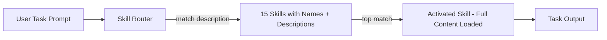

# Context Engineering 不是玄学：15 个标准化 Skill 把 AI Agent 的上下文管成了工程

## 导语

做 AI agent 开发的人，迟早会撞上一堵墙——

不是模型不够聪明，是**上下文窗口从来不够用**。

你塞 system prompt、工具定义、检索文档、对话历史、tool 输出……每个回合都在膨胀。然后模型开始表现出"lost-in-the-middle"、注意力涣散、忘了前面说过什么。

大多数人把这个当玄学处理：多塞一点、少塞一点，靠感觉调。少数人把它当工程问题。

最近有个叫 **Agent Skills for Context Engineering** 的 GitHub 项目，直接把这门学科做成了 15 个可安装、可评测、可复用的标准化 skill，覆盖从上下文基础理论到多 agent 编排、从压缩策略到 harness 工程的全链路。

这 repo 已经被北大通用人工智能国家重点实验室和 CMU/Yale/JHU/Amazon 等机构的研究论文引用为"静态 skill 架构的基础工作"。

## 一句话结论

一套面向 AI agent 开发者的"上下文工程技能包"——15 个标准化 skill，覆盖上下文理论、多 agent 模式、记忆系统、工具设计、评估框架和 harness 工程，Claude Code/Cursor/Codex 全兼容，装上就能用。

---

## 核心亮点

### 1、15 个 Skill，覆盖 Context Engineering 全链路

| 分类 | Skill | 一句话 |
|------|-------|--------|
| 基础理论 | context-fundamentals | 上下文是什么、为什么重要、上下文组件解剖 |
| 基础理论 | context-degradation | 识别 lost-in-middle / 中毒 / 分心 / 冲突等失败模式 |
| 基础理论 | context-compression | 长会话下的压缩策略设计与评估 |
| 架构模式 | multi-agent-patterns | orchestrator / peer-to-peer / 层级多 agent 架构 |
| 架构模式 | memory-systems | 短期/长期/图记忆架构设计 |
| 架构模式 | tool-design | 构建 agent 能高效使用的工具 |
| 架构模式 | filesystem-context | 用文件系统做动态上下文发现/工具输出卸载/计划持久化 |
| 架构模式 | hosted-agents | 远程沙箱/预构建镜像/多人协作 agent |
| 运行优化 | context-optimization | 压缩/屏蔽/缓存策略 |
| 运行优化 | latent-briefing | 通过 KV cache 压缩在 orchestrator 与 worker 间共享状态 |
| 评估 | evaluation | agent 系统评估框架构建 |
| 评估 | advanced-evaluation | LLM-as-a-Judge：评分/对比/偏置缓解 |
| 元工程 | harness-engineering | 带锁定指标/持久日志/回滚/审批边界的自主 agent harness |
| 元工程 | project-development | LLM 项目从构思到部署的全流程 |
| 前沿 | bdi-mental-states | 用 BDI 本体将外部 RDF 上下文转化为 agent 信念/欲望/意图 |

**读者收益**：这不是碎片化的技巧集合，而是一套完整的工程知识体系。从理论到实践、从单 agent 到多 agent、从开发到评估，每一步都有对应的 skill。

**前提/边界**：Skill 是平台无关的，用 Python 伪代码示范概念。不是开箱即用的插件，但模式可以直接移植到任何 agent 框架。

### 2、有数据支撑的 Skill 路由评测

这个 repo 做了目前我看到的最认真的路由评测——

通过 Cursor SDK 对 4 个前沿模型（gemini-3.1-pro、composer-2、gpt-5.5、claude-opus-4-7）做了 3 轮全量评测（50 prompts × 4 模型 × 3 复现 = 每轮 600 次调用）。

结果摘要：

| Skill | 基线 top-1 | 改写后 | 提升 |
|-------|-----------|--------|------|
| context-fundamentals | 0.255 | 0.489 | +23.4pp |
| project-development | 0.750 | 1.000 | +25pp |
| tool-design | 0.729 | 0.807 | +7.8pp |

第三轮全量评测 600/600 可用记录，0 格式失败。

**读者收益**：这不是拍脑袋说"我的 skill 很好"，而是用 1800 次调用验证过的路由准确率数据。如果你在搭建自己的 skill 系统，这套评测方法论本身就是可参考的实践。

**前提/边界**：评测只覆盖了 Cursor SDK 通道，不保证其他平台路由效果完全一致。但方法论是通用的。

### 3、学术研究引用——不是个人博客，是学术文献

这个 repo 被两篇论文引用：

- **北京大学通用人工智能国家重点实验室**（2025）：《Meta Context Engineering via Agentic Skill Evolution》中写道："While static skills are well-recognized [Anthropic, 2025b; Muratcan Koylan, 2025]…"
- **CMU/Yale/JHU/NEU/Tulane/Amazon 等**（2026）：《Agent Harness Engineering: A Survey》

**读者收益**：能被顶校和产业机构的研究论文引用，说明这个 repo 不是概念游戏，而是被学界认可的基础性工作。

**前提/边界**：学术引用不等于产品背书。但作为学习材料，它的可信度远超普通个人项目。

### 4、完整的示例系统——不只是 Skill 列表

repo 的 `examples/` 目录下有多个完整系统设计，每个都标注了应用了哪些 skill：

- **digital-brain-skill**：创始人的个人操作系统，6 个模块 + 4 个自动化脚本，附 `HOW-SKILLS-BUILT-THIS.md` 追溯每个架构决策对应哪个 skill
- **x-to-book-system**：监控 X 账号 + 自动生成每日合成书的多 agent 系统
- **llm-as-judge-skills**：TypeScript 实现的生产级 LLM 评估工具，19 个通过测试
- **book-sft-pipeline**：训练 8B 小模型模仿特定作者写作风格，$2 总成本，人类评分达 70%
- **interleaved-thinking**：捕获/分析/转化 agent 失败模式为生成式 skill 的推理优化器

**读者收益**：如果你觉得 skill 抽象、不知道怎么用，这些示例就是"参考答案"。

**前提/边界**：示例质量很高，但部分系统复杂度不低，需要花时间消化。

### 5、完整的持续研究引擎

repo 的 `researcher/` 目录不是一个摆设——它是一个"文件驱动的持续研究操作系统"：

- 源码注册表 + 策展规则
- 16 个已接受的机制变更 + 追加型接受/拒绝日志
- 12 个溯源追踪的声明条目（含来源 URL、证据强度、波动性、最后审查日期）
- 19 个确定性激活回归测试
- 对抗性 benchmark（重复机制、未检索证据、错误评分的对抗场景）
- 持续循环脚本 + launchd 编排

**读者收益**：这不是一个"写完 README 就放着"的 repo——它有持续的研究管道、有闭环的 novelty 检测、有回归测试。如果你想做一个"自我进化"的 agent 系统，这套设计可以直接参考。

**前提/边界**：持续研究管道的运维成本不低，适合团队级投入，个人项目可能过重。

### 6、三平台兼容 + Open Plugins 标准

Skill 通过 Open Plugins 标准发布，支持：

- Claude Code：`/plugin marketplace add muratcankoylan/Agent-Skills-for-Context-Engineering`
- Cursor：从 Cursor Plugin Directory 安装
- Codex / GitHub Copilot CLI：克隆或添加为插件目录

同时支持手动复制 skill 目录到 `.cursor/skills/`、`.claude/skills/`、`.codex/skills/` 或 `.agents/skills/`。

**读者收益**：你不需要绑死在某个 agent 平台上。同一个 skill 可以在多个工具间复用。

**前提/边界**：安装需要遵循目录结构（不能把 SKILL.md 拍平成一个文件），某些平台依赖 Open Plugins 插件系统的支持。

---

## Mermaid：Context Engineering Skill 的激活与执行流程



## 快速上手

### 安装（Claude Code）

```shell
# 添加插件市场
/plugin marketplace add muratcankoylan/Agent-Skills-for-Context-Engineering

# 安装
/plugin install context-engineering@context-engineering-marketplace
```

### 安装（Cursor / Codex / 手动）

```shell
# 克隆仓库
git clone https://github.com/muratcankoylan/Agent-Skills-for-Context-Engineering.git

# Cursor 项目级安装
cp -R skills/context-fundamentals .cursor/skills/

# Claude Code 项目级安装
cp -R skills/context-fundamentals .claude/skills/

# Codex 项目级安装
cp -R skills/context-fundamentals .codex/skills/

# 通用 agent 安装
cp -R skills/context-fundamentals .agents/skills/
```

### 命令速查

| 阶段 | 操作 | 说明 |
|------|------|------|
| Claude Code 安装 | `/plugin marketplace add ...` | 注册插件市场 |
| Claude Code 安装 | `/plugin install context-engineering@...` | 一键安装全部 15 个 skill |
| Cursor 安装 | Cursor Plugin Directory | 图形化安装 |
| 手动安装 | `cp -R skills/<skill-name> .<host>/skills/` | 按需复制 |
| 使用 | 描述对应任务 | Skill 自动匹配激活 |

## 写在最后

Context Engineering 这个领域，说穿了就是在做一件事：**在模型有限的注意力预算里，塞进最高信号密度的信息**。

这不是玄学。这个 repo 用 15 个 skill、1800 次路由评测、两篇学术论文引用和一个持续研究管道，证明了它是可以系统化、标准化、工程化的。

如果你在做 AI agent 开发——不管是用 Claude Code、Cursor、Codex 还是自己搭框架——这个 repo 都值得花一个下午认真过一遍。

尤其是 `harness-engineering` 和 `evaluation` 这两个 skill，很多项目直到上线才发现"没有评估"和"没有回滚"是致命的。与其踩坑再补，不如先看完这个 repo 再说。

---

#ContextEngineering #AIAgent #Skills #OpenSource #ClaudeCode #Cursor #Codex #Evaluation #HarnessEngineering #BDI