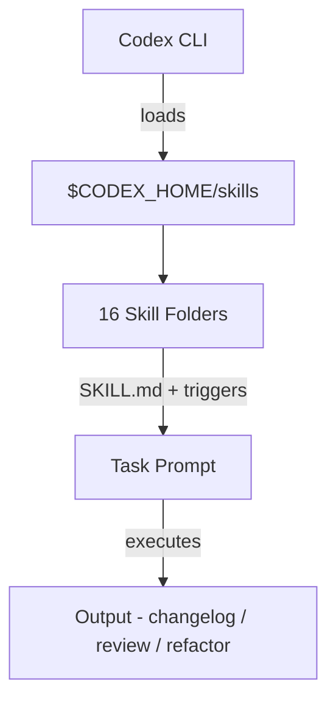

# 16 个自包含的 AI 技能模板，让你的 Codex 瞬间变「专业工种」

## 导语

用 AI 编码 agent 写代码，最烦人的一件事是什么？

不是它写得不够好，是**每次都要从零描述上下文**。

"帮我调试这个 iOS 崩溃"——然后你得贴一堆日志，告诉它项目结构、Xcode 版本、模拟器配置。下次换个场景，又得重来一遍。

这感觉就像你每次去同一个便利店，都要重新告诉店员你要买什么。效率根本起不来。

最近有人在 GitHub 上做了一个叫 **Skills** 的项目——把常见的工程任务打包成可复用的"技能"模板，直接喂给 Codex CLI 用。

目前一共 16 个，覆盖了从 App Store 发版笔记到 SwiftUI 性能诊断、从代码评审到多 agent 漏洞狩猎的全场景。

## 一句话结论

一套为 Codex CLI 准备的"职业技能包"——把 iOS 开发、SwiftUI 重构、代码评审、性能诊断等高频工程任务做成标准化 skill，放到 `$CODEX_HOME/skills` 下就能用，省去每次重复描述上下文的功夫。

---

## 核心亮点

### 1、16 个技能覆盖全栈 Apple 开发+工程管理

| 技能 | 用途 |
|------|------|
| App Store Changelog | 从 git 历史自动生成发版说明 |
| GitHub | 通过 `gh` CLI 操作 issue/PR/workflow |
| iOS Debugger Agent | 用 XcodeBuildMCP 构建+启动+调试 iOS 应用 |
| macOS Menubar Tuist App | 构建/重构 macOS 菜单栏应用（Tuist + SwiftUI） |
| macOS SwiftPM App Packaging | 不依赖 Xcode 项目，直接打包+签名+公证 macOS 应用 |
| Swift Concurrency Expert | 修复 Swift 6.2+ 并发问题（actor 隔离/Sendable 等） |
| SwiftUI Performance Audit | 从代码和架构层面诊断 SwiftUI 运行时性能 |
| SwiftUI UI Patterns | 导航/Sheet/异步状态等 SwiftUI 最佳实践示例 |
| SwiftUI View Refactor | 重构超大 View 为小 subview + MV 数据流 |
| SwiftUI Liquid Glass | 实现 iOS 26+ Liquid Glass API 的正确用法 |
| React Component Performance | 诊断 React 组件重渲染/不稳定 props 等问题 |
| Review and Simplify Changes | 代码评审 + 自动化简化 |
| Review Swarm | 四 agent 并行 diff 评审（回归/安全/性能/测试覆盖） |
| Bug Hunt Swarm | 四 agent 只读漏洞调查（复现/代码路径/回归/修复路径） |
| Orchestrate Batch Refactor | 依赖感知的大规模重构编排 |
| Project Skill Audit | 分析已有会话/技能，推荐最高价值的新技能 |

**读者收益**：你不需要自己写 skill，直接把文件夹放进去就能用。Apple 生态开发者的福音，React 和通用工程场景也有覆盖。

**前提/边界**：所有技能面向 Codex CLI 生态，需要 `$CODEX_HOME/skills` 目录支持。部分技能依赖外部工具（`gh` CLI、XcodeBuildMCP 等）。

### 2、多 agent 编排——Review Swarm 和 Bug Hunt Swarm

这是最让我眼前一亮的两项。

**Review Swarm**：用 4 个只读 agent 并行做 diff 评审——一个看回归，一个看安全，一个看性能/可靠性，一个看测试覆盖。然后汇总成一个优先级排序的修复路径。

**Bug Hunt Swarm**：同样 4 agent 并行，但目标换成了 bug 调查——复现、代码路径追踪、回归定位、最快证据步骤。最终返回一个排序后的根因路径。

**读者收益**：多 agent 编排不再是概念，这个 repo 给出了可直接运行的 skill 模板。如果你在搭建 AI 驱动的代码评审管道，这是现成的参考实现。

**前提/边界**：需要 Codex CLI 支持多 agent 并行执行（Swarm 模式）。单 agent 模式下无法发挥全部优势。

### 3、Project Skill Audit——AI 帮你判断缺什么技能

这是一个元技能：分析项目已有的 Codex 会话历史、memory、已有 skills 和开发惯例，然后推荐"当前最值得新增或更新哪些 skills"。

**读者收益**：随着 skill 越积越多，你会需要一个"审计员"来判断哪些是高频痛点、哪些技能已经过时。这个 skill 就是干这个的。

**前提/边界**：分析质量取决于已有会话记录和 memory 的完整性。新项目效果有限。

### 4、从 git 历史到 App Store 发版说明，一条命令的事

`app-store-changelog` skill 做的事情很直白：从 git 历史收集自上一个 tag 以来的变更，过滤出用户可见的工作，重写成简洁的"What's New"要点。

**读者收益**：很多团队每周花 15 分钟写发版说明。这个 skill 把它压缩成几秒钟。而且不是简单拉 git log，是"过滤+重写"，结果更接近人类写的东西。

**前提/边界**：依赖 git tag 作为版本锚点。如果团队不按 tag 发版，需要调整策略。

### 5、macOS 应用打包——不碰 Xcode 项目

`macos-spm-app-packaging` skill 能在没有 `.xcodeproj` 的情况下，完成 SwiftPM 项目的脚手架、构建、打包、签名和公证。

**读者收益**：CI/CD 场景下很多人不愿意在流水线里塞 Xcode 项目。这个 skill 给了另一条路——纯 SwiftPM + CLI，能签能公证。

**前提/边界**：需要 Apple Developer 证书和 notarization 凭证。不是开箱即用，但流程是完整的。

### 6、每个 skill 的边界清晰

从 README 的贡献指南能看出来，这个项目的设计哲学很清晰：

- 每个 skill 必须有单一明确的目的
- 文档要全面（SKILL.md + 触发条件 + 工作流指引 + 示例 + 参考资料）
- 模式要跟现有 skill 保持一致

**读者收益**：如果你也想写自己的 skill，这套模板和约定可以直接复用，不用从零想结构。

**前提/边界**：目前 16 个 skill 以 Apple 生态（Swift/SwiftUI/Xcode）为主。Web 前端只有 React Component Performance 一个。如果你主力是 Android 或后端，可能需要自己补充。

---

## Mermaid：Skills 的工作模式



## 快速上手

### 安装

```shell
# 克隆仓库到 skills 目录
git clone https://github.com/xsoway/Skills.git $CODEX_HOME/skills
```

或者逐个下载需要的 skill 文件夹放到 `$CODEX_HOME/skills` 下。

### 使用

每个 skill 文件夹里都有 `SKILL.md`，包含触发词、工作流指引、示例和参考资料。在 Codex CLI 对话中提及对应场景，skill 会自动触发。

### 命令速查

| 阶段 | 操作 | 说明 |
|------|------|------|
| 安装全部 | `git clone ... $CODEX_HOME/skills` | 一次性安装全部 16 个 skill |
| 安装单个 | 下载单个文件夹到 `$CODEX_HOME/skills` | 按需选择 |
| 使用 | 在 Codex 中描述对应任务 | skill 自动匹配触发 |
| 自定义 | 按 `SKILL.md` 模板新增 | 遵循单一职责 + 完整文档 |

## 写在最后

Skills 这个项目不是什么炫酷的新 AI 模型，也不是颠覆性的工具链——它做的事情很简单：**把高频工程任务做成标准化模板，让 AI 编码 agent 在特定场景下更聪明一点**。

但有时候最有价值的恰恰是这种"不起眼"的事。

如果你在用 Codex CLI 做 iOS/Swift 开发，装一套 skills 几乎零成本，收益却很直接——不用每次重复描述上下文，agent 能更准确理解你想干什么。

如果你在用其他 AI 编码工具（Claude Code、Cursor 等），这个项目的 skill 结构本身也值得参考——标准化、自包含、触发明确。你完全可以按同样的设计模式写一套自己的 skill。

16 个技能，总有一款适合你。

---

#Codex #Skills #Swift #SwiftUI #iOSDev #AIAgent #CodeReview #OpenSource #DevTools #MacDev