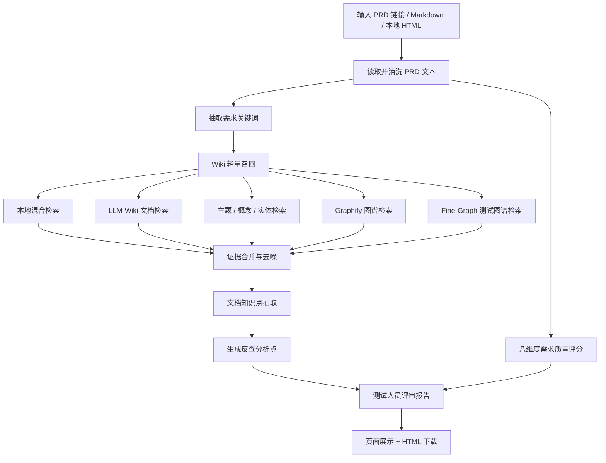
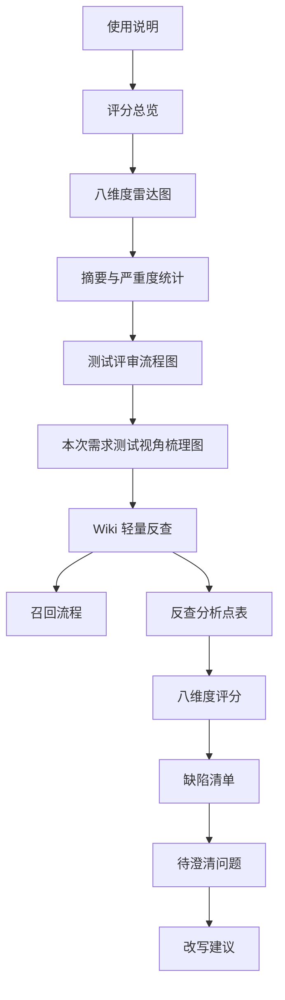
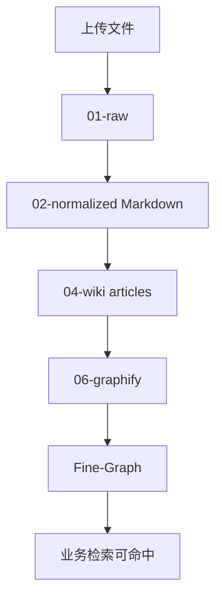
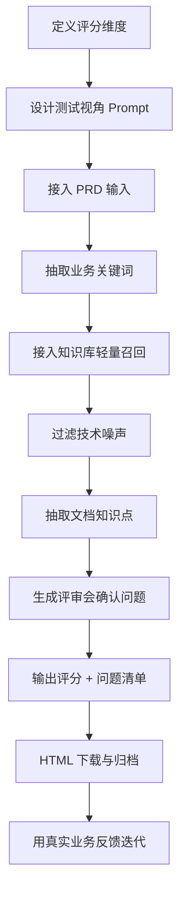

# AI + 知识库做需求评审，真正难的不是模型，而是证据清洗和问题设计

## 摘要

这篇文章复盘一次真实的需求质量分析模块优化过程。

最初的功能很简单：输入 PRD 链接，让 AI 从产品经理或测试人员视角给需求打分。听起来很合理，但实际使用时问题很快暴露：

- 报告像“通用模板”，没有测试人员真正能拿去开评审会的问题。
- Wiki 知识库检索出来的是 `meta`、`INDEX`、`KnowledgeGraph` 这类技术索引，业务同学完全看不懂。
- 上传的资料显示成功，但 `.docx`、`.xmind` 没进入编译链路，导致知识库看似有资料，实际检索不到。
- 新建业务线项目后，维护动作不可用，因为旧代码写死了项目白名单。
- 报告下载 HTML 缺少评分总览和雷达图，页面上看到的关键信息下载后丢了。
- 最后还踩了一个很典型的坑：召回流程显示“业务证据 1 条”，但“反查分析点”表格只有表头。

这不是一个“调 prompt 就好了”的故事。真正的改造发生在四层：输入资料归一化、检索证据治理、测试视角规则设计、报告阅读体验。

最终目标也不是让 AI 给一个漂亮分数，而是让测试人员带着问题进入需求评审：

> 当前 PRD 有没有讲清楚业务目标、功能范围、规则边界、异常路径、验收口径和历史回归风险？

## 一、先明确边界：需求质量分析不是影响分析

一开始最容易混淆的是两个模块：

| 模块 | 核心问题 | 是否结合 Wiki | 输出重点 |
| --- | --- | --- | --- |
| 需求质量分析 / 测试人员评审 | 这个 PRD 写得够不够清楚，能不能评审/提测？ | 轻量结合 | 用历史功能、历史 Bug、业务规则反查 PRD 缺口 |
| 测试报告 / 影响分析 | 这个需求会影响哪些模块，要测哪些范围？ | 深度结合 | 影响范围、功能点、回归范围、测试方案、用例设计 |

这个边界非常关键。

如果需求质量分析也输出完整测试方案，它就会和影响分析模块重叠；如果完全不看 Wiki，它又会变成一个只会说“补充验收标准”的通用评分器。

所以最终设计是：

- 需求质量分析只做“轻量反查”，重点检查 PRD 有没有漏写历史规则、旧链路、异常边界。
- 影响分析做“深度展开”，基于 Wiki 证据设计影响范围、测试点和用例。

一句话概括：

> 需求质量分析负责问对问题，影响分析负责展开怎么测。

## 二、整体链路：从 PRD 到测试评审报告

整个链路可以抽象成下面这张图。



这里的关键不是“调用模型”，而是模型之前和之后的工程处理。

模型之前要解决：

- PRD 是否真的读取到了全文？
- 关键词是否来自当前需求，而不是从标题里随便取几个词？
- Wiki 召回是否命中真实业务资料？
- 证据是否是可读知识点，而不是文件名或索引？

模型之后要解决：

- 报告能不能直接用于评审会？
- 问题是否具体到功能点、边界、异常、回归口径？
- 下载后的 HTML 是否保留评分总览、雷达图、流程图和表格换行？

## 三、测试视角评分：不是“好不好”，而是“能不能测”

需求质量分析采用八个固定维度，不是为了形式化打分，而是让测试人员从可测试性角度拆 PRD。

| 维度 | 名称 | 测试视角关注点 |
| --- | --- | --- |
| D1 | 问题清晰度 | 背景、问题、目标用户是否明确 |
| D2 | 目标与指标 | 是否有可验证目标和成功标准 |
| D3 | 范围边界 | 本期做什么、不做什么、旧入口怎么处理 |
| D4 | 用户故事 | 用户路径、角色、触发条件是否完整 |
| D5 | 功能规格 | 页面、状态、规则、字段、接口是否说清楚 |
| D6 | 非功能需求 | 性能、兼容、弱网、安全、埋点是否覆盖 |
| D7 | 验收标准 | 是否可直接转成测试用例 |
| D8 | 风险与依赖 | 外部依赖、历史 Bug、灰度、回滚是否明确 |

测试人员真正需要的不是一句“建议补充边界条件”，而是类似这样的评审问题：

- 这个按钮在待提交、已提交、失败、超时状态下分别展示什么？
- 弹窗关闭后是否记录状态？再次进入是否重复弹？
- 留资接口失败、网络异常、重复提交时用户看到什么？
- 旧入口、老版本、历史页面是否仍保留原规则？
- 埋点和线索是否都带同一套 ID，失败时怎么补偿？

所以 prompt 和服务层都围绕“可测试性”重构，而不是只让模型写一份 PM 风格总结。

## 四、第一坑：Wiki 轻量反查一开始查出来的是“文件名”，不是知识点

早期报告里出现过这样的内容：

| Wiki 证据 | 反查分析点 | 评审会确认问题 |
| --- | --- | --- |
| `INDEX.md` | 检查 PRD 是否补齐 INDEX、title、反向链接索引 | 本需求是否涉及 INDEX、title、反向链接索引？ |
| `meta.md` | 检查 PRD 是否补齐 meta、KnowledgeGraph | 本需求是否涉及 meta、KnowledgeGraph？ |

这类结果从技术上看“检索到了”，但对测试评审毫无意义。

原因很简单：RAG 召回没有区分“业务证据”和“技术索引”。`INDEX.md`、`meta.md`、`GRAPH_REPORT.md` 是知识库的控制文件，不应该进入业务问题表。

修复思路很克制：

1. 过滤技术索引文件。
2. 过滤 `KnowledgeGraph`、`normalized`、反向链接索引、编译产物等技术词。
3. 优先保留 `wiki_article`、`fine_graph_node`、`graph_node` 等业务证据。
4. 反查问题必须从“知识点详情”生成，不能直接拿文件名当问题。

核心逻辑类似这样：

```python
def _is_noise_evidence(item):
    name = Path(item.path).name.lower()
    title = item.title.strip().lower()

    if name in {"index.md", "meta.md", "graph_report.md"}:
        return True

    if "/moc/" in item.path.lower() or "主题地图" in item.title:
        return True

    identity = item.title if item.kind == "fine_graph_node" else f"{item.title} {item.path} {item.kind}"
    return bool(NOISE_RE.search(identity))
```

这个改动的本质是：

> 索引可以帮助召回，但不能作为评审证据。

## 五、第二坑：关键词必须来自当前 PRD，而不是用户随便输入的标题

如果只用 PRD 标题或摘要前 200 字做检索，很容易漏掉真正关键的业务词。

例如一个需求里真正有价值的线索可能藏在：

- 背景
- 本期范围
- 页面规则
- 子章节标题
- 菜单名
- 关键路径
- 按钮文案
- 弹窗行为
- 埋点字段
- 状态描述

所以关键词抽取逻辑从“标题 + 摘要”升级为“按需求结构抽取”。

```python
def _requirement_keyword_lines(title, excerpt, full_text):
    lines = [title, excerpt]
    for raw_line in full_text.splitlines():
        line = clean(raw_line)
        if re.search(r"背景|范围|功能|入口|页面|详情|按钮|规则|流程|验收|异常|埋点", line):
            lines.append(line)
        elif re.match(r"^\s*(?:#{1,6}|\d+[.、])", raw_line):
            lines.append(line)
    return unique(lines)[:120]
```

抽出来的关键词再参与打分：

```python
def _keyword_score(keyword, line):
    score = 0
    if re.search(r"App|H5|页|页面|列表|详情|入口|按钮|菜单|路径", keyword):
        score += 40
    if re.search(r"线索|留资|车源|销售|门店|城市|报价|埋点|状态|规则", keyword):
        score += 35
    if re.search(r"背景|范围|本期|功能|验收", line):
        score += 15
    return score
```

最终报告会展示“需求关键词整理”这一步，让测试人员知道系统拿什么去查 Wiki。

这一步非常重要，因为用户不只是要结果，还要知道结果为什么这么来。

## 六、第三坑：智能问答能查到，需求质量分析却查不到

用户指出一个关键问题：智能问答里的业务问答查询流程很完整，有本地混合检索、LLM-Wiki 文档检索、主题/概念/实体检索、Graphify、Fine-Graph 等步骤；但需求质量分析只做了简化搜索。

这导致同一个问题，在智能问答里能查到，在需求质量分析里反查不到。

于是需求质量分析复用了业务问答的证据收集链路：

```python
evidence, trace = evidence_service.collect_wiki_evidence_with_trace(
    wiki_project,
    query,
    retrieval_strategy="balanced",
)
```

并把 trace 直接放到报告里：

| 节点 | 作用 |
| --- | --- |
| 语义检索准备 | 从问题抽业务关键词，并结合 concepts/entities 补主题词 |
| 本地混合检索 | 走 BM25/本地混合召回 |
| LLM-Wiki 资料检索 | 查 meta、articles 等 Wiki 文档 |
| 主题/概念/实体检索 | 补主题地图、实体和历史归档 |
| Graphify 图谱检索 | 补结构化关联证据 |
| Fine-Graph 测试图谱检索 | 补测试点、边界、风险类证据 |
| 综合证据生成报告 | 合并去重，控制最终证据上限 |

这一步让报告从“黑盒生成”变成“可追踪生成”。

## 七、第四坑：查到了证据，但表格还是空的

这是最典型的工程落地坑。

某次报告显示：

> 原始综合证据 12 条；过滤技术索引和低价值噪声后，可用于 PRD 反查的业务证据 1 条。

但下面的“反查分析点”表格只有表头。

这说明什么？

说明证据通过了第一层过滤，但在生成表格行时，知识点抽取为空，于是代码直接 `continue` 掉了。

根因有两个：

1. 那条证据是 MOC 主题地图，只列了 concepts/entities，不是具体业务知识。
2. Fine-Graph 的测试证据路径里带 `02-normalized`，被“技术噪声过滤”误杀。

修复后做了三件事：

- MOC/主题地图只参与召回扩展，不进入反查表。
- Fine-Graph 证据按标题判断噪声，不因为路径里有 `normalized` 被误杀。
- 当原文详情抽取为空时，从标题和 snippet 生成兜底知识点。

```python
def _wiki_knowledge_points(item):
    text = read_evidence_text(item)
    cleaned = clean_wiki_text(text)
    points = extract_wiki_detail_points(cleaned)
    if points:
        return points[:5]
    return fallback_wiki_detail_points(item)[:5]
```

兜底逻辑不是为了“凑数”，而是为了避免“已经命中测试图谱节点，却因为没有完整原文而不展示”。

例如 Fine-Graph 命中：

- 弹出留资弹层时接口调用异常
- 弹出留资弹层时网络异常
- 车源显示数据按同步时间排序
- 店铺页面展示车源总量

这些本来就足够生成评审问题：

> 当前 PRD 是否覆盖留资弹层接口异常和网络异常？如果相关，需要补充失败提示、重试策略、重复提交兜底和回归口径；如果不相关，需要写入非目标。

## 八、第五坑：上传成功不代表知识库可检索

另一个大坑出现在数据维护。

用户新建了一个业务项目，上传资料成功，但编译、构建图谱、一键更新不可用，或者“看起来执行了，但文章数没涨”。

这里有两个根因。

### 1. 新项目被静态白名单拦截

旧代码把 Wiki 项目写死成两个项目：

```python
ALLOWED_WIKI_PROJECTS = {"project-a", "project-b"}
```

新建项目自然会被维护动作拒绝。

修复方式不是继续往白名单里加项目，而是按真实目录动态校验：

```python
def ensure_wiki_project(project):
    status = WikiProjectMaintenanceService().status(project)
    if not status.exists:
        raise HTTPException(status_code=404, detail="project not allowed")
```

这才是根因修复。否则每新建一个业务线都要改代码。

### 2. `.docx`、`.xmind` 没同步到 normalized 层

Wiki 编译吃的是 `02-normalized/wiki` 下的 Markdown 文本。

而上传文件先进的是 `01-raw/wiki`。

如果只保存 raw，不同步 normalized，就会出现：

> 上传成功了，但编译没有新文章。

所以同步层补了最小转换：

```python
def _sync_supported_upload_to_normalized(project_root, category, filename, content):
    suffix = Path(filename).suffix.lower()
    if suffix not in {".md", ".markdown", ".txt", ".docx", ".xmind"}:
        return

    if suffix in {".md", ".markdown", ".txt"}:
        text = content.decode("utf-8", errors="replace")
    elif suffix == ".docx":
        text = docx_to_markdown(filename, content)
    else:
        text = xmind_to_markdown(filename, content)

    normalized_file.write_text(text, encoding="utf-8")
```

`.docx` 用 stdlib zip + XML 读取 `word/document.xml`。

`.xmind` 同样是压缩包：

- 新版一般有 `content.json`
- 旧版一般有 `content.xml`

所以不需要引入复杂依赖，只提取 topic 标题和层级即可。

```python
def _xmind_to_markdown(filename, content):
    with zipfile.ZipFile(BytesIO(content)) as archive:
        names = set(archive.namelist())
        if "content.json" in names:
            return xmind_json_to_markdown(filename, archive.read("content.json"))
        if "content.xml" in names:
            return xmind_xml_to_markdown(filename, archive.read("content.xml"))
    raise ValueError("invalid xmind file")
```

这里没有做图片、样式、图标还原，因为知识库检索不需要这些。它需要的是“功能点、规则、异常路径、测试点”这些文本。

这是一次典型的工程取舍：

> 不做完整 XMind 渲染，只做检索所需文本抽取。

## 九、第六坑：PRD 链接不一定是 HTTP 链接

需求质量分析一开始支持 PRD URL，但用户实际输入可能是：

- 内网地址，没有 `http://`
- 本地下载的 HTML，格式是 `file:///.../prd.html`
- 超长 URL，展示时会溢出报告容器

裸内网地址会触发：

> Request URL is missing an 'http://' or 'https://' protocol

本地 HTML 如果交给 httpx，也会报类似问题。

最终把 URL 规整放到请求模型层：

```python
def normalize_http_url(value):
    url = str(value).strip()
    if not url:
        return None
    if url.lower().startswith("file://"):
        return url
    if url.startswith("//"):
        return f"http:{url}"
    if not url.lower().startswith(("http://", "https://")):
        return f"http://{url}"
    return url
```

拉取时再区分本地文件和远程 HTTP：

```python
def _fetch_url(url):
    if url.lower().startswith("file://"):
        raw = Path(unquote(urlparse(url).path)).read_text(
            encoding="utf-8",
            errors="replace",
        )
    else:
        response = client.get(url, headers={"User-Agent": "requirement-quality"})
        response.raise_for_status()
        raw = response.text

    return clean_html(raw)
```

这类问题看似小，但对工具可信度影响很大。

用户不会关心 httpx 为什么不支持本地文件，他只会觉得“我给了 PRD，系统没读到”。

## 十、报告体验：从“AI 输出”变成“评审材料”

报告优化不是锦上添花。

测试人员要拿它开会，就必须可读、可下载、可复盘。

最终报告结构大致如下：



报告头部加了“使用说明”，明确告诉测试人员：

> 本报告不是最终结论，而是评审会上的问题清单和查漏补缺依据。

下载 HTML 也做了优化：

- 加入总分、结论、严重度统计。
- 加入八维度雷达图。
- 表格单元格自动换行。
- 需求链接自动断行，避免撑破容器。
- 「文档知识点详情」「评审会确认问题」按分段展示。
- 整体改成偏纸制台历风格，减少厚重暗色视觉。

这部分看起来偏前端，但本质仍是质量工程。

因为如果报告难读，它就不会被用于评审；如果不会被用于评审，再聪明的分析都没有价值。

## 十一、最终输出长什么样

经过多轮优化后，“Wiki 轻量反查”不再是空泛描述，而会生成类似这样的结构：

| Wiki 证据 | 文档知识点详情 | 结合当前需求的判断结果 | 评审会确认问题 |
| --- | --- | --- | --- |
| 留资弹层网络异常 | 弹出留资弹层时网络异常 | 当前 PRD 提到留资弹窗，但需要确认异常路径是否覆盖 | 当前需求是否覆盖网络异常时的提示、重试、重复提交和回归口径？ |
| 留资弹层接口异常 | 弹出留资弹层时接口调用异常 | 当前 PRD 可能只描述成功路径 | 接口失败时弹窗关闭、按钮状态、线索生成是否有明确规则？ |
| 车源排序规则 | 车源按同步时间、会员/非会员规则排序 | 当前 PRD 涉及车源详情和门店车源，需要确认是否影响列表排序 | 是否影响旧排序规则？如不影响，是否写入非目标？ |
| 店铺车源展示规则 | 当前车商在售车源、分页、车源总量展示 | 当前 PRD 涉及门店车源，需要确认旧链路约束 | 是否覆盖无在售车源、分页加载、车源总量刷新？ |

这才是测试人员能带到评审会上的内容。

不是“建议补充异常场景”，而是：

> 哪个历史场景？为什么相关？会上要问什么？如果不相关，要不要写入非目标？

## 十二、用例和测试不是最后才开始，需求评审已经开始了

这次优化让我更确信一个判断：

> 测试左移不是提前写测试用例，而是提前让需求具备可测试性。

如果 PRD 没写清楚：

- 状态怎么流转
- 异常怎么兜底
- 旧入口怎么兼容
- 历史 Bug 是否回归
- 验收标准怎么判定

那测试用例写得再多，也只是在猜。

一个好的测试视角需求质量分析工具，不应该替测试人员“下结论”，而应该帮测试人员把问题问准。

## 十三、这次改造的关键工程经验

### 1. 不要把 RAG 召回条数当成质量

召回 12 条不代表有 12 条可用业务证据。

必须继续做：

- 技术索引过滤
- 业务证据分类
- 知识点抽取
- 噪声行过滤
- 表格兜底

### 2. 文件上传成功不等于知识库可检索

知识库一般有 raw、normalized、compiled、graph 多层。

每层都要验证：



只看 raw 文件存在，会误判。

### 3. Prompt 不是万能药

很多问题不能靠 prompt 修：

- 文件没编译，prompt 看不到。
- 检索召回 INDEX，prompt 会被污染。
- 表格行被代码 `continue`，prompt 无能为力。
- 下载 HTML 样式溢出，prompt 也救不了。

LLM 应用落地的关键，往往在模型之外。

### 4. 需求质量分析要有产品边界

如果它生成完整测试方案，就和影响分析重复。

如果它不查 Wiki，就没有历史上下文。

最佳边界是：

> 轻量查 Wiki，用历史知识反问当前 PRD，不展开完整测试方案。

### 5. 问题要能进入会议

“建议补充边界条件”不是一个会议问题。

“待提交状态点击按钮后展示留资弹窗，接口失败时按钮是否恢复可点击？是否会重复生成线索？”才是。

## 十四、可复用的实现模板

如果你也要做一个测试视角需求质量分析工具，可以按这个模板拆。



每一步都有验收点：

| 步骤 | 验收点 |
| --- | --- |
| PRD 输入 | 能确认是否读取全文，支持 URL、Markdown、本地 HTML |
| 关键词抽取 | 能从章节、路径、按钮、页面、状态中提取业务词 |
| Wiki 召回 | 能展示召回流程和证据数 |
| 证据过滤 | 不出现 INDEX、meta、KnowledgeGraph 等技术噪声 |
| 知识点抽取 | 输出具体业务规则、异常路径、历史 Bug |
| 反查问题 | 问题可直接用于评审会 |
| 报告下载 | 页面信息和下载 HTML 保持一致 |
| 回归测试 | 每次踩坑都固化成测试用例 |

## 十五、最后：AI 不是来替代测试评审的

这次优化后，我对“AI 做测试评审”的理解更现实了。

AI 不应该替测试人员拍板说“这个需求可以提测”。

它更适合做三件事：

1. 把 PRD 拆成可测试的维度。
2. 从历史知识库里找可能漏掉的规则和坑。
3. 把这些内容组织成测试人员能开会追问的问题清单。

真正的价值不在“AI 给了 36 分还是 72 分”，而在于它能不能指出：

- 你漏了哪个旧入口？
- 哪条历史异常路径没写？
- 哪个按钮状态没有定义？
- 哪个验收标准不可测？
- 哪些内容需要 PM 在会上明确回答？

当报告从“AI 总结”变成“评审问题清单”，它才真正进入了测试工作流。

这也是这次改造最大的收获。

#AI测试 ` ` #需求评审 ` ` #测试左移 ` ` #知识库检索 ` ` #RAG落地 ` ` #测试用例设计 ` ` #质量工程 ` ` #PRD评审 ` ` #工程实践 ` ` #LLM应用