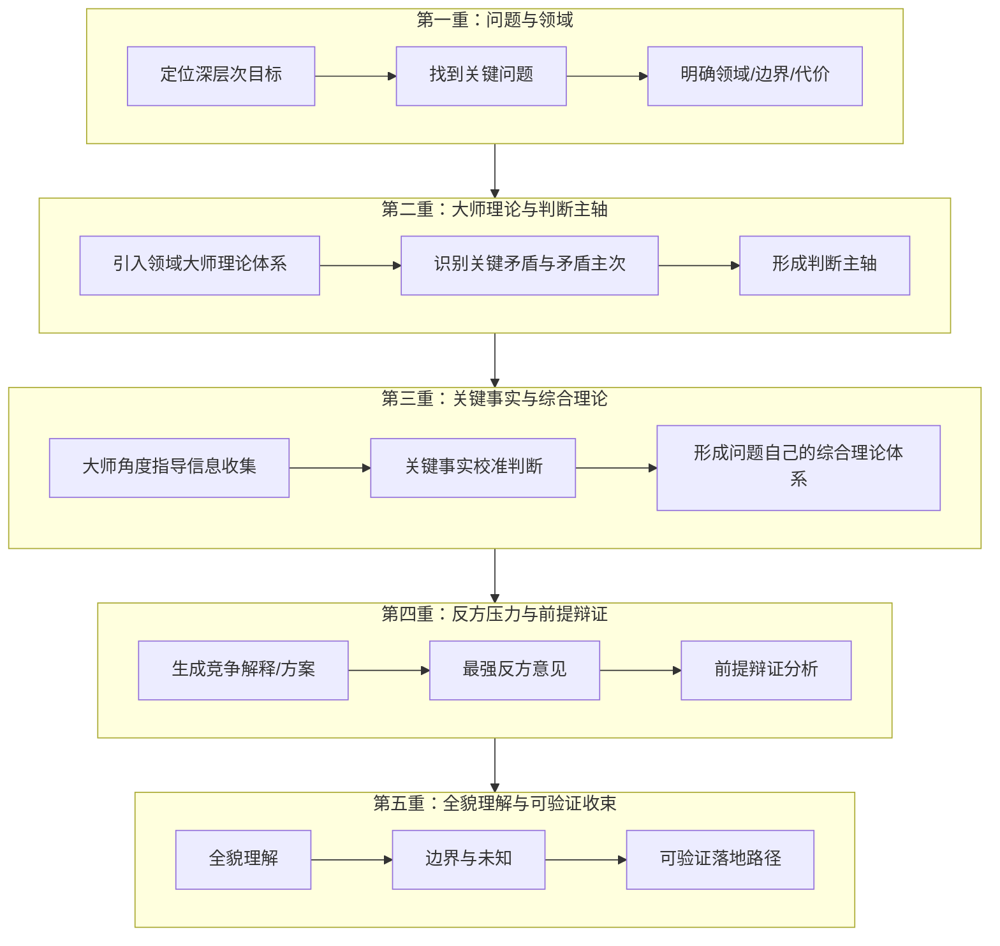

# AI 回答复杂问题总在敷衍？这项目让 Agent 像大师一样五重审视

你有没有遇到过这种情况——

问 AI 一个稍微复杂点的问题，比如"这个架构该怎么选"、"这个策略有没有坑"，它回了一堆正确的废话。看着面面俱到，实际等于什么都没说。

它没有真正理解你的问题场景，没有识别关键矛盾，没有考虑反方意见，没有告诉你结论的边界在哪里。

因为大多数 AI 的思考逻辑是"根据输入，生成最可能的输出"。这不是思考，这是填空。

但如果你能让它像领域大师一样思考呢？

---

## 这项目不是工具，是一套让 AI 学会"真正思考"的思维框架

GitHub 上有个项目叫 **Comprehensive Thinking Skill**，它不安装任何软件、不提供任何命令行，它就是一个 SKILL.md 文件。

但它的目标很猛——让 Codex 这类 Coding Agent 在面对复杂问题时，不再凭直觉填空，而是走一套完整的五重审视深度思考框架。

**核心公式：高质量结论 = 大师逻辑 × 关键事实**

---

## 为什么会有这个项目

项目文档里没藏着掖着，直接说了现在 AI 思考的常见问题：

- 把局部现象当全貌
- 把直觉、权威、历史经验当现实
- 只替自己的结论找支持，不考虑反方意见
- 输出一堆观点、建议、任务清单，但没有形成对问题的真正理解
- 不给边界，不说"什么情况下这套方案会失效"

说白了，就是看似说了很多，其实经不起追问。

这个框架要解决的就是这个——让 Agent 的思考过程可审阅、可验证、可反驳。

---

## 五重审视：每一层都要改变判断

这是整个框架的核心结构。不是填空式的栏目，而是每一层都必须真正改变判断：



每一重审视都必须显式输出"这一重审视改变了什么"。如果某一重没有改变判断，也必须说明为什么——是被前一重覆盖了，还是确实没有新增约束。

**这不是形式主义**。这套框架最狠的地方在于，它强迫每一层思考都必须产生实际增量。

---

## 它具体怎么让 AI 思考

### 1. 重新定义问题，而不是直接回答

基于用户的表层请求，先定位深层次目标。比如你说"帮我看看这个架构"，AI 不能直接开始评价，得先搞清楚：

- 深层次目标是什么？你要的是稳定性、可维护性、还是成本最优？
- 关键问题是什么？本轮真正要判断、设计、解释或选择什么？
- 边界在哪？哪些问题属于本轮，哪些不属于？
- 代价有多大？问题定义错了会损失什么？

### 2. 引入大师理论体系

这是最值钱的设计——不是让 AI 凭训练数据里的碎片知识回答，而是引入领域大师的成熟理论体系：

- 商业分析 → 商业模式画布
- 软件工程 → 一线成熟系统的架构说明、工程手册
- 战略规划 → 经典战略框架

每个理论体系要回答：它的核心概念是什么？它如何解释问题中的结果生成和演化机制？它的边界和失败场景在哪？

### 3. 识别关键矛盾，而不是罗列所有因素

不是所有问题因素都同等重要。框架要求识别：

- **主要矛盾** vs **次要矛盾**
- **矛盾主要方面** vs **矛盾次要方面**
- **判断主轴**：当前问题的核心抓手是什么
- **矛盾转化条件**：什么情况下主要矛盾会转化

用大白话说就是：别把 20 个因素都列一遍，告诉我哪 3 个真正决定了这件事的走向。

### 4. 最强反方意见，不是稻草人

很多 AI 的"反方意见"就是随便写两句"当然也有风险"然后继续推自己的结论。

这个框架要求：**站在反对者、失败案例、相反理论、现实约束和关键代价一侧，构造足以挑战当前理解的最有力反对理由。**

而且必须回答：什么情况下最强反方意见成立，并迫使当前结论降级、边界收缩或改道。

### 5. 前提辩证分析，标注来源

每个结论都有隐藏的前提。框架要求标注前提来源：

| 来源类型 | 含义 |
|----------|------|
| 事实 | 已有证据支持 |
| 推测 | 合理但未验证 |
| 迁移 | 来自其他领域或旧经验 |
| 权威 | 来自他人观点但未独立验证 |
| 脑补 | 只是直觉或叙事 |

然后必须输出分析后的判断动作：结论降级、边界收缩、补证动作、重建判断，或者前提通过。

### 6. 最终收束，落到可验证结果

复杂问题不能只输出观点。框架要求最终落到至少一种可执行结果：

- **证据**：真实文件、真实接口、真实页面、真实日志
- **实验**：最小验证、分段计时、对照实验、压力场景
- **实现**：代码改动、配置改动、架构边界守护
- **测试**：单测、回归、探索性验收
- **沉淀**：文档、规则、技能、失败案例

---

## 什么场景会触发这个框架

项目文档里列了非常具体的触发条件：

**通用触发：**
- 高复杂度：涉及多个因素、角色、阶段、系统或目标
- 高不确定性：信息不足，直觉可能误导
- 高代价：错误判断会损失时间、金钱、机会、信任
- 长期影响：当前选择会影响未来路径或系统演进
- 价值取舍：需要在效率、安全、收益、成本之间取舍
- 结构性原因：表面现象背后可能存在机制或认知问题
- 用户明确要求：全面思考、深度理解、系统性分析、帮我想清楚、从根上看

**项目与工程强化触发：**
- 多链路、多环境、多状态、多数据源判断
- 高风险业务真值：实盘交易、资金、账本、营收、客户资产、订单、券商接口、线上可用性
- 重要方案选择或系统性收口：架构调整、状态机设计、阶段验收、上线前检查

---

## 安装方式：零安装

这就是一个 SKILL.md 文件。对于 Codex 用户，放到对应目录即可：

```bash
# Codex CLI
git clone https://github.com/syzkillall/comprehensive-thinking-skill.git
# 将 SKILL.md 放到 ~/.codex/skills/ 或对应的 skill 目录
```

或者直接复制 SKILL.md 内容到你的 Agent 配置中。触发后，AI 会自动按五重审视结构输出。

---

**示例对话：**

```text
你: 帮我全面思考一下，这个微服务架构要不要拆成独立部署
AI: 收到，触发全面思考框架。

第一重审视：问题与领域
这一重审视改变了什么：
你的表层请求是"微服务要不要拆"，但深层次目标其实是"在当前团队规模和业务阶段下，找到成本和灵活性的最优平衡"。关键问题不是"能不能拆"，而是"拆了之后团队是否能维持"。

领域：软件工程架构 + 组织管理（康威定律）。

第二重审视：领域大师理论体系与判断主轴
这一重审视改变了什么：
引入康威定律——系统结构会镜像组织沟通结构。引入 Melvin Conway 的"organizations design systems that mirror their communication structure"。
判断主轴：团队沟通成本 > 技术拆分优雅度。如果团队只有 3 个人，拆成 6 个微服务反而增加沟通成本。

第三重审视：关键事实与综合理论体系
...

你: 好的，继续
AI: 第四重审视：反方压力与前提辩证分析
这一重审视改变了什么：
最强反方意见：当前架构已经能跑，拆了反而引入分布式事务和网络延迟风险。这个反方在"业务增长缓慢、团队熟悉单体"的条件下成立。但如果业务预期增长 3 倍，反方成立条件会减弱。

第五重审视：全貌理解与可验证收束
最终判断：建议暂不拆分，但先做模块化重构。验证路径：模块化后 3 个月，如果团队扩展至 8 人且模块间耦合度持续降低，再启动拆分。

可信度：中等偏高。主要依赖"团队规模判断"这个前提，如果团队招聘计划有变，结论需要重新审视。
```

---

**组合工作流示例（OpenClaw + Comprehensive Thinking Skill）：**

```text
你（对 OpenClaw）: 用全面思考帮我分析一下，现在要不要切到 QMT 实盘交易
AI（触发 comprehensive-thinking）:
  Step 1 ✅ 定位深层次目标：不是"能不能切"，而是"风险可控的前提下，何时切换收益最大"
  Step 2 ✅ 引入领域大师理论：金融工程的风险管理框架 + 软件工程的灰度发布策略
  Step 3 ✅ 识别关键矛盾：现有系统的稳定性 vs 新系统的功能优势
  Step 4 ✅ 最强反方意见：QMT 接口在极端行情下可能超时，当前模拟环境未覆盖熔断场景
  Step 5 ✅ 前提辩证分析：假设"QMT 接口稳定性 ≥ 当前系统"——这个前提需要至少 2 周的真实回测数据支撑，目前是推测
  Step 6 ✅ 最终判断：建议先灰度切换 10% 资金，观察 2 周再决定全量切换。验证指标：成交延迟、订单成功率、对账差异率
```

---

## 真的香的地方

- **不是又一个提示词模板**——它是一套有完整逻辑链条的思考框架，每一层都要求产生实际增量，不是填栏目
- **大师理论体系 + 关键事实 = 高质量结论**——这个公式比"让 AI 随便想想"靠谱得多
- **最强反方意见 + 前提辩证分析**——逼着 AI 考虑"我错了怎么办"，而不是只找支持自己结论的证据
- **可审阅、可验证**——整个思考过程是展开的，你能看到它每一步怎么想、为什么这么想

完整skill

```markdaown
name comprehensive-thinking  
description Use when Codex must make a high-quality judgment on any complex problem, not only technical problems. Trigger when a question has high complexity, uncertainty, cost of being wrong, long-term impact, value tradeoffs, possible structural causes, or when the user asks for 全面思考, 深度理解, 系统性分析, 帮我想清楚, 从根上看, 这件事到底怎么看, 方法论, 复杂问题拆解, 系统方案, 架构判断, 策略判断, or 根因分析. Also trigger for project and engineering high-risk scenarios such as multi-module, multi-environment, multi-data-source, multi-state, financial truth, live trading, ledger, revenue, customer assets, order governance, broker interfaces, online availability, major solution selection, and system closure.  
全面思考  
不可跳过的输出契约  
当用户显式触发“全面思考”、comprehensive-thinking、深度理解、系统性分析、帮我想清楚、从根上看、策略判断、架构判断或同等高责任复杂判断请求时，除非用户明确要求简短、只要结论或不要展开过程，否则输出必须采用五重审视结构。  
  
必须逐项输出：  
  
第一重审视：定义关键问题与领域  
第二重审视：领域大师理论体系与判断主轴  
第三重审视：关键事实与综合理论体系  
第四重审视：反方压力与结论前提辩证分析  
第五重审视：全貌理解与可验证收束  
最终判断  
每一重审视都必须显式写出“这一重审视改变了什么”。如果某一重审视没有改变判断，也必须说明它未产生新增约束、已被前一重覆盖，或因此将结论降级为假设、局部判断或待验证判断。  
  
不得用“关键问题、判断主轴、若干趋势、最强反方、最终判断”这类战略报告结构替代五重审视。不得只在内部完成五重审视却对外省略过程。只有用户明确要求压缩输出时，才可以使用自然压缩版；即便压缩，也必须保留关键矛盾、最强反方、前提辩证分析、边界与验证。  
  
核心  
高质量思考不是靠直觉、自信或权威评价，而是尽量接近问题的真实全貌，研究相关领域大师的理论体系和思考角度；由这些理论体系的思考角度指导关键真实信息的收集，再使用理论体系的思维逻辑和需要的关键信息进行系统化思考，进而把握对象关系、关键矛盾和矛盾主次，最终综合成针对当前问题和讨论对象的高阶理论体系。  
  
全面思考的核心产物是对讨论对象形成系统化、层次化、深刻且主次分明的理解，并在这种理解之上生成判断、方案。  
  
工作公式：  
  
高质量结论的思维逻辑 = 大师逻辑 × 关键事实  
高质量结论的思维过程 = 定位深层次的目标 × 找到关键问题 × 大师理论工具 × 关键真实信息 × 系统化思考 × 反方与前提压力测试 × 可验证收束  
  
重新定义问题 = 基于表层请求定位用户深层次的目标，继而找到关键问题  
高质量理论工具 = 大师理论体系 + 思考角度 + 思维逻辑  
关键真实信息 = 大师理论体系对问题进行推理所需要的信息  
系统化思考 = 使用大师理论体系和关键真实信息对问题进行系统化的推理  
反方与前提压力测试 = 最强反方意见 + 前提辩证分析 + 竞争解释  
可验证收束 = 全貌理解 + 方案边界 + 验证路径  
这里的“大师理论体系”是某个领域中长期有效、结构完整、能解释大量现象并指导行动的大师著作、系统化逻辑。  
  
大师理论体系提供高质量思维逻辑和思考角度，关键真实信息负责校准事实、提供高质量思考所需要的重要素材，系统化思考负责把思维逻辑和关键信息整合起来，关键矛盾暴露问题的判断主轴，矛盾主次让判断主次分明，前提辩证分析决定结论可信度。  
  
使用原则  
不把局部现象当全貌。  
不把直觉、权威、历史经验或当前代码当做现实。  
必须用大师思考角度指导关键真实信息收集，再用大师思维逻辑和关键信息进行系统化思考，进而把握对象关系和关键矛盾。参考辩证法中的“具体问题具体分析”“主要矛盾与次要矛盾”“矛盾主要方面与次要方面”，识别真正支配问题运动的矛盾、关系、力量和阶段，并说明哪些只是背景、条件、次要矛盾或表层现象。  
矛盾往往暴露理解边界、抽象层级、适用条件、隐含前提或尚未理解的更大全貌。  
所有推论、解释和方案都要拆出前提，并确认前提的正确。  
不让前提辩证分析停留在质疑表述；前提辩证分析必须由真实的信息产生判断动作。  
不只替自己的结论寻找支持；判断必须强制加入“最强反方意见”。最强反方意见不是稻草人反驳，而是站在反对者、失败案例、相反理论、现实约束和关键代价一侧，构造足以挑战当前理解或方案的最有力反对理由。  
不把输出目标降格为观点、建议或任务清单；全面思考首先要对讨论问题产生系统化、层次化、深刻的理解。  
不输出没有边界的建议；每个方案都要说明适用范围、风险、验证方式和不解决什么。  
对新问题，先承认直觉判断可能失效。  
五重审视  
复杂问题默认在内部完成五重审视，并默认对外采用可审阅展开版，逐层说明每一重审视“它改变了什么”。没有完成的审视必须显式说明，并把结论降级为假设、待查证判断或局部建议。  
  
第一重审视：定义关键问题与领域  
必须基于用户表层请求定位用户的深层次目标，围绕深层目标找到关键问题，再把关键问题改写成可判断、可验证的问题，定位问题所属的领域，如商业分析 、医学研究、软件工程、战略规划。  
  
审视重点：  
  
深层次目标清楚：用户表层请求背后的真实目标和成功标准是什么。  
关键问题清楚：基于深层次目标，本轮真正要判断、设计、解释或选择什么。  
边界清楚：本轮包含什么，不包含什么。  
代价清楚：问题定义错误会造成什么损失。  
领域清楚：有哪些领域的知识和问题最为相关。  
领域覆盖清楚：所选知识领域必须足以覆盖关键问题的主要机制、约束和判断标准。  
第二重审视：领域大师理论体系与判断主轴  
必须引入能够共同覆盖问题相关知识领域的大师成熟理论体系和经典著作，用这些理论体系的思考角度指导关键真实信息收集，再用理论体系蕴含的思维逻辑和收集到的关键信息进行系统化思考，关键公式是‘思考 = 逻辑 x 信息’，进而把握问题中的关键矛盾、矛盾主次，继而形成判断主轴。  
  
审视重点：  
  
所选理论体系组合必须覆盖关键问题相关的主要知识领域。  
大师理论体系规定了问题的判断逻辑、证据方向。  
关键矛盾说明了哪些元素与逻辑真正支配本轮判断，而不是把所有的信息与逻辑看成同等重要。  
矛盾主次说明了主要矛盾、次要矛盾、矛盾主要方面和矛盾次要方面分别是什么。  
判断主轴说明了当前问题的核心抓手是什么，哪些因素只是背景、条件或表层现象。  
若只列理论名称，没有改变判断，视为没有完成这一重审视。若看到很多因素但没有识别关键矛盾和矛盾主次，也视为没有完成这一重审视。  
  
第三重审视：关键事实与综合理论体系  
必须基于大师理论体系、大师思考角度、大师思考逻辑、关键矛盾和矛盾主次，收集能让判断主轴进行判断的事实和能够用于审视命题隐含的前提是否正确的事实，并加工成当前问题自己的综合理论体系。  
  
审视重点：  
  
高质量结论的思维逻辑 = 大师逻辑 × 关键事实，关键事实与大师逻辑决定了结论质量  
问题综合理论体系是当前问题自己的解释模型和行动判断底座，它是大师理论体系与关键事实的深度推演。  
综合理论体系必须展开讨论对象、核心命题、对象关系、关键矛盾、矛盾主次、事实来源、综合推理、推理整合链、系统化机制、深层机制、边界条件、反例与未知。  
必须说明大师思考角度如何指导事实筛选，关键事实如何校准判断主轴与对关键矛盾的识别，关键矛盾如何决定证据优先级和方案排序。  
必须让讨论对象变得更系统、更有层次、达到深层机制，同时让判断主次更分明。  
这是全面思考的核心步骤。若这一门只是摘要前面材料，或者没有形成“当前问题自己的理论结构”，整个全面思考就会流于形式。  
  
第四重审视：反方压力与结论前提辩证分析  
必须生成竞争解释或方案，强制加入最强反方意见，推理的结论由命题与逻辑生成，生成推理结论需要一个思维链与命题群，每个命题又会有隐藏的前提，需要对隐藏前提的真实性进行辩证分析。  
  
审视重点：  
  
候选解释或方案至少能形成真实竞争，而不是同义改写。  
最强反方意见必须真实有力，能挑战当前推荐理解或方案；不能写成容易击败的弱反驳。  
前提辩证分析必须标注关键前提来源：事实、推测、迁移、权威、脑补或叙事惯性。  
前提辩证分析必须检查三类失真风险：脑补过多、表面解决、局部止痛。  
推荐理解或方案必须能解释关键矛盾，能承受最强反方意见，且不依赖大量脑补前提。  
反方意见、结论前提辩证分析必须要有事实依据，不能凭空捏造，需要有置信度，不是无依据的质疑。  
第五重审视：全貌理解与可验证收束  
必须先判断本轮收束类型：一类是“全貌理解型”，最后输出一套对问题全貌的理解；另一类是“全貌理解 + 解决方案型”，先输出全貌理解，再给出解决方案全貌与可验证落地方式。  
  
审视重点：  
  
最终全貌理解说明我们如何理解这个问题和讨论对象，为什么这样理解。  
必须说明这套理解如何来自问题综合理论体系、关键真实信息、最强反方意见和竞争解释比较。  
必须说明讨论对象的系统化理解、层次化理解和深刻理解。  
必须说明这套理解意味着什么、不意味着什么、适用边界和未知在哪里。  
若需要解决方案，必须说明方案为什么成立、整体如何运转、可验证落地路径、成功信号、失败信号和转向条件。  
结论必须落到证据、实验、实现、测试、验收或文档沉淀之一。  
不能把所有问题都强行方案化，也不能用阶段清单替代理解本身。  
  
触发后的默认要求  
全面思考本身就是用于高责任、复杂判断的完整框架，一旦触发，就必须按完整框架推进。  
  
触发后必须完成五重审视，并在全面思考内部完成：  
  
定义关键问题与领域  
领域大师理论体系与判断主轴  
关键真实信息  
问题综合理论体系  
最强反方意见  
前提辩证分析  
竞争解释或方案  
边界与风险  
最终全貌理解  
可验证收束  
重点不是把栏目填满，而是防止思考空转。每一层展开都必须改变问题定义、领域判断、理论体系选择、关键矛盾、矛盾主次、证据选择、综合理论体系、最强反方意见、前提辩证分析、对象理解层次、解释或方案排序、风险边界、全貌理解、落地路径或验证标准之一。  
  
默认输出采用完全展开的可审阅版本。应先按五重审视详细展开说明每一重审视如何改变问题定义、领域判断、理论体系选择、关键矛盾、证据选择、综合理论体系、反方压力、前提辩证分析、结论边界或验证方式，再在最后收束为最终理解、判断或推荐方向，每一重审视必须详细展开思考过程。  
  
完全展开不是机械列出五项，也不是字段堆叠；每一重审视都必须用自然、简洁、可审阅的段落说明“它改变了什么”。如果某一重审视没有改变任何判断，必须说明它未产生新增约束或已被前一重审视覆盖。只有当用户明确要求简短、只要结论、不要展开过程，或场景明显很轻时，才可以压缩为自然判断版。  
  
反形式主义运行纪律  
全面思考必须防止把模板填满当作完成。每次触发后都要遵守以下纪律：  
  
能合并表达就合并表达，不为了凑门而拆门。  
每一重审视必须在内部改变判断；默认采用展开版说明每一重审视改变了什么，但表达上仍要避免字段堆叠和形式主义。  
理论思考角度必须落到关键矛盾；若只有概念罗列、关系罗列或理论摘录，没有主要矛盾、矛盾主次和判断抓手，必须重新处理。  
矛盾分析必须来自真实理论冲突、事实冲突、价值冲突、系统约束冲突或方案冲突，不能为了显得深刻而制造抽象矛盾。  
最强反方意见必须真实有力，能挑战当前推荐理解或方案；不能写成容易击败的弱反驳。  
前提辩证分析必须导致结论降级、边界收缩、补证动作、返回前序步骤重建判断，或明确确认关键前提已被证据支撑。  
最终输出必须让讨论对象变得更系统化、层次化、深刻；若只是给观点、建议或任务清单，没有形成对象理解，必须重新处理。  
真抓实干要求  
复杂问题不能只输出观点。每次全面思考都要尽量落到至少一种可执行结果：  
  
证据：真实文件、真实接口、真实页面、真实日志、官方资料  
实验：最小验证、分段计时、对照实验、压力场景  
实现：代码改动、配置改动、架构边界守护  
测试：单测、回归、探索性验收、浏览器验证、金融真值验证  
沉淀：文档、规则、技能、失败案例、Benchmark  
触发条件  
全面思考用于复杂判断问题，而不是普通问答。当问题不能只靠局部信息、单点经验或即时直觉可靠回答时，应触发。  
  
通用触发：  
  
高复杂度：涉及多个因素、角色、阶段、系统或目标。  
高不确定性：信息不足，直觉可能误导，需要先澄清事实、前提和边界。  
高代价：错误判断会损失时间、金钱、机会、信任、系统稳定性或长期方向。  
长期影响：当前选择会影响未来路径、组织结构、产品方向或系统演进。  
价值取舍：需要在效率、安全、收益、成本、体验、自由度、可维护性之间取舍。  
结构性原因：表面现象背后可能存在机制、激励、认知、约束、环境或历史路径问题。  
用户明确要求：全面思考、深度理解、系统性分析、帮我想清楚、从根上看、策略判断、架构判断、根因分析等。  
项目与工程强化触发：  
  
多链路、多环境、多状态、多数据源或多时间窗口判断。  
高风险业务真值：实盘交易、资金、账本、营收、客户资产、订单、券商接口、线上可用性。  
局部现象可能误导整体判断：接口 200 但数据不对、页面能打开但真值不对、超时但并非整体不可用。  
重要方案选择或系统性收口：架构调整、状态机设计、阶段验收、上线前检查、复杂 bug 关闭。  
当前项目关键正式链路：`VIRTUAL X 2.0` 的交易、账本、账户隔离、QMT、订单治理、Observation、RQAlpha、页面真值链等。  
工作流  
工作流与五重审视一致。执行时不要把问题拆成十几个栏目；优先用合并段落、关系表或小型概念图表达。  
  
1. 定义关键问题与领域  
必须输出或在内部完成：  
  
深层次目标：用户表层请求背后的真实目标和成功标准是什么？  
关键问题：基于深层次目标，本轮真正要判断、设计、解释或选择什么？  
边界：哪些内容属于本轮，哪些不属于？  
代价：问题定义错误或答案错误会造成什么损失？  
领域：有哪些领域的知识和问题最为相关？  
领域覆盖：所选知识领域是否足以覆盖关键问题的主要机制、约束和判断标准？  
2. 建立领域大师理论体系与判断主轴  
对关键知识领域寻找行业大师理论体系、官方规范、经典方法或一线系统经验，用于交叉校验和覆盖主要因果结构。  
  
优先顺序：  
  
行业大师的理论体系  
领域公认经典著作，涉及到商业领域必须选择《商业模式新生代》的商业画布  
长期被验证的实践框架、原始论文、官方规范、一线成熟系统的架构说明、工程手册  
领域专家的行业文章  
读取 references/master-theory-research.md，按其中模板提炼大师理论体系与大师思考角度。  
  
必须回答：  
  
这个体系要解决哪些关键问题？  
它的核心概念是什么？  
它如何解释问题中的结果生成、演化和改变机制？  
它要求我们从哪些思考角度理解真实世界？  
它的边界和失败场景是什么？  
它是否改写了原问题、判断标准、证据选择或方案排序？  
它与其他理论、事实或现实约束之间有哪些矛盾？  
它默认了哪些前提？这些前提在当前问题中是否成立？  
同时建立：  
  
对象关系：关键主体、状态、资源、动机、价值、约束、反馈、冲突、时间结构和外部环境如何相互作用。  
关键矛盾：哪些冲突真正支配本轮判断，为什么它比其他矛盾更关键。  
矛盾主次：主要矛盾、次要矛盾、矛盾主要方面和矛盾次要方面分别是什么。  
判断主轴：当前问题的核心抓手是什么，哪些因素只是背景、条件或表层现象。  
矛盾转化：什么事实、目标、时间窗口或边界变化会导致主要矛盾转化。  
3. 收集关键事实并形成综合理论体系  
不要堆砌信息。只收集能让判断分叉、解释关键矛盾、校准判断主轴，或用于审视、检验、削弱、推翻结论前提的关键真实信息：  
  
大师思考角度要求优先获取哪些真实对象、行为、指标或关系？  
关键矛盾要求优先验证哪个核心变量、核心关系或核心冲突？  
哪些证据会证明当前判断主轴错了，或者主要矛盾已经转化？  
哪些证据能解释关键矛盾为什么存在？  
哪些证据能检验、削弱或推翻最脆弱、最可能脑补、最可能影响结论的前提？  
哪些证据能证明问题不是表面症状，而是更深层结构问题？  
高风险或时效性问题要用当前证据，不要只靠记忆。  
  
随后形成问题综合理论体系。它不是外部理论摘录，也不是事实材料堆叠，而是当前问题自己的解释模型和行动判断底座。至少包含：  
  
讨论对象：本轮真正要理解的对象是什么。  
核心命题：这套理论最终如何解释当前问题。  
概念体系与概念关系：关键概念如何依赖、冲突、转化、反馈或互相约束。  
关键矛盾与矛盾主次：主要矛盾、次要矛盾、矛盾主要方面和矛盾次要方面是什么。  
判断主轴校准：哪些关键真实信息支撑或改变了当前判断主轴。  
对象结构与层次结构：讨论对象由哪些部分、关系、边界、状态、行为和反馈构成；表层现象、中层机制、深层结构分别是什么。  
矛盾地图与矛盾解释：关键矛盾来自时间尺度、分析对象、价值目标、抽象层级、边界条件、事实缺口还是前提不同。  
推理整合链：大师思考角度如何筛选事实，关键事实如何校准关键矛盾，矛盾主次如何组织事实并支撑核心命题。  
系统化机制与深层机制：什么机制解释了表层现象为什么发生、维持、放大或转向。  
边界条件、反例与未知：这套理论在哪些场景成立，哪些事实可能推翻它。  
行动含义：它如何改变候选解释或方案、风险边界、验证标准和转向条件。  
4. 做反方压力与结论前提辩证分析  
至少生成 2-3 个候选解释或方案，并加入最强反方意见：  
  
候选解释或方案分别能解释什么，解释不了什么。  
最强反方意见：如果反对当前推荐理解或方案，最有力的证据、理论、逻辑、代价、失败案例或现实约束是什么。  
反方成立条件：什么情况下最强反方意见成立，并迫使当前结论降级、边界收缩或改道。  
哪个解释或方案最能解释关键矛盾。  
哪个解释或方案依赖的脑补前提最少。  
哪个解释或方案最能承受最强反方意见。  
前提辩证分析必须标注来源：  
  
事实：已有证据支持  
推测：合理但未验证  
迁移：来自其他领域或旧经验  
权威：来自他人观点但未独立验证  
脑补：只是直觉或叙事  
前提辩证分析必须输出分析后的判断动作：  
  
结论降级：把确定结论降级为假设、局部判断或待验证判断。  
边界收缩：缩小结论或方案的适用场景、时间窗口、对象范围或环境条件。  
补证动作：说明缺什么证据、从哪里取得、如何验证、何时算补齐。  
重建判断：返回问题定义、理论思考角度、关键矛盾、关键事实、综合理论体系或候选解释重新处理。  
前提通过：明确说明关键前提已由哪些证据支撑，为什么暂不需要降级或补证。  
5. 收束为全貌理解，必要时给解决方案  
先判断收束类型：  
  
全貌理解型：最后输出一套对问题和讨论对象的全貌理解。  
全貌理解 + 解决方案型：先输出全貌理解，再给出解决方案全貌与可验证落地方式。  
最终全貌理解必须说明：  
  
为什么是这套理解：它如何来自综合理论体系、关键真实信息、最强反方意见和竞争解释比较。  
系统化理解：讨论对象由哪些部分、关系、层级、边界和反馈构成。  
层次化理解：表层现象、中层机制、深层结构分别是什么。  
深刻理解：真正决定对象运行、变化、失败或成功的关键机制是什么，哪些常见直觉会误解它。  
这套理解意味着什么，不意味着什么。  
边界与未知在哪里。  
后续用什么证据、现象、实验或反馈继续验证、修正或推翻它。  
如果需要解决方案，还必须说明：  
  
为什么是这套解决方案。  
方案作为一个整体如何运转。  
它会改变哪些业务结构、系统结构、职责边界、资源配置、风险分布或长期方向。  
为了让方案成立，必须完成哪些关键动作、依赖哪些条件、产出哪些结果、用哪些证据验证有效。  
什么信号表示方案正在生效，什么信号表示需要暂停、改道、回滚或重新判断。  
输出方式  
输出方式只提供组织方向，不是固定模板。默认使用完全展开的可审阅版本；必须优先保证表达自然、判断连贯、重点清楚，不得为了套标题牺牲真实思考。完全展开不是字段堆叠，而是把五重审视真正展开为“这一重审视改变了什么”。简单场景或用户明确要求简短时，可以压缩成几段自然判断。  
  
默认使用以下展开版：  
  
**第一重审视：问题与领域**  
这一重审视改变了什么：  
  
**第二重审视：领域大师理论体系与判断主轴**  
这一重审视改变了什么：  
  
**第三重审视：关键事实与综合理论体系**  
这一重审视改变了什么：  
  
**第四重审视：反方压力与结论前提辩证分析**  
这一重审视改变了什么：  
  
**第五重审视：全貌理解与可验证收束**  
这一重审视改变了什么：  
  
**最终判断**  
最后用一小段话给出当前最可靠的全貌理解或推荐方向，并说明结论可信度。  
当用户明确要求简短、只要结论、不要展开过程，或场景明显很轻时，才使用自然压缩版：  
  
**为什么这样理解**  
说明问题定义、主导领域、领域大师理论体系与判断主轴、关键矛盾、关键事实和综合理论体系如何共同生成这套理解。  
  
**关键矛盾与主次**  
说明主要矛盾、次要矛盾、矛盾主要方面、判断主轴，以及哪些因素只是背景、条件或表层现象。  
  
**反方与前提**  
给出最强反方意见，说明它是否削弱当前理解；列出最关键前提及分析后的判断动作。  
  
**边界与验证**  
说明这套理解适用于哪里、不解决什么、什么信号会推翻它，以及下一步落到证据、实验、实现、测试、验收或文档沉淀中的哪一种。  
  
**判断**  
最后用一小段话给出当前最可靠的全貌理解或推荐方向，并说明结论可信度。
```

---

## 这些角色会更适合

- **做架构决策的技术负责人** —— 方案选择、技术选型、架构调整这类高代价决策，让 AI 走完整框架
- **做策略判断的量化/交易团队** —— 资金管理、风险控制、策略上线这类场景，多一层思考少一层风险
- **写技术方案评审的工程师** —— 方案评审时用这个框架对照检查，不容易漏掉关键矛盾
- **需要深度分析的产品/运营负责人** —— 商业分析、战略规划、竞争分析，让 AI 先走框架再给结论
- **任何对 AI 输出质量有高要求的重度用户** —— 如果你受够了"正确的废话"，这个框架能强制 AI 认真思考

---

## 用之前最好知道的边界

项目文档里写得清楚：

- **这不是一个通用问答工具**——它只在高复杂度、高不确定性、高代价的场景下触发。普通问题强行走完整框架反而显得啰嗦。
- **大师理论体系的引入质量取决于 Agent 的知识储备**——如果 Agent 本身对某个领域的大师理论了解有限，这一层的价值会打折扣。框架要求优先使用行业大师的理论体系，但实际效果依赖于 Agent 的领域知识。
- **默认输出是展开版，篇幅较长**——完全展开的五重审视会输出很长的内容。用户需要明确要求压缩时，才能用自然压缩版。
- **框架的纪律性要求很高**——"能合并表达就合并表达，不为了凑门而拆门"、"矛盾分析必须来自真实冲突，不能为了显得深刻而制造抽象矛盾"——这些是强制纪律，但最终执行效果取决于 Agent 的遵守程度。
- **目前主要是 Codex 生态**——项目名称和触发机制主要针对 Codex CLI，但 SKILL.md 格式理论上兼容其他 Agent 平台。

https://github.com/syzkillall/comprehensive-thinking-skill/tree/main

---

**别指望它能让 AI 回答所有问题都变深刻。但在那些"这次判断错了代价很大"的场景里，多走一遍五重审视，比多问三遍 AI 有用得多。**

---

 #全面思考 #思维框架 #ComprehensiveThinking #AIAgent #Codex #深度思考 #复杂问题 #决策框架 #开源项目 #AI思考 #前提辩证 #反方压力