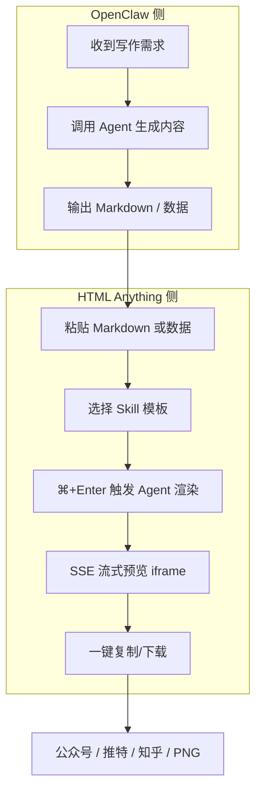

# 写文档还在用 Markdown？这项目让 Agent 直接给你出 HTML

你有没有遇到过这种场景——

花半小时写好一篇 Markdown，排版自以为还行，粘到公众号发现标题字号全崩，截图发推又丑得自己都不想点开看。

Markdown 这东西，给作者是爽了，给读者？算了吧。

Claude Code 团队自己早就不干了。他们发推说过一句很直接的话：Markdown 是草稿，HTML 才是给人读的成品。

但你总不能自己手写 CSS 去调每个文档吧？

所以这项目就来了。

---

## 核心就一句话：让本地 Agent 直接写 HTML，你只管输入

GitHub 上有个叫 **HTML Anything** 的开源项目，40k+ Star，来自 Open Design 团队。

它不是又一个 Markdown 编辑器。它是站在 Agent 时代角度重新做的一件事——

既然你已经不亲手改文档了，全都交给 Claude、Codex 这些 Coding Agent 来写了，那 Agent 的输出就该直接是读者能看的 HTML，而不是一个还得二次加工的 Markdown 中间态。

**本地优先、零 API Key、复用你已经登录好的 CLI session。**

---

## 它解决了什么具体的破事

项目说明里列了几个对比，看完基本就懂了：

| 场景 | Markdown | HTML Anything |
|------|----------|---------------|
| 写作体验 | 作者爽 | 作者只管输入 |
| 读者体验 | 排版受限 | 排版无限自由 |
| 截图发推 | 丑得离谱 | 直接是好看的图 |
| 粘公众号 | 要重排 | 一键格式转换 |

放到真实工作里，这意味着——

你写完东西，不用再纠结"这段放公众号要调什么字号、发推要截什么比例"。Agent 直接给你一份可交付的 HTML，粘到哪就是哪。

---

## 75 套 Skill 模板，覆盖 9 类输出场景

这是项目最值钱的部分。

**75 套 Skill**，每套都是一个文件夹，里面是 SKILL.md + 示例文件。说白了就是一套套设计好的 HTML 模板 + AI 提示词，告诉 Agent "按这个风格出 HTML"。

按场景分了几大类：

**幻灯片类（20 套）**
- 墨水风 PPT —— 10 套锁死版面 × 5 套调色板，纸感印刷质感，开起来像电子杂志
- 瑞士国际主义 PPT —— 16 列网格 + 单一饱和 accent 色，开会时让人觉得"这一定是设计师做的"

**文档类**
- 暖羊皮纸 editorial 系统 —— #f5f4ed 底色 + 单一线字体，长报告、简历、读书笔记都能套

**社交卡片**
- X / 小红书 / Spotify / Reddit 风格卡片

**海报 / 视频**
- 报纸风长图海报 —— 巨字 serif headline + 双栏正文
- Hyperframes 视频帧 —— 直接出 1920×1080 帧脚本，交给 Remotion 渲成 mp4

**办公文档**
- PM 规格书、工程 Runbook、财务报告、HR Onboarding、OKR、周报、会议纪要……

每套 Skill 还硬编码了中文优先字体栈（Noto Sans/Serif SC）、8px 基线网格、颜色对比度 ≥ 4.5 的约束。这不是 AI 随便生成的垃圾排版，是一套有设计准则的产出系统。

---

## 识别的 Agent 列表，比你想的齐全

项目启动时会扫描 PATH，自动识别你电脑上装了的 Coding Agent CLI。支持 9 个：

| Agent | 检测命令 |
|-------|----------|
| Claude Code | claude |
| OpenAI Codex | codex |
| Cursor Agent | cursor-agent |
| Gemini CLI | gemini |
| GitHub Copilot CLI | copilot |
| OpenCode | opencode-cli |
| Qwen Coder | qwen |
| Aider | aider |
| IBM Bob | bob |

扫描路径覆盖了 `~/.local/bin`、`~/.bun/bin`、`/opt/homebrew/bin`、`~/.npm-global/bin` 这些 GUI 启动容易漏掉的目录。顶栏一键切换，选中哪个用哪个。

**零 API Key** —— 直接复用你在终端已经登录好的 `claude login`、`cursor login`、`gemini auth` session。订阅复用 = 0 边际成本。

---

## 上手成本：真的不高

本地跑起来的命令就这么几行：

```bash
git clone https://github.com/nexu-io/html-anything
cd html-anything
pnpm install
pnpm -F @html-anything/next dev
# → http://localhost:3000
```

打开浏览器，顶栏自动列出你已经登录好的本地 Agent，选一个模板，粘贴内容，`⌘+Enter` 出 HTML。

---

**示例对话：**

```text
你: 我 clone 下来了，pnpm install 跑完，现在 http://localhost:3000 打开了
AI: 看到了。顶栏是不是已经列出你的 Agent 了？
你: 对，Claude Code 亮着，还有个 Codex 的选项
AI: 先选 Claude Code，然后右边挑一个模板。你想出什么？
你: 一篇技术复盘，之前写好的 Markdown 直接粘进去
AI: 选 Kami 暖羊皮纸那个模板，文档类，适合长报告。粘进去按 ⌘+Enter
你: 出来了！iframe 里实时刷新，跟在终端看 AI 写代码一样
AI: 对的，SSE 流式渲染，写一行推一行。不满意直接打断重来，不浪费 token
你: 试了下粘到公众号，样式全保留了
AI: juice 内联了 CSS，微信公众号直接显示，不需要二次调整
```

---

**组合工作流示例（以 OpenClaw + HTML Anything 配合为例）：**



这流程走下来，OpenClaw 负责内容生成和决策，HTML Anything 负责把内容变成可直接交付的 HTML。中间不涉及任何手动排版。

---

## 真的香的地方

- **75 套 Skill 开箱即用**，且每套都带设计约束，不是 AI 乱排的垃圾。新增一个 Skill 只需要 fork 文件夹、改 frontmatter、重启 dev server，picker 里就会出现。
- **SSE 流式渲染** —— Agent 输出一行，iframe 刷新一行。跟在终端看 AI 写代码一模一样，不满意随时打断。
- **一键发布到主流平台** —— 公众号粘过去 0 调整、推特直接出 2× PNG、知乎公式自动渲染。单文件 .html 和 .png 都能下载。

---

## 这些角色会更适合

- **写公众号/知乎的技术作者** —— 不用在编辑器里调半天样式，Agent 出 HTML 直接粘
- **团队里经常做 PPT 的同学** —— 20 套幻灯片 Skill 够用了，墨水风、瑞士国际主义风格都有
- **产品经理写 PRD / 规格书** —— Office 类 Skill 覆盖了 PM 规格书、OKR、周报、会议纪要
- **需要频繁出数据报告的人** —— 数据可视化 Skill + CSV/Excel 自动识别
- **做视频内容的团队** —— Hyperframes 视频帧脚本 + Remotion 渲染，直接出片头片尾

---

## 用之前最好知道的边界

项目说明里写得很清楚：

- Agent 永远跑在本地，Web 层可以部署到 Vercel —— 但 Web 层不处理 Agent 逻辑，你的数据不会上传
- iframe 预览使用 `sandbox="allow-scripts allow-same-origin"`，第三方脚本可以跑但隔离运行，不污染宿主页面
- **多模板对比预览**（同一份内容生成 4 张候选）还在开发中
- Hyperframes → .mp4 一键渲染也是进行中状态
- 浏览器扩展、历史记录、Skill 市场都在计划里，当前版本还没有

现状是：核心闭环已经跑通 —— 识别 Agent → 选 Skill → SSE 流式渲染 → iframe 预览 → 一键导出。这 5 步是稳定的。

---

**别想着用它替代你全部的工作流。但在「内容写好了，就差一份体面输出」的那一刻，它是真好使。**

---

 #HTML编辑器 #Agent时代 #开源项目 #ClaudeCode #CodingAgent #写作工具 #本地优先 #零APIKey #Skill模板 #SSE流式渲染 #微信公众号排版