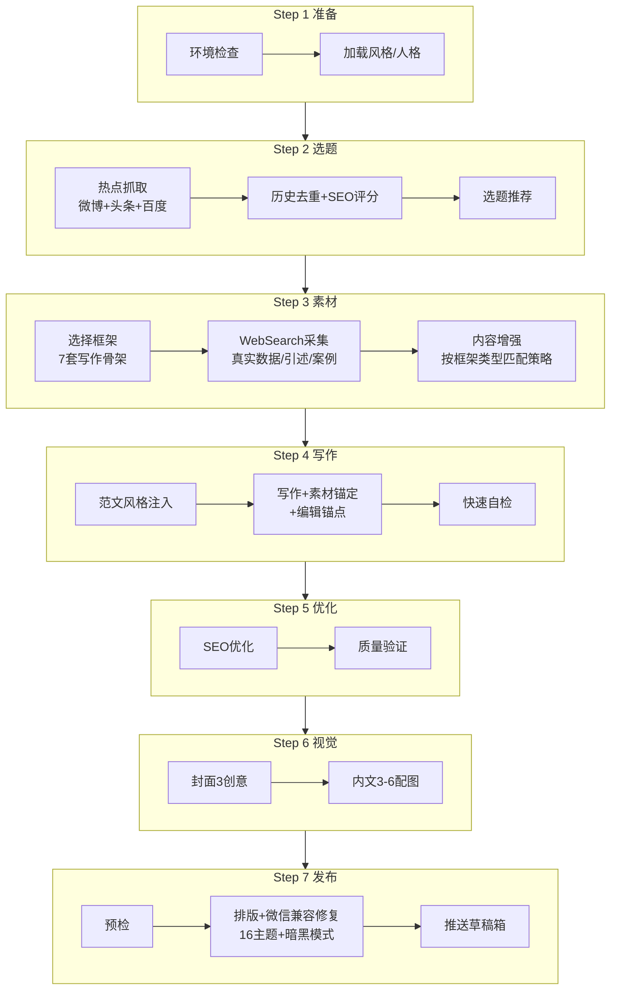

# 公众号写作还在手动抓热点调排版？这项目一条命令全干了

> wewrite: 公众号文章全流程 — 热点抓取 → 选题 → 写作 → SEO → 视觉 AI → 排版 → 微信草稿箱

做过公众号的都懂——

想追热点，得去微博、头条、百度手动翻榜单。选题没方向，写一半不知道往哪走。排版调半天，发布出去暗黑模式颜色全崩。配图用 AI 生吧，还得切好几个工具来回倒。

写一篇文章，实际花在写上面的时间，不到一半。

剩下的都在干杂活。

---

## 这项目就是一个全套的公众号 AI 工作流

GitHub 上有个叫 **WeWrite** 的项目，定位非常直接——

公众号文章全流程 AI Skill。从热点抓取到草稿箱推送，一句话搞定。

兼容 Claude Code 和 OpenClaw 的 skill 格式。安装之后说一句"写一篇公众号文章"，它就自己走完整条线。

[GitHub - oaker-io/wewrite: 公众号文章全流程 AI Skill for Claude Code — 热点抓取 → 选题 → 写作 → SEO → 视觉 AI → 排版 → 微信草稿箱

---

## 整条流水线长什么样



8 个步骤串下来，从"我今天想写点东西"到"文章已经在草稿箱了"，全自动。说"交互模式"可以在选题、框架、配图处暂停让你确认。

---

## 最值钱的设计：写作人格 + 范文风格库

这项目最让人的一点是，它不是让 AI 随便写。

**5 套写作人格预设：**

| 人格 | 适合 | 风格特点 |
|------|------|----------|
| midnight-friend | 个人号/自媒体 | 极度口语化、高自我怀疑、每段第一人称 |
| warm-editor | 生活/文化/情感 | 温暖叙事、故事嵌套数据、柔和情绪弧 |
| industry-observer | 行业媒体/分析 | 中性分析、数据先行、稳中带刺 |
| sharp-journalist | 新闻/评论 | 犀利简洁、数据驱动、强观点 |
| cold-analyst | 财经/投研 | 冷静克制、逻辑链条、风险意识强 |

选人格就像选排版主题一样，在 `style.yaml` 里一行搞定：

```yaml
writing_persona: "midnight-friend"
```

**范文风格库**就更骚了——你可以把自己已发布的文章导入进去，写作时自动注入你的风格指纹。句长节奏、情绪表达、转折方式这些细节，AI 会学着来。

配合"学习飞轮"：每次你手动编辑后说"学习我的修改"，下次初稿就更接近你的风格。

---

## 7 套写作框架 + 内容增强策略

不是所有文章都用一个套路写。WeWrite 准备了 7 套写作骨架，按场景匹配：

- **痛点文** — 先抛问题再给方案
- **故事文** — 叙事驱动，锚定真实细节
- **清单文** — 信息密度高，适合干货
- **对比文** — 注入真实用户体感
- **热点解读** — 找反直觉角度
- **纯观点** — 立场鲜明
- **复盘文** — 经验总结

选了框架之后，内容增强还会自动匹配策略：热点文找反直觉角度、干货文强化信息密度、故事文锚定真实细节、对比文注入真实用户体感。

不是 AI 瞎编，是真去 WebSearch 抓真实数据来锚定。

---

## 16+ 排版主题，微信暗黑模式全兼容

排版这块覆盖得很全：

| 类别 | 主题 |
|------|------|
| 通用 | professional-clean（默认）、minimal、newspaper |
| 科技 | tech-modern、bytedance、github |
| 文艺 | warm-editorial、sspai、ink、elegant-rose |
| 商务 | bold-navy、minimal-gold、bold-green |
| 风格 | bauhaus、focus-red、midnight |

所有主题都支持微信暗黑模式。内置了一批自动修复规则：

- 外链被屏蔽 → 转为上标编号脚注 + 文末参考链接
- 中英混排无间距 → 自动加空格
- 加粗标点渲染异常 → 标点移到 `</strong>` 外
- 原生列表不稳定 → 转样式化 `<section>`
- 暗黑模式颜色反转 → 注入 `data-darkmode-*` 属性
- `<style>` 被剥离 → 所有 CSS 内联注入

甚至支持从任意公众号文章 URL 提取排版主题，学过来自己用。

---

## 安装成本：Skill 化，一行命令搞定

针对不同 Agent 平台，安装方式都一样简单：

**Claude Code：**
```bash
git clone --depth 1 https://github.com/oaker-io/wewrite.git ~/.claude/skills/wewrite
cd ~/.claude/skills/wewrite && bash install.sh
```

**OpenClaw：**
```bash
git clone --depth 1 https://github.com/oaker-io/wewrite.git ~/.openclaw/skills/wewrite
cd ~/.openclaw/skills/wewrite && bash install.sh
```

**Codex（OpenAI Codex CLI）：**
```bash
git clone --depth 1 https://github.com/oaker-io/wewrite.git ~/.codex/skills/wewrite
cd ~/.codex/skills/wewrite && bash install.sh
python3 scripts/build_codex.py --install
```

`install.sh` 会在 `.venv` 里创建隔离环境并安装依赖，自动绕过 macOS Homebrew Python 的 PEP 668 限制。Skill 运行时会自动使用该 venv，无需手动 activate。

---

**示例对话：**

```text
你: 刚装完 WeWrite，说"写一篇公众号文章"就行？
AI: 对。首次运行会引导你设置公众号风格，之后一句话就能跑。
你: 热点怎么来的？
AI: 自动抓微博、头条、百度热搜，去重后结合 SEO 评分推荐选题。你也可以指定主题。
你: 那我配图怎么搞？
AI: 需要配一下图片 API key。不配也能用，会自动降级为本地 HTML + 输出图片提示词。
你: 写完能直接发到公众号？
AI: 需要填一下微信公众号的 appid/secret。不填也能生成预览，自己粘到公众号编辑器里。
```

---

**组合工作流示例（OpenClaw + WeWrite）：**

```text
你（对 OpenClaw）: 用 WeWrite 写一篇关于 AI Agent 的公众号文章
AI（WeWrite 流程触发）:
  Step 1 ✅ 环境检查 → 加载 midnight-friend 人格
  Step 2 ✅ 热点抓取 → 发现"AI Agent 落地难"话题 → SEO 评分 87
  Step 3 ✅ 选中"热点解读"框架 → 采集 3 篇真实案例 → 找反直觉角度
  Step 4 ✅ 范文风格注入 → 写作 + 素材锚定 → 生成 2 个编辑锚点
  Step 5 ✅ SEO 优化 → 标题策略建议
  Step 6 ✅ 封面 + 3 张内文配图生成
  Step 7 ✅ sspai 主题排版 → 微信兼容修复 → 草稿箱推送
  Step 8 ✅ 写入历史 → 附编辑建议 + 飞轮提示
你: 收到，我加两段自己的话再发布
```

---

## 真的香的地方

- **全流程自动化**——从热点抓取到推送草稿箱，8 个步骤一条命令走完。这不是一个写作助手，是一个完整的公众号运营流水线。
- **范文风格库 + 学习飞轮**——用越多越像你。导入已发布文章后，风格指纹会逐渐对齐你的写作习惯。这个飞轮设计是在解决 AI 写作最大的问题——千篇一律。
- **16+ 排版主题 + 微信暗黑兼容**——排版不是事后补的，是工作流的一部分。而且能通过 URL 学习别人的排版主题。
- **安装即用，零门槛**——Skill 化安装，一个 clone 一个 install.sh 就完事。不配 API 也能用，只是会降级。

---

## 这些角色会更适合

- **公众号运营 / 自媒体人** —— 每天追热点、写稿、排版的整套流程都能省掉
- **团队内容负责人** —— 一个人定方向、AI 出初稿、人工过编辑锚点再发布
- **需要稳定日更的个人号主** —— 写作人格 + 范文风格库能让产出保持风格一致性
- **做小绿书（图片帖）的内容创作者** —— 横滑轮播、3:4 比例、最多 20 张，一条命令生成

---

## 用之前最好知道的边界

项目说明里写得很清楚：

- **不配 API 也能用**，但热点抓取、AI 配图、公众号推送这些功能会降级。完整体验需要配微信公众号 appid/secret 和图片 API key。
- **编辑锚点机制是核心**——生成的文章会有 2-3 个位置标记"在这里加一句你自己的话"。目的是让你花 3-5 分钟加入自己的观点，从"AI 初稿"变成"你的作品"。不是生成完就能直接发的。
- **学习飞轮需要你主动触发**——手动编辑后说"学习我的修改"，飞轮才会记录。不触发就不学习。
- 默认是全自动模式。说"交互模式"才能在选题/框架/配图处暂停让你选择。
- **Codex 没有 SKILL.md 自动触发机制**，需要用 `/wewrite` 前缀命令。源 SKILL.md 更新后需重跑 `build_codex.py --install` 同步。

---

**别指望 AI 能替你思考和表达。但它能帮你把写稿前和写稿后的所有杂活全干了——这已经很够了。**

https://github.com/oaker-io/wewrite
---

#推荐标签 #WeWrite #公众号写作 #AI写作 #开源项目 #ClaudeCode #OpenClaw #热点抓取 #微信排版 #自媒体工具 #写作工作流 #学习飞轮 #小绿书