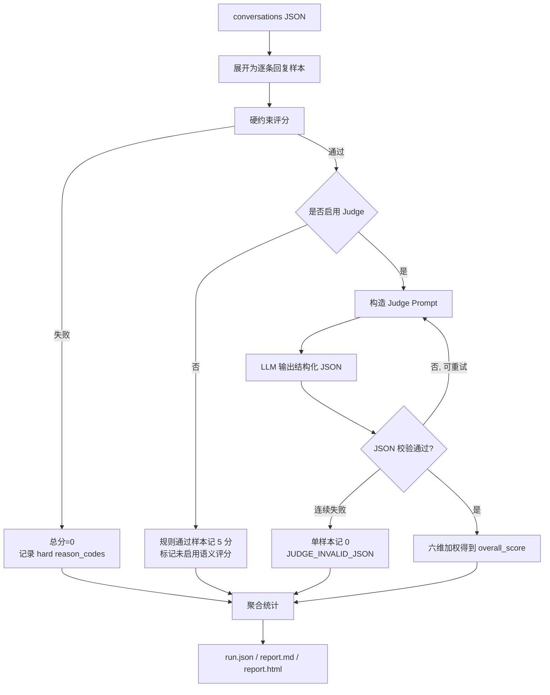
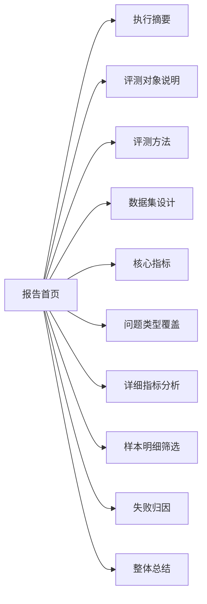

# 对话质量评测怎么落地：从规则门禁、LLM Judge 到可运营的质量报告

> 最近新起了几个 AI-IM 客服的项目，需要做评测，基于一个真实的 Agent 评测工程实践整理，重点说明“对话质量评估”如何从一份 conversations JSON，落到可复现评分、可追踪归因、可运营报告。示例业务以微信销售回复为背景，方法本身适用于客服、销售、问答助手等多轮对话场景。

## 1. 为什么需要单独做“对话质量评测”

很多 Agent 评测一开始只看“有没有回答出来”。但真实业务对话不是单题问答，它还有更硬的上线要求：

| 评测问题 | 普通问答评测容易忽略的点 | 对话质量评测要补上的能力 |
|---|---|---|
| 回复是否能用 | 只看语义是否相关 | 先检查格式、安全、业务禁用话术 |
| 是否符合上下文 | 单轮问题可能看起来正确 | 比对历史中的车型、价格、客户意图 |
| 是否符合业务节奏 | 模型可能过度营销 | 根据 `need_invite` 判断该不该邀约 |
| 是否能定位问题 | 只有总分不可治理 | 输出原因码、证据、改进建议 |
| 是否能持续回归 | 手工看样本不可复现 | 固化 `run.json`、`report.md`、`report.html` |

所以这个方向的目标不是“让 LLM 给个分”这么简单，而是建立一条可重复执行的质量流水线：规则先兜底，Judge 再细评，报告最后服务运营和研发排障。

## 2. 工程入口：一个独立的 `score-replies` 命令

项目没有另起复杂平台，而是在现有 `agent-eval` CLI 下增加了一个明确入口：

```bash
uv run agent-eval score-replies \
  --input src/conv-quality-eval/tcc_wechat_new.json \
  --output runs \
  --with-judge \
  --limit 20
```

核心参数很少：

| 参数 | 作用 |
|---|---|
| `--input` | 原始 conversations JSON |
| `--output` | 评测产物目录，默认 `runs` |
| `--with-judge / --no-with-judge` | 是否启用 LLM Judge |
| `--limit` | dry-run 时只评测前 N 条 |
| `--model` | 指定 Judge 模型 |

这一层的设计取舍很关键：对话质量评测不侵入原来的通用 `agent-eval run` 报告，只新增面向回复质量的独立流水线。

## 3. 数据读取：保留原始 conversations 结构

输入不是重新设计一套 YAML 用例，而是直接读取已有 conversations JSON。加载逻辑会把每个会话组里的多轮消息展开成单条待评测样本，并补充 `group_index`、`turn_index`：

```python
def load_conversations(path, *, limit=None):
    data = json.loads(Path(path).read_text(encoding="utf-8"))
    rows = []
    for group_index, group in enumerate(data, start=1):
        for turn_index, item in enumerate(group.get("conversations", []), start=1):
            row = dict(item)
            row["group_index"] = group_index
            row["turn_index"] = turn_index
            rows.append(row)
            if limit is not None and len(rows) >= limit:
                return rows
    return rows
```

这样做的好处是简单：已有数据不需要二次转换，评测报告还能按首轮/多轮拆解质量变化。

## 4. 两阶段评分：硬规则一票否决 + LLM Judge 六维评分

整体流程如下：



### 4.1 第一阶段：硬规则门禁

硬约束回答的是：“这条回复有没有资格进入语义评分？”

当前实现包含六类检查：

| 检查项 | 目的 | 失败原因码 |
|---|---|---|
| `format_ok` | 回复不能空、过短或无有效文本 | `FORMAT_INVALID` |
| `context_ok` | 避免和历史价格、车型冲突 | `CONTEXT_CONFLICT` |
| `invite_ok` | `need_invite` 与邀约话术一致 | `INVITE_MISSING` |
| `relevance_ok` | 不能明显回避用户问题 | `EVASIVE_REPLY` |
| `safety_ok` | 基础安全表达过滤 | `UNSAFE_CONTENT` |
| `business_rule_ok` | 禁用业务话术、链接、发送动作 | `BUSINESS_RULE_VIOLATION` |

伪代码非常直接：

```python
hard = score_hard_constraints(item)
if not hard.passed:
    score = 0
else:
    score = weighted_score(judge.evaluate(item))
```

这个“一票否决”很重要。比如回复里出现 URL、让客户“加微信”、或者把事实里没有的车况说成“准新车”，即使语气自然、句子完整，也不能让语义分掩盖业务红线。

### 4.2 第二阶段：LLM Judge 六维评分

硬规则通过后，才进入 LLM-as-Judge。Judge Prompt 中会注入：

- `history`
- `question`
- `reply`
- `intents`
- `need_invite`
- `source`
- `priority`
- `question_type`
- `primary_question_type`
- `turn_index`
- `best_skill.md` 中的业务规则

Judge 必须返回结构化 JSON，包含六个评分字段：

| 维度 | 字段 | 权重 |
|---|---|---:|
| 意图理解 | `intent_understanding` | 0.20 |
| 回答完整性 | `answer_completeness` | 0.20 |
| 上下文一致性 | `context_consistency` | 0.15 |
| 事实准确性/业务合规 | `business_compliance` | 0.20 |
| 销售转化能力 | `conversion_quality` | 0.15 |
| 表达质量 | `expression_quality` | 0.10 |

综合分是 1-5 分制加权平均。`conversion_quality` 支持 `"NA"`：当 `need_invite=0` 且确实不需要转化推动时，这个维度可以不参与分母，避免强行鼓励过度营销。

```python
def _weighted_score(semantic):
    total_weight = 0.0
    total = 0.0
    for key, value in semantic.scores.items():
        if value == "NA":
            continue
        _, weight = DIMENSIONS[key]
        numeric = max(0.0, min(5.0, float(value)))
        total += numeric * weight
        total_weight += weight
    return total / total_weight if total_weight else 0
```

等级映射也固定下来：

| 分数区间 | 等级 |
|---|---|
| 4.5-5.0 | 优秀 |
| 3.5-4.4 | 良好 |
| 2.5-3.4 | 一般 |
| 1.0-2.4 | 较差 |
| 0 | 不合格 |

## 5. LLM 输出不稳定怎么办：重试，但不让单条失败拖垮整批

LLM Judge 的风险在于：模型可能输出非 JSON，或者漏字段。实现里做了两层保护。

第一层是格式修复重试：第一次解析失败后，把错误信息拼回 prompt，要求模型只输出合法 JSON。

第二层是单样本隔离：如果连续失败，不中断整批评测，而是把当前样本标为 `JUDGE_INVALID_JSON`，综合分记 0，并在报告中提示重跑或切换更稳定的 Judge 模型。

```python
try:
    semantic = judge.evaluate(item)
except Exception as exc:
    semantic = _judge_failure_score(exc)
```

这比“整批任务失败”更适合离线评测。业务侧通常更关心这批数据整体质量和失败分布，而不是因为某一条模型格式错误丢掉全部结果。

## 6. 聚合分析：报告不是展示样本，而是定位问题

每条样本评分后，会进入聚合层。当前聚合维度包括：

| 聚合项 | 用途 |
|---|---|
| `by_intent` | 看哪些意图类型容易低分 |
| `by_need_invite` | 看邀约与非邀约场景是否失衡 |
| `by_source` | 对比真实样本与构造样本 |
| `by_turn` | 对比首轮与多轮表现 |
| `by_priority` | 重点关注 P0/P1 高优先级问题 |
| `by_primary_question_type` | 看主问题类型覆盖和均分 |
| `failure_reasons` | 统计硬约束失败原因 |
| `reason_codes` | 统计硬规则和语义原因码 |
| `question_type_reason_codes` | 做“问题类型 × 原因码”交叉分析 |
| `by_dimension` | 看六维语义均分，找最弱指标 |

其中 `by_primary_question_type` 对回归集特别有价值，因为它能回答一个管理问题：我们的评测集是不是只覆盖了少数热门问题？P0 场景够不够？真实样本占比够不够？

```python
{
  "车况/事故/检测": {
    "count": 12,
    "P0": 8,
    "P1": 3,
    "P2": 1,
    "invite_yes": 9,
    "invite_no": 3,
    "real_samples": 10,
    "failed": 2,
    "average_score": 4.1
  }
}
```

## 7. 最终报告长什么样

每次执行都会生成一个独立目录：

```text
runs/conv-quality-<timestamp>Z/
├── run.json
├── report.md
└── report.html
```

三份产物各有用途：

| 文件 | 面向对象 | 用途 |
|---|---|---|
| `run.json` | 工程侧 | 保留完整结构化结果，便于二次分析和回归对比 |
| `report.md` | 研发/测试侧 | 轻量台账，可直接读、可进文档系统 |
| `report.html` | 业务/管理侧 | 单文件可视化报告，离线打开即可查看 |

HTML 报告采用纸质台账风格，不依赖前端构建，也不引入图表库。主要区域包括：



样本明细支持筛选：

- 全部
- 失败
- 通过
- P0
- P1
- P2

失败归因区会展示：

- 失败原因说明
- 原因码统计
- 问题类型 × 原因码
- 低分样本改进建议

这让报告不只是“好看”，而是能直接回答治理问题：是邀约策略错了？多轮上下文掉了？某类问题覆盖不足？还是 Judge 输出不稳定？

## 8. 一个小样例：报告摘要会呈现哪些指标

一次 dry-run 可能得到这样的结构化摘要：

```json
{
  "summary": {
    "total_cases": 2,
    "passed_cases": 2,
    "failed_cases": 0,
    "pass_rate": 100.0,
    "average_score": 5.0,
    "grade_distribution": {
      "优秀": 2
    }
  },
  "aggregates": {
    "by_primary_question_type": "...",
    "by_priority": "...",
    "reason_codes": "...",
    "by_dimension": "..."
  }
}
```

HTML 首页会突出：

| 指标 | 展示方式 |
|---|---|
| 样本数 | masthead 元信息 |
| 通过率 | 大号核心数字 |
| 平均分 | KPI 卡片和核心指标区 |
| 最弱指标 | 自动从六维均分中选出 |
| 失败数 | 独立卡片 |
| 覆盖情况 | 主问题类型覆盖表 |

## 9. 这个实现的优势

### 9.1 简单，容易维护

实现集中在 `conversation_quality.py`，没有新服务、没有新依赖、没有前端构建。对一个离线评测工具来说，这比搭一套复杂平台更稳。

### 9.2 规则和语义分层清晰

硬规则处理上线底线，LLM Judge 处理语义质量。二者职责明确，避免“模型觉得还不错”覆盖业务硬禁忌。

### 9.3 对失败友好

失败不是一个泛泛的“不通过”，而是被拆成：

- 硬约束 reason codes
- 语义 reason codes
- evidence
- improvement advice
- 问题类型交叉统计

这让研发能定位 prompt、规则、数据集还是模型输出的问题。

### 9.4 适合回归

`run.json` 固化每次结果，`report.md` 和 `report.html` 固化当次呈现。后续可以继续做 run 对比、趋势分析、阈值门禁。

### 9.5 适合业务沟通

HTML 报告不是开发日志，而是面向业务质量治理的台账：覆盖了多少 P0、真实样本占比多少、哪类问题最弱、低分样本怎么改，一眼能看。

## 10. 后续可以继续增强什么

当前版本刻意保持轻量，没有提前平台化。后续真正需要时，可以按下面顺序加：

| 增强方向 | 什么时候加 |
|---|---|
| visible / hidden / regression 数据集分层 | 开始做正式验收和防过拟合时 |
| normal / boundary / adversarial 场景标签 | 需要区分常规、边界、对抗样本时 |
| run-to-run 趋势对比 | 每天或每版本固定跑回归时 |
| Judge 一致性抽检 | Judge 评分波动影响决策时 |
| 接入平台看板 | 报告消费方超过单个项目组时 |

## 11. 项目目录树与关键文件说明

这套能力不是一个孤立脚本，而是复用在 `agent-eval-kit` 这个评测工程里。和对话质量评测直接相关的目录结构如下：

```text
test-agent-eval/
├── README.md
├── pyproject.toml
├── ai_apiclient.py
├── docs/
│   ├── 操作手册.md
│   └── 2026-07-09-wechat_conversation_quality_eval_article.md
├── src/
│   ├── agenteval/
│   │   ├── cli.py
│   │   ├── conversation_quality.py
│   │   ├── judge.py
│   │   ├── runner.py
│   │   ├── reporting.py
│   │   ├── cases.py
│   │   ├── casegen.py
│   │   └── models.py
│   └── conv-quality-eval/
│       ├── best_skill.md
│       ├── evaluation-plan.md
│       ├── eval-test-plan.md
│       ├── tcc_wechat.json
│       ├── tcc_wechat_new.json
│       └── tcc_wechat_new_全量回归用例.xlsx
├── tests/
│   ├── test_conversation_quality.py
│   ├── test_judge.py
│   ├── test_runner.py
│   ├── test_cases.py
│   └── test_casegen.py
└── runs/
    └── conv-quality-<timestamp>Z/
        ├── run.json
        ├── report.md
        └── report.html
```

关键文件可以按职责理解：

| 文件 | 作用 |
|---|---|
| `src/agenteval/cli.py` | 注册 `agent-eval score-replies` 命令，负责接收输入路径、输出目录、Judge 开关和模型参数 |
| `src/agenteval/conversation_quality.py` | 对话质量评测主实现，包含数据加载、硬规则、Judge 调用、加权评分、聚合统计、Markdown/HTML 报告渲染 |
| `src/agenteval/judge.py` | 通用 JSON 提取与 Judge 基础能力，供对话质量 Judge 复用 |
| `src/conv-quality-eval/best_skill.md` | 业务话术与销售规则来源，既用于硬规则拦截，也注入 LLM Judge Prompt |
| `src/conv-quality-eval/tcc_wechat*.json` | conversations 格式评测数据，包含问题、历史、回复、意图、邀约标记、来源等字段 |
| `src/conv-quality-eval/evaluation-plan.md` | 对话质量评测规划，定义指标、数据集和验收口径 |
| `src/conv-quality-eval/eval-test-plan.md` | 测试计划，约束用例分层、覆盖范围和执行方式 |
| `tests/test_conversation_quality.py` | 核心回归测试，覆盖硬规则、Prompt、报告结构、原因码、Judge 失败隔离 |
| `runs/conv-quality-*/run.json` | 单次执行的完整结构化结果，可用于后续趋势分析或二次处理 |
| `runs/conv-quality-*/report.md` | Markdown 台账，适合研发、测试快速阅读 |
| `runs/conv-quality-*/report.html` | 离线 HTML 报告，适合业务评审和质量复盘 |

从维护角度看，新增一个质量规则时优先改 `conversation_quality.py` 的硬规则或 Prompt；新增业务话术约束时优先沉淀到 `best_skill.md`；新增报告字段时同步补 `tests/test_conversation_quality.py`，避免报告结构漂移。

## 12. 公众号推荐标签与爆款标题

推荐标签：

| 标签           | 适合覆盖的人群                |
| ------------ | ---------------------- |
| AI Agent 测试  | 关注 Agent 工程落地的研发和测试    |
| LLM 评测       | 关注大模型质量度量、Judge、回归评测的人 |
| LLMOps       | 关注模型上线、监控、回归和质量闭环的人    |
| AI 测试平台      | 关注企业内部 AI 测试体系建设的人     |
| Prompt 评测    | 关注 Prompt 改版效果验证的人     |
| 对话质量评估       | 关注客服、销售、问答机器人质量的人      |
| LLM-as-Judge | 关注用模型评估模型的技术实践         |
| 自动化测试        | 关注测试工程化和离线回归的人         |

标题备选：

| 类型        | 标题                                        |
| --------- | ----------------------------------------- |
| 技术硬核      | 我们如何把 AI 销售对话质量评测做成一条工程流水线                |
| 方法论       | 对话质量评测落地实践：规则门禁、LLM Judge 与可运营报告          |
| 痛点型       | 别再人工抽查 Agent 回复了：一套可复现的对话质量评测方案           |
| 结果型       | 从 conversations JSON 到质量报告：AI 对话评测系统的完整实现 |
| 爆款型       | 让 AI Agent 上线前先过这一关：对话质量评测工程实践            |
| 管理视角      | AI 回复到底好不好？用一份报告讲清楚质量、归因和改进方向             |
| 测试视角      | 大模型测试不只看准确率：一次对话质量评测框架的落地复盘               |
| LLMOps 视角 | LLM-as-Judge 怎么真正落地？从硬规则到 HTML 台账的实践      |

首推标题：

```text
别再人工抽查 Agent 回复了：一套可复现的对话质量评测方案
```

副标题：

```text
从硬规则一票否决、LLM Judge 六维评分，到 run.json / report.md / report.html 三件套报告。
```

## 结语

对话质量评测的核心不是堆更多模型，而是把质量判断拆清楚：

1. 先用硬规则守住不能上线的底线。
2. 再用 LLM Judge 评估自然语言质量。
3. 最后用结构化报告把问题变成可治理项。

这套实现的价值在于“够小但闭环”：一个 CLI、一条流水线、三份产物，就能把对话 Agent 的质量从主观抽查推进到可复现、可归因、可回归的工程流程。

#AI #Agent测试 #/assistant LLM评测 #LMOps #AI测试平台 #Prompt评测 #对话质量评估 #LLM-as-Judge #自动化测试