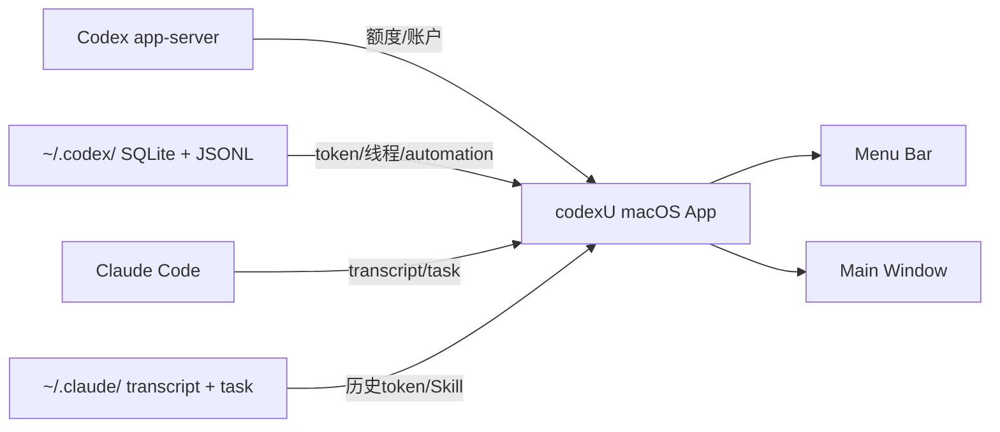

# 一个菜单栏搞定 Codex 和 Claude Code 额度监控：codexU 把"到底还剩多少额度"这件事做成了菜单栏上的环

codexU，一个 macOS 菜单栏应用，把 Codex 和 Claude Code 的额度、token 用量、今日任务全部塞进菜单栏。

**一句话结论：** 一个 macOS 原生菜单栏工具，让你在菜单栏里直接看到 Codex 和 Claude Code 的剩余额度、token 用量和今日任务状态，不用切浏览器，不用翻终端。

## 核心亮点

**1、Codex + Claude Code 双端额度一屏看齐**

主界面顶部有个 `Codex | Claude Code` 全局开关，一键切换两边所有面板的数据范围。不用在两个工具之间来回切，一个窗口看全。

**2、菜单栏额度环，点一下就知道还剩多少**

Codex 的 5 小时和 7 天额度被做成了两个同心环，蓝色是 5h，紫色是 7d。三种显示模式可调：简约只留环，经典环内显示数字，丰富展示完整标签和进度条。还有一个细节：进度环的方向会告诉你口径，已用量顺时针，剩余量逆时针，不用看文字说明。

**3、token 用量拆到三类，成本一目了然**

今日、近 7 天、累计 token 用量，细分为未缓存输入、命中缓存输入、输出三类分开统计。对于关心 token 成本的人来说，这个粒度比 Codex 原生界面还细。

**4、「羊毛进度」——帮你算这个月订阅费回本了没**

codexU 把本机 token 用量按 OpenAI API 价格折算成美元，和 Plus、Pro 100、Pro 200 以及满额月价值做对比。进度条采用分段非线性刻度，Plus/Pro 节点在前段，超过 Pro 200 后用对数比例映射。不是真账单，但能帮你建立直观的成本感知。

**5、今日任务看板，自动聚合 Codex 线程和 automations**

从本机 Codex 线程和已启用的 automations 生成任务看板，按进行中、待处理、定时、完成四类组织。平时跑自动化任务的人，一眼就能看到今天还有哪些没跑完。

**6、用量趋势、项目排行、Skill 使用 TOP 全有**

最近半年每日 token 热力图、最近 7 天趋势摘要、项目排行（token/估算价值/线程数/活跃时间）、工具调用 TOP 和 Skill 使用 TOP。帮你看清自己的 Codex 工作结构。

**7、本地数据，不上传**

codexU 只读取本机 `~/.codex/` 和 `~/.claude/` 下的数据，不上传 usage、线程或账户数据到第三方。自动更新检测也只访问 GitHub Release 公开元数据。

**8、macOS 原生体验，快捷键 + 菜单栏 + 设置窗口**

默认 `Command + U` 显示/隐藏主窗口，可在设置中自定义。设置窗口支持中文/英文界面、自动/浅色/深色外观、状态栏实时预览。关闭主窗口后继续后台运行，菜单栏图标常驻。

**9、全自动更新检测**

默认每天自动检查 GitHub Release 新版本，发现新版时提供匹配当前 Mac 架构的 DMG 下载入口。不会静默下载安装，自动检查可在设置里关闭。

## 快速上手

### 安装

从 GitHub Release 下载对应芯片的 DMG：

- Apple Silicon：`codexU-<version>-mac-arm64.dmg`
- Intel：`codexU-<version>-mac-x86_64.dmg`

打开 DMG，把 `codexU.app` 拖到 `Applications` 文件夹，从 Applications 打开。

### 首次安装：隐私与安全

因为是 GitHub Release 分发，不经过 Mac App Store，第一次打开 macOS 可能会拦截：

1. 打开 `codexU.app` 一次。如果提示无法打开，先取消弹窗。
2. 打开 **系统设置 > 隐私与安全性**。
3. 在 **安全性** 区域找到 `codexU.app`，点击 **仍要打开**。
4. 使用 Touch ID 或密码确认，然后点击 **打开**。

### 运行要求

- macOS 14 或更新版本
- 本机已安装 Codex，且至少用过一次（生成 `~/.codex/state_5.sqlite`）
- 已登录 Codex 账户
- Claude Code 统计为可选能力

### 从源码构建

```sh
make build
make run
make install
make probe
```

### 打包 DMG

```sh
make release
make release-arm64
make release-intel
make release-all
```

### 命令速查

| 阶段 | 命令 | 用途 |
|------|------|------|
| 构建 | `make build` | 从源码编译 |
| 运行 | `make run` | 启动开发模式 |
| 安装 | `make install` | 安装到 `/Applications` |
| 数据检查 | `make probe` | 检查本机数据源输出 |
| 打包 | `make release` | 打包当前架构 DMG |
| 打包 arm64 | `make release-arm64` | 打包 Apple Silicon DMG |
| 打包 Intel | `make release-intel` | 打包 Intel DMG |

### 架构关系



## 写在最后

codexU 不是一个那种让你「卧槽」的产品。它没有炫酷的 AI 能力，没有让人惊叹的技术突破。它就是一个很朴素的工具，帮你解决一个很小但很烦的问题。

但我觉得这种工具恰恰是大多数开发者真正需要的。

现在 AI 圈子里的新闻太多了。今天一个模型刷新榜单，明天一个框架颠覆一切。但你每天真正面对的问题，其实没那么多宏大叙事。你只是想知道：我的额度还有多少？今天的 token 用了多少？有没有什么地方可以省一点？

codexU 做的就是这件事。它不解决你写不出代码的问题，不解决你的项目架构问题，不解决你团队协作的问题。它只帮你回答一个简单的问题：你的 Codex 额度到底还有多少。

而且答案就在菜单栏里，点一下就知道。

有几个边界也值得说一下。codexU 不是官方 OpenAI 产品，额度显示的是剩余百分比而不是绝对数量（因为 Codex 本地 API 只暴露百分比），Claude Code 首版只读取本地历史记录不代表 Claude.ai 官方账单。如果你需要精确的官方账单数据，还是得去 OpenAI 和 Anthropic 的官网看。

但对于日常开发中快速扫一眼额度、了解今日用量、判断要不要省着点用，codexU 完全够用了。

项目地址：https://github.com/shanggqm/codexU

#codexU #Codex #ClaudeCode #macOS #开源项目 #额度监控 #Token管理 #开发者工具