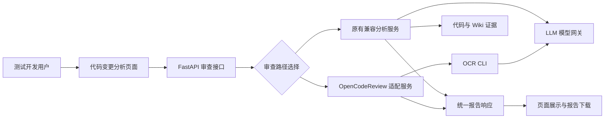
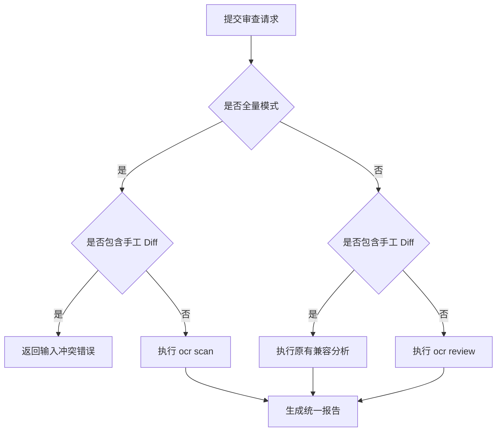
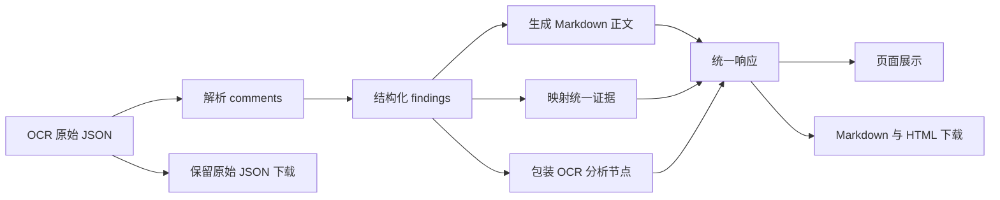

---

# 我们把阿里 OpenCodeReview 接进了测试平台：从 Git Diff 到全量扫描，一套 AI 代码审查链路是怎样落地的？

## 摘要

代码审查是测试左移的重要入口，但把 Git Diff 直接丢给大模型，并不等于拥有了一套可用的 AI Code Review 系统。真实工程里还要处理变更范围、仓库边界、文件过滤、Token 成本、超时、结构化结果、报告下载、部署配置以及错误可观测性。

本文复盘一次完整的平台化改造：在已有代码变更分析能力上接入 Alibaba OpenCodeReview，增加 Git Diff 审查和全量文件扫描，同时保留手工 Diff 的兼容分析链路。我们会展开讲清楚工具如何分工、请求如何分流、OCR 输出如何适配成统一报告，以及为什么“页面里出现分析节点和证据”并不意味着两套工具被同时执行。

这不是一篇只讲安装命令的工具教程，而是一份面向测试开发与质量工程师的工程实现说明。

---

## 一、背景：测试人员真正需要的不是一句“代码看起来没问题”

在提测之前，测试人员通常需要回答一组比“代码有没有 Bug”更具体的问题：

- 这次改动到底影响了哪些文件、方法和业务路径？
- 有没有空值、异常处理、状态一致性、并发或资源释放风险？
- 哪些调用方需要连带回归？
- 哪些边界条件和异常场景值得优先补测？
- 当前实现是否与已有 Wiki、业务规则或接口约定冲突？
- 审查结论能不能沉淀成结构化报告，而不是散落在聊天窗口？

早期方案通常是“解析 Diff + 检索代码与 Wiki 证据 + 调用 LLM 生成报告”。这条链路有明显价值，因为它擅长从测试视角组织影响范围、回归建议和业务冲突。但当需求进一步扩展到更标准的代码级 Review 时，问题也随之出现：

1. **审查编排要不要继续自研？** 文件读取、Diff 定位、规则匹配、评论聚合和上下文控制，每一项都不是简单 Prompt 能解决的。
2. **没有有效 Diff 怎么办？** 陌生代码库、迁移前审计或历史快照，没有一份有意义的工作区 Diff。
3. **全量扫描怎么控制成本？** 整个仓库一次性送入模型，不仅容易超出上下文，也无法预测总消耗。
4. **结果怎么进入现有平台？** 外部工具输出的数据结构、页面组件和下载格式并不天然一致。
5. **服务器怎么稳定部署？** CLI 版本、模型配置、密钥文件、容器架构和超时必须可控。

于是，我们做了一个重要取舍：**不再重复实现一套代码审查 Agent，而是把成熟的开源工具作为审查执行内核，平台负责边界、分流、适配、展示与部署。**

## 二、为什么选择 OpenCodeReview，而不是继续堆 Prompt

Alibaba OpenCodeReview，以下简称 OCR，是一个面向 AI 代码审查的开源工具。它不仅能读取 Git Diff，还提供全文件扫描、规则配置、结构化评论、Session 和多模型协议适配等能力。

这里的关键不是“它也会调用 LLM”，而是它已经把一次 Code Review 拆成了可执行的工程流程。平台不需要自己重新处理每个文件如何送审、如何定位评论、如何限制并发等细节。

我们比较过三种方案：

| 方案 | 做法 | 优点 | 主要问题 |
|---|---|---|---|
| 继续增强原有链路 | 在现有 Diff、知识检索和 LLM 报告逻辑中继续增加代码审查能力 | 业务语境强，页面和数据结构完全可控 | 容易重复实现审查 Agent；文件级定位和全量扫描复杂度持续上升 |
| 完全替换 | 所有场景全部切换到 OCR | 链路统一，代码最少 | 手工 Diff、Wiki 冲突分析和测试视角报告能力会被削弱 |
| 分流集成 | 自动 Git Diff 和全量扫描走 OCR，手工 Diff 保留原引擎 | 发挥两套能力各自优势，迁移风险小 | 必须把分流和报告来源解释清楚 |

最终采用第三种方案。

这不是为了“保留两套系统显得功能更多”，而是因为两个引擎解决的问题不同：

- OCR 更像专业的代码审查执行器，擅长读取真实仓库、按文件审查并输出结构化问题。
- 原有兼容链路更像测试分析器，擅长消费用户粘贴的 Diff，并结合代码图谱、Wiki 证据和测试规则组织报告。

最重要的一条设计原则是：**同一次请求只选择一条链路，不让两套工具同时消耗模型、产生重复结论。**

## 三、总体架构：把工具放在正确的位置

改造后的系统由五层组成：

1. React 页面负责选择项目、审查模式、关注点和 Token 预算。
2. FastAPI 接口负责输入校验与互斥分流。
3. OCR 适配服务负责固定命令、运行边界、错误翻译和结果解析。
4. 原有兼容服务继续负责手工 Diff 的证据增强分析。
5. 统一报告层负责页面展示与 Markdown、HTML、JSON 下载。



这个架构刻意没有新增微服务、消息队列或数据库。OCR 以 CLI 方式由 API 进程调用，符合当前规模，也让部署和故障定位保持简单。等到并发量、任务时长或历史报告需求真正出现，再考虑异步任务和持久化。

## 四、最容易误解的一点：不是两套工具同时审查

页面支持两种按钮模式，但实际存在三种输入场景：

| 页面模式与输入 | 实际执行引擎 | 检测对象 | 是否执行原有证据检索 |
|---|---|---|---|
| Git Diff 审查，未粘贴 Diff | OpenCodeReview `review` | 暂存、未暂存和未跟踪变更 | 否 |
| Git Diff 审查，手工粘贴 Diff | 原有兼容分析服务 | 用户提供的 Diff 文本 | 是 |
| 全量代码审查 | OpenCodeReview `scan` | 当前项目中的有效代码文件 | 否 |

也就是说：

- 未粘贴 Diff 时，只执行 OCR。
- 全量模式下，只执行 OCR。
- 粘贴手工 Diff 时，只执行原有兼容链路。
- OCR 失败时直接返回明确错误，不静默切换到另一套引擎。

核心分流条件非常短：

```python
has_manual_diff = bool(payload.diff_text and payload.diff_text.strip())

if payload.review_mode == "full" and has_manual_diff:
    raise HTTPException(status_code=400, detail="全量审查不接受手工 Diff")

if payload.review_mode == "full" or (payload.use_git_diff and not has_manual_diff):
    report = OpenCodeReviewService().review(
        project,
        payload.question,
        review_mode=payload.review_mode,
        token_budget=payload.scan_token_budget,
    )
else:
    report = CodeReviewTestService().review(
        project=project,
        question=payload.question,
        diff_text=payload.diff_text,
        use_git_diff=payload.use_git_diff,
    )
```

分流逻辑放在 HTTP 边界层，原因很直接：这是由请求形态决定的业务路由，不应隐藏到某个服务内部。条件保持显式，也方便 API 测试证明“调用了谁、没有调用谁”。



## 五、Git Diff 审查：审查的是工作区，不是最近 N 次提交

当前 Git Diff 模式面向日常开发场景，审查当前工作区中的：

- 已暂存变更；
- 未暂存变更；
- 未跟踪文件。

它不是“最近一次提交”，也不是“最近 N 次提交”。如果代码已经提交且工作区干净，当前模式不会自动回看提交历史。

这个边界必须在页面说明里说清楚，否则用户很容易误以为选择 Git Diff 就等于审查最近的 Commit。分支范围、单 Commit 和最近 N 次提交虽然 OCR 本身可以扩展支持，但当前平台没有开放这些参数，因此文章也不把它们描述成已上线能力。

### 5.1 为什么不让前端自己读取 Git Diff

浏览器既不应该直接访问服务器文件系统，也无法可靠识别目标仓库。项目目录解析、白名单校验和 Git 范围判断都放在 API 服务端完成：

- 页面只提交项目标识和审查关注点；
- API 通过已登记项目定位代码目录；
- 服务端校验目录和 OCR 配置；
- OCR 在受控工作目录中读取变更。

这样既减少前端复杂度，也守住了路径信任边界。

### 5.2 嵌入式项目的变更隔离

真实平台经常把多个代码项目放在一个总仓库或统一知识目录中。如果直接把总仓库交给 OCR，它可能看到与当前所选项目无关的修改。

适配层做了两步处理：

1. 如果目标目录本身拥有 `.git`，直接以该目录作为 OCR 仓库。
2. 如果目标目录是更大 Git 仓库中的子目录，则解析总仓库根目录，收集工作区变更，并把当前项目以外的变更作为排除项传给 OCR。

这样无需复制仓库，也不需要临时创建 Git 历史，就能把审查范围限制在当前项目。

当嵌入式项目没有任何变更时，平台不会浪费一次模型调用，而是返回“当前项目没有待审查变更”的成功报告。

## 六、全量代码审查：用原生 scan，而不是伪造一个超大 Diff

第一版全量审查思路很容易走向一个误区：枚举文件、复制到临时仓库，再制造“空基线到当前快照”的巨大 Diff。这个方案能工作，但会带来几个问题：

- 平台需要自己维护文件白名单和数量上限；
- 临时仓库会增加 I/O 和清理逻辑；
- 固定 200 个文件的限制并不代表真实 Token 消耗；
- 本质上仍然把全文件扫描伪装成 Diff 审查。

后来我们改为使用 OCR 原生 `scan`：

```python
arguments = [
    "--exclude", DEFAULT_SCAN_EXCLUDES,
    "--batch", "by-directory",
    "--max-tokens-budget", str(token_budget),
]

command = [
    "ocr", "scan",
    "--repo", str(project_root),
    *arguments,
    "--format", "json",
    "--audience", "agent",
    "--concurrency", "4",
    "--rule", str(rule_file),
    "--background", question,
]
```

这带来三个直接收益。

第一，`scan` 不依赖 Git Diff，即使目录没有有意义的变更，也能逐文件审查。

第二，`by-directory` 让 OCR 按目录组织批次，而不是尝试把所有文件一次性塞入单个上下文。

第三，平台用总 Token 预算控制“还要不要继续派发新文件”，比固定文件数更接近真实成本。

### 6.1 自动排除哪些文件

平台只维护明显不应进入审查的目录和锁文件，例如：

- `.git`、IDE 配置和版本控制元数据；
- `node_modules`、虚拟环境和第三方依赖；
- `dist`、`build`、`target`、`out` 等构建产物；
- 缓存、覆盖率、日志、临时目录和历史报告；
- 常见包管理器锁文件；
- 已生成的图谱结果目录。

具体语言文件识别、二进制判断和规则匹配继续交给 OCR 原生扫描器。平台没有再维护一份庞大的扩展名白名单，避免两套规则随版本演进发生漂移。

### 6.2 Token 预算如何给使用者解释

文件数不是成本的可靠度量。同样 100 个文件，可能是一批几十行的配置，也可能是数万行的核心服务。页面因此提供预算档位，并把文件数量明确标注为粗略估算：

| Token 预算 | 页面给出的粗略文件量 | 建议场景 |
|---|---:|---|
| 20 万 | 约 20 至 60 个文件 | 小型模块、首次试跑、规则调试 |
| 50 万 | 约 50 至 150 个文件 | 常规项目扫描，默认推荐 |
| 100 万 | 约 100 至 300 个文件 | 较大项目或重点审计 |
| 不限 | 不承诺文件数 | 仅在成本和时间可控时使用 |

这些数字不是 SLA。实际覆盖量取决于文件长度、代码复杂度、规则、工具调用次数和模型行为。页面把这句话直接展示给使用者，比给出一个看似精确、实际误导的文件上限更负责任。

## 七、OCR 命令执行：越简单，越要守住边界

平台调用外部 CLI 时没有拼接 shell 字符串，而是构造参数数组并使用 `subprocess.run`：

```python
completed = subprocess.run(
    command,
    cwd=str(repo_root),
    capture_output=True,
    text=True,
    timeout=process_timeout,
    check=False,
)
```

这几个参数分别解决了不同问题：

- 参数数组避免项目名、路径或关注点被解释成 shell 语法；
- 固定 `cwd` 保证 OCR 在明确仓库内运行；
- 捕获输出用于解析 JSON 和记录失败；
- Git Diff 与全量扫描使用不同超时；
- `check=False` 让适配层能把退出码翻译成稳定 API 错误。

运行前还会校验：

- 模型配置文件是否存在；
- 审查规则文件是否存在；
- 目标代码目录是否有效；
- Git Diff 模式下目标是否属于 Git 仓库。

平台不会自动执行 `pull`、`checkout`、`commit`，更不会根据 OCR 结果修改业务代码。它是一条只读分析链路。

## 八、LLM 如何复用现有模型能力

项目原有分析服务通过 `ai_apiclient.py` 访问 OpenAI 兼容模型网关。接入 OCR 后，没有要求测试团队再维护另一家模型供应商，而是让 OCR 的 Provider 指向同一类兼容网关。

需要准确区分的是：

- 手工 Diff 路径由原有 Python 服务直接调用 `ai_apiclient.py`。
- OCR 路径由 OCR CLI 按自己的 Agent 流程调用已配置的兼容模型端点。
- 两者可以使用同一个模型网关和模型，但调用编排并不是同一段 Python 代码。

配置示例只应提交占位值：

```json
{
  "provider": "internal-openai-compatible",
  "custom_providers": {
    "internal-openai-compatible": {
      "url": "https://llm-gateway.example/api/v1",
      "protocol": "openai",
      "api_key": "replace-with-real-key",
      "model": "your-review-model"
    }
  }
}
```

真实配置写在服务器本地、权限受控且被 Git 忽略的文件中。即使团队明确选择“密钥写配置文件，不走环境变量”，也不意味着密钥应该进入仓库。

## 九、报告适配：OCR 输出怎样进入原有页面

OCR 返回 JSON，其中包含 Session 和评论列表。平台把评论解析为统一 finding：

- 文件路径；
- 起止行号；
- 问题类别；
- 严重等级；
- 审查意见。

之后，API 同时构造四类输出：

1. 适合阅读的 Markdown 正文；
2. 结构化 `ocr_report.findings`；
3. 未损失的 OCR 原始 JSON；
4. 兼容现有页面的数据字段，包括 `answer`、`evidence` 和 `trace`。

```python
evidence = [
    EvidenceItem(
        title=f"[{item.severity}] {item.category}",
        path=f"{item.file_path}:{item.start_line or 1}",
        kind="ocr_finding",
        confidence="EXTRACTED",
        snippet=item.content,
    )
    for item in report.findings
]

trace = [
    ChatTraceStep(
        name="OpenCodeReview",
        status="done",
        detail=f"OCR 完成审查，发现 {len(report.findings)} 个问题",
        evidence_count=len(report.findings),
    )
]
```

这也解释了一个曾经引发困惑的现象：**OCR 报告页面仍然显示“分析节点流程”和“证据”模块，看起来像原来的逻辑。**

实际情况是：

- 组件外观确实复用了原页面；
- “OpenCodeReview”节点由 API 适配层包装；
- “证据”由 OCR findings 映射；
- 原有的图谱检索、Wiki 检索、风险规则节点并没有被执行。



复用统一响应模型的价值在于，页面无需为每个引擎重新开发一整套结果框架；但复用不能模糊来源，因此我们又增加了“本次审查实现说明”。

## 十、报告必须说明：用了什么工具、什么模式、什么实现

仅在标题上写“代码审查报告”远远不够。使用者需要知道这份结论是怎么来的，否则无法判断覆盖范围。

页面和下载报告都会标注：

- 审查工具；
- 审查模式；
- 核心实现逻辑；
- 模型；
- 生成时间；
- 全量模式 Token 预算；
- OCR Session ID。

| 报告元数据 | Git Diff OCR | 全量 OCR | 手工 Diff 兼容分析 |
|---|---|---|---|
| 工具 | Alibaba OpenCodeReview | Alibaba OpenCodeReview | 平台兼容分析引擎 |
| 模式 | Git Diff 审查 | Full-file Scan | 手工 Diff 兼容分析 |
| 核心逻辑 | OCR 读取工作区变更 | OCR 枚举文件并分批扫描 | Diff 解析加代码与 Wiki 证据生成 |
| Token 预算 | 不展示 | 展示所选档位 | 不展示 OCR 预算 |
| OCR Session | 有则展示 | 有则展示 | 不展示 |

除了页面阅读，平台还提供三种下载：

- Markdown：适合二次编辑、归档和进入 Wiki；
- HTML：适合浏览器打开或作为独立报告流转；
- OCR 原始 JSON：适合自动化消费、问题统计和后续系统对接。

原始 JSON 不经过二次重写，便于排查“页面展示”和“工具真实输出”之间是否存在差异。

## 十一、Mermaid 为什么会失败，以及如何在统一边界修复

LLM 生成报告时经常输出 Mermaid 调用链。实际运行中遇到过两类典型错误：

- 节点文本含括号、尖括号、加号或 HTML 换行标签；
- 节点外层和内部同时使用英文双引号，导致解析器提前结束字符串。

例如，下面这种人类看起来合理的写法，可能让 Mermaid 解析失败：

```text
A["BaseClass（"基类"）<br/>+eventType"]
```

最差的处理方式是在每份报告里手工改图。下一次 LLM 换一个节点名，问题还会回来。

最终修复放在共享 Mermaid 渲染边界：

1. 识别流程图中的方形、菱形和圆形节点标签；
2. 去除冲突的外层引号；
3. 把内部英文双引号替换为中文引号；
4. 把易冲突符号替换为全角或安全字符；
5. 页面渲染和 HTML 下载共用同一清洗函数。

```typescript
function sanitizeNodeLabel(value: string): string {
  let label = value.trim();
  if (label.startsWith('"') && label.endsWith('"')) {
    label = label.slice(1, -1);
  }
  label = label
    .replace(/"([^"\n]*)"/g, '“$1”')
    .replace(/"/g, '＂')
    .replace(/\+/g, '＋');
  return `"${label}"`;
}
```

这里的工程原则比具体正则更重要：**修共享输入边界，不要在每个报告、每个调用方分别打补丁。**

同时，文章中的 Mermaid 图也主动使用简单节点文本，不依赖 HTML 标签、嵌套引号和特殊形状。生成侧约束与渲染侧防御应该同时存在。

## 十二、错误处理：不要为了“看起来可用”而静默降级

外部 CLI 和 LLM 都可能失败。平台对错误进行了稳定分类：

| 故障 | API 状态 | 处理策略 | 为什么不自动降级 |
|---|---:|---|---|
| OCR CLI 未安装 | 503 | 返回安装提示 | 改用另一引擎会改变报告语义 |
| OCR 配置缺失 | 503 | 指明缺少配置文件 | 避免掩盖部署错误 |
| 审查超时 | 504 | 提示超时并保留服务日志 | 防止请求无限占用资源 |
| OCR 非零退出 | 502 | 返回执行失败 | 需要检查模型、规则或 CLI 输出 |
| 返回内容不是合法 JSON | 502 | 标记结果解析失败 | 不能用不可信内容伪造结构化报告 |
| 全量模式同时提交手工 Diff | 400 | 拒绝冲突输入 | 两种范围语义不能混用 |
| Token 预算不在允许档位 | 422 | 在请求模型层拒绝 | 无需启动外部进程 |

“OCR 失败后自动调用旧引擎”表面上提升成功率，实际会让用户误以为得到的是 OCR 报告，也会造成测试结论不可追溯。因此我们选择失败透明，而不是静默换轨。

## 十三、规则设计：让审查贴近工程质量，而不是泛泛评价

OCR 支持按文件路径配置审查规则。平台为常见技术栈准备了基础关注点：

- Java：空值安全、事务边界、并发、资源释放、外部接口失败和状态一致性；
- TypeScript 与 JavaScript：类型安全、异步异常、状态一致性、接口契约、空态和错误态；
- Python：输入边界、异常处理、路径安全、类型契约、日志定位和资源释放；
- 测试文件：通过 include 规则确保测试代码不会被默认忽略。

规则文件进入版本控制，团队可以评审；模型密钥配置不进入版本控制。两者分离后，质量标准可以公开协作，秘密仍留在运行环境。

对测试团队来说，规则的价值不只是发现编码规范问题，更重要的是把“我们线上最怕什么”转化为稳定检查项。例如状态机一致性、重试幂等、外部依赖失败、金额与权限边界，通常比变量命名更接近真实质量风险。

## 十四、前端交互：让用户在运行前理解成本和范围

页面没有塞入大量高级参数，只保留真正影响结果的选择：

- 当前代码项目；
- 审查关注点；
- Git Diff 或全量扫描；
- 全量模式 Token 预算；
- Git Diff 模式下可选的手工 Diff。

选择全量模式后，手工 Diff 输入框会被清空并禁用，从界面上提前阻止冲突请求。全量模式的请求超时也高于 Git Diff，避免浏览器在服务端仍运行时提前放弃。

结果区则分成四层：

1. 工具与模式元数据；
2. OCR 结构化问题表格；
3. Markdown 报告正文；
4. 可折叠的分析节点和证据。

这种层次兼顾了两类读者：只想看结论的人停在正文，需要追溯来源的人继续展开 finding、路径和原始 JSON。

## 十五、部署：同时支持 Docker 与传统服务器

平台提供两种部署方式，但使用同一套运行边界。

### 15.1 Docker 部署

API 镜像内安装固定 OCR 版本，并按 CPU 架构下载对应二进制。构建阶段校验 SHA256，避免下载内容漂移或损坏。审查规则复制进镜像，运行时模型配置目录通过 Compose 挂载。

```yaml
services:
  api:
    volumes:
      - ./deploy/opencode-review/runtime:/root/.opencodereview
```

运行目录被 Git 忽略，其中既保存本地配置，也可以保存 OCR Session。目录和配置文件应设置最小权限。

### 15.2 传统服务器部署

非容器部署需要：

1. 为 API 运行用户安装固定版本 OCR CLI；
2. 在该用户可读的目录放置模型配置；
3. 设置配置文件权限；
4. 使用 API 运行用户执行版本与模型连通性检查；
5. 对一个测试仓库执行 preview 或小范围审查。

无论哪种方式，启动前都应该至少验证：

```bash
ocr version
ocr llm test
ocr review --repo /srv/code/sample-project --preview
```

生产化的关键不在于命令能在开发者终端运行，而在于它能以服务器上的真实 API 用户身份运行。

## 十六、测试策略：不仅测“能返回报告”，还要证明没有走错引擎

这次改造最重要的测试并不是某段 Markdown 是否包含标题，而是分流和边界。

### 16.1 OCR 服务单元测试

通过注入 runner，测试无需真正调用模型即可验证：

- 命令名称和参数顺序；
- 工作目录和超时；
- JSON 解析与 finding 字段；
- 空问题列表；
- CLI 缺失、超时、非零退出和非法 JSON；
- 嵌入式项目的范围隔离；
- 无项目变更时不启动 OCR；
- `scan` 是否携带目录分批、排除和 Token 预算。

### 16.2 API 分流测试

API 测试同时 Mock 两个服务，并明确断言：

- 自动 Git Diff 调用了 OCR，原有服务 `assert_not_called`；
- 手工 Diff 调用了原有服务；
- 全量模式调用 OCR `scan` 路径；
- 全量模式加手工 Diff 时，两边都不调用；
- 不支持的 Token 档位被请求模型拒绝；
- OCR 错误映射为预期 HTTP 状态。

“没有调用另一套服务”是非常关键的负向断言，它直接防止未来重构时不小心变成双引擎执行。

### 16.3 前端验证

前端重点覆盖：

- 模式与元数据文案；
- Mermaid 特殊字符和嵌套引号回归样例；
- TypeScript 构建；
- 生产静态资源中是否包含说明文档；
- 实际页面请求和报告下载是否成功。

此外，本地还要用真实服务验证 HTTP 主路径，因为 Mock 只能证明我们的编排代码正确，不能证明 OCR 二进制、模型配置和目标仓库在当前环境真的可用。

## 十七、这套方案给测试团队带来了什么

### 17.1 从“代码阅读”变成“可执行的测前输入”

结构化 finding 包含文件、行号、类别和等级，可以直接转化为测试关注点。测试人员不必先完整理解所有改动，便能从高风险评论开始定位。

### 17.2 Diff 与全量场景互补

日常提测优先 Git Diff，成本低、结论聚焦；接手陌生项目、迁移前审计或没有有效 Diff 时使用全量扫描。两种方式覆盖了不同阶段，而不是强迫所有任务使用最大范围。

### 17.3 成本可解释

Token 预算由使用者主动选择，页面给出粗略文件量和限制说明。即使不能精确预测每次消耗，也比“点击后才发现扫描了整个仓库”更可控。

### 17.4 报告可追溯

工具、模式、模型、时间、预算和 Session 都进入报告。原始 JSON 可以下载，问题来源不再只存在于一次性聊天上下文中。

### 17.5 不重复建设成熟能力

平台把工程精力投入到边界、用户体验、报告和质量规则，而不是重新实现 OCR 已经具备的文件审查编排。

## 十八、它解决不了什么

任何 AI Code Review 工具都有边界。平台化不能把边界变没，只能让边界更透明。

| 限制 | 表现 | 当前补偿方式 |
|---|---|---|
| 跨文件全局理解有限 | 单文件问题更容易发现，复杂重构影响可能遗漏 | 结合人工 Review；手工 Diff 场景可使用原有图谱与 Wiki 证据链路 |
| LLM 可能误报 | 评论看似合理但不符合真实业务 | 展示文件行号、原始 JSON和待复核语义，不自动修复 |
| 全量扫描成本较高 | 大仓库耗时和 Token 上升 | 排除无关文件、目录分批、预算档位和更长超时 |
| 工作区模式不审历史提交 | 已提交且工作区干净时没有 Diff | 后续可按真实需求增加单提交或分支范围，不在当前页面假装支持 |
| Mermaid 生成不稳定 | 特殊字符导致图表解析失败 | 生成约束加统一清洗，失败时保留原始文本便于排查 |
| 外部 CLI 增加部署依赖 | 本地可用但服务器用户不可用 | 固定版本、镜像内安装、启动前连通性验证 |

特别要强调：OCR 适合捕获文件内的代码质量问题，但不应成为跨文件重构影响分析的唯一工具。对于核心链路、资金、权限、状态机和复杂外部依赖，人工 Review 与针对性测试设计仍然不可替代。

## 十九、几个值得复用的工程经验

### 经验一：先定义谁负责什么，再谈工具组合

“OCR 加原有逻辑”不等于两者每次都运行。工具越多，越需要明确互斥条件和结果来源，否则成本翻倍、结论冲突、用户无法解释报告。

### 经验二：全量扫描的核心指标是 Token，不是文件数

固定 200 个文件看似简单，却无法体现文件大小和审查复杂度。使用原生分批扫描和总预算，才更接近模型消费的真实约束。

### 经验三：保留原始结果，展示层可以演进

结构化 finding 适合页面，Markdown 适合阅读，HTML 适合流转，JSON 适合自动化。保留原始 JSON，未来更换页面或增加统计时不需要重新运行审查。

### 经验四：错误透明比静默降级更专业

工具缺失就是工具缺失，模型超时就是模型超时。悄悄换引擎会让报告失去可解释性，也让部署问题长期潜伏。

### 经验五：修复公共渲染边界，不手改生成内容

Mermaid 失败是一个典型例子。统一清洗函数和最小回归测试，比在每份报告里替换字符更省事，也更可靠。

### 经验六：测试要证明“另一条路径没被调用”

互斥分流的回归风险不只在选错服务，也在两边都执行。负向 Mock 断言是成本很低、价值很高的保护。

## 二十、后续可以怎样演进

当前方案刻意停在一个可维护的边界，没有提前引入复杂基础设施。后续只有在真实需求出现时，才值得考虑：

1. 增加单 Commit、分支范围和 PR 或 MR 审查入口；
2. 将长时间全量扫描改为异步任务，支持进度和取消；
3. 持久化历史报告，按项目、版本和严重等级做趋势统计；
4. 将 OCR finding 转换为测试用例候选或回归范围建议；
5. 结合代码图谱做跨文件影响补充，但保持与 OCR finding 的来源标识；
6. 对规则、模型和 Prompt 建立固定样本 Eval，衡量误报率与漏报率；
7. 在权限和审计成熟后，再评估 PR 评论回写与问题闭环。

这些方向都不是“因为架构图里缺一块所以要补”，而应由并发规模、报告使用频率和测试团队反馈驱动。

## 结语

AI Code Review 真正困难的部分，从来不是调用一次大模型，而是把范围、规则、成本、错误、报告和部署组织成一条可信的工程链路。

这次改造没有推翻原有系统，也没有把 OpenCodeReview 包装成万能答案。我们做的事情更朴素：让专业工具负责专业审查，让平台负责分流与治理，让测试人员清楚知道一份报告从哪里来、覆盖了什么、又遗漏了什么。

对测试开发团队而言，这类能力最有价值的使用方式，不是替代代码 Review，而是把审查结论提前转化为风险线索、回归范围和可验证的问题清单。

当工具、流程和报告都能被解释，AI 代码审查才真正从 Demo 走向工程实践。

---

