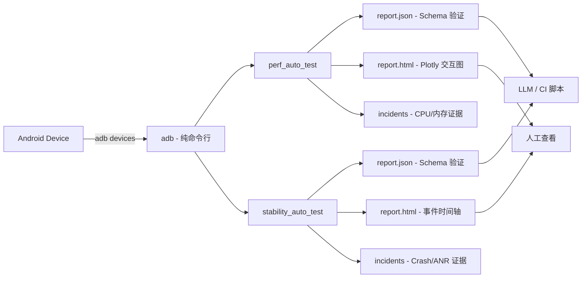

搞 Android 测试的应该都经历过这种场景：

老板说"这个版本上线前跑一遍性能监控"，你翻出几年前的 Profiler，发现要连 Android Studio、要开调试模式、甚至还得配个可调试包。改完代码重新打包，测完发现跟线上根本不是同一个东西。

或者更常见的一种——App 线上突然 ANR 了，crash 日志捞出来就一行"NullPointerException"，后面跟的调用栈被混淆器切得稀碎，连是哪个第三方库炸的都不知道。

最近 GitHub 上有个项目 **apk_auto_test** 把这两件事一起做了，而且做得很克制。

**一个纯 adb + Python 的工具集，不需要改 App、不需要 root、不需要可调试版本，丢一个包名进去，自动跑性能监控或稳定性测试，跑完给你两份报告——一份 AI 友好 JSON，一份带交互图表的 HTML。**

---

## 一句话结论

`apk_auto_test` 是两个独立但互补的 Android 测试工具：`perf_auto_test` 监控 CPU 和内存的异常增长，`stability_auto_test` 自动抓取 Java/Native Crash 和 ANR——都不需要修改 App，纯 adb 无侵入，跑 1 小时到 24 小时都验证过，产出报告直接喂 LLM 或 CI。

---

## 核心亮点

### 1. 零侵入，纯 adb

这是最让我觉得"终于有人想清楚"的地方。两个工具都只依赖 `adb`，设备上不需要装任何东西。给一个包名，工具自动发现该包关联的所有进程。不需要 debuggable 包，不需要 root，不需要改 AndroidManifest。

对于测试团队来说，这意味着你可以直接拿线上包来跑——不用为了测试单独打一个"调试版本"，测出来的数据就是真实线上表现。

### 2. 两份报告，人和机器各取所需

每次跑测产出两个文件：

- **`report.json`**：JSON Schema Draft-07 验证的结构化数据，带版本号。包含跑测元数据、每个进程的统计、每条 incident 的触发值/峰值/持续时长/证据文件路径/一句话摘要。可以直接丢给 LLM 分析，或者接 CI 脚本做自动判定。
- **`report.html`**：单文件自包含，内嵌 Plotly 交互图表。打开就能看，不需要搭服务器，不需要额外构建步骤。

这种"人机双输出"的设计，比那种只出一个 CSV 或者只出一个 HTML 的测试工具，实用太多。

### 3. 跑 1 小时和跑 24 小时，输出结构一样

项目说明里提到，长跑稳定性已经验证过 1h–24h。文件按小时滚动，adb 断线自动重连加退避。这意味着你可以：

- 开发阶段跑 30 分钟快速验证
- 回归阶段跑 1–2 小时抓异常
- 稳定性压测直接丢 8 小时甚至通宵

跑出来的报告结构一致，不管是 CI 对比还是人工审查，都不需要适应不同格式。

### 4. 报告自带交互式可视化

先说 `perf_auto_test` 的 HTML 报告：

一屏展示：顶部告警栏告诉你这次跑测是正常还是超阈；六个 KPI 卡片展示监控进程数、CPU 峰值/p95、内存峰值、告警次数、生命周期事件；中间是一条交互式运行时间轴，鼠标悬停告警标记弹详情，点击直跳事件列表。

事件详情面板里，CPU 告警会展示触发时刻 Top 线程占比条形图，内存告警展示 `dumpsys meminfo` 的内存分类分布。每个被监控进程有独立的 CPU%（单核归一化）和内存 PSS（MB）曲线，红色虚线是告警阈值，告警标记直接叠在曲线上。

### 5. 崩溃测试的报告更细

`stability_auto_test` 的报告在崩溃排查场景下特别有用：

告警栏一句话总结结果，比如"检测到 3 次 Crash 和 2 次 ANR"。四个计数卡片按类型拆分。Plotly 时间轴有七条泳道——四种事件类型加三种生命周期状态，书签线叠加。

事件列表可以按事件类型、严重级别、进程名或关键字自由筛选。详情面板展示异常类、数据来源（logcat / dropbox）、设备时间戳、一句话摘要，以及完整的 Java/Native 调用栈——**业务包帧用橙色高亮**，一眼就能分清是自家代码炸的还是第三方库炸的。

证据文件（logcat 切片、tombstone、ANR trace）都做成可点击链接，直接在报告里查看，不用再去 adb pull 翻目录。

还有一个"进程稳定性总表"：每个进程显示在线率进度条（绿色→橙色随在线率下降）、重启次数、各类型事件计数 chip。点击 chip 直接跳转到对应筛选后的事件列表。

### 6. 三种使用方式

项目文档里明确给了三种接入方式：

- **CLI**：终端直接跑命令，适合手动测试
- **Python 库**：`with` 语句嵌入现有测试框架，适合 CI 集成
- **Skill**：在 Claude Code 中用自然语言触发，Claude 自动执行、打开报告并输出总结

最后一种方式其实挺有意思，后面会单独说。

### 7. 输出目录结构清晰

跑测完的输出目录分层明确：

```
reports/run1/
├── report.json        ← 权威结果，AI/CI 可直接读
├── report.html        ← Plotly 交互图表
├── *.csv              ← 原始时序数据，按小时滚动
└── incidents/
    ├── cpu_<ts>_<proc>_pid<n>.json   ← Top-N 线程 + 触发元数据
    ├── heap_<ts>_<proc>_pid<n>.json  ← 内存分类 + 评估结果
    └── ...
```

稳定性测试的输出还会多出 `logcat_*.log` 和 `lifecycle_*.csv`，incidents 目录里包含 `java_crash_*.json`、`native_crash_*.tombstone`、`anr_*.trace`。

### 8. 注意事项（文档里明确写的）

- `stability_auto_test` 不负责启动 App——目标进程须在工具启动前已在运行
- 依赖 Python 3.9+，adb 必须在 PATH 里

---

## 快速上手

### 安装依赖

```bash
# perf_auto_test
cd perf_auto_test/scripts
pip install -r requirements-dev.txt

# stability_auto_test
cd stability_auto_test/scripts
pip install -r requirements-dev.txt
```

### CLI 运行

```bash
# 性能测试 - 监控 CPU 和内存
python -m pat \
  --package com.example.app \
  --duration 30m \
  --cpu-threshold-percent 60 \
  --mem-threshold-pss-mb 400 \
  --output ./reports/run1

# 稳定性测试 - 监控 Crash 和 ANR
python -m sat \
  --package com.example.app \
  --duration 30m \
  --output ./reports/run1
```

### Python 库嵌入

```python
# perf_auto_test
from pat import PerfConfig, PerfTest

cfg = PerfConfig(
    package="com.example.app",
    duration_sec=1800,
    output_dir="./reports/run1",
    cpu_threshold_percent=60,
    mem_threshold_pss_mb=400,
)
with PerfTest(cfg) as t:
    t.run()
# t.result 即完整的 report.json 数据

# stability_auto_test
from sat import StabilityConfig, StabilityTest

cfg = StabilityConfig(
    package="com.example.app",
    duration_sec=1800,
    output_dir="./reports/run1",
)
with StabilityTest(cfg) as t:
    t.run()
# t.result 即完整的 report.json 数据
```

### 命令速查

| 阶段 | 命令 | 用途 |
|------|------|------|
| 安装 perf | `cd perf_auto_test/scripts && pip install -r requirements-dev.txt` | 安装性能测试依赖 |
| 安装 stability | `cd stability_auto_test/scripts && pip install -r requirements-dev.txt` | 安装稳定性测试依赖 |
| 运行 perf | `python -m pat --package <包名> --duration <时长> --cpu-threshold-percent <阈值> --mem-threshold-pss-mb <阈值> --output <目录>` | 启动 CPU/内存监控 |
| 运行 stability | `python -m sat --package <包名> --duration <时长> --output <目录>` | 启动崩溃/ANR 监控 |
| Python 集成 | `with PerfTest(cfg) as t: t.run()` | 嵌入现有测试框架 |
| Python 集成 | `with StabilityTest(cfg) as t: t.run()` | 嵌入现有测试框架 |

---

## 组合工作流示例：Claude Code 触发

项目文档里提到一个很有意思的用法——在 Claude Code 中用自然语言触发：

```
/perf-auto-test com.example.app 30m
/stability-auto-test com.example.app 1h
```

Claude 会自动执行测试、打开报告并输出总结。Skill 定义分别在 `perf_auto_test/SKILL.md` 和 `stability_auto_test/SKILL.md`。

这种玩法适合那种"开发写完代码，在终端里一句命令就把性能测试跑完并看到结果"的场景。当然这属于项目提供的 Skill 集成能力，不是工具本身的核心功能，具体效果取决于你的 Claude Code 配置和 adb 环境。

---

## Mermaid：工具架构与数据流



---

## 写在最后

这个项目给我的感觉是"克制"。

它没有试图做一个 All-in-one 的 Android 测试平台，而是聚焦在两件最痛的事上——性能监控和崩溃采集，并且把每件事做透了。纯 adb 无侵入的设计让它几乎可以即插即用，报告的双输出格式（JSON + HTML）让它既适合 CI 自动判定，也适合人工排查。

适用边界也很清楚：

- 适合已有 adb 环境、需要快速给 App 做性能/稳定性摸底的场景
- 适合测试团队想要把线上包直接拿来跑测试的场景
- 不适合需要深度 Instrumentation（如方法耗时追踪、UI 自动化）的场景——那个得找别的工具

如果你是 Android 开发或测试，值得把这个项目放进工具箱。

---

#APK自动化测试 #Android测试 #adb #性能监控 #崩溃分析 #开源工具 #Python #CI集成 #移动端测试 #ANR分析