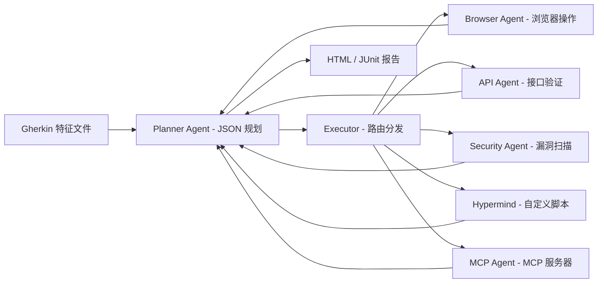

# 写 Gherkin 就能跑自动化测试：这个开源项目把 E2E 测试做成了"填需求"

> 一个 AI Agent，吃 Gherkin 特征文件，自己规划、自己执行、自己出报告。不写脚本、不配选择器，连浏览器都自己开。

---

如果测试团队还在为"维护脚本"和"找定位器"两头烧，最近有个项目值得看看。

**TestZeus Hercules**，号称"世界上第一个开源测试 Agent"——不是测试框架，不是录制回放工具，而是一个真正能理解 Gherkin 描述、自己规划步骤、自己操作浏览器、自己断言结果的 AI Agent。

项目地址：https://github.com/test-zeus-ai/testzeus-hercules

---

## 一句话结论

Hercules 是一个基于 LangGraph 状态机的 AI Agent。你给它一个 Gherkin 特征文件（比如"用户在搜索框输入无线耳机，点击搜索，打开第一个结果，验证详情页"），它自己规划执行路径、操作浏览器、断言结果，最后输出 JUnit XML 和 HTML 报告。

**它的定位不是"帮你写测试脚本"，而是"直接替你跑测试"。**

---

## 核心亮点

### 1. 输入是 Gherkin，输出是报告——中间全是 Agent 自己干

你不需要写任何 Python 代码、不需要配 Playwright 选择器、不需要管 WebDriver 生命周期。写一个 Gherkin 特征文件，跑一条命令，它自己开浏览器、自己找元素、自己点、自己断言。

```gherkin
Feature: Product Search on Demo Store

  Scenario: Successfully find a product
    Given I am on the demo store home page
    When I enter "wireless headphones" in the search field
    And I click on the "Search" button
    And I open the first matching product result
    Then I should see the product details page
    And I should see "wireless headphones" in the product title or description
```

上面这段就是全部输入。不需要 `driver.find_element`，不需要 `By.CSS_SELECTOR`。

### 2. 架构：LangGraph 状态机 + 多 Agent 分工

Hercules 的底层是 LangGraph StateGraph，跑起来后内部拆成几个角色：

- **Planner Agent**：解析 Gherkin，把场景拆成 JSON 计划（含 `next_step`、`target_helper`、`assertion`）
- **Executor**：根据 Planner 的指令路由到对应的导航 Agent
- **Navigation Agents**：各自负责一类操作——浏览器操作、API 调用、安全扫描、SQL 查询、时间控制、MCP 调用、Python 脚本执行

每个 Navigation Agent 绑定 LangChain StructuredTool，执行完结果回传给 Planner，Planner 判断下一步，直到终止或进入断言处理。

### 3. 支持多种"导航方式"——不只是点浏览器

Hercules 内置了至少 7 种导航 Agent：

| 导航 Agent | 用途 |
|---|---|
| `browser_nav_agent` | 打开 URL、点击、输入文本、选择下拉框、滑块、日期选择、文件上传、验证码 |
| `api_nav_agent` | API 级别的 E2E 测试 |
| `sec_nav_agent` | 安全漏洞扫描（集成 Nuclei） |
| `sql_nav_agent` | 数据库验证 |
| `mcp_nav_agent` | 连接 MCP 服务器（支持 stdio、sse、streamable-http） |
| `executor_nav_agent` | 执行自定义 Python 脚本（Hypermind 沙箱） |
| `time_keeper_nav_agent` | 时间控制 |

也就是说，同一个 Gherkin 文件里，你可以先做 UI 操作，再调 API 验证，再查数据库，最后扫安全——全都用 Gherkin 描述。

### 4. 浏览器感知能力：不是简单选元素

Hercules 的 DOM 处理策略比较有意思。它不会把整个 DOM 塞给 LLM（那样 token 撑爆），而是：

- 用 `get_interactive_elements` 提取可交互节点（可点击、可聚焦、可输入）
- 用 `get_input_fields` 提取表单输入节点
- 给每个 DOM 元素注入 `md` 属性作为主选择器
- 输出紧凑 JSON，避免大 DOM 导致 LLM 的 INVALID_ARGUMENT 错误

同时支持视觉能力——截图检查组件状态。

### 5. 多模型支持，不绑定 OpenAI

Hercules 支持多种 LLM 后端：

- **OpenAI**：GPT-4o、GPT-4.1、o-series、GPT-5 系列
- **Anthropic**：Claude 系列（需 tool-calling 支持）
- **Gemini / Vertex AI**：通过 LiteLLM 网关接入
- **Groq、Mistral、DeepSeek、Bedrock、Azure、Ollama**：兼容 OpenAI 格式的都可以
- **本地模型**：Ollama 部署，模型需能稳定输出 JSON 且支持 tool calling

更关键的是，它支持**按角色配不同模型**——Planner 用强模型做 JSON 推理，Navigation 用支持 tool calling 的模型，Helper 用轻量模型，通过 `agents_llm_config.json` 配置。

### 6. 一个测试用例成本约 $0.20（GPT-4o）

文档给出了一个参考：复杂用例（搜索→打开商品→加购→打开购物车→断言）用 GPT-4o 跑一次大约 $0.20。这在一个 E2E 测试场景里算可接受范围，但如果大规模跑 CI 流水线，成本需要算清楚。

### 7. 开箱即用的集成路径

Hercules 提供 4 种运行方式：

| 方式 | 适用场景 | 命令 |
|---|---|---|
| PyPI 安装 | 本地快速测试 | `pip install testzeus-hercules` |
| Docker | CI/CD 集成 | `docker pull testzeus/hercules:latest` |
| 源码编译 | 自定义扩展 | `git clone → make install` |
| Google Colab | 快速体验 | 官方 Notebook |

### 8. 远程浏览器 + CDP 支持

Docker 模式默认跑 headless 浏览器。但如果你需要可视化调试，或者想连接 BrowserBase、BrowserStack、LambdaTest、AnchorBrowser 等远程浏览器，可以通过 `CDP_ENDPOINT_URL` 配置。

注意：视频录制仅支持 `connect_over_cdp` 方式（BrowserBase、AnchorBrowser），BrowserStack 和 LambdaTest 不支持。

### 9. 自定义脚本执行：Hypermind 沙箱

当标准操作不够用，可以在 Gherkin 里直接调用自定义 Python 脚本：

```gherkin
And execute the apply_filter function from script at "scripts/apply_filter.py" with filter_type as "Turtle Neck"
```

脚本里自动注入 `page`、`browser`、`logger`、`asyncio` 等工具，支持多租户隔离（executor / data / API / restricted 四个安全级别）。

```python
async def apply_filter(filter_type: str) -> dict:
    """Apply filter with fallback strategies."""
    await page.wait_for_selector('[data-filter-section]')
    for selector in [f'input[value="{filter_type}"]',
                     f'label:has-text("{filter_type}") input']:
        if await page.locator(selector).count() > 0:
            await page.locator(selector).click()
            break
    return {"status": "success", "filter": filter_type}
```

### 10. 安全测试 + 无障碍测试

集成 Nuclei 做漏洞扫描，支持 WCAG 2.0/2.1/2.2 的 A/AA/AAA 级无障碍检测——同样是 Gherkin 描述，Agent 执行。

---

## 快速上手

### 安装

```bash
pip install testzeus-hercules
playwright install --with-deps
```

### 配置模型

```bash
export LLM_MODEL_NAME=gpt-4o
export LLM_MODEL_API_KEY=***
export LLM_MODEL_BASE_URL=https://api.openai.com/v1
```

### 准备目录结构

```
opt/
├── input/
│   └── test.feature
├── output/
├── log_files/
├── proofs/
└── test_data/
    └── test_data.txt
```

### 编写 Gherkin 特征文件

`opt/input/test.feature`：

```gherkin
Feature: Product Search on Demo Store

  Scenario: Successfully find a product
    Given I am on the demo store home page
    When I enter "wireless headphones" in the search field
    And I click on the "Search" button
    And I open the first matching product result
    Then I should see the product details page
    And I should see "wireless headphones" in the product title or description
```

### 运行

```bash
testzeus-hercules \
  --input-file opt/input/test.feature \
  --output-path opt/output \
  --test-data-path opt/test_data
```

### 查看结果

执行完成后，`opt/output/` 下会生成 JUnit XML 报告和 HTML 报告，`opt/proofs/` 下有截图、视频、网络日志。

### Docker 方式

```bash
docker pull testzeus/hercules:latest

docker run --env-file=.env \
  -v ./agents_llm_config.json:/testzeus-hercules/agents_llm_config.json \
  -v ./opt:/testzeus-hercules/opt \
  --rm -it testzeus/hercules:latest
```

### 命令速查

| 阶段 | 命令 | 说明 |
|---|---|---|
| 安装 | `pip install testzeus-hercules` | 从 PyPI 安装 |
| 安装浏览器 | `playwright install --with-deps` | 安装 Playwright 浏览器和依赖 |
| 配置模型 | `export LLM_MODEL_NAME=gpt-4o` | 设置 LLM 模型 |
| 运行测试 | `testzeus-hercules --input-file ... --output-path ... --test-data-path ...` | 标准运行 |
| 简化运行 | `testzeus-hercules --project-base=opt` | 使用项目目录结构，自动定位输入输出 |
| 交互模式 | `make run-interactive` | 聊天式交互，适合调试 |
| Docker 运行 | `docker run ... testzeus/hercules:latest` | 容器化运行 |

---

## 架构速览

Hercules 的核心运行流程：



---

## 写在最后

Hercules 这个项目，方向是对的。它解决了测试自动化里最耗人的两个问题：**写脚本**和**维护选择器**。

但有几个边界值得说清楚：

**成本要算。** 每个测试用例 $0.20 看起来不多，但一个 CI 流水线一天跑几百个用例，月账单就能到上千美元。如果团队预算紧，先用本地模型（Ollama）压成本，但模型能力要够稳定输出 JSON 和 tool calling。

**Gherkin 的表达力有限。** 复杂业务逻辑（条件分支、循环、数据驱动）在 Gherkin 里写起来并不自然。Hercules 用 Hypermind 沙箱补了自定义脚本的能力，但意味着你还是要写 Python——只是从"写全部脚本"变成了"写关键脚本"。

**生产环境需评估。** 项目文档提到了 enterprise 场景支持，但从架构来看，Agent 每次执行都依赖 LLM 推理，延迟和稳定性与纯脚本框架（Playwright + 断言库）不是一个量级。适合的场景是：**回归测试、冒烟测试、跨浏览器兼容性验证**，不适合毫秒级响应的测试流水线。

总的来说，Hercules 值得测试团队关注——尤其是那些"脚本写不完、维护跟不上、但业务还在变"的团队。它不会取代传统测试框架，但它在"测试自动化"这件事上，提供了一个完全不同维度的解法。

#开源 #AI测试 #E2E测试 #Gherkin #Playwright #LangGraph #TestZeus #自动化测试 #测试Agent #LLM #安全测试 #无障碍测试 #MCP #Nuclei #CI/CD #软件测试 #AIAgent