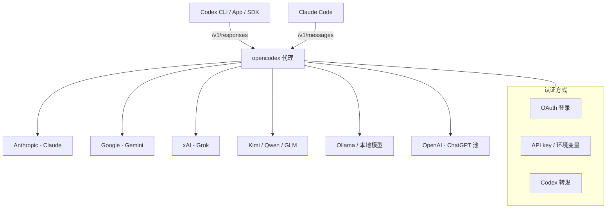

# opencodex：一个包，让 Codex 和 Claude Code 能跑任意 LLM


用 Codex 的，应该都遇到过这种情况：想换个模型试试，但官方的模型列表就那么几个，不支持的就是不支持。

Claude Code 也一样——你被绑死在 Anthropic 上，想用 Gemini 跑个代码审查、用 Grok 做点快速原型，都得切工具、换环境、重新配密钥。

最近有人把这个麻烦事儿做成了一个项目，叫 **opencodex**。

一句话：它是一个轻量级本地代理，把你的 Codex 会话路由到任何 LLM——Claude、Gemini、Grok、GLM、DeepSeek、Kimi、Qwen、Ollama，甚至本地跑的模型，都可以。不需要等官方加支持，装一个包，配一个 provider，直接在 Codex 模型选择器里选。


opencodex 是一个基于 Node 18+ 的本地代理，通过翻译 Codex 的 Responses API 到目标 provider 的协议，让 Codex CLI / App / SDK 和 Claude Code 都能使用任意 LLM。同时也支持 ChatGPT 账户池管理、配额追踪、自动 failover。适合那些不想被单一模型绑死、需要在不同场景下灵活切换后端的开发者。


### 1、40+ provider 开箱即用，5 种协议 adapter 全覆盖

opencodex 内置了 5 种协议 adapter：Anthropic Messages、Google Gemini、Azure、OpenAI Responses 直通，以及 OpenAI 兼容的 Chat Completions 端点。这意味着只要你的目标 provider 支持其中任何一种，opencodex 就能直接对接。

内置的 provider 目录包括 Anthropic、Google、xAI、Kimi、Ollama Cloud、Groq、OpenRouter、Azure、DeepSeek、GLM、Together、Fireworks、Cerebras、Mistral、Hugging Face、NVIDIA NIM、MiniMax、Qwen Cloud 等 40+ 家。不够的话，还可以自定义任意 OpenAI 兼容端点。

### 2、在 Codex 里用任意模型，模型选择器原生可见

安装配置完成后，你添加的路由模型会像原生模型一样出现在 Codex 的模型选择器里。通过 `provider/model` 格式指定：

```
codex -m "anthropic/claude-opus-4-8" "解释这个 stack trace"
codex -m "google/gemini-3-pro" "为 auth.ts 写单元测试"
codex -m "ollama/llama3" "重构这个函数"
```

省略 provider 前缀时，会根据模型名模式自动匹配（`claude-*` 路由到 Anthropic，`gpt-*` 路由到 OpenAI）。**注意：** 这在 Codex CLI 里直接可用，App 模型选择器也支持。

### 3、Claude Code 也能用——不是反了，是同一套代理

opencodex 的同一个守护进程也提供 Anthropic Messages API（`/v1/messages` + `count_tokens`）。运行 `ocx claude` 启动完全接线的 Claude Code，路由模型通过网关模型发现出现在原生 `/model` 选择器中（`claude-ocx-<provider>--<model>` 别名，需要 Claude Code 2.1.129+）。槽位和模型映射在仪表盘的 Claude 页面配置。

### 4、ChatGPT 账户池：多个账户自动路由 + 配额刷新

这是 opencodex 比较特别的一个功能——它不止是协议代理，还能管理 Codex 认证的 ChatGPT 账户池。

你在仪表盘里添加多个 ChatGPT / Codex 账户，opencodex 会：
- 刷新每个账户的 5 小时 / 每周 / 30 天配额
- 新会话自动路由到使用量最低的健康账户
- 现有 Codex 线程固定在启动它的账户上，不会中途跳账户（这对长时间 SSH、tmux 或移动端连接的会话很关键）
- 内置配额查询，一键刷新所有账户

**边界：** 这个功能依赖 ChatGPT 登录，不是 API key 模式。如果你只用 API key，走 `openai-apikey` provider 就行，不涉及账户池。

### 5、登录一次，免填 API key

xAI、Anthropic、Kimi 支持 OAuth，用现有账户登录，token 自动刷新。也可以转发 `codex login`、粘贴 API key，或使用 `${ENV_VAR}` 引用环境变量——三种方式都支持。

### 6、委派给合适的模型：subagent 选择器 + effort 控制

在仪表盘或 config 中，可以把最多 5 个路由/原生模型放进 Codex 的 subagent 选择器——复杂任务交给 reasoning 模型，快速任务交给便宜模型。

路由模型在 Codex 支持时可显示 `low`、`medium`、`high`、`xhigh`、`max` 和 `ultra` reasoning 控制。除非 provider config 明确设置 alias，opencodex 会把 `xhigh` 与 `max` 保持为不同档位。

**已知限制：** 原生父代理 spawn 路由子代理时，任务正文可能以后端加密形式到达而丢失（[issue #92](https://github.com/lidge-jun/opencodex/issues/92)）。需要可靠的跨 provider 委派请使用 v1 表面。

### 7、给非 OpenAI 模型加超能力：网页搜索 + 图片理解

非 OpenAI 模型也能通过你的 ChatGPT 登录上运行的 `gpt-5.4-mini` sidecar 获得真正的网页搜索和图片理解。这个 sidecar 由你的 ChatGPT 登录驱动，不需要额外 API key。

### 8、原生图片生成，独立于 hosted Responses

Codex 的独立 `image_gen` 工具通过 `POST /v1/images/generations` 生成图片、通过 `POST /v1/images/edits` 编辑图片。它独立于 hosted Responses 的 `image_generation` 工具，所以即使你的 provider 不支持图片生成，opencodex 也能处理。

### 9、Web 仪表盘 + 实时日志

`ocx gui` 打开 `http://localhost:10100` 仪表盘，可以看到 provider 状态、OAuth 状态、模型选择、实时请求日志。当上游返回时，也会包含 `cached`/`cache-write` token 计数——不用再猜请求为什么失败。

### 10、干净退出，零残留

`ocx stop`（或仪表盘的 Stop 按钮）会关闭代理、停止已安装的后台服务，并将 Codex 恢复为原始配置。之后 `codex` 就像从未安装过 opencodex 一样工作——无残留配置，无僵尸进程。

## 快速上手

### 安装

```bash
npm install -g @bitkyc08/opencodex
```

**注意：** 推荐使用用户自有的 Node（nvm/fnm），避免 `sudo npm install -g`。如果遇到 "bundled Bun runtime is missing" 错误，说明安装时跳过了 lifecycle 脚本，需要允许 bun 安装脚本后重新安装：

```bash
npm install -g --allow-scripts=bun @bitkyc08/opencodex
```

如果最初是用 sudo 安装的，继续使用 sudo：

```bash
sudo npm install -g --allow-scripts=bun @bitkyc08/opencodex
```

### 初始化

```bash
ocx init
```

这会交互式写入配置并注入 Codex。

### 启动

```bash
ocx start
```

### 使用

```bash
codex "Write a hello world in Rust"
```

### 命令速查

| 阶段 | 命令 | 用途 |
|------|------|------|
| 安装 | `npm install -g @bitkyc08/opencodex` | 全局安装（自动打包 Bun 运行时） |
| 初始化 | `ocx init` | 交互式写入配置 + 注入 Codex |
| 启动 | `ocx start [--port 10100]` | 启动代理 |
| 停止 | `ocx stop` | 停止代理并恢复原生 Codex 配置 |
| GUI | `ocx gui` | 打开 Web 仪表盘 |
| 状态 | `ocx status` | 查看代理是否在运行 |
| 更新 | `ocx update [--tag preview]` | 更新 opencodex |
| 卸载 | `ocx uninstall` | 移除所有配置和状态 |
| Claude Code | `ocx claude [args...]` | 启动接入代理的 Claude Code |
| 后台服务 | `ocx service install` | 安装为系统服务（launchd / systemd） |
| 自动启动 | `ocx codex-shim install` | 运行 codex 时自动启动代理 |

### 配置示例

云端 provider 配置（`~/.opencodex/config.json`）：

```json
{
  "port": 10100,
  "defaultProvider": "anthropic",
  "providers": {
    "anthropic": {
      "adapter": "anthropic",
      "baseUrl": "https://api.anthropic.com",
      "authMode": "oauth",
      "defaultModel": "claude-sonnet-4-6"
    },
    "ollama-cloud": {
      "adapter": "openai-chat",
      "baseUrl": "https://ollama.com/v1",
      "apiKey": "${OLLAMA_API_KEY}",
      "defaultModel": "glm-5.2"
    }
  }
}
```

本地 provider 配置（Ollama / vLLM / LM Studio）：

```json
{
  "port": 10100,
  "defaultProvider": "local",
  "providers": {
    "local": {
      "adapter": "openai-chat",
      "baseUrl": "http://localhost:11434/v1",
      "apiKey": "",
      "defaultModel": "qwen3:32b"
    }
  }
}
```

## 架构图

opencodex 的架构本质上是一个协议转换层：




opencodex 解决的是一个真实痛点：**模型锁定**。Codex 和 Claude Code 都是好工具，但如果你只能用一个模型，你就失去了灵活切换、按场景选模型的能力。

这个项目做得比较聪明的地方是，它不止是翻译协议，还管了账户池、配额、failover、sidecar 这些真正在用的场景里会遇到的问题。而且 `ocx stop` 能干净退出，这在工具类项目里不多见——很多代理装上去就不好拆了。


#GitHub #opencodex #Codex #ClaudeCode #LLM #开源 #代理 #模型切换 #开发工具