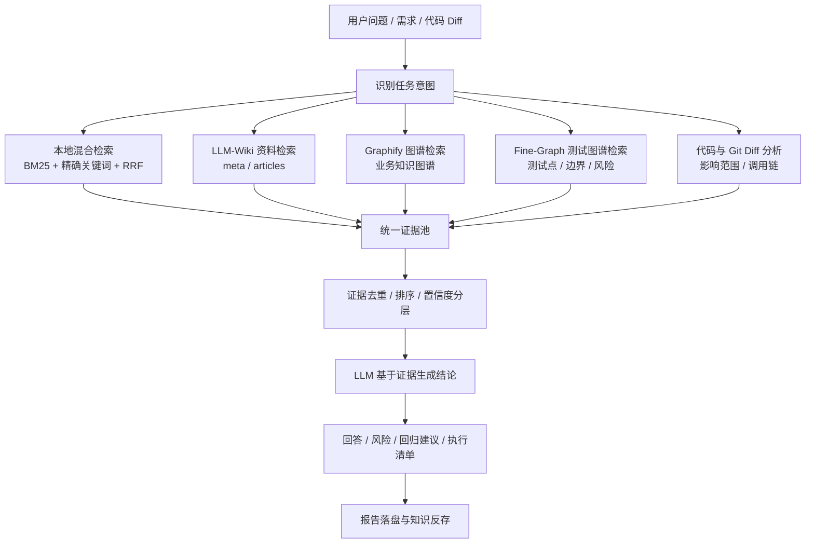

# AI 辅助开发半年后，我把自己踩的坑写成了一套工作区框架

## 你以为 AI 开发是"聊着聊着就写完了"

半年前我也是这么想的。

打开一个 IDE，唤起 Agent，说一句"帮我写个接口"，然后看着它噼里啪啦输出代码。改完 bug 来一句"修复一下"，再看着它跑一遍测试。觉得不对就重新开个会话重来一遍。

看起来挺高效，对不对？

**直到你真正开始做项目。**

不是那种"写一个脚本就完事"的项目，是那种跨模块、跨天、跨会话、跨模型、甚至跨宿主平台的项目。

这时候你会发现：

- 换了模型，Agent 不记得上次聊到哪了
- 换了会话，上下文丢了，得从头说一遍
- 换了平台（Codex 换 Claude Code 换 Cursor），每个环境都有自己的规则文件格式，配置不通用
- 写了几个 skill，下个项目要用的时候发现"之前那个项目里写过，但得重新找"
- 好不容易写完一个功能，过两天回来改 bug，发现当时的代码逻辑和现在想的不一样，但没有文档记录当时为什么这么写

**这不是 AI 的问题，这是工作方式的问题。**

## 把"聊天式协作"升级成"工程式协作"


项目就叫 **code_project**，地址在 `src/` 下管理所有真实代码，根目录只放规则、记忆、技能和引导文件。

核心思路很简单：**Agent 按文件工作，按规则沉淀，而不是依赖单次聊天上下文。**

### 六层结构，每层解决一个问题

```
Identity  →  Soul  →  User  →  Rules  →  Memory  →  Skills  →  Code
 识别身份    人格    用户     规则      记忆      技能      代码项目
```

| 层 | 文件 | 解决什么问题 |
|----|------|------------|
| 身份层 | `IDENTITY.md`、`SOUL.md` | 告诉 Agent 你是谁、怎么说话 |
| 用户层 | `USER.md` | 用户的技术栈、偏好、工作内容 |
| 规则层 | `AGENTS.md`、`TEAM.md`、`REVIEW.md` | 把规范写成文件，Agent 进了仓库先读规则 |
| 记忆层 | `MEMORY.md` + `memory/` | 跨会话可读的记忆，不依赖聊天上下文 |
| 能力层 | `skills/`、`bootstrap/` | 可复用技能包 + 多平台接入引导 |
| 代码层 | `src/` | 真实代码工程，按项目独立组织 |

根目录是控制面，`src/` 是执行面。规则在根目录，代码在 `src/`，测试、评测、harness 围绕代码工程展开。

## 最核心的机制：可恢复现场

这是我踩得最深的一个坑——**AI 开发最怕的不是写不出来，而是写到一半断了。**

换了模型、换了会话、甚至只是过了一夜，Agent 就不记得上次聊到哪了。你得重新描述一遍上下文，而描述的过程往往比直接写还累。

解决方案是：**把任务状态写进文件，而不是留在聊天记录里。**

### 任务开始时的三件套

```text
tasks/active/<task-name>/
├── ROADMAP.md    # 目标、范围、阶段计划、验收标准
├── STATE.md      # 当前进度、已完成、进行中、阻塞、下一步
└── verify-log.md # 验证记录
```

### 中断前必须做的事

当会话可能中断时，先更新 `STATE.md`：

- 当前分支 / 当前目录 / 当前项目
- 已完成内容
- 未完成内容
- 下一步可执行动作
- 已修改或重点关注的文件
- 最近一次验证命令与结果
- 当前阻塞、风险、假设

### 恢复时的读取顺序

当你说"继续上次"时，Agent 按固定顺序恢复现场：

1. 读根目录 `AGENTS.md`
2. 读项目局部 `AGENTS.md`、`README.md`
3. 查 `tasks/active/` 下的 `ROADMAP.md` 与 `STATE.md`
4. 查 `MEMORY.md` 与必要的 `memory/` 主题文件
5. 检查工作区真实状态（`git status`、已有测试/验证日志）
6. 向你报告：已完成、未完成、下一步、风险
7. 继续执行剩余任务

### 归档前的 Gate

任务完成并验证后，运行：

```bash
python3 tools/verify_task.py tasks/closed/<task-name>
```

检查 `ROADMAP.md`、`STATE.md`、`verify-log.md` 是否具备最小证据。不替代真实测试，但确保"做完"不是一句口头结论。

## 四层协作体系，各司其职

项目大了之后，光靠"文件即规则"还不够。我逐步集成了四层框架：

```text
AGENTS.md（总纲层）—— 定规矩
    ↓
OpenSpec（规约层）—— 把"要做什么"写清楚
    ↓
oh-my-opencode（编排层）—— 拆任务、调 agent、并行执行
    ↓
Superpowers（纪律层）—— TDD / review / verification 流程注入
    ↓
Agent / 人（实现层）—— 改代码、跑验证
```

### 规约层：OpenSpec

核心命令四个：

| 命令 | 场景 | 说明 |
|------|------|------|
| `/opsx:explore` | 需求还不清楚 | 探索模式，澄清范围和约束 |
| `/opsx:propose <change>` | 需求已清楚 | 生成 proposal/design/tasks |
| `/opsx:apply` | specs 准备好 | 进入实现执行 |
| `/opsx:archive` | 完成后归档 | 沉淀经验 |

### 编排层：oh-my-opencode

负责在 OpenCode 里做任务调度——拆解任务、加载 subagent、并行执行、汇总验证结果。

| 子 Agent | 职责 |
|----------|------|
| `explore` | 搜索代码库内部 |
| `librarian` | 搜索外部文档/开源 |
| `oracle` | 复杂调试/架构咨询 |
| `momus` | 计划评审/方案评估 |
| `metis` | 预规划分析/需求澄清 |

### 纪律层：Superpowers

给 Agent 注入固定工程流程技能，确保不乱写、不漏测、不漏审：

- **brainstorming**：创建新功能前
- **systematic-debugging**：遇到 bug 时
- **test-driven-development**：实现功能前
- **requesting-code-review**：合并前
- **verification-before-completion**：声称完成前

## 知识库不是聊天机器人，是证据链

说完了工作区框架，再聊聊真正落到业务上的东西。

我做的另一个项目 **LLM-Wiki-Code**，是一个面向测试人员的知识库与代码分析平台。它最初看起来像个"智能问答机器人"，但后来我发现：**测试场景里最重要的不是"答得像"，而是"答得有证据、可追溯、能复核"。**

### 证据优先，模型只是分析者

平台的一次回答，大致经过以下过程：



**模型负责理解、组织和表达，事实证据尽量来自本地知识资产、图谱和真实代码。** 平台不把大模型当作事实数据库，而是把它当作一个能够阅读证据、解释关系、组织结论的分析者。

### 三种置信度，不能混用

从图谱和模型中产生的证据，按置信度分级：

| 置信度 | 含义 | 使用原则 |
|--------|------|----------|
| `EXTRACTED` | 从资料或代码中明确抽取 | 可作为主要结论依据 |
| `INFERRED` | 根据关系或上下文推断 | 可用于扩展分析，需要校验 |
| `AMBIGUOUS` | 存在歧义或弱相关 | 只能作为待复核线索 |

这个分级很重要。很多"AI 知识库"的问题就在于：把所有结论包装成同一置信度，用户分不清哪些是真实证据、哪些是模型推断。

### 代码工程图谱分析：从英文代码到中文业务

测试人员经常面对的一个问题是：代码里全是英文类名，但业务资料和测试用例用的是中文术语。

```
CarDetectionReportController → 检测报告
PaymentService → 支付
LeadPushTask → 线索推送
```

平台通过 `meta.md` 中的业务别名、关键词和 Fine-Graph 特征节点建立桥接，再从变更影响到的 Feature 出发，寻找关联测试证据，并输出 `MUST` / `SHOULD` / `OPTIONAL` 三级回归推荐。

## 踩过的坑，写成了两条教训

### 教训一：AI 工具链最大的坑是"无声失败"

在开发 Claude Code 状态栏时，配置完后底部一片空白。排查了半天，发现是**权限位 644，没有执行位**。Claude Code 拉起失败、又没把 stderr 展示给用户，对用户来说就是"无声失败"。

**解决办法**：所有 `type: "command"` 的 hook / 状态栏 / 钩子脚本，部署完先 `ls -la` 看权限位、再 `echo {} | ./script` 走一次，比反复看代码逻辑省时间。

### 教训二：做平台容易做成"工具箱"，但用户要的是"主流程"

LLM-Wiki-Code 早期功能越来越多，但用户反馈"只有智能问答用处和效果好些，其他功能没有太实质性的作用"。

复盘发现：**不是能力不够，而是缺少主流程。** 覆盖热图、待复核队列、关系链分析、图谱——每个点都可以解释价值，但用户不知道应该从哪里开始。

后来把定位从"查询平台"收敛为"提测影响分析与测试执行清单生成平台"，核心流程变成：

```text
输入需求说明 + 代码 diff
  → 自动理解影响范围
  → 生成风险点
  → 推荐回归范围
  → 生成测试执行清单
  → 支持追问和归档
```

知识库、代码图谱、关系链、覆盖热图都不再是最终产品卖点，而是支撑这个主流程的底层能力。

## 写在最后

这套框架目前仍在迭代，但它已经解决了几个核心问题：

- **跨会话不丢现场**：`tasks/` + `memory/` 文件系统，Agent 换模型换会话也能继续
- **跨平台可迁移**：`bootstrap/` 适配不同宿主，规则不绑定任何 IDE
- **知识可复用**：`skills/` 沉淀高频技能，`src/` 统一管理代码工程
- **结论有证据**：LLM-Wiki 的知识节点 + 图谱 + 置信度分级，AI 回答可追溯

**适用边界也很清楚**：

- 如果你只写一个脚本就跑，不需要这套框架——直接聊就行
- 如果你在维护多个项目、跨天开发、团队协作，这套框架能省掉大量"重新描述上下文"的时间
- 如果你做的是测试平台 / 知识库 / 评测工程，证据链的设计思路比具体实现更值得参考

**需要注意的**：

- 框架本身是"规则 + 约定"，没有安装包，需要自己按需裁剪
- 规约层（OpenSpec）+ 编排层（oh-my-opencode）+ 纪律层（Superpowers）的集成依赖 OpenCode 生态，如果换宿主需要重新适配
- 记忆体系目前基于文件系统，大规模项目可能需要更高效的检索方案

整体来说，**AI 辅助开发不是"聊着聊着就写完了"，而是"写着写着就沉淀下来了"**。工具只是起点，真正的工程化，是从把规则写进文件、把记忆留到明天开始的。

#AI开发 #工程化 #Agent #工作区 #测试 #知识库 #LLM #开源 #DevOps #经验分享