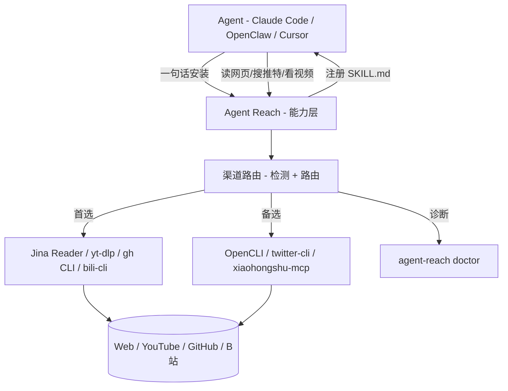

# 一句话让 Agent 拥有互联网能力：Agent Reach 把 16 个平台接成了一条命令

AI Agent 已经能帮你写代码、改文档、管项目了——但你让它去网上找点东西，它就抓瞎了。

YouTube 的视频字幕拿不到，Twitter 的 API 要付费，Reddit 直接 403 封 IP，小红书必须登录才能看，B站的风控让通用下载工具集体失效……每个平台都有自己的门槛，你要一个一个去踩坑、装工具、调配置。光是让 Agent 能读个推特就得折腾半天。

**Agent Reach 把这件事变成了一句话：**

```
帮我安装 Agent Reach：https://raw.githubusercontent.com/Panniantong/agent-reach/main/docs/install.md
```

复制给你的 Agent，几分钟后它就能读推特、搜 Reddit、看 YouTube、刷小红书了。


**Agent Reach 是一个"能力层"（capability layer）**，不是又一个工具——它替你选好、装好、体检好当下最稳的接入方式，Agent 直接调用上游工具完成读取，没有包装层。接入方式会换代，你不用操心。

适合所有在用 AI Agent 的开发者：Claude Code、OpenClaw、Cursor、Windsurf……任何能跑命令行的 Agent 都能用。


### 1. 16 个平台覆盖，从网页到社交到搜索

| 平台            | 装好即用                     | 配置后解锁                       | 怎么配                        |
| ------------- | ------------------------ | --------------------------- | -------------------------- |
| **网页**        | 阅读任意网页                   | —                           | 无需配置                       |
| **YouTube**   | 字幕提取 + 视频搜索              | —                           | 无需配置                       |
| **RSS**       | 阅读任意 RSS/Atom 源          | —                           | 无需配置                       |
| **全网搜索**      | —                        | 全网语义搜索                      | 自动配置（MCP 接入，免费无需 Key）      |
| **GitHub**    | 读公开仓库 + 搜索               | 私有仓库、提 Issue/PR/Fork        | 告诉 Agent「帮我登录 GitHub」      |
| **Twitter/X** | 读单条推文                    | 搜索推文、浏览时间线、读长文              | 告诉 Agent「帮我配 Twitter」      |
| **B站**        | 搜索 + 视频详情（bili-cli，无需登录） | 字幕（OpenCLI）                 | 告诉 Agent「帮我配 B站」           |
| **Reddit**    | —                        | 搜索 + 读帖子和评论                 | 桌面装 OpenCLI 用浏览器登录态        |
| **Facebook**  | —                        | 搜索、主页、Feed、群组列表             | 桌面装 OpenCLI（复用 Chrome 登录态） |
| **Instagram** | —                        | 用户搜索、Profile、用户最近帖子、Explore | 桌面装 OpenCLI（复用 Chrome 登录态） |
| **小红书**       | —                        | 搜索、阅读、评论                    | 桌面装 OpenCLI（刷过小红书即可用）      |
| **LinkedIn**  | Jina Reader 读公开页面        | Profile 详情、公司页面、职位搜索        | 告诉 Agent「帮我配 LinkedIn」     |
| **V2EX**      | 热门帖子、节点帖子、帖子详情+回复、用户信息   | —                           | 无需配置                       |
| **雪球**        | 股票行情、搜索股票、热门帖子、热门股票排行    | —                           | 告诉 Agent「帮我配雪球」            |
| **小宇宙播客**     | —                        | 播客音频转文字（Whisper 转录，免费 Key）  | 告诉 Agent「帮我配小宇宙播客」         |

6 个零配置渠道默认激活，其余需要登录态的渠道，Agent 会列菜单问你要哪些，点名才装。

### 2. 每个平台都有"首选 + 备选"多后端路由

不是一条路走到黑。每个渠道文件按序真实探测各候选后端，第一个完整可用的当选。某个接入方式失效了，自动换下一个——你无感。

项目文档明确给出了一个真实案例：2026 年 6 月，yt-dlp 被 B站风控 412 封死，路由自动切换到 bili-cli，用户零操作。

### 3. 完全免费，隐私安全

所有工具开源、所有 API 免费。唯一可能花钱的是服务器代理（约 $1/月），本地电脑不需要。

Cookie 只存在你本地 `~/.agent-reach/config.yaml`，文件权限 600（仅所有者可读写），不上传不外传。代码完全开源，随时可审查。

### 4. 兼容所有主流 Agent

Claude Code、OpenClaw、Cursor、Windsurf……任何能跑命令行的 Agent 都能用。安装时会自动在 Agent 的 skills 目录注册 SKILL.md，以后 Agent 遇到"全网调研"、"搜推特"、"看视频"这类需求，会自动知道该调哪个上游工具。

**OpenClaw 用户注意**：Agent Reach 依赖 Agent 执行 shell 命令。如果你的 OpenClaw 使用了默认的 messaging 工具配置，Agent 将无法执行命令。安装前需开启 exec 权限：

```bash
openclaw config set tools.profile "coding"
```

或在 `~/.openclaw/openclaw.json` 中设置 `"tools": { "profile": "coding" }`，然后重启 Gateway。

### 5. 自带诊断：`agent-reach doctor`

一条命令告诉你每个渠道的状态——当前走哪个后端、通不通、不通怎么修。

### 6. 安全模式 + Dry Run，不信任也能预览

担心安全？用 `--safe` 模式不会自动修改系统，只列出需要什么；用 `--dry-run` 预览所有操作，不做任何改动。卸载也干净彻底：`agent-reach uninstall` 清除所有配置和 token。

### 7. 持续换代，不用自己盯

每个平台都是「首选 + 备选」多后端路由。项目作者自己每天在用，平台封了修，有新渠道加。你不用自己盯着各平台的反爬变化。


### 安装

复制这句话给你的 AI Agent：

```
帮我安装 Agent Reach：https://raw.githubusercontent.com/Panniantong/agent-reach/main/docs/install.md
```

Agent 会自己完成剩下的所有事情：

1. **安装 CLI 工具** — `pip install` 装好 `agent-reach` 命令行（自带 yt-dlp、feedparser）
2. **安装系统基建** — 自动检测并安装 Node.js、gh CLI、mcporter
3. **配置搜索引擎** — 通过 MCP 接入 Exa（免费，无需 API Key）
4. **检测环境** — 判断是本地电脑还是服务器，给出对应的配置建议
5. **注册 SKILL.md** — 在 Agent 的 skills 目录安装使用指南
6. **问你要不要更多** — 默认只激活 6 个零配置渠道；需要登录态的渠道列菜单问你要哪些

### 更新

```
帮我更新 Agent Reach：https://raw.githubusercontent.com/Panniantong/agent-reach/main/docs/update.md
```

### 安全模式安装

```
帮我安装 Agent Reach（安全模式）：https://raw.githubusercontent.com/Panniantong/agent-reach/main/docs/install.md
安装时使用 --safe 参数
```

### 卸载

```bash
agent-reach uninstall
```

清除 `~/.agent-reach/`（含所有 token/cookie）、各 Agent 的 skill 文件、mcporter 中的 MCP 配置。

```bash
# 只预览，不实际删除
agent-reach uninstall --dry-run

# 只删 skill 文件，保留 token 配置（重装时用）
agent-reach uninstall --keep-config
```

卸载 Python 包本身：`pip uninstall agent-reach`

### 安装方式速查

| 方式 | 命令 | 适合场景 |
|------|------|---------|
| 一键全自动（默认） | `agent-reach install --env=auto` | 个人电脑、开发环境 |
| 安全模式 | `agent-reach install --env=auto --safe` | 生产服务器、多人共用机器 |
| 仅预览 | `agent-reach install --env=auto --dry-run` | 先看看会做什么 |


不需要任何配置，告诉 Agent 就行：

- "帮我看看这个链接" → `curl https://r.jina.ai/URL` 读任意网页
- "这个 GitHub 仓库是做什么的" → `gh repo view owner/repo`
- "这个 YouTube 视频讲了什么" → `yt-dlp` 提取字幕
- "B站搜一下 AI 教程" → `bili search`（无需登录）
- "全网搜一下 LLM 框架对比" → Exa 语义搜索
- "订阅这个 RSS" → `feedparser` 解析

**不需要记命令。** Agent 读了 SKILL.md 之后自己知道该调什么。

## 项目架构




Agent Reach 解决了一个非常实在的问题：Agent 的"互联网能力"一直是个碎片化的痛点——每个平台一套工具、一套配置、一套认证，每次换 Agent 都要重新踩一遍。它把这件事做成了"能力层"，安装一次，后续所有 Agent 共享。

**适用边界也很清楚**：

- 如果你只让 Agent 写代码、读本地文件，不需要——装了也白装
- 如果你需要 Agent 去网上找信息、看视频、搜社交平台，Agent Reach 能省掉大量"装工具调配置"的重复劳动
- 需要登录态的平台（Twitter、小红书、Reddit 等），配置过程需要你配合——不是完全自动化的，但 Agent 会一步步引导你

**需要留意的地方**：

- **Cookie 安全**：使用 Cookie 登录的平台存在被平台检测并封号的风险。项目方建议使用**专用小号**，不要用主账号——这个建议很实在，不是敷衍
- **OpenClaw 用户**：需要先开启 exec 权限，否则无法安装
- **服务器部署**：需要代理（约 $1/月），本地电脑不需要
- 项目目前是个人维护，路由的持续更新依赖作者的时间投入——不过作者明确说"我自己每天在用，所以我会一直维护它"，这比"欢迎 PR"式的空话靠谱

整体来说，**如果你在认真用 Agent 做事，Agent Reach 值得一试**。它不解决"Agent 能不能上网"的问题，但能解决"Agent 上网要折腾多久"的问题。

#Agent #开源 #互联网 #AI #工具 #自动化 #Claude #OpenClaw #Cursor #生产力