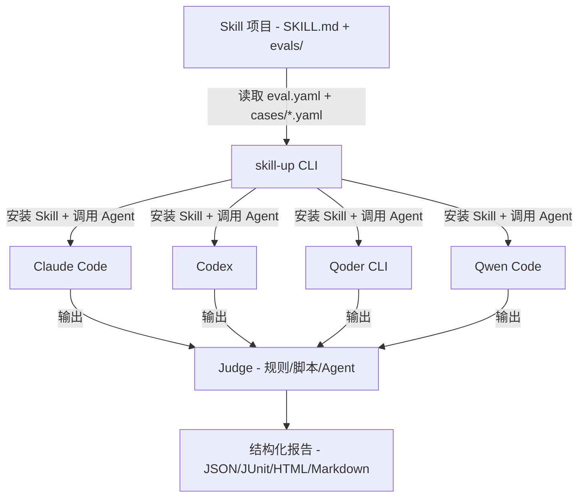

# 从"手写 YAML 试半天"到"一条命令跑评测"：阿里 skill-up 把 Agent Skill 评测做成了 CLI

Skill 写好了，SKILL.md 改了七八版，交给 Agent 跑了几次感觉还行——但你怎么知道它真的"行"？

不是功能行不行，而是**评测行不行**。

一个评测案例，需要准备 workspace、安装 Skill、调 Agent、对比 with/without 输出、评分、汇总。每次手动来一遍，开发者很快就变成"感觉差不多就行"了。

阿里最近开源的 **skill-up**，就是专门解决这个问题的：一个给 Agent Skill 开发者用的 CLI 评测框架。


**skill-up 是一个声明式评测 CLI**：你在 Skill 包里写 YAML 定义评测用例和环境，一条命令跑完"安装 Skill → 调用 Agent → 评分 → 出报告"全流程。

适合所有人：刚写完第一个 SKILL.md 想验证一下的开发者、要给 Skill 上 CI 管线的团队、以及需要跨引擎（Claude Code / Codex / Qoder CLI）跑同一套评测的人。

## 核心亮点

### 1. 声明式评测配置，YAML 就是评测契约

不用再手写临时脚本拼运行目录。在 `evals/eval.yaml` 里声明环境、引擎、模型、用例路径，`evals/cases/*.yaml` 里写具体用例。配置和用例分离，结构清晰，版本管理友好。

**前提**：需要了解 YAML 语法，但学习成本很低——一个最小配置也就十几行。

### 2. 多引擎支持，不绑定单一 Agent 客户端

内置支持 **Claude Code**、**Codex**、**Qoder CLI**、**Qwen Code** 四种 Agent 引擎。通过 `engine.custom` 还可以接入自定义 Agent（本地传输协议）。

这意味着同一个 Skill 可以用不同引擎跑评测，对比不同 Agent 的表现差异——不是"能跑就行"，而是"在不同引擎下表现如何"。

### 3. 灵活评分策略，三种评估方式

- **rule_based**（规则匹配）：检查输出是否包含指定字符串，适合简单用例
- **script**（脚本评分）：写自定义评分脚本，适合复杂判断
- **agent_judge**（Agent 评分）：让另一个 Agent 来评估输出质量，适合主观性强的场景

不同的评测维度选不同的评分方式，不搞一刀切。

### 4. 结构化报告，不止是"通过/失败"

输出多种格式的报告：Anthropic 兼容的 `grading.json`、`benchmark.json`、`benchmark.md`，以及通用的 `result.json`、JUnit XML 和 HTML 报告。

JUnit XML 意味着可以直接对接 CI 平台（Jenkins、GitLab CI 等）的测试报告展示。HTML 报告则方便本地查看。

### 5. Anthropic 兼容，迁移成本低

如果你之前用过 Anthropic 的 `evals.json` 格式，`skill-up import` 可以直接导入，也可以用 `--auto` 自动识别。不要求你从头改写评测配置。

### 6. AI 辅助编写评测：skill-upper

项目内置了一个叫 **skill-upper** 的 Agent Skill。你不用手写 YAML——在 Agent 里打开目标 Skill 项目，告诉它"用 skill-upper 给这个 Skill 添加评测"，Agent 会自动生成评测配置、校验、运行并解释结果。

**注意**：这是 skill-upper Skill 的能力，不是 skill-up CLI 本身的功能。你可以选择用 AI 辅助，也可以选择手写 YAML——后者更可控。

### 7. CI 就绪，GitHub Action 一步到位

仓库自带了 `action.yml`，直接在 GitHub Actions 里用：

```yaml
# .github/workflows/skill-eval.yml
name: Skill Eval
on:
  pull_request:
    paths: ['skills/**', 'evals/**', '**/SKILL.md']
jobs:
  eval:
    runs-on: ubuntu-latest
    steps:
      - uses: actions/checkout@v4
      - uses: alibaba/skill-up@main
        with:
          engine: claude_code
          api-key: ${{ secrets.ANTHROPIC_API_KEY }}
          base-url: https://api.anthropic.com
          skill-target: evals/eval.yaml
```

每个 PR 自动触发评测，跨引擎校验同一个 Skill。action 镜像里预装了 skill-up 和三个引擎 CLI，拉镜像就跑。

**前提**：需要 Linux runner（Docker 容器 action），以及把模型凭据存为仓库 secret。

### 8. 跨平台，Windows 也支持

skill-up 原生支持 Windows，有专门的 Windows 使用指南和 PowerShell 工具脚本。不过原生运行 agent CLI 需要 Git Bash。


### 安装

```bash
curl -fsSL https://raw.githubusercontent.com/alibaba/skill-up/main/install.sh | bash
```

安装脚本从 GitHub Releases 自动下载对应平台的二进制文件。

本地构建需要 Go 1.25+：

```bash
make build
# 或
go build -o bin/skill-up ./cmd/skill-up
```

### 第一步：创建评测配置

在 Skill 目录下创建 `evals/eval.yaml`：

```yaml
schema_version: v1alpha1

environment:
  type: none

engine:
  name: claude_code

cases:
  files:
    - evals/cases/hello-world.yaml
```

当 `evals/eval.yaml` 位于包含 `SKILL.md` 的目录下时，skill-up 会自动安装当前 Skill。未写出的字段使用默认值：JSON 报告、`timeout_seconds: 300`、`max_turns: 10`、`parallelism: 1`。

### 第二步：编写 Eval Case

创建 `evals/cases/hello-world.yaml`：

```yaml
input:
  prompt: |
    请帮我生成一个 Hello World 程序

expect:
  must_contain:
    - "Hello"
    - "World"
```

用例 `id` 默认取文件名（这里是 `hello-world`）。需要脚本评测或 Agent 评测时才额外添加 `judge` 配置。

### 第三步：校验配置

```bash
skill-up validate
```

可选但建议首次运行前执行：只检查 `eval.yaml` 和引用的用例文件，不启动 Agent Engine。

### 第四步：运行评测

```bash
skill-up run
```

评测结果写入 `<skill-name>-workspace/iteration-1/` 目录。

### 从 Anthropic 格式导入

```bash
skill-up import ./evals/evals.json --output ./evals
```

### 命令速查

| 阶段 | 命令 | 说明 |
|------|------|------|
| 校验 | `skill-up validate [path]` | 检查 eval.yaml 和用例文件 |
| 运行 | `skill-up run [path]` | 运行评测用例并生成报告 |
| 列表 | `skill-up list-cases [path]` | 列出配置引用的所有用例 |
| 报告 | `skill-up report <result.json>` | 从已有结果生成报告 |
| 导入 | `skill-up import <evals.json>` | 将 Anthropic evals.json 导入为 YAML 用例 |
| 调试 | `skill-up debug judge <input.json>` | 调试 judge 模块 |
| 调试 | `skill-up debug report <input.json>` | 调试 report 模块 |

## 项目架构




skill-up 解决的痛点非常具体：Agent Skill 的评测一直是个"谁都能做但没人愿意标准化"的环节。阿里把它做成了一个 CLI 工具，YAML 声明评测、一条命令跑完、多引擎支持、CI 可集成——这确实是 Skill 开发从"野路子"走向"工程化"的必需品。

**适用边界也很清楚**：

- 如果你只写一个简单的 prompt 技能，不需要评测框架——手动跑两遍看看就行
- 如果你在维护多个 Skill 或团队协作，skill-up 的价值就出来了：评测可复现、可追溯、可对比
- CI 集成是它的杀手锏——每个 PR 自动跑评测，比"我手动测了没问题"靠谱得多

**需要注意的点**：

- Agent 评测本质上是"用模型来评模型"，结果有随机性，不要把它当成确定性单元测试
- 评测需要消耗模型 API 额度，CI 场景下要注意成本
- `agent_judge` 评分策略虽然灵活，但引入了额外的模型调用和延迟

整体来说，**如果你在认真写 Agent Skill，skill-up 值得放进工具链**。它不解决"你的 Skill 好不好"的问题，但能帮你可靠地知道"它到底怎么样"。

#AgentSkill #评测 #CLI #开源 #阿里巴巴 #DevOps #CI #YAML #LLM #AI