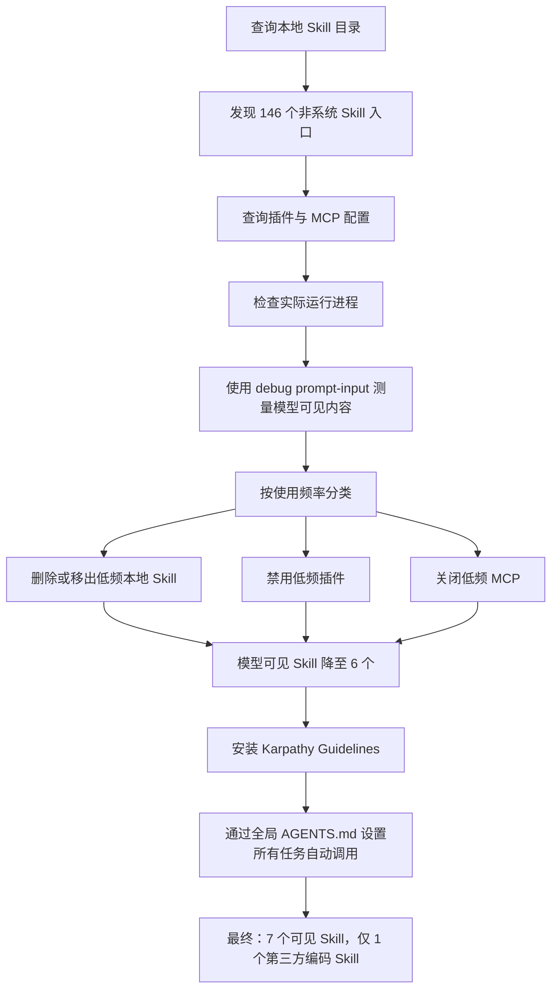

# 我清掉了几乎所有 Codex Skill 和低频 MCP，最后只留 Karpathy Guidelines

前段时间，我给 Codex 安装了很多 Skill 和 MCP。

代码审查、测试生成、浏览器操作、知识图谱、文档处理、流程规划……看到有用的就装，想着以后总会用到。

但实际使用一段时间后，我发现一个问题：

> 能力越来越多，Codex 却没有变得更好用。

每次启动任务，Codex 都要先了解当前有哪些 Skill、插件和工具。很多能力几个月都用不到一次，却长期占据初始上下文、增加路由判断，有些 MCP 还会随任务启动后台进程。

于是，我做了一次完整盘点和清理。

最后只保留了一个第三方编码 Skill：

**Karpathy Guidelines。**

清理后的 Codex，反而更符合我的日常开发习惯。

---

## 一、我先查了 Codex 到底安装了多少 Skill

最开始，我只是想知道 Codex 当前能发现哪些非系统 Skill。

我检查了四类常见目录：

```bash
find ~/.codex/skills \
     ~/.agents/skills \
     ~/gstack/.agents/skills \
     ~/.codex/superpowers/skills \
     -name SKILL.md \
     -not -path '*/.system/*'
```

同时检查已启用插件：

```bash
codex plugin list
```

结果比预想中夸张：本机一度存在 **146 个非系统 Skill 入口**。

### 1. 用户级 Codex Skill：21 个

来源：`~/.codex/skills`

```text
code-review
devos-change-docs
devos-docs
excel-testcase-workbook
gstack
neat-freak
openspec-apply-change
openspec-archive-change
openspec-continue-change
openspec-explore
openspec-ff-change
openspec-new-change
openspec-propose
performance-summary-report
test-automation-report
test-case-agent
test-graph-diff-risk-query
test-graph-impact-query
test-graph-testcase-query
test-graph-workload-estimator
ui-ux-pro-max
```

### 2. 通用第三方 Skill：51 个

来源：`~/.agents/skills`

```text
agent-browser
agent-debug-diagnosis
archify
archimate
architecture
bpmn
canvas
caveman
cloud
computer-use
context-manager
data-analytics
diagnose
find-skills
graphify
graphviz
grill-me
grill-with-docs
hallmark
handoff
improve-codebase-architecture
infocard
infographic
iot
iterative-optimizer
itinerary-optimizer
mindmap
network
orca-cli
orchestration
outcome-benchmark-generator
playwright-best-practices
playwright-generate-test
prototype
release-skills
routing-benchmark-generator
sandbox-guard
security
setup-matt-pocock-skills
skill-benchmark-generator
skill-generator
skill-optimizer
skill-sync
tdd
to-issues
to-prd
triage
uml
vega
write-a-skill
zoom-out
```

### 3. gstack Skill：54 个

来源：`~/gstack/.agents/skills`

```text
autoplan
benchmark
benchmark-models
browse
canary
careful
claude
context-restore
context-save
cso
design-consultation
design-html
design-review
design-shotgun
devex-review
diagram
document-generate
document-release
freeze
gstack
gstack-upgrade
guard
health
investigate
ios-clean
ios-design-review
ios-fix
ios-qa
ios-sync
land-and-deploy
landing-report
learn
make-pdf
office-hours
open-gstack-browser
pair-agent
plan-ceo-review
plan-design-review
plan-devex-review
plan-eng-review
plan-tune
qa
qa-only
retro
review
scrape
setup-browser-cookies
setup-deploy
setup-gbrain
ship
skillify
spec
sync-gbrain
unfreeze
```

### 4. Superpowers Skill：14 个

来源：`~/.codex/superpowers/skills`

```text
brainstorming
dispatching-parallel-agents
executing-plans
finishing-a-development-branch
receiving-code-review
requesting-code-review
subagent-driven-development
systematic-debugging
test-driven-development
using-git-worktrees
using-superpowers
verification-before-completion
writing-plans
writing-skills
```

### 5. Ponytail 插件 Skill：6 个

```text
ponytail
ponytail-audit
ponytail-debt
ponytail-gain
ponytail-help
ponytail-review
```

这里的 146 是按实际发现入口统计。不同目录中可能存在功能相近甚至同名的 Skill，但对 Codex 来说，它们依然会扩大候选能力范围。

---

## 二、Skill 并不是越多越好

Codex 使用渐进式加载机制：

1. 启动时注入 Skill 的名称、描述和路径；
2. 根据任务与 `description` 判断是否调用；
3. 命中后再读取完整的 `SKILL.md`。

也就是说，Codex 不会在每次启动时读取 146 份完整 Skill 正文。

但初始 Skill 清单仍然要进入模型上下文。Skill 越多：

- 初始提示词越长；
- 路由判断越复杂；
- 相似 Skill 越容易产生错误匹配；
- 真正需要的 Skill 可能被大量低频能力淹没；
- 某些插件还会通过 Hook 注入额外规则。

Ponytail 就是一个典型例子。它不只提供 6 个 Skill，还会给任务加入一整块行为约束。

它本身没有问题，但如果不是每个任务都需要，那么这部分上下文就是固定成本。

---

## 三、接着查询所有 MCP

Skill 之外，我还检查了 MCP 配置：

```bash
rg -n '^\[mcp_servers' ~/.codex/config.toml
```

当时主要存在：

| MCP | 用途 | 清理决策 |
|---|---|---|
| `code-review-graph` | 代码知识图谱、影响分析、代码审查 | 保留 |
| `agentmemory` | 跨任务记忆查询 | 保留 |
| `node_repl` | Node.js、浏览器和桌面控制支撑 | 关闭 |
| `codex_apps` | Codex App/Plugin 连接器 | 按插件启用状态使用 |
| `computer-use` | macOS 桌面控制 | 保持关闭 |

我还查询了相关进程：

```bash
ps -axo pid=,command= |
  rg -i 'mcp|code-review-graph|agentmemory|node_repl'
```

机器上当时同时出现过：

- 12 个 `code-review-graph` 服务进程；
- 12 个 `agentmemory-mcp` 服务进程；
- 8 个 `node_repl` 服务进程。

这不代表一个任务启动了这么多实例，而是多个 Codex/ChatGPT 任务累计的结果。

但它提醒了我：MCP 不只是提示词里的一个名字，它还可能带来真实的启动、内存和进程成本。

---

## 四、不要凭感觉，直接检查模型看到了什么

删除目录并不等于完成清理。

真正需要确认的是：**模型最终看到了什么。**

我使用了：

```bash
codex debug prompt-input "测试"
```

再从返回结果中提取 Skill 清单：

```bash
codex debug prompt-input "测试" |
  jq -r '.[] |
    select(.role == "developer") |
    .content[]?.text'
```

这几个入口的用途不同：

```text
codex plugin list
    查看插件是否 installed / enabled / disabled

codex debug prompt-input
    查看真正发送给模型的 Skill 和指令

Codex 的 "/" 菜单
    只是部分命令入口，不是完整能力清单
```

手动删除大部分本地 Skill 后，模型可见 Skill 已从一百多个来源缩减到 22 个。

但这 22 个 Skill 的初始说明仍有：

**10,616 个字符。**

粗略估算，相当于每个新任务约 2,500～3,500 tokens 的上下文。

---

## 五、我的完整清理路径

整个过程可以概括为：



我关闭了这些低频插件和 Skill：

- Ponytail
- Graphify
- Sites
- Visualize
- Template Creator
- Documents
- PDF
- Spreadsheets
- Presentations

同时关闭：

- `node_repl`
- `computer-use` 保持禁用

这里采用的是 **禁用优先、删除谨慎**：

- 插件设置为 `enabled = false`；
- Graphify 移出 Skill 发现目录；
- 不直接破坏插件缓存；
- 确认长期不用后再考虑卸载。

例如禁用插件后的配置类似：

```toml
[plugins."sites@openai-bundled"]
enabled = false

[plugins."visualize@openai-bundled"]
enabled = false

[plugins."template-creator@openai-primary-runtime"]
enabled = false
```

关闭 MCP：

```toml
[mcp_servers.node_repl]
command = "/path/to/node_repl"
enabled = false
```

清理完成后：

| 指标 | 清理前 | 第一阶段清理后 | 最终状态 |
|---|---:|---:|---:|
| 模型可见 Skill | 22 | 6 | 7 |
| Skill 清单字符数 | 10,616 | 3,388 | 3,782 |
| 相比清理前 | — | 减少约 68% | 减少约 64% |
| 第三方编码 Skill | 多个 | 0 | 1 |

最终增加的一个 Skill，就是 Karpathy Guidelines。

---

## 六、为什么最后只安装 Karpathy Guidelines

安装命令：

```bash
codex plugin marketplace add forrestchang/andrej-karpathy-skills

codex plugin add andrej-karpathy-skills@karpathy-skills
```

安装后验证：

```bash
codex plugin list
codex debug prompt-input "测试"
```

Codex 最终识别到：

```text
andrej-karpathy-skills:karpathy-guidelines
```

它的核心规则只有四组：

### 1. 动手前先思考

不隐藏不确定性，不默默假设需求；存在多种解释时，先说明取舍。

### 2. 优先选择简单方案

只实现当前真正需要的功能，不为未来提前搭建抽象层。

### 3. 修改必须克制

只改与任务直接相关的代码，不顺手重构无关模块。

### 4. 用可验证结果驱动任务

修复 Bug 就先复现，重构就验证前后测试，新增功能就定义完成标准。

这些原则正好针对大模型编码时最常见的问题：

- 过度设计；
- 修改范围失控；
- 自作主张扩展需求；
- 写了很多代码却没有验证；
- 为简单功能增加大量抽象。

我不需要它替 Codex 增加一个复杂工作流。

我需要它约束 Codex：少做无用功，把事情做对。

---

## 七、设置为所有任务自动调用

Codex 默认根据 Skill 的 `description` 做隐式匹配。

但我希望 Karpathy Guidelines 不依赖“编码”“开发”“测试”等关键词，而是在所有任务中调用。

因此，我在全局 `~/.codex/AGENTS.md` 中增加：

```text
For every task, always invoke
`$andrej-karpathy-skills:karpathy-guidelines`
before planning or taking action, regardless of task type.
```

然后再次验证：

```bash
codex debug prompt-input "普通任务：总结今天的工作"
```

返回内容中同时出现：

```text
andrej-karpathy-skills:karpathy-guidelines

For every task, always invoke
$andrej-karpathy-skills:karpathy-guidelines
```

这说明：

- Skill 已被模型发现；
- 全局规则已进入新任务上下文；
- 自动调用不再依赖任务关键词。

这同样是一项明确取舍。

所有任务强制调用，意味着每次都会读取完整的 Karpathy Guidelines，增加少量固定上下文。

但对我来说，这部分 token 值得保留，因为它换来了更加稳定的行为约束。

---

## 八、清理时遇到的一个细节

安装 Karpathy 插件后，我重新检查配置，发现 `node_repl` 的禁用标记被插件命令重写掉了。

因此我再次补回：

```toml
[mcp_servers.node_repl]
enabled = false
```

这个细节很重要：

> 安装、升级插件后，不要默认原有配置完全不变，要重新检查 Skill、插件和 MCP 的最终状态。

我现在固定使用三步验证：

```bash
codex plugin list
codex debug prompt-input "测试"
rg -n '^\[mcp_servers|^enabled =' ~/.codex/config.toml
```

---

## 九、清理后最大的变化，不只是 token

清理前：

- 一个任务可能匹配多个相似 Skill；
- 很难确认哪个 Skill 真正生效；
- MCP 工具很多，但大部分不会使用；
- 插件规则之间可能互相影响；
- 排查异常时需要检查很多层。

清理后：

- 系统默认 Skill 负责基础能力；
- Browser 处理必要的网页操作；
- Karpathy Guidelines 统一约束工作方式；
- `code-review-graph` 和 `agentmemory` 保留给仍在使用的场景；
- 其他低频能力按需恢复；
- 出现问题时，排查范围明显缩小。

工具少了，控制感反而更强。

---

## 十、如果你也想清理 Codex

建议按下面的顺序进行。

### 第一步：查询

列出本地 Skill、插件、MCP 和后台进程。

### 第二步：测量

使用 `codex debug prompt-input` 查看模型真正接收的内容。

### 第三步：分类

按每天使用、偶尔使用、几乎不用三个等级分类。

### 第四步：先禁用

先关闭一段时间，确认没有影响，再决定是否卸载。

### 第五步：重新验证

不要只看文件是否删除，要检查插件状态、模型输入和 MCP 配置。

### 第六步：只保留真正影响行为的 Skill

一个高频、稳定、边界清晰的 Skill，往往比几十个“以后可能有用”的 Skill 更有价值。

---

## 写在最后

以前我觉得，给 Codex 安装更多 Skill，就是在给它增加更多能力。

现在我的理解正好相反：

> Codex 的默认能力已经很强。额外 Skill 应该只用来固化真正重要、反复使用的工作方式。

其他低频能力，不应该常驻。

清理之后，我的 Codex 没有变弱。

它只是更安静、更稳定，也更清楚自己应该做什么。

最后，我几乎清掉了所有第三方 Skill 和低频 MCP，只留下 Karpathy Guidelines 作为唯一常驻的第三方编码 Skill。

Codex 用起来，确实清爽多了。

---

## 

#Codex #AI编程 #AgentSkill #MCP #Karpathy #软件工程 #开发效率 #提示词工程 #程序员工具
