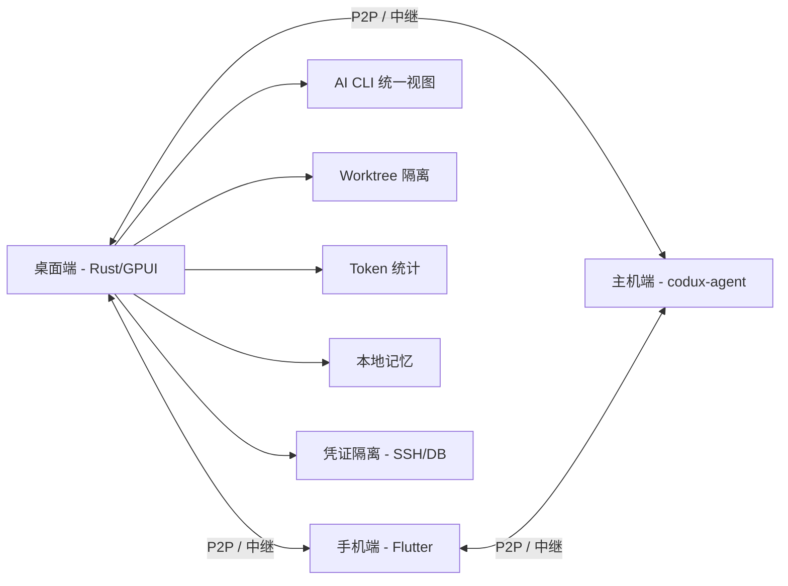

# 用 Rust + GPUI 重写终端：一个开源项目把 AI 编程 CLI 的状态、Token、上下文全收进了一个工作

现在做 AI 编程，手边至少挂着三四个终端窗口：Codex 在跑一个任务，Claude Code 在改另一个分支，Oh My Pi 在分析日志。每个窗口各管各的状态，Token 烧了多少全靠猜，会话一断就找不到刚才跑到哪里了。

更烦的是，项目一多，worktree 东一个西一个，SSH 密钥不知道该不该贴进提示词，跑一半要出门，手机又连不上终端。

最近有人把这个麻烦事做成了一个项目。

**Codux**，一个用 Rust + GPUI 原生打造的开源终端工作台。它把 Codex、Claude Code、OpenCode、Kimi Code 等 9 个以上 AI 编程 CLI 统一到一个项目级视图里，同时帮你管好实时状态、Token 统计、本地记忆、凭证隔离，还支持手机和远程主机接管会话。


Codux 不是一个编辑器，也不是又一个 AI IDE。它是一个面向重度 AI 编程 CLI 用户的控制台——当你的 agent 任务跨项目、跨机器、跨会话时，它能帮你把分散的状态收回来，让长跑任务稳得住、接得上、看得清。


### 1. 统一 9+ AI CLI 的项目级视图

每个 AI 编程工具都有自己的启动方式、自己的会话管理、自己的历史记录。Codux 把它们按项目组织起来，目前支持的 CLI 包括：

**Codex、Claude Code / reclaude、Oh My Pi、OpenCode、Kiro CLI、Kimi Code、CodeWhale、MiMo Code、Agy**

你不需要切换终端标签页去找某个项目的会话——打开 Codux，按项目看，所有 agent 的实时状态、Token 用量、历史记录一目了然。

### 2. Worktree 即任务：并行 agent 不再打架

多个 agent 并行工作时，最怕的就是互相干扰——A 改了文件，B 不知道，结果冲突一堆。

Codux 以 Git worktree 为核心隔离机制：每个任务保留自己的终端、Git 状态、文件和 AI 会话。不同 agent 跑在不同的 worktree 里，天然互不干扰。任务跑完了，worktree 可以独立提交或丢弃，不影响主分支。

### 3. Token 统计不再是黑盒

按工具、模型、项目、worktree、日期多维统计用量。这个功能对长期使用 AI 编程 CLI 的人来说挺实用——不用再自己记账，也不用等到月底账单来了才吓一跳。

### 4. 本地记忆：会话之间上下文不蒸发

每次启动新会话，AI 对你的项目、习惯、偏好一无所知。Codux 提供了本地记忆机制，保存项目画像、模块笔记、使用习惯，并自动注入回支持的 CLI。

**注意**：记忆注入依赖于各 CLI 的环境指令通道。Codex 通过 developer instructions、Claude Code 通过 `--append-system-prompt`、OpenCode 通过 Codux 托管的 plugin 配置。对 Kiro CLI 和 Agy 等暂未确认非侵入注入通道的工具，Codux 不会强写项目文件或用户级配置。

### 5. 凭证隔离：SSH 密钥和数据库密码不再贴进提示词

这是 Codux 一个很值得关注的设计。

很多人在用 AI 编程时，直接把 SSH 密钥或数据库密码贴进提示词让 agent 去用——这是凭证泄露的常见方式。Codux 的做法是：

- **codux-ssh**：agent 只能看到配置名和主机名，连接由 wrapper 代为完成。密码和密钥在 Codux 辅助进程内部注入，永远不会进入模型上下文、会话记录或 shell 历史。
- **codux-db**：对 MySQL / PostgreSQL / SQLite 做同样的隔离。只读配置由 wrapper 强制执行单语句白名单，模型无法自行提权。

所有支持的 CLI 都会通过 Codux 环境指令自动知道这两个命令的存在，无需额外配置。

### 6. 手机接力 + 远程主机：换个设备，会话不断

长 agent 任务经常跑一半要离开电脑。Codux 的解决方案：

- **P2P / 中继链路**：桌面端、手机端、主机端之间端到端加密，能直连就走直连，网络环境不允许时自动回落到中继。
- **手机接力**：几秒完成配对，在手机上继续同一批终端、历史和 AI 会话。
- **主机端（codux-agent）**：把 Codux 跑在服务器、闲置 Mac 或 Linux 上，像本地一样驱动它的终端、Git 和 AI。
- **断线重连**：恢复的是同一批正在运行的 shell 和 agent 会话，不是新建的。

**注意**：连接主机端功能在 2.0 版本中以 Beta 状态发布，作者明确表示"连接、配对、主机侧数据链路都还在持续测试中，可能会有粗糙的地方"。

### 7. 非侵入式设计：不写提示词文件，不改全局配置

Codux 使用非侵入式 wrapper 和各工具适配器注入上下文。它不会往你的仓库里写提示词文件，也不会修改 AI CLI 的全局配置。所有上下文注入都经由可审查的 wrapper 和工具适配器完成。

### 8. 数据自持 + 无云端

项目、终端、会话、记忆、Token 统计和凭证全都留在你自己的机器上。没有 Codux 云端，不需要注册账号。桌面端 ⇄ 手机 ⇄ 主机之间的链路也是端到端加密。

### 9. 像素宠物（彩蛋）

Agent 每烧一个 Token，都会喂养一只像素宠物。五维属性（智慧、混沌、夜行、体力、共情）长自你真实的工作方式和作息。可以安装自定义像素宠，也可以让老伙计退役进入传承名册。

项目作者的原话是——"毫无用处，但不可或缺。"

## 快速上手

### 安装

**macOS**（推荐 Homebrew）：

```bash
brew install --cask duxweb/tap/codux
```

**macOS · Apple 芯片**：直接下载 [codux-macos-aarch64.dmg](https://github.com/duxweb/codux/releases/latest/download/codux-macos-aarch64.dmg)

**macOS · Intel**：直接下载 [codux-macos-x86_64.dmg](https://github.com/duxweb/codux/releases/latest/download/codux-macos-x86_64.dmg)

**Windows 11 · x64**：直接下载 [codux-windows-x86_64-setup.exe](https://github.com/duxweb/codux/releases/latest/download/codux-windows-x86_64-setup.exe)

**移动端**：Android 从 [Codux Mobile 最新版本](https://github.com/duxweb/codux-flutter/releases/latest) 下载 APK；iOS 从 [App Store](https://apps.apple.com/cn/app/codux/id6772156906) 获取。

> iOS 版收费说明：Codux 完全开源（GPL-3.0），桌面端与 Android 免费。iOS 定价仅用于覆盖苹果每年 99 美元的开发者费用与收入抽成，无订阅、无内购。不想付费可从源码自行编译。

### 启动

1. 打开一个项目。Git worktree、项目状态和会话按项目自动就位。
2. 在内置终端里启动你的 AI CLI——codex、claude、opencode 都行。非侵入 wrapper 自动点亮实时状态、Token 统计和记忆注入，零配置。
3. 起身走人。手机或主机端配对一次，之后在任何地方接管同一个正在运行的会话。

### 主机端（codux-agent）安装

**macOS / Linux**：

```bash
curl -fsSL https://raw.githubusercontent.com/duxweb/codux/main/apps/agent/scripts/install.sh | sh
```

支持参数：`--beta` · `--version <x.y.z>` · `--dir <路径>` · `--setup` · `--mirror <前缀>` · `--uninstall`

### 命令速查

| 阶段 | 命令 | 作用 |
|------|------|------|
| 初始化 | `codux config` | 交互式初始化（设备名、中继），写入 codux.toml |
| 安装为服务 | `codux install` | 安装为开机自启服务（launchd / systemd --user / 任务计划程序） |
| 启动/停止 | `codux start / stop` | 前台启动/停止主机端 |
| 状态查看 | `codux status` | 是否在运行、节点 id、已配对设备数 |
| 配对 | `codux qrcode / link` | 显示配对二维码 / 打印配对 ticket |
| 设备管理 | `codux device` | 列出已配对设备；device:del / rename / clear 管理 |
| 更新 | `codux update` | 下载、校验并替换当前二进制，再重启主机端 |
| 卸载 | `codux uninstall` | 停止并移除该服务 |

### 快捷键

| 操作 | 快捷键 |
|------|--------|
| 新建分屏 | ⌘T |
| 切换 Git 面板 | ⌘G |
| 切换 AI 面板 | ⌘Y |
| 切换项目 | ⌘1 – ⌘9 |

所有快捷键可在 设置 → 快捷键 里自定义。

## 架构关系




Codux 解决的是一个真实的问题：AI 编程 CLI 越来越强，但管理这些 CLI 的工具链几乎为零。

它的设计思路很清晰——不做编辑器，不做 AI IDE，只做"控制台"。统一视图、worktree 隔离、Token 统计、凭证隔离、远程接管，这些都是从实际使用场景里长出来的功能，不是堆功能。

值得注意的边界：

- **主机端功能目前是 Beta**。如果你主要需要远程连接，建议先观望，等稳定后再上生产环境。
- **不是所有 AI CLI 都支持完整注入**。Kiro CLI 和 Agy 暂无法注入环境指令，Codux 在这些工具上只能追踪会话状态，不会强写文件。
- **系统要求**：桌面端需要 macOS 14.0+ 或 Windows 11；主机端支持 macOS、Linux、Windows（x86_64 与 arm64）。
- **如果你是重度 AI 编程 CLI 用户**，项目多、agent 并行、经常换设备，Codux 值得一试。如果只是偶尔在终端里跑一次 AI 命令，那它带来的收益可能不太明显。

项目开源（GPL-3.0），GitHub 地址：https://github.com/duxweb/codux

#Codux #AI编程 #终端工具 #Rust #GPUI #开源 #Token管理 #凭证隔离 #远程开发 #Worktree