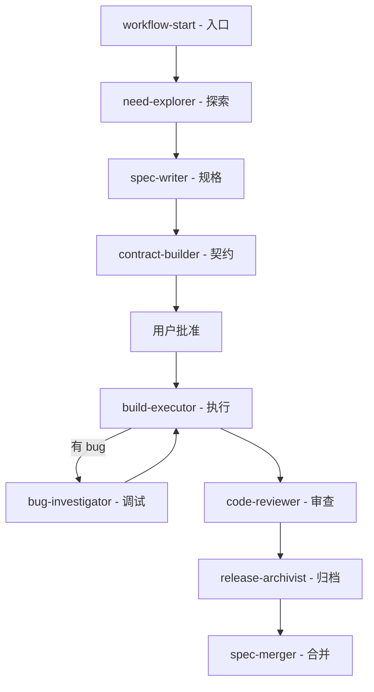

# 源码级融合 OpenSpec + Superpowers：一个开源插件给 AI 编程加上了"规划-契约-执行"三重纪律

## 导语

用 AI 写代码时，最常碰到的两个失控点，用过的人应该都懂。

一是还没想清楚要做什么，AI 就开始写代码。你说了句"帮我加个权限控制"，它就开始改几十个文件。改到一半才发现——到底要 RBAC 还是 ABAC？需求都没对齐。

二是规划文档写得明明白白，但执行阶段还是会跑偏。proposal 写了、design 画了，但实现过程中没人盯着测试、没人卡 review，等到合并才发现行为不对。

最近有人把这两个问题一起做了一个项目。

**Spec Superflow**，一个开源 AI 编程工作流插件，源码级融合了 OpenSpec 的规划引擎和 Superpowers 的执行纪律。它在你和 AI 之间建起一道"规划-契约-执行"的硬墙：需求没澄清不能进实现，契约没批准不能动代码，执行违反契约会被拦截。

## 一句话结论

Spec Superflow 不是一个 AI 编程工具，而是一个"AI 编程的工作流框架"——它让你和 AI 协作时，先想清楚再动手，动手后按纪律执行，避免"需求没说清就开干"和"规划写得好但执行跑偏"这两个最常见的坑。

## 核心亮点

### 1. 9 个 Skill，8 个状态，一条完整流水线

项目把 AI 编程的全流程拆成了 9 个 Skill，每个 Skill 负责一个阶段，串成一条流水线：

| Skill | 阶段 | 职责 |
|-------|------|------|
| workflow-start | 入口 | 内容级状态检测、8 状态路由、阻止非法跳转 |
| need-explorer | 探索 | 一次一问 + 方案对比 + 推荐 |
| spec-writer | 规格 | 产出 proposal/specs/design/tasks，Schema 引擎实时验证 |
| contract-builder | 桥接 | 解析引擎自动提取 4 工件 → 压缩为 execution-contract.md |
| build-executor | 执行 | TDD 铁律 + SDD 子代理驱动 + Review Gate |
| bug-investigator | 调试 | 4 阶段根因分析，3+ 修复失败 → 质疑架构 |
| code-reviewer | 审查 | 结构化审查，三级问题分级 |
| release-archivist | 收尾 | 验证 + 归档 + 风险总结 |
| spec-merger | 收尾 | Delta Spec → 主规范智能合并 |

关键约束是：**Full/legacy Hotfix 没有 execution-contract.md、current execution plan 或 pass review receipt → 不允许推进。**

### 2. 内容级状态检测，不看文件时间戳

传统工作流工具靠文件时间戳判断状态，但 Spec Superflow 用的是**内容级检测**——不比较 proposal 范围 vs 契约意图锁，而是比较内容本身。

这意味着你改了 proposal 但没改时间戳，它能感知到；你改了 specs 但没改文件名，它也能感知到。路由到正确的下一个 Skill。

你只需要告诉它一句话：

- 启动新的变更 → `用 workflow-start 开始`
- 恢复旧的变更 → 继续上次的工作流
- 不确定当前状态 → `帮我看看现在该干什么`

### 3. 四级执行模式，按风险区分

不是所有改动都需要走完整流程。项目设计了四级模式：

- **Quick**（≤3 文件/任务，单模块低风险代码）：直接执行并验证，跳过规划+桥接
- **direct Hotfix**（incident 且 ≤2 文件）：直接执行，必须验证原症状回归
- **Tweak**（≤4 文件，纯配置/文档修改）：跳过规划+桥接，直接编辑
- **Full / legacy Hotfix**：保留规划、契约和 review 的完整流程

DP-4 执行模式推荐机制：先由 `ssf execution recommend` 根据任务量和 wave 策略列出 Inline、Batch Inline、SDD 三种执行方式并给出推荐理由，用户确认后才保存 plan。

### 4. 支持 19 个 AI 编程平台

这是目前看到覆盖最广的 AI 编程工作流插件：

| 平台 | 安装方式 |
|------|---------|
| Claude Code | `/plugin marketplace add` |
| Cursor | `npx spec-superflow@latest install-cursor` |
| Codex | `codex plugin add` |
| GitHub Copilot | `copilot plugin install` |
| Gemini CLI | `gemini extensions install` |
| Cline / Kiro / Windsurf / Qwen Code / Amazon Q / Roo Code / Continue / Pi / Qoder / WorkBuddy / CodeBuddy | 各平台有专用安装器 |

### 5. 自包含，不需要安装上游运行时

源码级融合了 OpenSpec 的 Schema/验证/解析引擎和 Superpowers 的 TDD/SDD/调试/审查机制，但**不需要单独安装 OpenSpec 或 Superpowers**。一个插件全包。

### 6. Schema 引擎实时验证 + 执行契约桥接

规划阶段产生的 proposal、specs、design、tasks 四份工件，经过 Schema 引擎实时验证格式。然后 contract-builder 自动提取关键信息，压缩为 `execution-contract.md`——这是规划到实现的唯一交接层。

用户批准契约后，build-executor 才进入实现阶段，执行 TDD 铁律 + SDD 子代理驱动 + Review Gate 三重纪律。

### 7. Delta Spec 同步，防止规范腐烂

活动工作流只以 `changes/<change>/` 为事实来源，项目根 `specs/` 是发布后的规范基线。运行 `ssf sync` 时，CLI 会把 ADDED/MODIFIED/REMOVED/RENAMED 操作应用到根基线，并在 change 状态写入可重算的发布回执。closing 会同时核验 delta 与基线，任一侧同步后被修改都必须重新同步。

## 快速上手

### 安装（以 Claude Code 为例）

```bash
/plugin marketplace add MageByte-Zero/spec-superflow
/plugin install spec-superflow@spec-superflow
```

### 安装（以 Cursor 为例）

```bash
npx spec-superflow@latest install-cursor
```

### 安装（CLI 全局）

```bash
npm install -g spec-superflow
```

### 启动工作流

```
用 workflow-start 开始
```

### 命令速查

| 命令 | 功能 |
|------|------|
| `ssf list` | 列出所有 changes 及状态 |
| `ssf validate <dir>` | 验证工件完整性 |
| `ssf doctor` | 健康检查（版本、hooks、skills、文档一致性） |
| `ssf resume` | 只读恢复摘要 |
| `ssf switch <change>` | 只读返回明确 change 的恢复上下文 |
| `ssf execution recommend` | 列出可用执行方式并给出推荐 |
| `ssf execution plan` | 保存受 guard 保护的执行计划 |
| `ssf execution review` | 记录 review receipt |

### 模型配置

在项目根目录的 `spec-superflow.config.json` 中配置不同执行角色的模型：

```json
{
  "models": {
    "mechanical": "vendor-small",
    "standard": "vendor-standard",
    "strong": "vendor-strong",
    "review": "vendor-review"
  }
}
```

## 工作流架构



## 写在最后

Spec Superflow 解决的是一个很真实的问题：AI 编程的效率越来越高，但"先想清楚再动手"这个基本功反而被忽略了。

它的设计思路很清晰——不做一个 AI 编程工具，而是做一个"AI 编程的工作流框架"。把 OpenSpec 的规划能力和 Superpowers 的执行纪律融合在一起，用 9 个 Skill 和 8 个状态把整个过程管起来。

**值得注意的边界：**

- **推荐场景**：大型功能开发、多人协作项目、长期维护项目、需要 TDD + Review Gate 的棕地项目。
- **不推荐场景**：一次性脚本/工具、纯咨询/问答。这些场景走完整流程反而拖慢效率。
- **学习成本**：9 个 Skill、8 个状态、四级执行模式，需要花时间理解。如果你只是偶尔用 AI 写几行代码，这个插件可能太重了。
- **当前版本 v0.12.1**，还在快速迭代中。建议在非关键项目上先试用，熟悉后再推到生产环境。
- 项目建议不要在同一会话混用 OpenSpec 或 Superpowers。已有 OpenSpec 工件目录的项目可以直接用 spec-superflow 接管。

GitHub 地址：[MageByte-Zero/spec-superflow](https://github.com/MageByte-Zero/spec-superflow)

#SpecSuperflow #AI编程 #工作流 #规划引擎 #TDD #SDD #开源 #OpenSpec #Superpowers